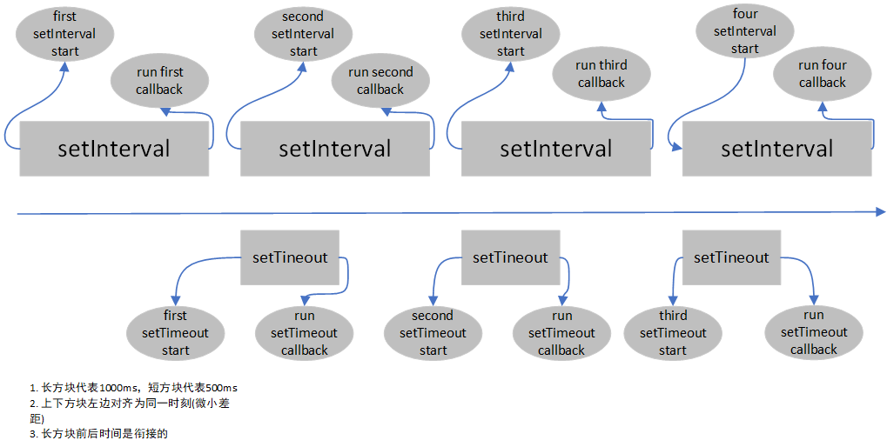
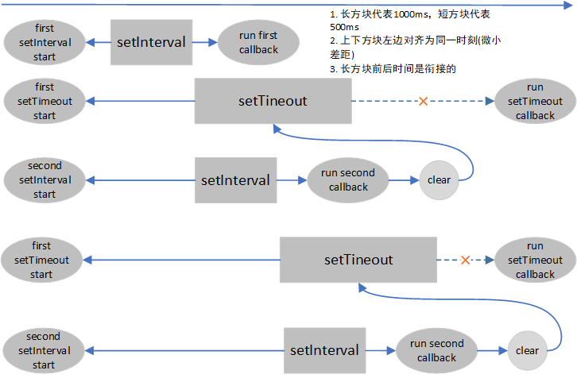

## 函数防抖

---

1. 什么是函数防抖

- 某事件被触发后 n 秒后在执行回调，如果在这 n 秒内又被触发，则重新开始计时。在一个电梯事件中，如果有人进电梯(触发事件)，那电梯将在 10 秒钟后出发(执行事件)，这时如果又有人进电梯了(在 10 秒内再次触发该事件)，我们又得等 10 秒
- 思路：每次触发事件时都取消之前的延迟调用方法。将多个顺序地调用合并为一次，在一定时间内，规定事件被触发的次数

2. 使用地点

- 用来处理那些离散的事件，一般用于判断用户的输入情况，只在用户停止输入一段时间后再进行判断

```js
function fangdou(callBack, wait, ...arr) {
  let timer = null;
  let date;
  return () => {
    // 这里是一个闭包
    if (timer) {
      clearTimeout(timer);
      timer = null;
    }
    timer = setTimeout(() => {
      callBack(...arr);
    }, wait);
  };
}
function fn(...arr) {
  console.log(arr);
}
```

```js
setInterval(fangdou(fn, 500, Date.now()), 1000);
// 1500ms后输出date，以后每隔1000ms输出一次
```



```js
setInterval(fangdou(fn, 1000, Date.now()), 500);
// 多次触发，不会输出任何内容
```



- 函数触发停止一段时间后（期间不能再触发该函数，否则将重新计时），再执行回调函数

---

## 函数节流

---

1. 什么是函数节流

- 规定一个单位时间，在这个单位时间内，只能有一次触发事件的回调函数执行(单位时间内有事件被多次触发则，只生效一次，会稀释函数的执行频率)
- 就如 LoL 英雄的冷却时间一样，只有冷却时间到了才能释放技能，冷却完之前就算你把键盘按烂都不会有效果的
- 思路：每次触发事件都判断当前是否具有等待执行的延迟调用函数或定时器

2. 使用场景

- 用来处理那些连续的事件
- 表单的连续点击，防止重复提交，如重复提交数据到后台
- 登录框或搜索框，当停止输入后再验证用户有效性或在搜索
- 拖动浏览器窗口（滚动条），但只想触发一次事件

```js
function jieliu(callBack, time, ...arr) {
  let lastDate = Date.now();
  let nowDate;
  return () => {
    // 这里是一个闭包
    nowDate = Date.now();
    if (nowDate - lastDate >= time) {
      callBack(...arr);
      lastDate = nowDate;
    }
  };
}
function fn() {
  console.log(`我在${new Date()}被触发了` + new Date().getMilliseconds());
}
setInterval(jieliu(fn, 1000), 500);
// 设定为1s触发一次
```

- 规定一个单位时间，在这个单位时间内，只能有一次触发事件的回调函数执行（如果该单位时间内多次触发，则只生效一次）

3. 函数防抖和节流的作用和本质

- 主要解决的问题是：防止函数 `短时间` 的重复执行
- 本质上是：在时间轴上控制函数的执行次数
