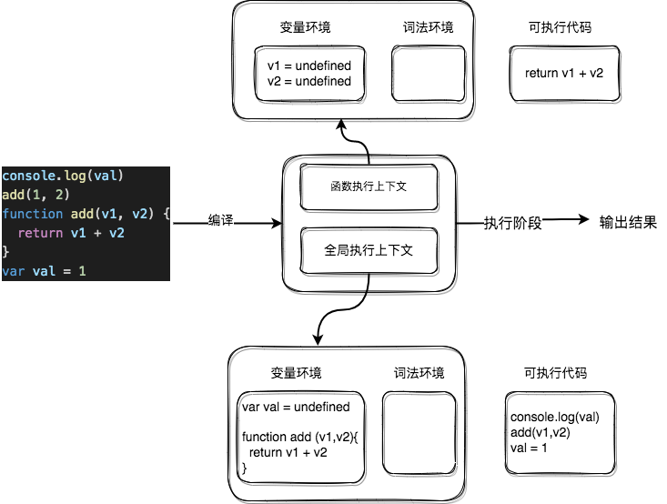
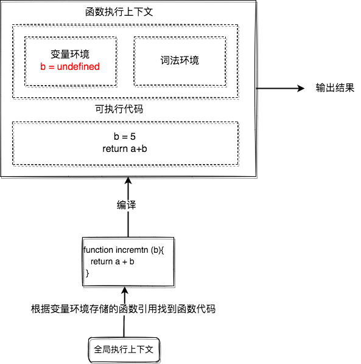
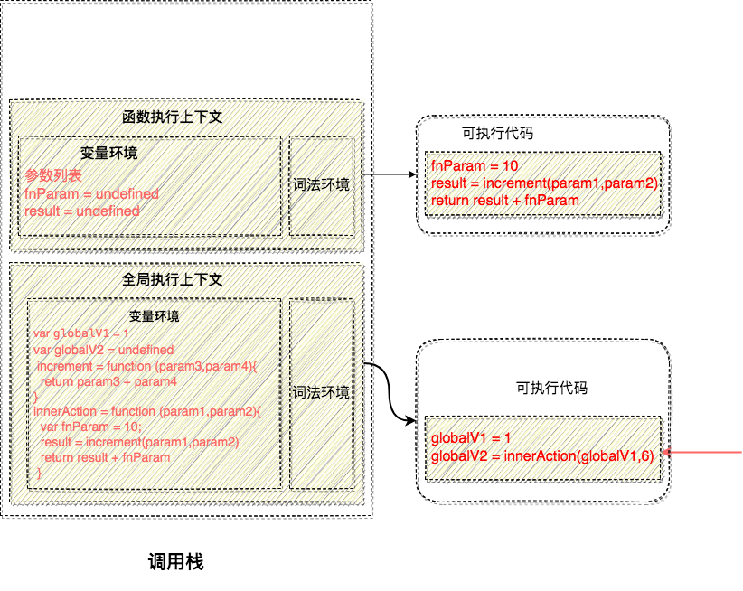
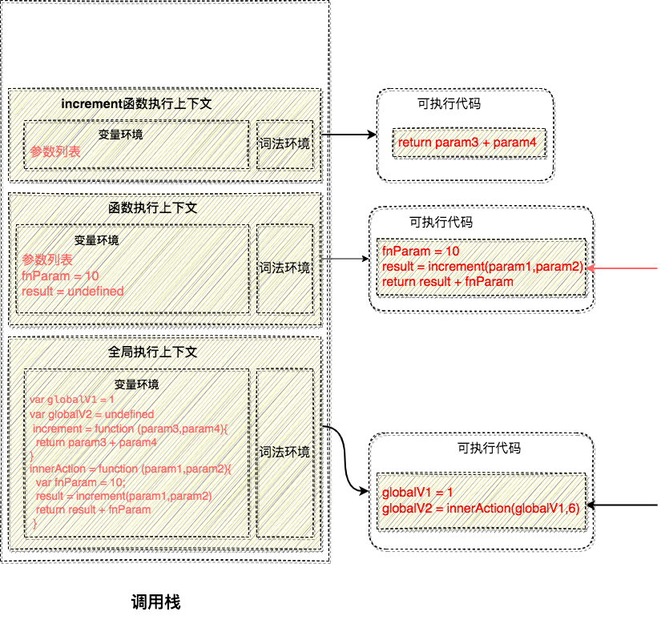
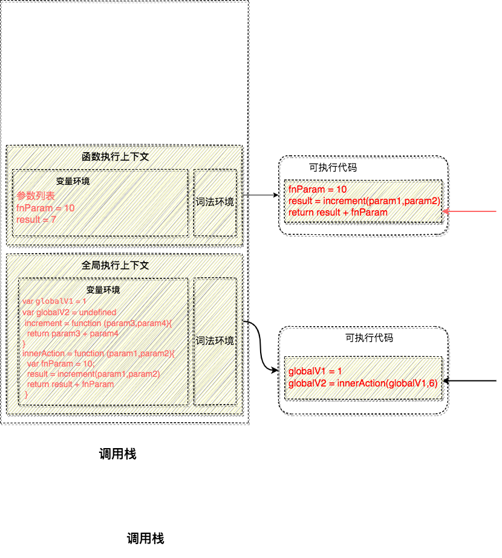

## 调用栈
---
1. js的输出流程
- 从代码到输出(**需要被调用**)，js需要经过 **编译阶段** 和 **执行阶段**，代码在执行之前需要被 js 引擎编译，编译完成后才会进入执行阶段。那么在代码中的 *变量* 和 *函数* 声明会在 **编译阶段** 被 js 引擎放入到内存中(**函数体会以函数对象的形式被存放在堆内存中**)
- (这里统一将 v8引擎 的翻译过程称作编译阶段，想了解的可以查看[v8引擎的执行流程](./v8engine))源代码经过编译阶段以后，所有的代码会被分成两部分：**执行上下文** 和 **可执行代码**，以下面一段代码为例
```js
console.log(val) // undifined
add(1, 2) // 3
function add(v1, v2) {
    return v1 + v2
}
var val = 1
```
- 首先 **参数/函数声明/变量声明**会在 **编译阶段** 被提前进行收集(也就是常说的提升)，所以上面的代码就会被抽象成以下两个部分：**可执行代码** 与 **执行上下文**。其中 **执行上下文** 是 js 执行一段代码时的运行环境，其中包含该段代码在执行期间用到的如 this、变量、函数和对象等



- 在编译阶段，变量和函数会被收集到 **变量环境** 中，其中规则如下：一：通过 var 声明的变量会初始化为 `undefined`，函数声明的变量会指向函数的地址引用(同名函数后声明的覆盖先声明的)；二：编译阶段，如果存在同名的函数和变量声明，那么变量声明会被忽略(**变量声明优先级小于函数声明**)；三：在代码执行阶段，js 引擎会从词法环境中去查找自定义的变量和函数
```js
// 两段代码结果一致
getName();

function getName () {
  console.log('name:fn')
};

var getName = function () {
  console.log('name:var')
};
```
```js
// 两段代码结果一致
getName();

var getName = function () {
  console.log('name:var')
};

function getName () {
  console.log('name:fn')
};
```
- 其中涉及到 **变量提升** 的概念。在语法分析阶段时，有两种解析方式: 预解析和全量解析. 其中预解析不会生成 AST 与 不带变量声明和引用的 `[[Scopes]]` 信息，全量解析则会生成具体的 `[[Scopes]]` 信息及 AST。也就是说，如果某一段代码仅仅是做了声明而没被调用，那么它不会生成自身的运行环境信息，因为这是没必要且耗费内存空间的. 只有在代码被执行的时候，才会生成环境本身的具体的运行环境信息(执行上下文)，这个时候才需要去收集这段代码执行所需要的变量声明、函数声明，因此，能够断定变量提升是发生在 解析 阶段
2. 执行上下文的类型
- 当一段代码被执行时，它需要先被 js 引擎编译，并创建 **执行上下文**。而在以下三种情况中，执行上下文会在编译阶段被创建
- 当 j s 执行全局代码的时候，会编译 **全局代码** 并创建全局执行上下文，而且在整个页面的生存周期内，全局执行上下文只有一份(*需要注意在浏览器环境下，代码是被包含在script标签中的，但它不是全局上下文，浏览器会将 script 标签处理成一个匿名函数参与到栈中，通过开发者工具能观察到，但观察不到全局上下文，默认全局上下文是随窗口存在而存在的*)
- 当调用一个函数的时候，函数体内的代码会被编译，并创建函数执行上下文。一般情况下，函数执行结束之后，创建的函数执行上下文会被销毁
- 当使用 eval 函数的时候，eval 的代码也会被编译，并创建执行上下文
3. 调用栈
- 在 js 中，经常会出现在一个函数中调用另一个函数的情况，而 **调用栈** 就是被用来 **管理** 函数调用关系的一种数据结构，也就是用于管理多个函数嵌套关系，但它不一定代表函数的执行顺序。因为栈的思维，就是操作栈顶的元素，如果要操作栈中的元素，就只能把栈顶的元素先出栈，然后才能操作，具体的代码执行顺序不一定是按照栈来执行的。单个函数内部的代码是从上到下执行的，并不存在出栈过程
- 我们知道，代码需要先经过编译阶段创建 **执行上下文** 和生成 **可执行代码**，然后在执行阶段执行 **可执行代码** 输出结果。通过以下代码来分析其中的情况
```js
console.log(a);
var a = 99;

function increment (b) {
  return a + b
}
increment(5);
```
- 首先在执行该段代码之前，js 引擎会先编译并创建 **全局执行上下文**，其中包含了声明的变量和环境


- 全局上下文准备好后，便开始执行全局中的可执行代码。当执行到 `increment(5)` 时，此时被判定为一个函数调用，那么会从 **全局执行上下文** 中取出 `increment` 函数的代码进行编译，并 *创建该函数的执行上下文和可执行代码*，然后执行其中的代码，输出结果



- 当执行到 `increment` 时，有了两个执行上下文，而多个执行上下文会通过栈的数据结构被管理。在执行上下文创建好后，js 引擎会将执行上下文压入栈中，通常把这种用来管理执行上下文的栈称为执行上下文栈，又称调用栈
```js
var globalV1 = 1;

function increment(param3,param4) {
  return param3 + param4
}

function innerAction (param1,param2) {
  var fnParam = 10;
  var result = increment(param1,param1);
  return result + fnParam
}

var globalV2 = innerAction(globalV1,6)
```
- 在上述代码中，当开始执行该段代码之前，编译并创建全局上下文，将其压入 **调用栈底部**


- 此时可执行代码和执行上下文创建完成，全局执行上下文被压入调用栈，js 引擎开始执行全局代码。为 a 赋值为 1，然后执行 `innerAction` 函数，此时会先编译该函数并创建该函数的执行上下文，并将其压入调用栈顶



- 函数的执行上下文被压入栈中以后，就会执行其中的可执行代码。首先给 d 赋值为 10，然后调用 `increment` 函数，会编译并创建它的执行上下文，压入栈顶



- 此时执行 `increment` 的可执行代码，根据参数列表的值相加并将该值(7)返回，此函数的执行上下文将从栈中弹出



- 执行完运算操作，将值返回，此时 `innerAction` 的执行上下文将从栈中弹出，此时调用栈中就只剩下全局上下文


- 那么，整个代码的执行流程到这也结束了，调用栈其实就是 js 引擎用于追踪函数执行的一个机制，它反映了各函数之间的调用关系。并且，栈底永远是全局上下文，栈顶则是当前正在执行的函数的上下文
- 代码的执行顺序是严格按照 *函数调用栈的顺序* 来执行的，这是同步的概念；同时这种方式执行代码，函数调用栈是不可中断的

4. 栈在内存中的存在形式
- js中在使用内存的时候，会把内存空间分为两块：栈内存和堆内存。堆内存是从地址低位向地址高位存放数据，而栈内存是从地址高位向地址低位存放数据，也就是地址高位是栈底
- 实际上放进去的我们把它叫做 **执行上下文**，那么对应到内存里面的就是一些函数的入参、声明、返回的内容等，还会有执行上下文中的一些实体对象，以及存放在堆内存中的一些内容
- 而在函数调用的时候，栈内存的体现形式为指针的移动，如出栈是将指针由地址低位向地址高位移动，并且会在移动的过程中顺带清理掉那些失去引用的栈内容。一般来说，这个过程是非常快的，所以我们一般说的垃圾回收其实是针对堆空间的垃圾回收
5. 栈溢出
- js 中的调用栈是有大小的，当栈中的上下文超过一定数量，引擎就会报错，提示超过最大调用栈大小
- 调用栈具有两个指标；最大栈容量和最大调用深度，满足任意一个就会栈溢出
