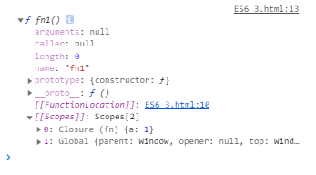
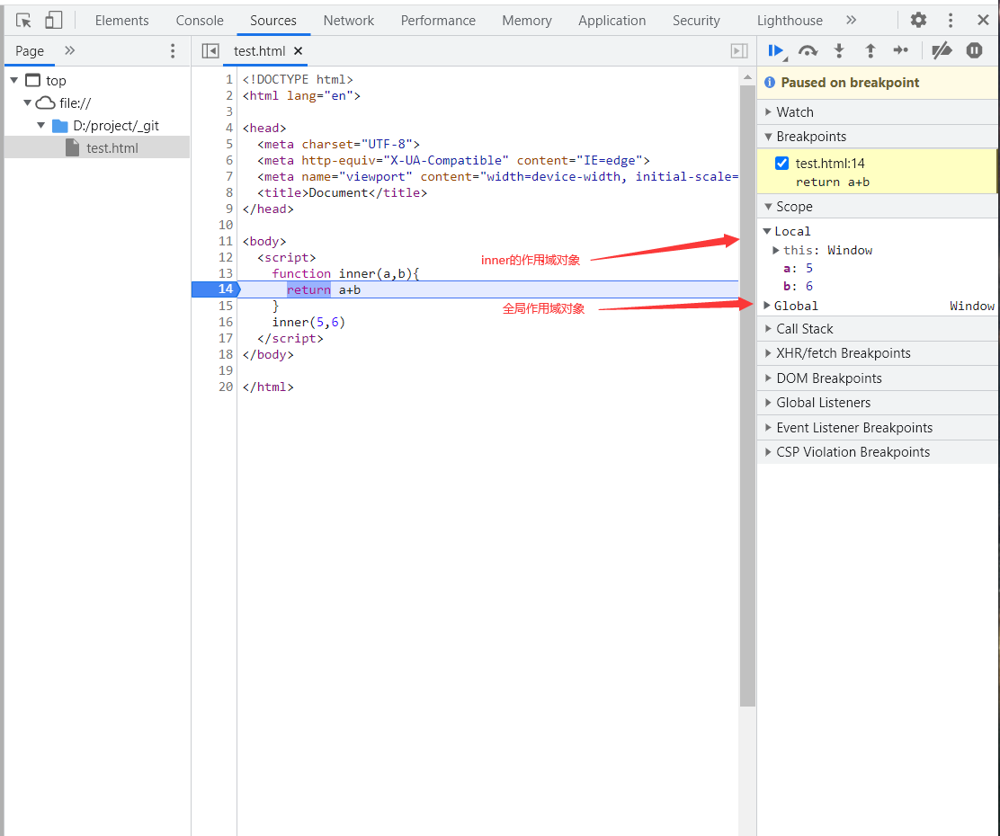
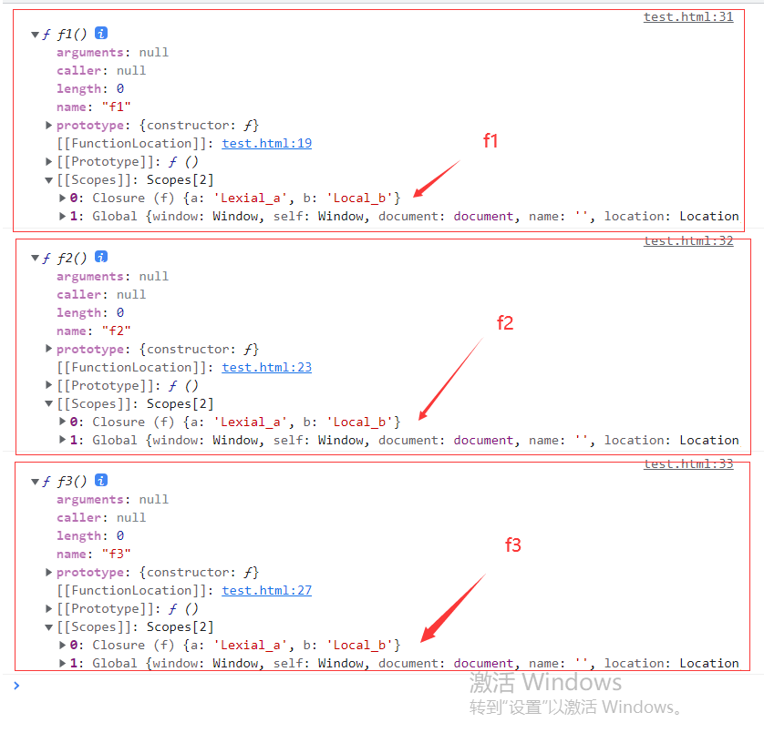
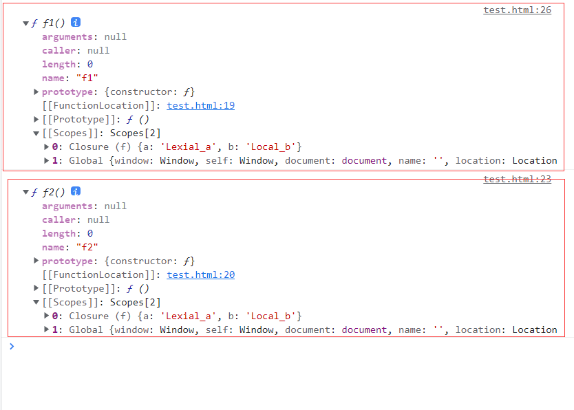
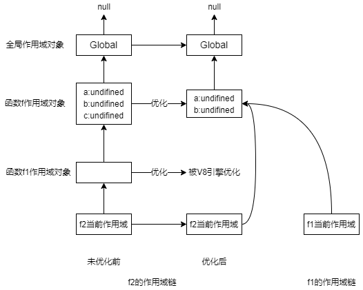

## 闭包
---
1. 作用域的分类
- 作用域是指程序中定义变量的区域，该位置决定了变量的生命周期。它是变量与函数的可访问范围，控制着变量和函数的可见性和生命周期。属于是代码里的变量的生效的范围，它是一套规则
- 在 JavaScript 执行过程中，其作用域链是由词法作用域决定的，它会在编译阶段就被确定好，和函数怎么被调用是没有关系的。词法作用域就是指作用域是由代码中函数声明的位置来决定的，所以词法作用域是静态的作用域，通过它就能够预测代码在执行过程中如何查找标识符

```js
// 先来定义一个function
function fn(){
	var a=1;
	function fn1(){
		console.log(a)
	}
	console.dir(fn1)
}
fn()
```



- 可以发现 fn1 并未执行，仅仅是被预解析，但是它的词法作用域已经生成了

```js
// 注意与本例区分
var a = 2;
function fn1() {
  console.log(a);
}
function fn() {
  var a = 1;
  fn1();
  console.dir(fn1);
}
fn();
```

|作用域类型|描述|
|---|---|
|全局作用域|全局作用域中的对象在代码中的任何地方都能访问，其生命周期伴随着页面的生命周期|
|函数作用域|函数作用域就是在函数内部定义的变量或者函数，并且定义的变量或者函数只能在函数内部被访问。函数执行结束之后，函数内部定义的变量会被销毁|
|块级作用域|使用{}限制变量生效范围，代码块内部定义的变量在代码块外部无法被访问到，并且块级作用域内声明的变量也不会影响块外面的变量|

2. 作用域链
- 当 js 被执行的时候，它需要一些 *空间* 来存储本地变量(local variables)，这些空间就是 **作用域对象(Scope Object)**，有时候也叫 **LexicalEnvironment**。当你调用函数时，函数内定义了一些本地变量，这些变量被存储在一个作用域对象中，它可以类比一个普通的 js 对象，但区别在于你不能直接在 js 中获取这个对象，你只能修改这个对象的属性，而不能获取这个对象的引用。作用域链是基于作用域这套规则的具体实现
- js 中的作用域对象是在 *堆* 中被创建的，所以在函数返回后它们也还是能够被访问到而不被销毁。如果本地变量保存在栈中，那它们就会在出栈的时候被销毁。并且 `Scope Object` 是存在 `Parent Scope Object/父作用域对象` 的引用的，也就是我们常说的 *outer/外部引用*；当代码尝试访问一个变量时，js 会先在当前的作用域对象查找这个属性，如果这个属性不存在，它会去父作用域对象查找，直到找到该属性或者再也没有父作用域对象。那么这个查找变量的过程中所经过的作用域对象称作作用域链（Scope chain），每个函数内能够访问哪些变量，他必须要有一个具体的 *范围*，这就是作用域链的概念
- 我们可以发现，在作用域链中查找变量的过程和原型链中的查找属性的过程非常的相似，但是当你在原型链上找不到一个属性的时候，并不会引发一个错误，而是会得到一个 undefined；而当你访问一个作用域链中不存在的属性时会得到一个 *ReferenceError*

```js
function inner(a,b){
  return a+b
}
inner(5,6)
```



- 从上面的图中可以看出，作用域链的最顶层就是 *Global Object*，一个页面中只有一个 *全局对象*，当在全局环境中定义变量或声明函数时，它们就会被定义到全局对象中

3. [[Scopes]]
- 当函数被定义的时候，它的标识符(*identifier*)就会根据 *定义的位置* 添加到当前的作用域对象中，这个标识符所引用的是一个 `函数对象/function object`。函数对象中包含了函数的源代码和其他的属性，其中有一个内部属性是 `[[Scopes]]`，这个内部属性所指向的就是当前的作用域对象，也就是说，在函数被创建的时候(*函数的标识符被定义到当前的作用域对象中时*)，这个内部属性就已经被创建了，它指向当前环境能够直接访问到的那个作用域对象
- 它是由一系列对象组成的数组，其中的每个对象都是从父级函数作用域中收集的 **当前函数作用域内会使用到的变量声明、函数声明、函数参数的集合**，也就是说每个对象都对应着一个优化过的 **父级作用域对象**。这些作用域对象大致存在以下几种

| 作用域对象 | 描述 |
| --- | --- |
| Global 对象 | 不包含任何优化，包含全局对象中的所有属性和方法 |
| Script 对象 | 在全局环境中，通过 let/const 声明的变量会挂载到此对象下 |
| Closure 对象 | 一般是访问了父级函数的变量生成的，只会保存当前作用域能够访问到的变量属性 |
| Local 对象 | 上面的作用域对象，会存在于函数的`[[Scopes]]`属性中，因为，它们在解析阶段就能被确定，而 Local 对象需要在函数的执行过程中才会被确定，并且其中的属性还会随时变化，该对象除了存储当前函数上下文中所有的变量声明与函数声明，还会额外记录 this 的指向 |

- 这些作用域对象中，除了 `Local` 对象在代码执行时才能得到确认外，其他的都是在代码的解析阶段生成的
```js
function f() {
  let a = "Lexial_a";
  var b = "Local_b";
  const c = "Lexial_c";

  function f1() {
    console.log(a)
  }

  function f2() {
    console.log(b)
  }

  function f3() {
    let d = 4;
  }

  console.dir(f1);
  console.dir(f2);
  console.dir(f3);
}
f()
```



- 可以发现，在f1、f2、f3 的作用域对象中，除了代表全局作用域对象的 *Global* 外，都包含了父级函数f的作用域，虽然在f中声明了三个变量，但三个子函数的 `[[Scopes]]` 中只出现了两个变量；这是因为只在f1、f2函数内访问了变量a、b，这是在编译阶段做的优化

```js
function f() {
  let a = "Lexial_a";
  var b = "Local_b";
  const c = "Lexial_c";

  function f1() {
    function f2(){
      return a + b
    }
    console.dir(f2)
  }

  console.dir(f1);
  f1()
}
f()
```



- f1和其内部的函数f2的 `[[Scopes]]` 具有相同的作用域对象，这是因为对于函数f来说，内部函数始终只访问了变量a和b，V8引擎会在编译阶段就将那些未被访问的变量从作用域对象中优化掉，也就是说，未被访问的变量/函数声明不会被解析到内部函数的作用域链当中
- 在这里，我们需要搞明白一个东西，就是出现在作用域链中的父级作用域对象，它是先存在、再优化。试想一下，如果v8不做优化，内部函数的作用域链应该是什么样的? 拿上例来说，f2的作用域链应该是 `[f2,f1,f,Global]`，也就是说，它应当包含所有父级作用域中声明的变量/函数/参数，而在优化过后，那些不存在的父级作用域对象(**可以理解为空对象，没有任何内部函数访问该父级作用域中的变量/函数/参数，这个空对象就会从作用域链中删除**)就会被优化掉；并且，它会添加那些被内部函数所访问的变量/函数/声明到父级作用域对象中(**也可以理解为先包含所有的父级作用域对象，删掉那些不存在的父级作用域对象，在从存在的父级作用域对象中删掉那些没被内部函数访问过的变量/函数/声明**)，这个父级作用域对象被所有内部函数所共享，也就是说，所有内部函数的作用域链中的同一个父级函数的作用域对象都是同一个



- 搞明白作用域链的作用以后，变量的查找机制也就很清楚了。当要查找一个变量时，会先在当前执行上下文进行寻找；如果没找到就会去作用域链中查找，而作用域链是在编译阶段就生成的存在于函数对象中的一个属性 `[[Scopes]]` 中的，并不是一层一层往上查找的
4. 闭包是如何产生的
- 闭包作为一个现象来说，其实概念(内部函数引用外部函数的变量的集合，它是一个特殊的对象，也就是一个优化过的环境记录对象)并不重要，重要的是它是如何产生的。在上面的铺垫中，闭包是个什么东西已经很清楚的了。当函数A内部创建函数B，并且函数B访问函数A中的变量/参数/函数时，闭包就会产生，它是在预解析阶段确定的
- 通过构造一个闭包环境，这个环境可以把数据给保存下来，这样就可以实现 **局部数据共享**

- 那么，当这些作用域对象仍然能被引用到，它们就不会被垃圾回收器销毁，我们就可以一直访问它们。当引用一个作用域对象的最后一个引用被解除的时候，并不代表垃圾回收器会立刻回收它，只是它现在可以被回收了
- 需要注意的是作用域链是不会被复制的。每次函数调用只会往作用域链下面新增一个作用域对象。所以，如果在函数调用的过程当中对作用域链中的任何一个作用域对象的变量进行修改的话，那么同时作用域链中也拥有该作用域对象的函数对象也是能够访问到这个变化后的变量的
