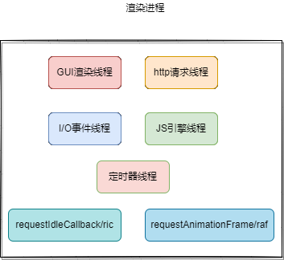
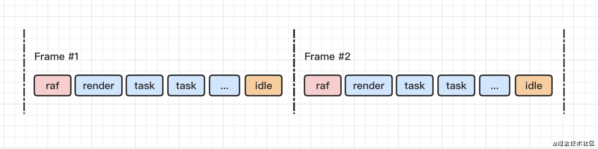
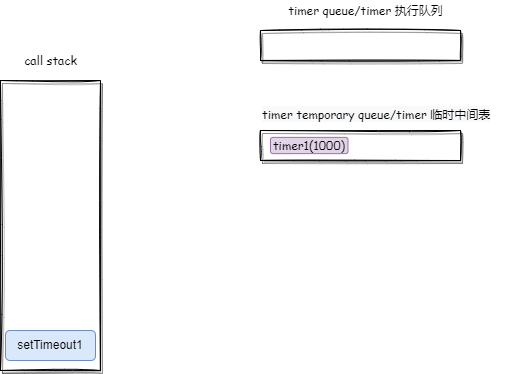
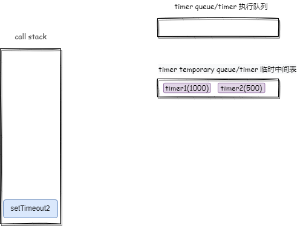
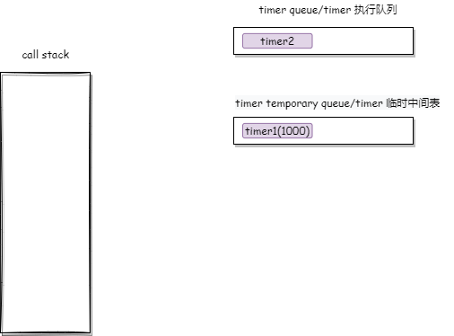
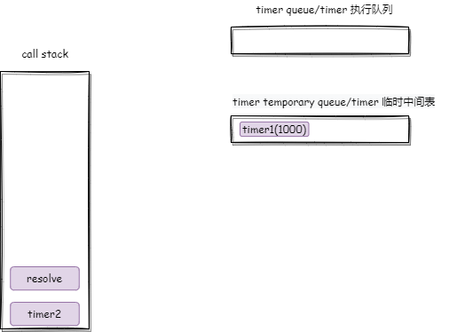
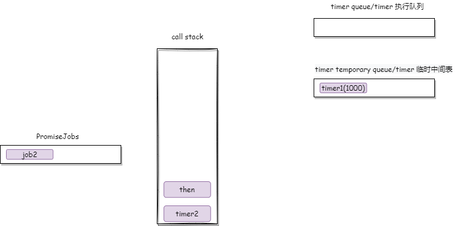
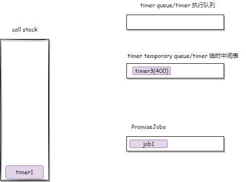
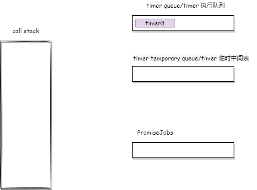
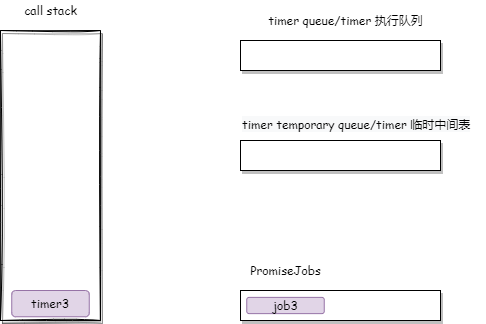

## 同步与异步
---
1. 函数的执行顺序
- 正常情况下，代码的执行顺序是反映到函数调用栈里面的，并不是完全按照从上到下来执行的，在没有异步事件的前提下。函数调用栈是 JavaScript 的代码顺序机制，而事件循环机制是执行环境的机制，并不是 JavaScript 的机制
- 如果所有的任务都按函数调用栈的顺序去执行，那么意味着这些任务在执行之前就是统一安排好的，它的顺序是固定的。但事实上，**`大部分情况下新的任务是在线程运行过程中产生的`**，**要想在线程运行过程中，能接收并执行新的任务，就需要采用事件循环机制**
2. 任务的执行
- 异步任务：假如说，现在"我"作为一个任务源，有一个任务需要去完成，但是这个任务我可以自己做，也可以给别人做。类比到线程中，主线程有一个任务需要做，但不是马上就做，那么主线程可以将这个任务交给其他的线程去做，做完了再通知主线程
```js
// setTimeout作为一个任务发布者，将定义的任务交给定时器线程去做，做完了需要通知主线程
setTimeout(()=>{ /* ...这里需要做一段任务 /*/ },1000)

useEffect(()=>{
  /* ...这里需要做一段任务 */
},[deps])

promis.resolve().then(()=>{})
```
- 不同的任务分发器约定的是执行时机，也就是说什么时候执行。例如说有一个 promise，它的任务分发器是 then/catch，当 Promise 有了一个结果以后，根据这个结果去判断执行 then 还是 catch
- 同步：在 js 中，就是按照函数调用栈的顺序。它的特性就是 不可中断（只要在执行了，就不可中断它的执行了）。但是需要搞清楚一个事情，如果将一个任务的时间线分成执行前、执行中、执行后，那么如果要中断一个任务只能是在执行前或执行后这两个阶段去做，而一旦这个任务处于执行中，它就不能被中断了
- 就比如说 任务队列中有很多个任务，如果不中断的话，任务队列中的任务应该是要依次执行完毕；反之，只执行其中的部分任务，因为我们可以通过某些条件不让其中的一些任务执行。所以说，可中断的应该是 *任务队列*，任务一旦开始执行，就是处于 *不可中断* 状态了
- 拿 *setTimeout* 来说，当定义的任务开始执行以后，它就处于同步逻辑了，它就处于不可中断的状态了
```js
// setTimeout作为一个任务发布者，将定义的任务交给定时器线程去做，做完了需要通知主线程
setTimeout(()=>{ /* ...这里需要做一段任务 /*/ },1000)
```
3. 如何让任务不立即执行
- 实际上很简单，就是当我需要这个任务的时候，我自己不去做这个事情，我将这个任务交给别人来做，这样就能达到一个不立即执行的目的
- 让别人去做这个任务，对应到浏览器中，就是渲染进程中的各个线程去执行这些任务



||描述|
|---|---|
|js引擎线程|宿主环境并不能直接执行js代码，需要为js的运行提供环境|
|定时器线程|用于处理setTimeout、setInterval派发的任务，任务最终是放在队列之中被js引擎线程所处理的|
|I/O线程|用于处理鼠标、键盘等触发的事件，最终的任务也是放在队列之中被js引擎线程所处理的|
|http线程|基于应用层http协议的基础之上达到与其他设备通信的目的，并且它的事件监听、触发也不是在js引擎线程内的|
|requestAnimationFrame|可以用于实现动画，它的回调任务在每一帧开始渲染之前执行，它需要符合屏幕的刷新率|
|requestIdleCallback|用于利用空闲时间处理优先级不高的任务，它的回调任务在每一帧的最后执行|

```js
let oDiv = document.querySelector('#btn');
// 获取页面中一个元素
oDiv.style.background = "red";
// 发布任务，并不是由js来执行
```
- 在上面的代码中，通过发布一个任务：将oDiv的背景颜色改为红色。这个任务会被提交给gui渲染线程来执行，gui渲染线程将该元素的颜色改为红色，因此它是一个异步的任务，因为它也是交给别人做的
- 那么，我们如何来证明：DOM的渲染过程，是异步的呢？通过以下例子来进行验证
```html
<body>
  <div id="box">
    一个盒子
  </div>
  <div id="removeBox">将要被删除的盒子</div>
  <script>
    document.querySelector("#box").onclick = function () {
      console.log('准备修改dom');
      this.style.color = "red";
      console.log('dom修改完成');
      document.body.removeChild(document.getElementById('removeBox'));
      let lastTime = Date.now()
      for(var i=0;i<1000000;i++){
        console.log(i)
      }
    }
  </script>
</body>
```
- 按照代码的执行顺序，也就是函数调用栈的顺序来输出代码，它的结果应该是 `'打印准备修改DOM' --> '将id=box的盒子的字体颜色修改为红色' --> '打印dom修改完成' --> '将id=removeBox从body中删除' --> '循环输出i'` 。可实际上并非如此，真实的执行顺序为 `'打印准备修改DOM' --> '打印dom修改完成' --> '循环输出i' --> '将id=box的盒子的字体颜色修改为红色' --> '将id=removeBox从body中删除'`，可以看出，ui的渲染过程是被其他线程所处理，与 setTimeout 一样，被放到了后面去做
- 但是需要搞清楚一件事情，操作 DOM 与 渲染 DOM 是两个不同的事情，也就是说操作 DOM 实际上还是 js引擎线程来做的事情，它是同步的，这个时候操作的是一个 DOM对象(js对象)，它是一个同步的过程；而渲染 DOM ，是交由 GUI线程来完成的事情，它是异步的。也就是说，DOM 修改之后，需要反映到页面中的变化，这是两个过程
4. 宏任务与微任务
- 这两个概念对应到同步或异步任务，那么宏任务也就是上面所说的异步任务，它是交给别人做的。那么微任务，一般来说指的是 *promise*，它是自己做的任务，只不过这个任务是所有的任务做完以后，再去执行这个任务队列中的任务，Promise 是 JavaScript 的内部逻辑，并非由浏览器额外的线程来执行。因此，Promise 的异步逻辑与线程对应的异步逻辑是不一样的
- 严格上来说，*promise* 并不算一个异步任务，因为它是自己本身要做的任务，但它呈现的却是异步的效果，实际上就是 *resolve* 的时机是不确定的。例如我们使用 *setTimeout* 去 *resolve* 一个 promise
```js
new Promise((resolve,reject)=>{
  setTimeout(()=>{
    resolve()
  },1000)
})
```
- 这个时候，resolve() 已经成为异步任务的一部分了，所以经常会把 promise 当成一个异步任务，而实际上是 resolve 经常被用于异步任务里面去执行
- 还有一个是，使用 MutationObserver 监控某个 DOM 节点，然后再通过 JavaScript 来修改这个节点，或者为这个节点添加、删除部分子节点，当 DOM 节点发生变化时，就会产生 DOM 变化记录的微任务
5. 临时队列与执行队列
- 在我们的代码中，只依靠 *调用栈* 的情况下并不能覆盖所有的代码执行逻辑，因为 *调用栈* 的代码执行顺序是同步的逻辑；对于其他线程所引发的异步逻辑，需要依靠队列机制。相应的，每一个异步行为，都可以对应一个 **执行队列** 和 **临时队列**
- *执行队列*：这个队列中的任务会在一轮循环中直接执行，例如被 resolve 后的 then 所分发的任务。*临时队列*：不会马上执行，它是处于等待状态的任务队列，该队列中的任务需要满足一定的条件之后，才会被 **移入** 到执行队列中(*临时队列的名称可能不一样，promise 中有两个临时队列，一个是 PromiseFulfillReactions，另一个是 PromiseRejectReactions；有的临时队列又叫 Event Table*)。本质上来说它不是队列，不满足队列的特性，因此把它叫成是临时中间表可能更加合适，因为可能后面进来的任务先满足执行条件，它就被移入执行队列中了

|执行队列|描述|
|---|---|
|scriptJobs|script 标签，代码执行的起点|
|rafs|requestAnimationFrame 所对应的队列|
|UI render|渲染 UI 的任务队列|
|ric|requestidleCallback对应的队列|
|event queue|I/O事件队列|
|timer queue|定时器队列，由 setTimeout/setInterval 分发|
|http queue|http 队列|
|PromiseJobs|promise 队列，由 then/catch 分发|


- 也就是说，每一轮事件循环中，如果进入执行队列的，就是会立即会执行的；而当条件不满足时，任务会被放到临时队列中，当条件满足时，会被放入到执行队列中。将这些执行队列一般统称为异步队列，对于一个需要其他线程来做的任务，如果这个任务A中又有一个需要其它线程做的任务B，那么这个任务B即使满足条件也会被放到临时队列中，它也要到下一轮事件循环中才能被放入到执行队列中

- 怎么去理解这个临时队列的概念呢？我们来看一下，一个常见的异步任务是如何书写的
```js
// i/o事件
box.onclick = f1

// 定时器事件
setTimeout(f2,1000)

function f1(){
  // ...
}

function f2(){
  // ...
}
```
- 上面的这些逻辑，不会马上执行，而是需要等到条件满足之后才会执行。而像 f1、f2 这种最终真正被执行的任务，会被放到相应地临时队列中，等到条件满足之后，才会被放到执行队列中。而执行队列的任务需要依靠函数调用栈来执行，也就是最终需要主线程来做处理
- PromiseJobs 是内循环，所以一轮循环的起点，永远都不可能从 PromiseJobs 中开始，它是在所有的执行队列都清空之后，一轮循环完毕的标志也就是最后一个 task 中的内循环 PromiseJobs 队列情空。UI render 的渲染，由 GUI 执行。因此 UI render 队列，也不会是一轮循环的起点。除此之外，其他的所有队列中任务「称之为 task」，都有可能是一轮循环的起点。下一轮循环会从执行队列中的第一个任务继续开始执行，直到当次执行队列清空为止

- PromiseJobs 的逻辑，其实是 JavaScript 代码的内部逻辑，不会因为在 Job 的执行过程中产生了新的 Job，就认为一轮循环的结束。而是要直接将队列中的 job 执行到不会产生新的 Job，才算结束。一个 job 要进入 PromiseJobs，需要确定返回结果，否则会进入临时队列



- 上面的图是一帧所要执行的任务，表示一轮循环。其中 raf | ui render | ric 三个队列中的 task 不会每次循环都执行，他们的执行频率要和刷新率保持一致。因此很多次循环中，他们都不会执行「执行队列为空」

```jsx
import React,{useRef} from 'react';

export default () => {
  const moveRef1 = useRef(null)
  const moveRef2 = useRef(null)
  const rootRef = useRef(null)
  const arrRef = useRef([0,1])
  const btnRef = useRef(false)

  const moveBox1 = () => {
    if(arrRef.current[0] > rootRef.current?.clientWidth) {
      arrRef.current[0] = 0
    } else {
      arrRef.current[0] = arrRef.current[0] + 1
    }
    moveRef1.current.style.left = `${arrRef?.current[0]}px`
    setTimeout(moveBox1,0)
  }

  const moveBox2 = () => {
    if(arrRef.current[1] > rootRef.current?.clientWidth) {
      arrRef.current[1] = 0
    } else {
      arrRef.current[1] = arrRef.current[1] + 1
    }
    moveRef2.current.style.left = `${arrRef?.current[1]}px`
    requestAnimationFrame(moveBox2,0)
  }

  const start = () => {
    if(btnRef.current) return;
    btnRef.current = true;
    moveBox1()
    moveBox2()
  }
  return (
    <div
      ref={rootRef}
      style={{
        position:'relative',
        width:'100%',
        height:'150px',
        overflow:'hidden'
      }}
    >
      <button onClick={start}>start</button>
      <div 
        ref={moveRef1}
        style={{
          position:'absolute',
          width:'50px',
          height:'25px',
          background:'skyblue',
          top:'25px',
          left:'0px'
        }}
      >
      </div>
      <div 
        ref={moveRef2}
        style={{
          position:'absolute',
          width:'50px',
          height:'25px',
          background:'skyblue',
          top:'75px',
          left:'0px'
        }}
      ></div>
    </div>
  )
}
```
- 所有能作为起点的队列中的任务，都是进入主线程执行，借助函数调用栈，依次执行，直到 PromiseJobs 为空，当次任务结束。PromiseJobs 是 task 的内循环。当次任务执行过程中，可能会产生新的任务，这些任务会放入到临时队列或者下一次循环的执行队列，当次循环的执行队列是执行一个少一个，直到清空为止。多个执行队列之间存在先后关系（raf -> ui render -> [event，http，timer] -> ric）

```js
const timer1 = setTimeout(() => {

  const timer3 = setTimeout(() => {
    Promise.resolve().then(res => {
      console.log('timer3', timer3)
    })
  },400)

  Promise.resolve().then(res => {
    console.log('timer1', timer1)
  })

}, 1000)

const timer2 = setTimeout(() => {

  Promise.resolve().then(res => {
    console.log('timer2', timer2)，
  })
}, 500)
```
- 我们以一个例子来实际说明一下，在上面的例子中，我们在 timer1 这个任务中使用 setTimeout 分发一个定时任务 timer3，看下它的事件顺序。首先，第一轮循环中，scriptJobs 添加了一个任务，开始执行其中的代码





- 两个 setTimeout 先后分发两个 task 进入临时队列(因为不满足条件)，其他代码执行完毕，此时检查 PromiseJobs 发现其为空，因此，第一轮循环结束。500ms 后，临时队列中的 task2 满足了延时条件，因此，它被移入到执行队列中，第二轮循环开始



- 此时 timer 执行队列中有任务，队头任务开始出队执行并进入调用栈执行


- 主线程开始执行 timer2 的任务，调用 resolve 确定 promise 的状态



- 因为状态被固定，then 执行时直接将 job 分发到 Promise 的执行队列中



- then 和 timer2 执行完毕分别出栈，此时检查到 PromiseJobs 不为空，开始循环执行其中的任务，输出 `timer2`，本轮循环结束。时间来到了 1000ms 以后，此时 timer1 也有了结果，被移入到 timer 执行队列中，第三轮循环开始


- timer1 出队并进入到调用栈开始执行，首先 setTimeout 分发了一个任务到 timer 临时中间队列中，then 执行完毕，也分发了一个 job 到 PromiseJobs 中(因为已被 resolved)



- timer1 执行完毕出栈，此时检查到 PromiseJobs 不为空，开始循环执行其中的任务，输出  `timer1`，本轮循环结束。时间来到了 1400ms 以后，此时 timer3 也有了结果，被移入到 timer 执行队列中，第四轮循环开始



- timer3 出队并进入到调用栈开始执行，其中的 then 执行完毕，分发了一个 job 到 PromiseJobs 中(因为已被 resolved)



- timer3 执行完毕出栈，此时检查到 PromiseJobs 不为空，开始循环执行其中的任务，输出 `timer3`，本轮循环结束，此时所有的队列都被清空了，表示程序的可执行代码执行完毕
6. 实例
```js
setTimeout(function () {
  console.log(1);
});
new Promise(function(resolve,reject){
  console.log(4)
  resolve(2)
}).then(function(val){
  console.log(val);
})
console.log(3);
```

```js
console.log('script start');

setTimeout(function () {
  console.log('setTimeout');
}, 0);

Promise.resolve()
  .then(function () {
    console.log('promise1');
  })
  .then(function () {
    console.log('promise2');
  });
console.log('script end');
```
