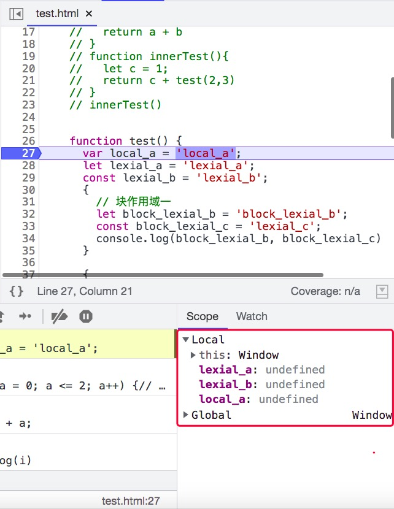
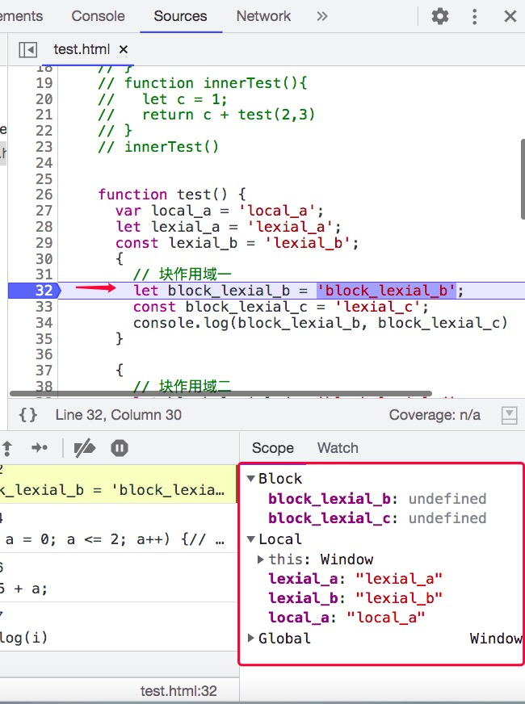
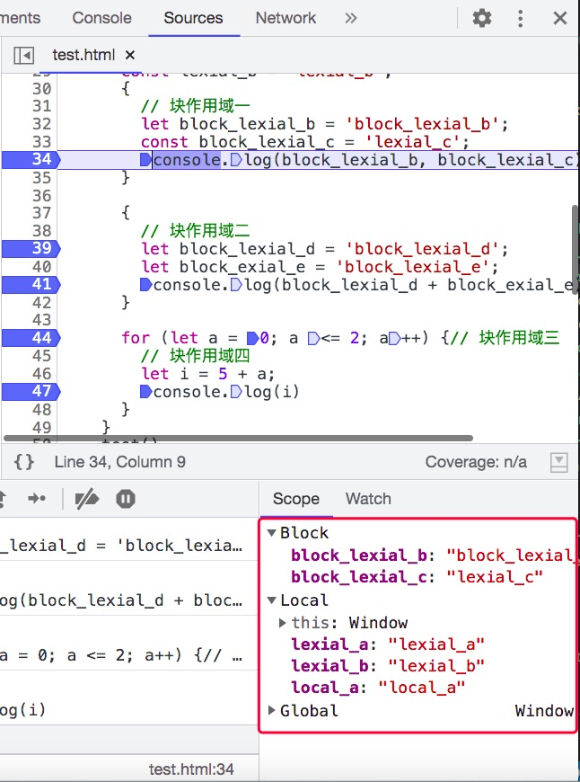
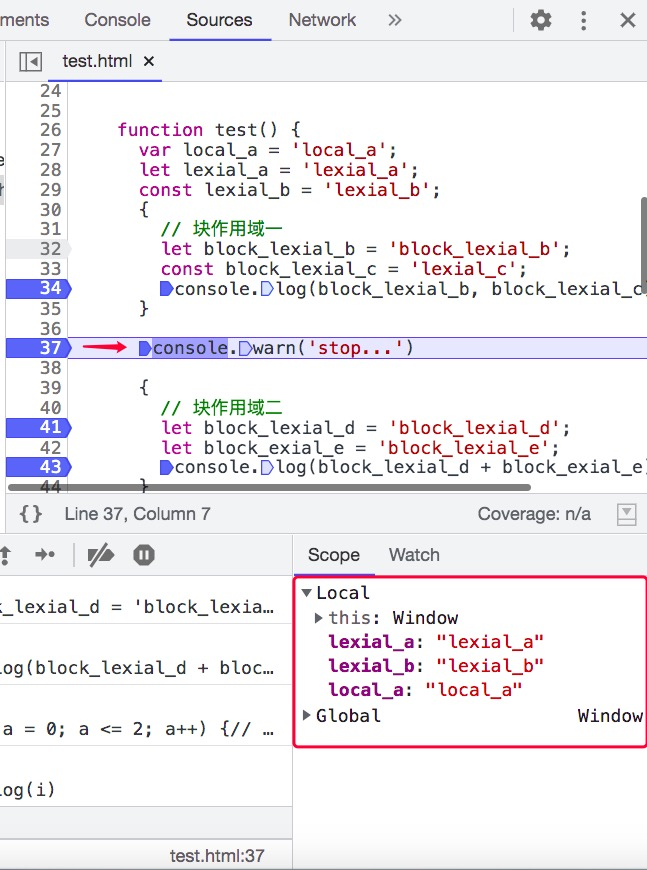
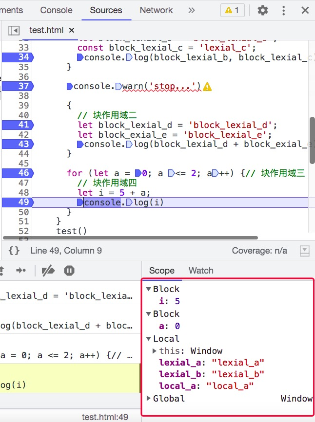
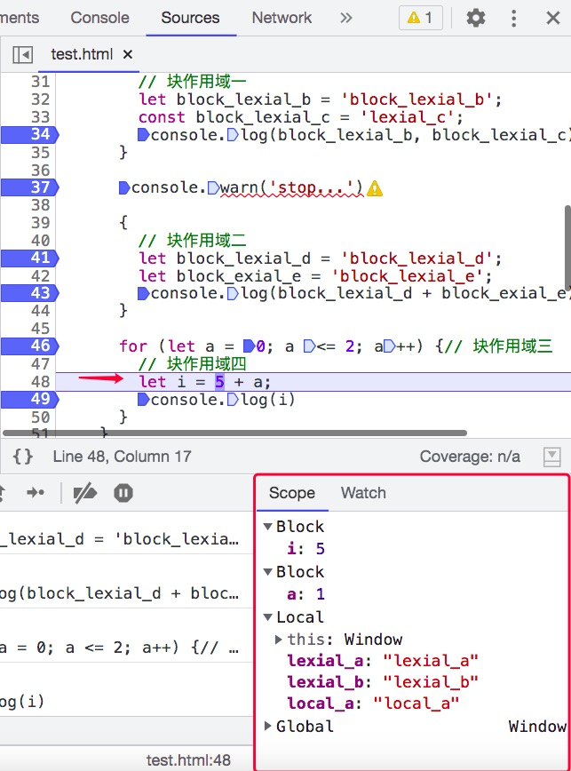
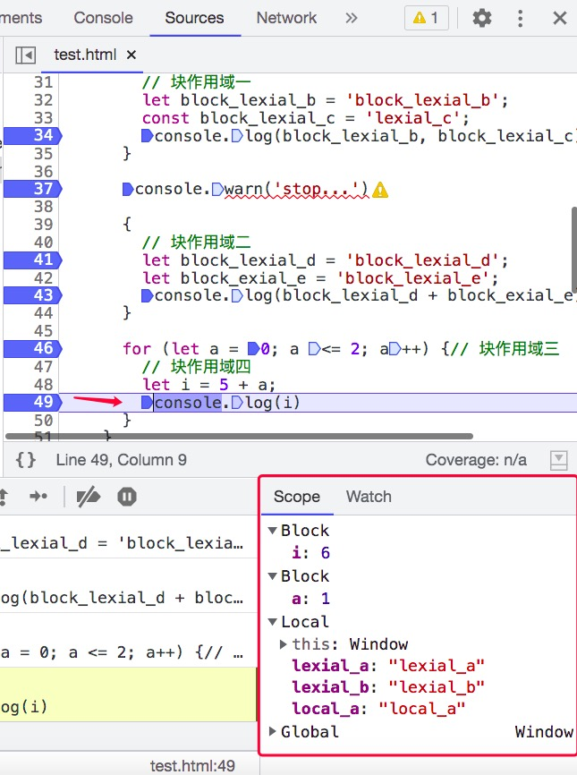
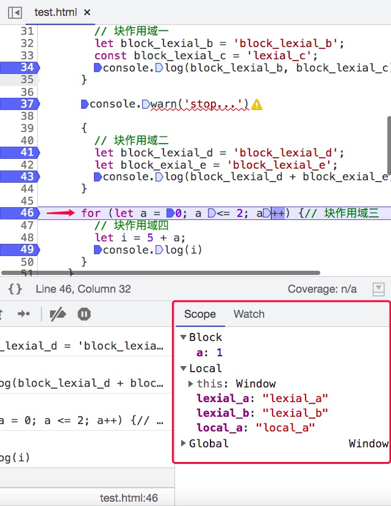
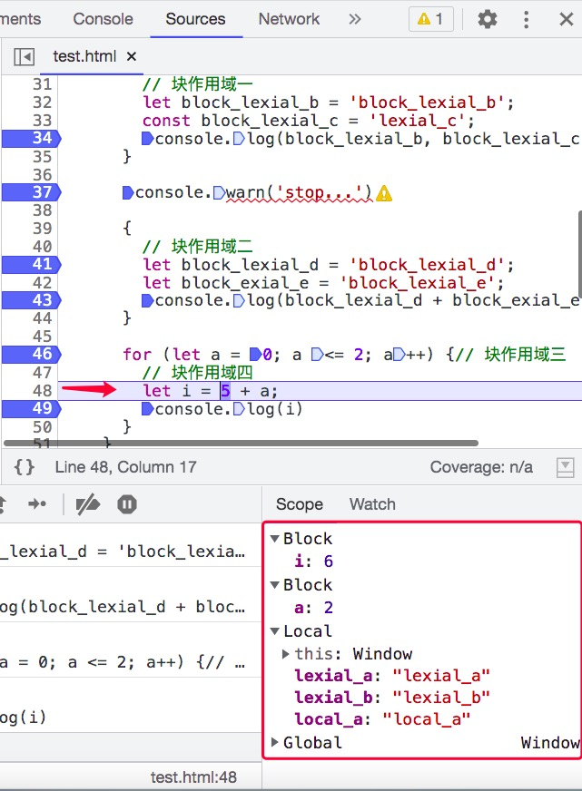

## 执行上下文

---
1. 执行上下文的组成
- 执行上下文是 js 代码段在执行时所需要的上下文环境，它包含有关函数执行时的详细细节：当前控制流所在的位置、当前的变量、this 的值，以及一些其他的内部细节。函数在 **执行过程中** 的相关信息将被存储在上下文环境中
- 执行上下文包含了代码执行过程中所需要的所有状态，其中需要一些特定的实体对象来记录这些特定状态。其中使用 Component 来统一称呼这些对象

|基础状态|描述|
|---|---|
|代码执行状态(code evaluation state)|当前上下文的代码执行状态：执行、暂停、恢复等|
|Function|函数对象，如果当前正在执行的代码是函数，该对象为一个函数对象，如果是 Script 或 Module，则该对象的值为 null|
|Realm|当前上下文能访问的资源领域|
|Script/Module|Module/Script标签对应的执行代码，代码处于其他环境中时，该值为null|
|LexicalEnvironment|词法环境对象，用于解析当前上下文中由 const/let 声明的标识符引用|
|VariableEnvironment|变量环境对象，用于解析当前上下文中由 var 声明的标识符引用|
|Generator|生成器函数特有的实体对象，包含了对生成器函数本身的引用|

- *Realm/资源域*：这个域表示的是范围（当前代码的运行环境范围），但是不同于作用域，作用域链其实是包含在这个域里面的。[例如，两个不同的页面，对应两个不同的域。一个页面中，包含一个 iframe 标签，也表示他们是不同的两个域。在代码执行之前，所有的代码都必须与一个域进行关联。从概念上来说，一个域由所有内置对象，全局环境，以及在该全局环境中加载的所有 ECMAScript 代码以及其他关联的状态和资源组成。一个 Realm 域由一个 Realm 记录对象呈现，具体包含如下内部属性](https://xiaozhuanlan.com/topic/4107562398)

|属性名|描述|
|---|---|
|[[Intrinsics]] |该属性对应所有的内置对象，例如 Map，JSON等，以及一些全局方法 isNaN，具体可查看|
|[[GlobalObject]]| 全局对象|
|[[GlobalEnv]] |全局环境记录|
|[[TemplateMap]]| 模板对象列表|
|[[HostDefined]] |保留供主机使用的字段，表示与领域相关联的其他信息，通常为 undefined|

- *环境记录项(Environment Record)*：环境记录项是基于ES代码词法嵌套的语法结构下，用于定义 **标识符和具体的变量和函数值之前的关联关系的特定结构**。词法环境一般包含了环境记录项（Environment Record）和可能为null的 outer 属性，表示指向外部的词法环境；词法环境像个字典，存储了标识符和实际引用之间的映射，js引擎能够在具体的执行阶段，遇到函数名就到这个字典中查找并调用里面的词。outer指针引用了函数外部的环境记录项，通过一层一层的向外引用，所以形成了链式结构。这个是形成作用域链的核心

2. 环境记录项
- *声明式环境记录项(declarative environment records)*：储存了其作用范围内变量（variable），const，let，class，module，import，function的声明，相当于记录了变量名和其对应的声明值

|-|描述|
|---|---|
|函数环境记录|函数被调用时会创建。它包含了在函数内部所有声明的变量与方法。如果不是箭头函数，就会给function提供一个新的 this 绑定。还支持捕获 super 方法以及函数被调用所需要的所有参数(arguments)|
|模块环境记录|包含了所有顶层模块的声明、显示导入的模块，它的outer指向全局环境记录|

- *对象环境记录(object environment records)*：主要记录的是 with 语句创建的上下文环境
- *全局环境记录(global environment records)*：对应的是全局声明，不存在外部环境，也就是其中的 outer 的值为 null。它可能预装了标识符绑定，并且包括一个关联的全局对象，该对象的属性提供了某些全局环境的标识符绑定。在代码执行过程中，可以往该全局对象中添加新的属性并修改其值
3. 创建时机
- 全局上下文在编译完成后，最先进入调用栈，并且始终在栈底。函数被调用时会先编译该函数并创建执行上下文，因此 **执行上下文** 在编译时就会被创建，它确定了函数的 **词法/静态作用域**
- 当 **执行上下文** 被创建完成后，进行执行阶段时，上下文会被激活并进入 **调用栈**，执行完成后，该执行上下文会自动出栈(*return 会结束函数的执行，此时执行上下文会被弹出栈*)。全局上下文在浏览器窗口关闭后出栈
- 同一时刻只有一个上下文处于执行过程中，那就是栈顶的上下文（*执行中的上下文始终是在栈顶*），其他的上下文需要等待(处于挂起状态)
4. 变量提升
- 之前的一些地方已经有介绍过变量提升，变量提升是在 *语法分析阶段* 出现的，js 引擎会在代码执行过程中，会将变量声明和函数声明部分提升到代码开头，也就是提前收集变量信息并进行初始化，以以下代码为例
```js
console.log(a); // undefined
var a = 'jetmine';
```
```js
// 上述的代码在js引擎中的行为
var a = undefined;
console.log(a); // undefined
a = 'jetmine';
```
```js
getName();
console.log(_name);
var _name = 'global';
function getName() {
  console.log(_name)
}
```
```js
// 上述的代码在js引擎中的行为
var _name = undefined;

function getName(){
  console.log(_name)
}
// 注意一点:函数声明的优先级高于变量,编译阶段同名的变量声明会被忽略,同时先收集变量再收集函数
getName();
console.log(_name);
_name = 'global';
```
- 函数和变量在执行之前都提升到了代码开头，也就是将变量或函数声明语句拆分成 *声明* 和 *赋值* 过程。分析上来看，似乎在执行的过程中就会将声明的语句从物理层面上移动到代码开头，但实际上它们的位置是不会变的，只是在编译时才会进行提前收集
- 不过这也直接导致了函数中的变量无论是在哪里声明的，在编译阶段都会被提取到执行上下文的变量环境中，所以这些变量在整个函数体内部的任何地方都是能被访问的，这也就是 JavaScript 中的变量提升
- 变量提升的影响: 一、变量很容易在不易察觉的情况下被覆盖。二、本应销毁的变量没有被销毁
5. 如何在函数作用域的基础上实现块级作用域
- 这个问题需要从执行上下文的角度来展开回答
```js
function test(){
  var local_a = 'local_a';
  let lexial_a = 'lexial_a';
  const lexial_b = 'lexial_b';
  {
    // 块作用域一
    let block_lexial_b = 'block_lexial_b';
    const block_lexial_c = 'lexial_c';
    console.log(block_lexial_b,block_lexial_c)
  }

  {
    // 块作用域二
    let block_lexial_d = 'block_lexial_d';
    let block_exial_e = 'block_lexial_e';
    console.log(block_lexial_d + block_exial_e)
  }

  for(let a = 0;a<=2;a++){// 块作用域三
  // 块作用域四
    let i = 5 + a;
    console.log(i)
  }
}
```
- 当代码执行到函数的首行时，函数内部的作用域对象情况如下所示，可以看到使用 `var/let/const` 声明的变量均被收集到了函数的词法环境对象(local)中（**实际上使用 `var` 声明的变量会被收集到变量环境对象中，使用 `let/const` 声明的变量被收集到词法环境对象中，这里将两者统称为词法环境**）



- 代码继续往下执行，执行到 *块作用域* 时，{} 包裹的代码中 `let/const` 声明的变量被挂载到名为 `Block` 的块作用域对象下





- 块内代码执行完毕后，`Block` 对象会被销毁，如下图所示，作用域中已经不存在 `Block`



- 每当遇到一个 {} 并且内部有 `let/const` 声明的变量时，都会创建一个块级作用域，但并非在原来的词法环境(*这里指let/const声明的变量所被收集的环境*)中在创建一个块，当这个块执行完毕之后，追加到词法环境中的内容会被销毁
- for 也会为 `let/const` 声明的变量创建块级作用域，一个是循环体内的块级作用域，另一个是循环条件内的块级作用域，每一次循环会都可能对块内的变量进行更新











6. 闭包的执行上下文
- 从一个简单的闭包例子来解释
```js
function fn1(){
	var num = 'Hello World';
	function fn2(){
		console.log(num);
	}
	return fn2;
}
var res = fn1();
res()
```
- fn2 在 fn1 的可执行代码中，并未调用执行，所以执行 fn1 时，fn2 不会创建新的上下文，直到 res 执行时，才创建了一个新的执行上下文
- 请描述以下两段代码的相同点与不同点
```js
var scope = 'global scope';
function checkscope() {
  var scope = 'local scope';
  function f() {
    return scope;
  }
  return f();
}
checkscope();
```

```js
var scope = 'global scope';
function checkscope() {
  var scope = 'local scope';
  function f() {
    return scope;
  }
  return f;
}
checkscope()();
```

- 使用函数调用栈的方式来描述

```js
ECStack.push(<checkscope> functionContext);
ECStack.push(<f> functionContext);
ECStack.pop()
ECStack.pop()
```

```js
ECStack.push(<checkscope> functionContext);
ECStack.pop()
ECStack.push(<f> functionContext);
ECStack.pop()
```
