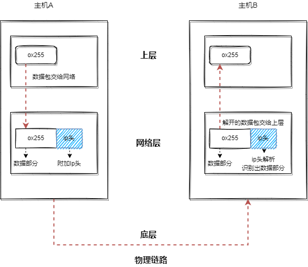
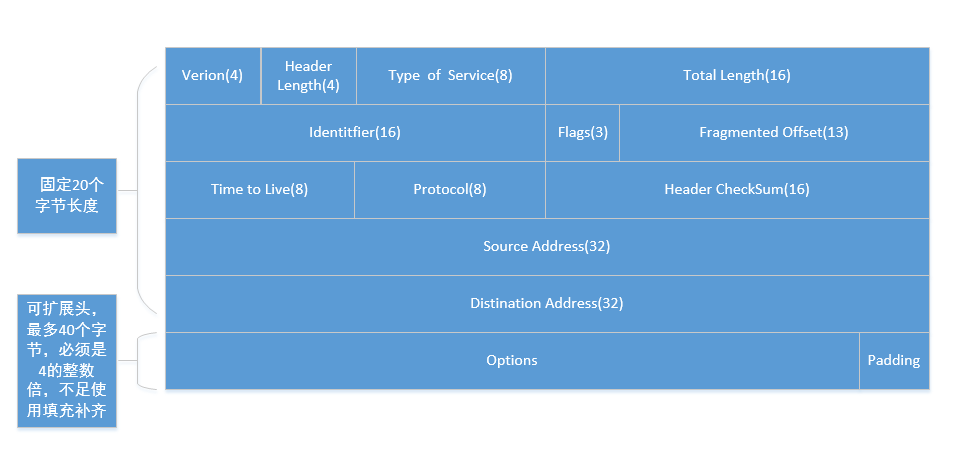
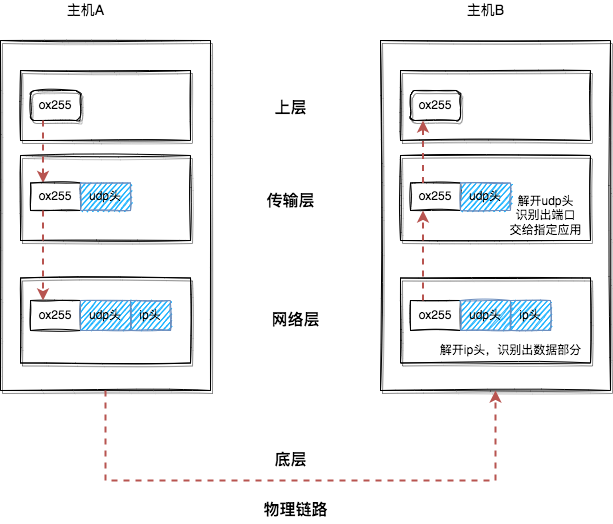
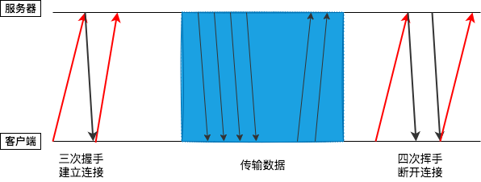
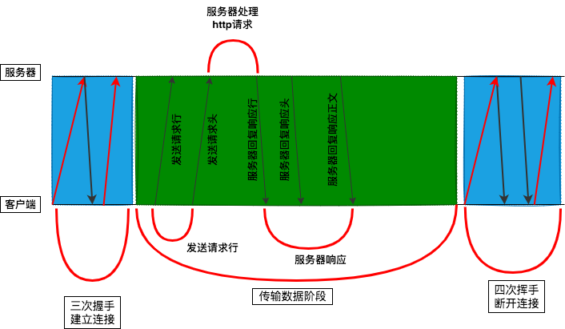
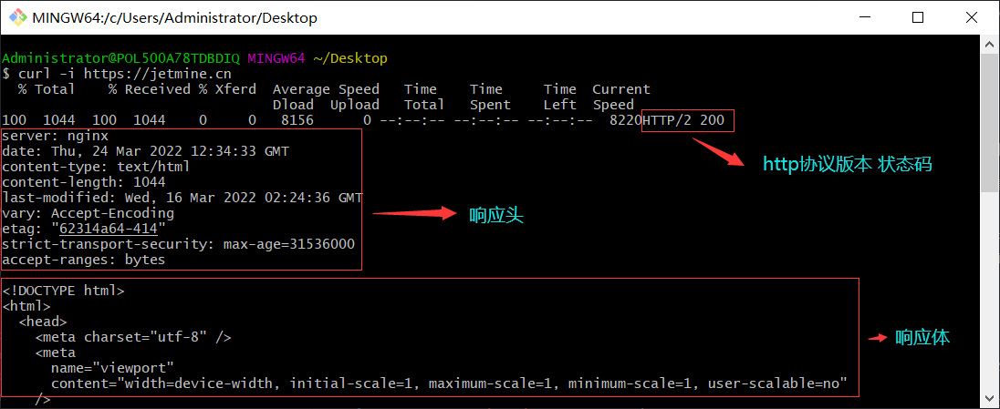
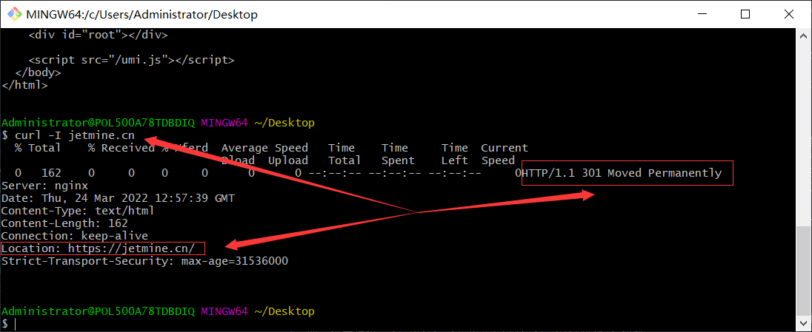

## Tcp 连接流

---

1. 数据包的处理流程

- 互联网中的数据是通过数据包来传输的，如果发送的数据很大，那么该数据就被拆分成很多小数据包来传输，而不是将一个大的文件一次传输过来
- 数据包要在互联网上传输，需要符合 _网际协议(internet protocol)_ 标准，那么互联网上不同的在线设备都有唯一的地址，这些计算机的地址称为 _ip 地址_，对任何网站的访问实际上只是计算机向另一台计算机请求信息

2. ip：将数据包送达目的主机

- 将一个数据包从一台主机送至另一台主机，在传输之前，数据包会被附带上接收方主机的 ip 信息，这样数据包在传输的过程中才能正确寻址；并且，还会附带上发送方主机的 ip 信息，这样接收方在收到以后可以回复信息给发送方



- 这些额外的附带的信息会被附带进 ip 头里面。ip 头是 ip 数据包开头的信息，其中包括 _Version(ip 协议版本号/ipv4/ipv6)_、_Protocal(协议/协议类型 1：ICMP， 2：IGMP， 6：TCP， 17：UDP)_、_Source Address(源 ip)：请求方 IP_、_Distination Address(目的 IP)：响应方 IP_ 等信息



3. UDP：将数据包送达应用程序

- ip 属于非常底层的协议，只负责将数据传送到对方，但是对方电脑并不知道把数据包交给哪个应用程序。因此需要基于 Ip 之上开发能与应用打交道的协议，常见的有 **用户数据包协议(UDP)**
- 那么 UDP 通过 **端口号** 来标识应用程序，端口号是一个数字。每个需要访问网络的应用程序都要绑定一个端口号，这样 UDP 就能根据从拆开的 UDP 头 中得到的端口号将数据分发给指定的应用程序了



- IP 通过 IP 地址信息把数据包发送给指定的电脑，而 UDP 通过端口号把数据包分发给正确的程序。和 Ip 头一样，也有相应的 UDP 头，其中包含有 目的端口、源端口信息等
- UDP 发送数据时，会有各种因素导致数据包出错，虽然 UDP 可以校验数据是否正确，但对于错误的数据包，UDP 并不提供重传机制，而是将其丢弃，并且 UDP 在发送之后也无法知道数据包是否能送达目的主机
- 虽然 UDP 不能保证数据可靠性，但是传输速度非常快，一般常用于一些关注速度、但不那么要求数据完整性的领域，如视频直播、互动游戏等

4. TCP：把数据完整地送达应用程序

- 那么对于一些要求数据传输可靠性的应用，如果使用 UDP 来传输会存在两个问题：一是数据包在传输过程中容易丢失；二是大文件会被拆分成很多小的数据包来传输，这些小的数据包会经过不同的路由并在不同的时间达到接收端，但 UDP 协议不知道如何组装这些数据包，以让这些数据包还原成完整的文件
- TCP 又叫 传输控制协议，是一种面向连接的、可靠的、基于字节流的传输层通信协议，与 UDP 相比，它具有以下几个特点：一是 **对于数据包丢失的情况，TCP 提供重传机制**；二是 **TCP 引入了数据包排序机制，用来保证把乱序的数据包组合成一个完整的文件**
- 和 UDP 头一样，TCP 头除了包含目的端口和本机端口外，还提供了用于排序的序列号，以便接收端通过序号来重排数据包。TCP 单个数据包的传输流和 UDP 流程差不多，不同的是，通过 TCP 头的信息保证了一块大的数据传输的完整性


- 一个完整的 TCP 连接的生命周期包括了 _建立连接_、_传输数据_ 和 _断开连接_ 三个阶段
- 首先是 **建立连接阶段**。该阶段通过 _三次握手_ 来建立客户端和服务器之间的连接。TCP 提供面向连接的通信传输。_面向连接_ 是指数据通信开始之前先做好两端之间的准备工作。_三次握手_ 是指在建立一个 TCP 连接时，客户端和服务器总共要发送三个数据包以确认连接的建立
- 其次，**数据传输阶段**。在该阶段，_接收端需要对每个数据包进行确认操作_，也就是接收端在接收到数据包之后，需要发送确认数据包给发送端。所以当发送端发送了一个数据包之后，在规定时间内没有接收到接收端反馈的确认消息，则判断为数据包丢失，并触发发送端的重发机制。同样，一个大的文件在传输过程中会被拆分成很多小的数据包，这些数据包到达接收端后，接收端会按照 TCP 头中的序号为其排序，从而保证组成完整的数据
- 最后，**断开连接阶段**。数据传输完毕之后，就要终止连接了，涉及到最后一个阶段“四次挥手”来保证双方都能断开连接



- TCP 为了保证数据传输的可靠性，牺牲了数据包的传输速度，因为 _三次握手_ 和 _数据包校验机制_ 等把传输过程中的数据包的数量提高了一倍

---

## http 请求流程

---

1. 浏览器发起请求

- http 协议是属于应用层的协议，是一种允许浏览器向服务器获取资源的协议，它是建立在 tcp 连接基础之上的。通常由浏览器发起，用于获取不同类型的文件

2. 请求流程

- **构建请求**。在浏览器发起请求之前，需要先构建 _请求行_ 信息，构建好后，浏览器就准备发起请求

```bash
GET /index.html http/1.1
# 请求方法 请求URL地址 协议名称及版本
```

- **查找缓存**。在发起网络请求之前，浏览器会先在浏览器缓存中查询是否有要请求的文件(浏览器缓存是一种在本地保存资源副本，以供下次请求时直接使用的技术)
- 如果浏览器在缓存中发现存有该次请求的副本，它会拦截请求并返回该资源的副本，结束此次请求，而不会去源服务器重新下载，这样做可以 _缓解服务器压力，提升性能(获取资源的耗时更短了)_、快速实现网站资源加载
- **DNS解析**：如果未查找到该站点的缓存，则会进入 *DNS查询环节*。当然此阶段也存在缓存，如查询到缓存，则会返回该站点的 *ip地址*；否则进行 *DNS查询* 
- **准备 ip 地址和端口**。如果缓存查找失败，就会进入网络请求流程。浏览器使用 HTTP 协议作为应用层协议，用来封装请求的文本信息；并使用 TCP/IP 作传输层协议将它发到网络上，所以在 HTTP 工作开始之前，浏览器需要通过 TCP 与服务器建立连接。
- 也就是说 **http 的内容是通过 tcp 的传输阶段来来传输的**。



- 我们只在输入框输入了网站的地址，那么如何获取请求服务器的 ip 地址呢? 这就需要用到 DNS 了，它负责将域名与 ip 做一一映射关系。这套将域名映射为 ip 的系统就叫做 _域名系统(（Domain Name System)_。那么在准备 ip 地址和端口的过程种，第一步浏览器会请求 DNS 返回域名对应的 Ip
- 并且浏览器会提供了 DNS 数据缓存服务，如果某个域名已经解析过了，那么浏览器会缓存解析的结果，以便下次查询时直接使用。在 URL 未指明端口号的前提下，HTTP 协议默认端口是 80 端口
- **等待 TCP 队列**：到这一步就开始建立 TCP 连接了。不过 Chrome 有个机制，同个域名下最多只能建立 6 个 TCP 连接(<font color="red">不光是指 ajax，还包括页面中的资源加载，只要是一个域名下的资源，浏览器同一时刻最多只支持 6 个并行请求。这是 HTTP/1.1 的规则</font>)。如果同个域名下同时有 10 个请求发生，那么其中 4 个请求会进入排队等待状态，直到进行中的请求完成。如果当前域名下请求数少于 6，会直接进入下一步，建立 TCP 连接
- **建立 TCP 连接**：结束排队以后，就可以跟服务器建立连接了，在发起 HTTP 请求之前，浏览器要先通过 TCP 与服务器建立连接
- **发送 HTTP 请求**：当建立 TCP 连接以后，浏览器就可以与服务器进行通信了，http 中的数据就是这个通信过程传输的。那么 http 报文通过 _请求行_、_请求头_ 以及 _请求体(可选)_ 构成，如下所示


3. 响应处理流程

- 在请求送到服务器并被处理完成后，服务器会根据请求响应内容。响应头和请求头的结构是一样的，也是通过 _请求行_、_请求头_ 以及 _请求体(可选)_ 构成



- **断开连接**：一般在服务器向客户端返回了请求数据以后，它就会关闭 TCP 连接，但是客户端可以通过在 _请求头_ 中添加一些字段信息，使得保持 TCP 连接，如 `Connection:Keep-Alive`。保持 TCP 连接可以省去下次请求时需要建立连接的时间，提升资源加载速度。比如，一个 Web 页面中内嵌的图片就都来自同一个 Web 站点，如果初始化了一个持久连接，你就可以复用该连接，以请求其他资源，而不需要重新再建立新的 TCP 连接



- 在上面的响应行中，状态码为 301，也就是告诉浏览器需要进行重定向，浏览器会根据响应头中的 _Location_ 字段重定向到新的网址
