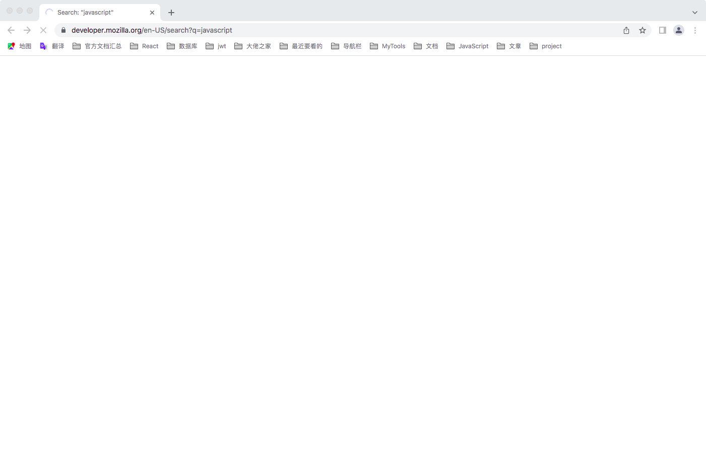
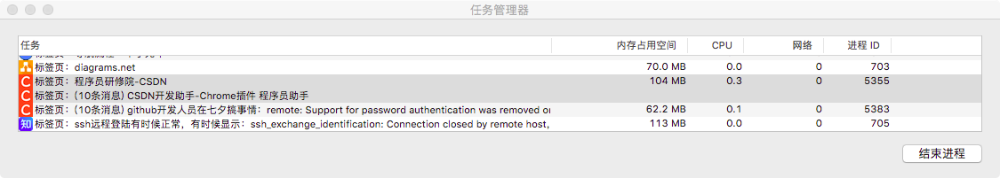
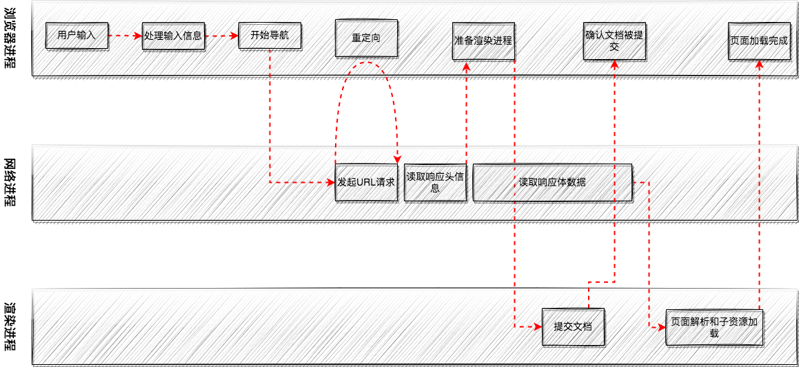

## 从输入 URL 到页面展示

---

1. 整体流程

- ① 首先，浏览器进程接收到用户输入的 URL 请求，浏览器进程便将该 URL 转发给网络进程
- ② 然后，在网络进程中发起真正的 URL 请求
- ③ 接着网络进程接收到了响应头数据，便解析响应头数据，并将数据转发给浏览器进程
- ④ 浏览器进程接收到网络进程的响应头数据之后，发送“提交导航 (CommitNavigation)”消息到渲染进程，发送 CommitNavigation 时会携带响应头等基本信息
- ⑤ 渲染进程接收到“提交导航”的消息之后，便开始准备接收 HTML 数据，接收数据的方式是直接和网络进程建立数据管道
- ⑥ 最后渲染进程会向浏览器进程“确认提交”，这是告诉浏览器进程：“已经准备好接受和解析页面数据了”
- ⑦ 浏览器进程接收到渲染进程“提交文档”的消息之后，便开始移除之前旧的文档，然后更新浏览器进程中的页面状态
- 经过上面的流程，那么 **用户发出 URL 请求到页面开始解析的这个过程，就叫做导航**

2. 子流程 ① 用户输入

- 当用户在地址栏输入一个查询关键字时，地址栏会判断输入的关键字是 _搜索内容_ 还是 _请求的 URL_
- 如果是搜索内容，地址栏会使用浏览器默认的搜索引擎，来合成新的带搜索关键字的 URL；如果判断输入内容符合 URL 协议，那么地址栏会根据规则，把这段内容加上协议，合为完整的 URL

```sh
jetmine.cn > https://jetmine.cn
```

- 在用户输入关键字并回车后，那么这意味着当前页面将被替换为新的页面。不过在这个流程继续之前，浏览器还给了当前页面一次执行 beforeunload 事件的机会，beforeunload 事件允许页面在退出之前执行一些数据清理操作，还可以询问用户是否要离开当前页面，比如当前页面可能有未提交完成的表单等情况，因此用户可以通过 beforeunload 事件来取消导航，让浏览器不再执行任何后续工作
- 当前页面没有监听 beforeunload 事件或者同意了继续后续流程，那么浏览器会进入下面的状态



- 也就是当浏览器刚开始加载一个地址之后，标签页上的图标会进入加载状态，但此时页面中的内容仍是之前打开的页面内容，并不会立即替换为要访问的页面。因为要等待 _提交文档阶段，页面内容才会被替换_

3. 子流程 ② URL 请求过程

- 这时就进入了页面资源请求流程。浏览器进程通过 _进程间通信_ 把 URL 请求发送到网路进程，网络进程接收到 URL 请求后，会在这里发起真正的 URL 请求流程
- 首先，网络进程会查找本地缓存是否缓存了该资源。如果有缓存资源，那么直接返回资源给浏览器进程；如果在缓存中没有查找到资源，那么直接进入网络请求流程。这请求前的第一步是要进行 DNS 解析，以获取请求域名的服务器 IP 地址。如果请求协议是 HTTPS，那么还需要建立 TLS 连接
- 接下来就是利用 IP 地址和服务器建立 TCP 连接。连接建立之后，浏览器端会构建请求行、请求头等信息，并把和该域名相关的 Cookie 等数据附加到请求头中，然后向服务器发送构建的请求信息
- 服务器接收到请求信息后，会根据请求信息生成响应数据（包括响应行、响应头和响应体等信息），并发给网络进程。等网络进程接收了响应行和响应头之后，就开始解析响应头的内容了。那么当导航过程中，如果服务器响应行的状态码包含了 301、302 一类的跳转信息，浏览器会跳转到新的地址继续导航；如果响应行是 200，那么表示浏览器可以继续处理该请求
- 并且浏览器会根据 Content-Type 的值来决定如何显示响应体的内容，如果 Content-Type 字段的值被浏览器判断为下载类型，那么该请求会被提交给浏览器的下载管理器，同时该 URL 请求的导航流程就此结束。但如果是 HTML，那么浏览器则会继续进行导航流程。由于 Chrome 的页面渲染是运行在渲染进程中的，所以接下来就需要准备渲染进程了

4. 子流程 ③ 准备渲染进程

- 默认情况下，Chrome 会为每个页面分配一个渲染进程，就是每打开一个新页面就会配套创建一个新的渲染流程。但如果 **从一个页面打开了另一个新页面，而新页面和当前页面属于同一站点的话**，那么新页面会复用父页面的渲染进程



- 从上图中可以看到，这两个页面由于拥有相同的协议和根域名，因此它们属于同一站点，这两个页面就会运行在同一渲染进程中，是同一个进程 ID
- 总而言之，打开一个新页面采用的 **渲染进程** 策略是：一般情况下，打开新的页面都会使用单独的渲染进程。如果从一个页面打开另一个页面，并且这两个页面都属于同一站点的话，那么新页面会复用父页面的渲染进程；如果是其他情况，浏览器进程会为新页面创建一个新的渲染进程
- 渲染进程准备好之后，还不能立即进入文档解析状态，因为此时的文档数据还在网络进程中，并没有提交给渲染进程，所以下一步就进入了提交文档阶段

5. 子流程 ④ 提交文档

- 提交文档的意思是 浏览器进程将网络进程接收到的 HTML 数据提交给渲染进程，它的流程是这样的
- 当浏览器接收到网络进程的响应头数据之后，便向渲染进程发起 _提交文档_ 的消息；渲染进程接收到 _提交文档_ 的消息后，会和网络进程建立传输数据的 _管道_；等文档数据传输完成之后，渲染进程会返回 _确认提交_ 的消息给浏览器进程；浏览器进程在收到 _确认提交_ 的消息后，会更新浏览器界面状态，包括了 _安全状态_、_地址栏的 URL_、_前进后退的历史状态_，并更新 Web 页面
- 这也就解释了为什么在浏览器的地址栏里面输入了一个地址后，之前的页面没有立马消失，而是要加载一会儿才会更新页面

6. 子流程 ⑤ 渲染阶段

- 一旦文档被提交，渲染进程便开始页面解析和子资源加载了。一旦页面生成完成，渲染进程会发送一个消息给浏览器进程，浏览器接收到消息后，会停止标签图标上的加载动画


