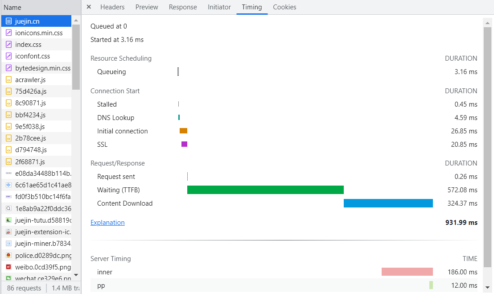

## Performance
---
1. 一次完整请求的瀑布图的含义

- 以 *掘金* 为例，其中各个阶段代表的含义
- *Queueing*：表示请求进入排队阶段，以下三种情况会进行排队。一、有更高优先级的请求。二、已经为此源打开了六个 TCP 连接，这是限制。仅适用于 HTTP/1.0 和 HTTP/1.1。三、浏览器在磁盘缓存中短暂分配空间
- *Stalled*：表示停滞不前，请求可能因上述排队中描述的任何原因而停止
- *DNS Lookup*：表示开始进行DNS解析，将我们的请求域解析为ip地址
- *Initial connection*：表示进行tcp链接/重试和ssl协商共同耗费的时间
- *SSL*：这一步就是当请求 https 域名时会进行 ssl 协商的耗时
- *request sent*：表示请求开始发送
- *TTFB*：TTFB 代表 `Time To First Byte`。此时间包括 1 次往返延迟和服务器准备响应所用的时间。通俗来说就是当请求发送到接受到响应的第一个字节的时间。TTFB这一步通常可以粗略表示本次请求服务器(后台)从接受到请求然后返回响应结果处理的耗时。
- *Content Download*：下载本地响应的时间
