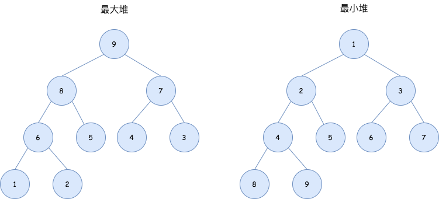

## 优先级队列
---
1. 优先级队列的特性
- 普通的队列是不允许插队的，它遵循一个先进先出的这样一个特性，也就是按进来的顺序来进行出队操作。而优先级队列在进入队列的时候会携带一个优先级进入队列，会进行一个排队操作
- 比如定时器的实现原理，定时器任务实际上是携带了时间上的优先级的，这个时间戳就是优先级队列的比较标准，它会按照时间上的优先级来执行这个队列中的任务

2. 二叉堆
- 二叉堆是是一颗完全二叉树：在树结构中，除了最后一层，其他节点都是完整的(**每一个节点都拥有左右两个节点**)，分为最大堆和最小堆。**二叉堆中，每一个节点都必须是可比较的，否则就无法判断优先级**
- **最大堆**：又称为大顶堆，任何父节点的键值，都大于等于任何一个子节点。最大堆的根节点为堆顶，堆顶元素是整个堆中的 **最大值**
- **最小堆**：又称为小顶堆，任何父节点的键值，都小于等于任何一个子节点。最小堆的根节点为堆顶，堆顶元素是整个堆中的 **最小值**

- 在对二叉堆进行操作时，需要满足它的特性，不能去破坏的特点。通常需要进行元素之间的比较，称之为上浮或下沉，对二叉堆的操作一般插入节点、删除节点、构建二叉堆