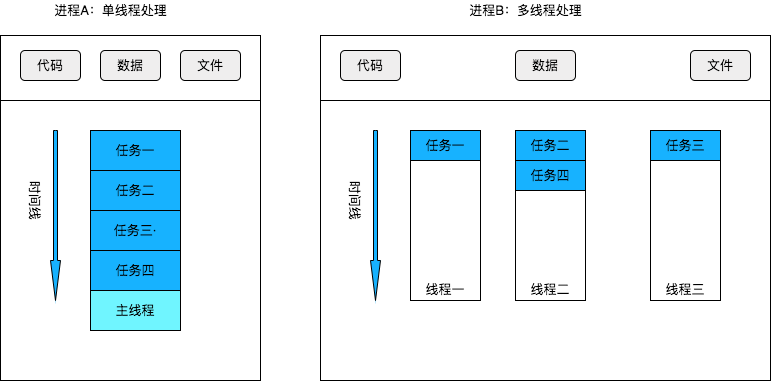
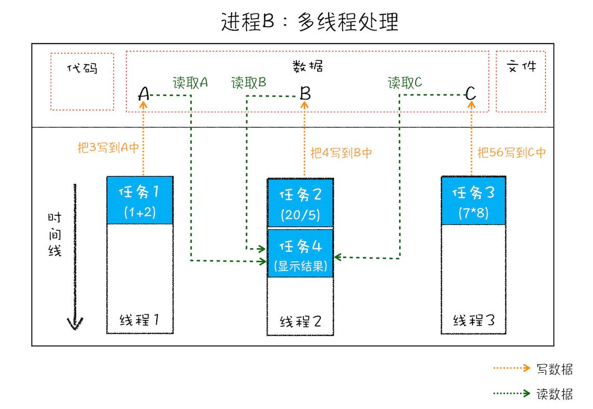
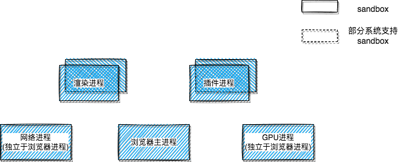
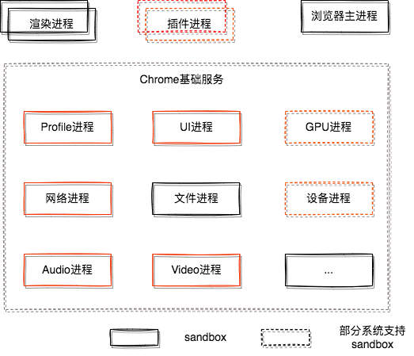
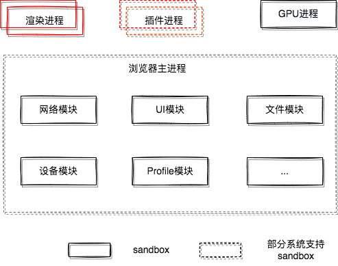

## 进程与线程

---

1. 什么是并行处理

- 计算机中的并行处理是 **同一时刻处理多个任务**。以数的运算为例，如下面的三个表达式计算并展示出结果中，这个过程可以拆分成四个任务：任务一是计算 _a=1+2_，任务二是计算 _b=15\*3_，任务三是计算 _c=9-5_，任务四是 _显示最后计算的结果_

```js
const a = 1 + 2;
const b = 15 * 3;
const c = 9 - 5;
```

- 正常情况下使用单线程来处理的话，程序会分四步按照顺序分别执行这个四个任务；那么采用多线程的话，只需要分为两步，第一步是使用三个线程同时执行前三个任务，第二步，再执行第四个显示任务。对比起来的话，并行处理能大大提升性能

2. 进程和线程

- 多线程可以并行处理任务，但是线程是不能单独存在的，它是由进程来启动和管理的
- **一个进程是一个程序的运行实例**。在启动一个程序时，os 会为这个程序创建一块内存，用于存放代码、运行中的数据和一个用于执行任务的主线程，那么这样的一个运行环境就叫 _进程_



- 能够看出来，**线程是依赖于进程的，而进程中使用多线程并行处理能提升计算效率**。那么进程与线程之间的关系具有以下四个特点
- 一：**进程中的任意一线程执行出错，都会导致整个进程的崩溃**。这就好比上面那个计算过程，把其中任意一个表达式改为 _22 / 0_，此时执行该条任务的线程会执行出错，进而导致整个进程的崩溃(进程中的其他线程的读写结果也没了)
- 二：**线程之间共享进程中的数据**。线程之间可以对进程的公共数据进行读写操作，如图所示，线程一和线程二以及线程三分别把执行的结果写入到对应的数据中，接着线程二又继续读取这些数据，并显示执行结果



- 三：**当一个进程关闭之后，操作系统会回收进程所占用的内存**。当一个进程退出时，操作系统会回收该进程所申请的所有资源；即使其中任意线程因为操作不当而导致内存泄漏，当进程退出时，这些内存也会被正确回收
- 四：**进程之间的内容相互隔离**。_进程隔离_ 是为保护操作系统中进程互不干扰的技术，每一个进程只能访问自己占有的数据，这就避免了进程 A 写入数据到进程 B 的情况。并且因为进程之间的数据是严格隔离的，所以一个进程关闭或是挂起了，是不会影响到其他进程的。而进程之间的通信，需要使用用于 _进程间通信(IPC)_ 的机制

---

## 单进程浏览器时代

---

1. 单进程架构

- 顾名思义，单进程浏览器是指浏览器所有的功能模块都是运行在同一个进程里，其中的模块包含了网络、插件、JavaScript 运行环境、渲染引擎和页面等


- 如此多的功能模块运行在一个进程里，是导致单进程浏览器 _不稳定_、_不流畅_、_不安全_ 的一个主要因素

2. 问题分析

- _不稳定_：早期浏览器需要借助插件来实现像 web 视频、web 游戏等各种强大的功能，但插件是最容易出问题的模块，并且还运行在浏览器进程中，所以一个插件的意外崩溃会引起整个浏览器的崩溃。而渲染引擎模块也是不稳定的，一些复杂的 js 代码就有可能引起渲染引擎模块的崩溃，进而导致整个浏览器的崩溃
- _不流畅_：在单进程浏览器架构中，所有页面的渲染模块、js 环境、插件都是运行在同一个进程中的，也就是说同一时刻只有一个模块可以执行。那么当有一段非常耗时(如死循环等)的代码被执行时，js 执行环境这个模块会独占整个线程，导致页面中的其他模块没有几乎被执行。因为浏览器中所有的页面都运行在该线程中，所以这些页面都没有机会去执行任务，这样就会导致整个浏览器失去响应，变卡顿
- 而导致不流畅的因素除了脚本或插件外，页面的内存泄漏也会导致单进程变慢。运行一个复杂点的页面在关闭按钮，会存在内存不能完全回收的情况，就会导致浏览器使用时间越长，内存占用越高，浏览器会变得越慢
- _不安全_：插件是可以获取操作系统的任意资源，那就意味着在页面中运行一个插件时这个插件能完全操作你的电脑。如果是个恶意插件，那么它就可以释放病毒、窃取你的账号密码，引发安全性问题。对于页面脚本的话，它可以通过浏览器的漏洞来获取系统权限，这些脚本获取系统权限之后也可以对电脑作一些恶意的事情

---

## 多进程浏览器时代

---

1. 早期多进程架构


- 在上面的架构图中能看到，Chrome 的页面是运行在单独的渲染进程中的，同时页面里的插件也是运行在单独的插件进程之中的，同时进程之间通过 Ipc 机制进行通信
- 那么由于进程是相互隔离的，所以当一个页面或插件崩溃时，影响到的仅仅是当前的页面进程或者插件进程，并不会影响到浏览器和其他页面，这就完美解决了页面或插件的崩溃会导致整个浏览器崩溃。同样，JavaScript 也是运行在渲染进程中，所以即使 JavaScript 阻塞了渲染进程，影响到的也只是当前的渲染页面，而并不会影响浏览器和其他页面，因为其他页面的脚本是运行在它们自己的渲染进程中的
- 这样一来的话，当页面被关闭时，整个渲染进程也会被关闭，之后该进程所占用的内存都会被系统回收，浏览器页面的内存泄漏问题也得以解决
- 采用多进程架构的好处是可以使用安全沙箱。沙箱类似给系统上了一把锁，沙箱里面的程序可以运行，但是不能在硬盘上写入任何数据，也不能在敏感位置读取任何数据，如文档和桌面
- Chrome 把插件进程和渲染进程锁在沙箱里面，这样即使在渲染进程或者插件进程里面执行了恶意程序，恶意程序也无法突破沙箱去获取系统权限

2. 目前多进程架构



- 目前 Chrome 浏览器包括：1 个浏览器(Browser)进程、1 个 GPU 进程、1 个网络(NetWork)进程、多个渲染进程和多个插件进程
- **浏览器进程**：主要负责界面展示、用户交互、子进程管理，同时提供存储功能
- **渲染进程**：核心任务是将 HTML、CSS 和 JavaScript 转换为用户可以与之交互的网页，排版引擎 Blink 和 JavaScript 引擎 V8 都是运行在该进程中。默认情况下，Chrome 会为每一个 Tab 标签创建一个渲染进程，处于安全考虑，渲染进程都是运行在沙箱模式下
- **GPU 进程**：GPU 的使用初衷是为了实现 3D CSS 的效果，而随后网页、Chrome 的 UI 界面都选择采用 GPU 来绘制，这使得 GPU 成为浏览器普遍的需求。其实，Chrome 刚开始发布的时候是没有 GPU 进程的；最后，Chrome 在其多进程架构上也引入了 GPU 进程
- **网络进程**：主要负责页面的网络资源加载，面向浏览器进程和渲染进程提供网络下载功能，之前是作为一个模块运行在浏览器进程里面的，直到最近才独立出来成为一个单独的进程
- **插件进程**：主要是负责插件的运行。因插件易崩溃，所以需要通过插件进程来隔离，以保证插件进程崩溃不会对浏览器和页面造成影响
- **预渲进程**：一个额外的渲染进程，会提前开启，等有渲染进程需求的时候，就直接使用该进程，这样就省去了创建进程的时间
- 那么在页面中，以下几个情况也会开启单独的进程。iframe 没有单独标签，是潜入在其它页面里面的，比如一个页面嵌入了三个不同域名的 iframe，那么这个页面就会拥有四个渲染进程(同一站点的渲染进程会复用)

| 情形              |
| ----------------- |
| 页面里存在 iframe |
| 页面里有插件      |
| 装了扩展的情况下  |

3. 当前多进程架构的问题

- 更高的资源占用。每个进程都会包含公共基础结构的副本(如 js 运行环境)，也就是说浏览器会消耗更多的内存资源
- 更复杂的体系结构。浏览器各模块之间耦合性高、扩展性差等问题，会导致现在的架构难以适应新的需求

---

## 未来面向服务的架构

---

1. SOA

- 2016 年，Chrome 团队使用 “面向服务的架构” 的思想设计了新的 Chrome 架构，也就是说，谷歌整体架构会朝向现代操作系统所采用的 “面向服务的架构” 方向发展，原来的各种模块会被重构成独立的服务（Service），每个服务（Service）都可以在独立的进程中运行，访问服务（Service）必须使用定义好的接口，通过 IPC 来通信，从而构建一个更内聚、松耦合、易于维护和扩展的系统
- Chrome 最终要把 UI、数据库、文件、设备、网络等模块重构为基础服务，类似操作系统底层服务，下面是 Chrome“面向服务的架构”的进程模型图



- Chrome 正在逐步构建 Chrome 基础服务（Chrome Foundation Service），如果将 Chrome 认为是“便携式操作系统”，那么 Chrome 基础服务便可以被视为该操作系统的“基础”系统服务层。并且它还提供灵活的弹性架构，在强大性能设备上会以多进程的方式运行基础服务，但是如果在资源受限的设备上，Chrome 会将很多服务整合到一个进程中(内存不够的系统中，会把相关的进程都合并到主进程中)，从而节省内存占用


