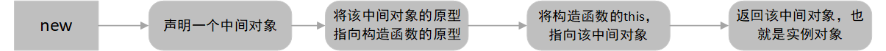
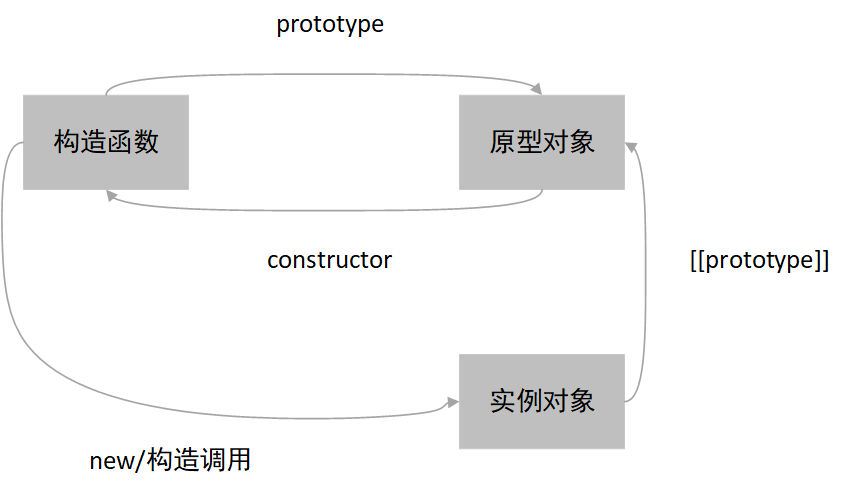
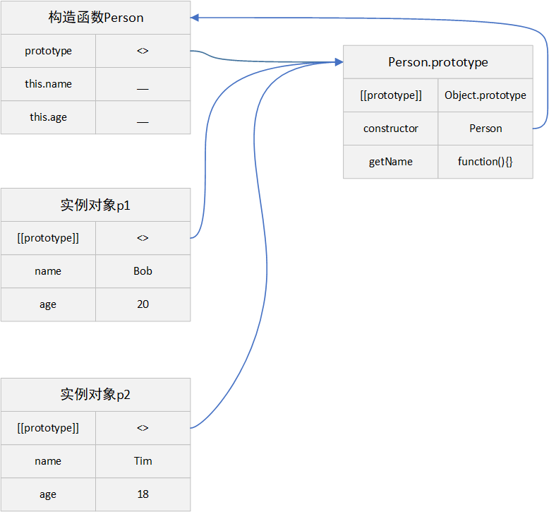
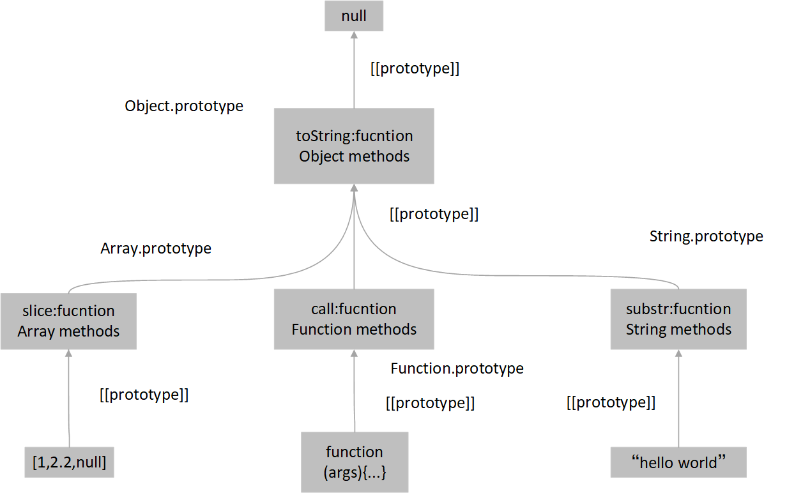
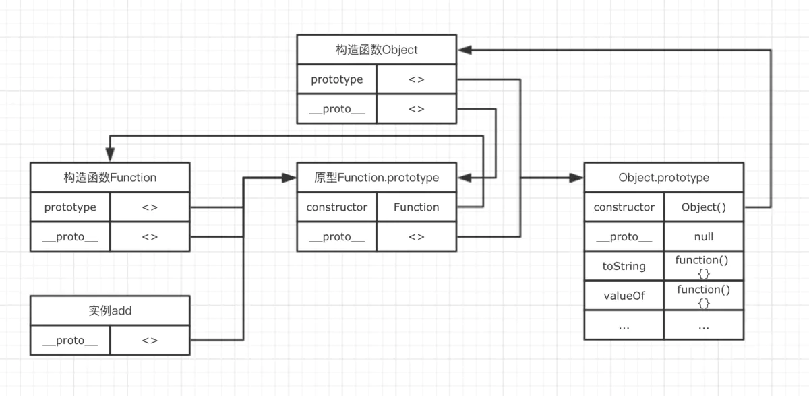

## 工厂模式
---

1. 模型化生产

- 当我们需要多个 person 对象时，也就是可能部分属性不一样，大部分属性一致时，就需要多次创建相似的对象
- 这时候可以使用工厂模式，使用工厂模式创建一个模子，通过这个模子复制出很多需要的相似的对象

2. 对比
- 多次创建属性类似的对象

```js
var Tom ={
	name:'Tom',
	age:20,
	sex:"男",
	getName:function(){
		return this.name
	}
};

var Marry ={
	name:'Marry',
	age:18,
	sex:"女",
	getName:function(){
		return this.name
	}
}
```

- 使用工厂模式创建模子，但是会有一个问题，无法使用 instanceof 识别对象的类型，但是我们可以通过构造函数去解决这个问题

```js
const createPerson = function(props){
	const obj = {};
	// 声明一个中间对象,该对象就是工厂模式的模子

	// 添加需要的属性与方法
  Object.entires(props).map(items => {
    obj[items[0]] = items[1]
  })

	return obj;
};

const Tom = createPerson({
  name:'Bob',
  age:18,
  sex:'男',
  getName:function(){
		return this.name
	};
});

Tom instanceof Object; // true
Tom instanceof createPerson; // false
```

---
## 构造函数
---

1. new 关键字
- 使用 new 构造调用与直接调用函数的区别

```js
function demo(){
   console.log(this)
}
demo(); // window
new demo(); // demo
// 使用new之后，函数内部发生了事情，this指向发生了改变
```

- new 出来的实例对象，我们知道，这个实例对象是可以访问构造函数的成员属性以及构造函数的原型对象中的属性。因此，只要我们实现这大概的两步，一个简单的 new 就被实现出来了

```js
function New(constructor) {
  let obj = {};

  constructor.prototype && Object.setPrototypeOf(obj, constructor.prototype);
  // 将新的实例对象的__proto__指向构造函数的原型对象

  let arg = Array.prototype.slice.call(arguments, 1);
  // 获取传递进来的剩余参数

  let result = constructor.apply(obj, arg);
  // 构造函数传递参数并执行，通过 apply 将函数的 this 指向 obj

  return (typeof result === "object" || typeof result === "function") && result !== null ? result : obj;
  // 判断是否有明确返回值
}
```

```js
/** 
 * 通过 New 声明创建实例对象，这里的变量p1指向 new 中返回的对象
 * 这里等价于 new Person('tom',20,'男')，实例的类型是可以判断的
*/
var p1 = New(Person, 'tom', 20,'男');
p1 instanceof Person;
// true
```

- 为什么要判断构造函数中是否明确返回了类型?

```js
/** 
 * 构造函数中存在返回值
*/
function func(name, age, sex) {
  this.name = name;
  this.age = age;
  return {
    name,
    age,
    sex,
  };
}

func.prototype.getName = function () {
  console.log(this.name);
};

var obj = new func('Bill', 18, 'Boy');

obj.getName; // undefined
obj instanceof func; // false
Object.getPrototypeOf(obj) === Object.prototype; // true
```

```js
/** 
 * 构造函数中不存在返回值
*/
function func(name, age, sex) {
  this.name = name;
  this.age = age;
}

func.prototype.getName = function () {
  console.log(this.name);
};

var obj = new func('Bill', 18, 'Boy');

obj.getName(); // Bill
obj instanceof func; // true
Object.getPrototypeOf(obj) === Object.prototype; // false
```

- 可以看到，当我们在构造函数中返回一个对象时，对构造函数调用 new 操作符，最后得到的将会是我们返回的对象；而当我们返回一个非对象的值的时候 (函数默认的返回值为undefined)，得到的则是在构造函数中初始化的 this (也就是实例对象)
- 总结：但实际的使用过程中，我们往往很少会在构造函数中返回一个值，最常见的场景大概是 return this 以实现 **链式调用**

2. 构造函数 new 的总结
- 与普通函数相比，构造函数并没有特别的地方，首字母大写只是一个规定，为了区分普通函数与构造函数而已。在 js 中，其实不存在所谓的构造函数，只有对函数的构造调用，实际上就是通过 new 关键字来调用的函数
- 目的就是 **为了实现可重用的对象创建代码**。new 关键字让构造函数具有了与普通函数不同的许多特点，在 new 的过程中，执行了如下过程



- **构造器模式测试**：可在构造器中使用 new.target 属性来检查它是否被构造调用了。常规调用时，返回一个 undefined；构造调用时，返回被调用的函数

```js
function test() {
  console.log(new.target);
}

new test();
// ƒ test(){
// 	console.log(new.target)
// }

test();
// undefined
```

3. 成员属性与成员方法

- 在构造函数中，通过 this 关键字声明或者实例化出对象后，通过 "对象.属性" 追加的均属于成员属性(成员方法)，也叫实例属性与实例方法，它属于实例化出的这个对象，通过"对象.属性"调用

```js
function Person(name){
	this.name=name; // 声明成员属性
	this.getName = function(){ // 声明成员方法
		console.log(this.name)
	}
}

var p1 = new Person("zhangsan");
p1.age=20; // 追加成员属性
console.log(p1.age,p1.name); // 调用成员属性
p1.getName(); // 调用成员方法
```

4. 静态属性与静态方法
- 通过 「类名.属性名」/「类名.方法名」 声明的变量，成为静态属性，也叫类属性/类方法，这类属性是属于类的(或称构造函数)，它们必须通过「类名.属性/方法」才能调用，它不同于通过对象名调用
- 在 js 中，函数是一等公民，它也是一个对象，用来模拟类。因此，我们也可以为它添加成员属性/方法

```js
function Person(name){
  this.name = name
}

Person.sex="男"; // 声明类属性
Person.sex; // 访问构造函数上的属性：男

var p1 = new Person("zhangsan");
console.log(p1.sex);  // undefined,类属性只能用类名调用
```

5. 私有属性与私有方法

- 在构造函数中，在函数内部声明的属性/方法，~~成为私有属性~~，叫做局部属性。私有属性的作用域，仅在当前函数有效。对外不公开，即通过对象/类都无法获取到

```js
function Person(name){
	var sex = '男';
	console.log(sex); // 私有属性只能在类内容使用
}

Person.sex; // undefined,私有属性只能在类内容使用
var p1 = new Person("zhangsan"); // 男
p1.sex;  // undefined,私有属性只能在类内容使用
```
---

## 原型

---

1. 构造函数中的方法
- 构造函数解决判断实例类型的问题，但是它还是一个对象的复制过程，与工厂函数还是类似。通过构造函数声明的对象，就会生成多个不一样的方法，但这些方法实现的功能其实是一模一样的
- 由于这些方法分属于不同的实例，就需要不停的为这些实例的方法分配空间，显然这是不合理的。因此，我们需要考虑将相同的方法统一成一个，这样只需要存储一个同名方法即可

2. 原型对象
- 创建的函数(除了箭头函数和对象简写方法外)，都会有一个 prototype 属性，该属性指向要么是一个对象，要么为 null，称之为原型对象
- 在创建对象时，可以根据自己的需求，选择性的将一些方法与属性通过 prototype 属性，挂载在原型对象上
- 而每一个 new 出来的实例，都有一个 \__proto__/[[Prototype]] 属性，该属性指向构造函数的原型对象，通过这个属性，让实例对象也能访问原型对象上的方法
- 当所有的实例都能通过 \__proto__ 访问到原型对象时，原型对象的方法与属性也就变成了共有属性和方法
- 实际上来说，构造函数与它的原型对象之间的关系应该是一个水平的关系，而实例对象则是继承至构造函数的原型对象，属于一种垂直关系 



3. 实例、构造函数与原型之间的关系
- 每个函数都可以是构造函数，每个对象都可以是原型对象

```js
// 声明构造函数
function Person(name,age){
	this.name=name;
	this.age=age;
}
// 通过prototype属性,将方法挂载到原型对象上
Person.prototype.getName = function(){
	return this.name
}

var p1 = new Person('Bob',20);
var p2 = new Person('Tim',18);
p1.__proto__===Person.prototype; // true
p2.__proto__===Person.prototype; // true
p1.getName===Person.prototype.getName; // true
```



- 构造函数的 prototype 与其所有的实例对象的 \__proto__ 都指向该构造函数的原型对象。原型对象的 constructor 指向构造函数

4. 属性访问优先级
- 当访问实例对象中的属性和方法时，会优先访问实例对象自身的属性和方法。如果实例上不存在该方法时，会通过 \__proto__ 去原型对象上寻找(原型对象上也会重复这个过程)
- 当前实例中，同时在原型与构造函数中都声明了一个 getName 函数 ，结果显示 p1、p2 并未访问原型中的同名方法

```js
function Person(name,age){
	this.name=name;
	this.age=age;
	this.getName = function(){
		return this.name
	}
}

Person.prototype.name = 'person'
Person.prototype.getName = function(){
	return `my name is ${this.name}`
}

var p1 = new Person('Bob',20);
var p2 = new Person('Jim',18); // Jim

p1.getName(); // Bob
p2.getName(); // Jim
Person.prototype.getName(); // 'my name is person'
```

5. 原型的书写形式

- 第一种方式

```js
// 先声明一个构造函数
function Person(name,age){
	this.name=name;
	this.age=age;
	this.getName = function(){
		return this.name
	}
}
// 向构造函数的原型对象添加属性/方法
Perosn.prototype.getAge = function(){
  return this.age
}
Perosn.prototype.getSex = function(){
  return this.sex
}
Perosn.prototype.sayHello = function(){
  return 'Hello World'
}
```

- 第二种方式

```js
// 先声明一个构造函数
function Person(name,age){
	this.name=name;
	this.age=age;
	this.getName = function(){
		return this.name
	}
}
// 向构造函数的原型对象添加属性/方法
Person.prototype = {
	constructor:Person,
	// 显式设置constructor指向
	getName:function(){
		return this.age
	},
	getAge:function(){
		return this.sex
	},
	sayHello:function(){
		return 'Hello World'
	}
}
```

- 需要注意的是，第二种方法实际上是重新创建了一个对象并让「constructor.prototype」指向它，它并不是最初的那个原型对象，它里面也并不包含 constructor 属性，因此之前挂载在原型上的方法会被覆盖而无法使用。为了保证正确性，我们必须在新创建的对象中显式的设置 constructor 的指向，即上面的「constructor: Person」
- 另外，需要提到一点的是：当构造函数的 prototype 属性发生变化时，即指向改变时，不影响已经构造调用过的对象，但会影响后续构造调用出来的对象

```js
function Person(name, sex) {
  this.name = name;
  this.sex = sex;
}

Person.prototype.getName = function () {
  return this.name;
};

let p1 = new Person('Bob', 'Boy');

Person.prototype = {
  constructor: Person,
  getSex: function () {
    return this.sex;
  },
};
let p2 = new Person('Jim', 'Boy');

p1 instanceof Person; // false
p2 instanceof Person; // true
Object.getPrototypeOf(p1) === Person.prototype;
// false
Object.getPrototypeOf(p2) === Person.prototype;
// true
```

6. 对象属性存在性检测
- in 操作符常用于判断对象的自有属性和继承来的属性是否存在，用于判断一个对象是否拥有某一个属性/方法，无论该属性/方法存在于实例对象还是原型对象

```js
function Person(name,age){
	this.name=name;
	this.age=age;
	this.getName = function(){
		return this.name
	}
}

Person.prototype.Fname = 'person'
Person.prototype.getAge = function(){
	return this.age
}

var p1 = new Person('Bob',20);
"getAge" in p1;
"getAge" in Object.getPrototypeOf(p1);
// 通过原型对象继承的属性 true true

"name" in p1;
"name" in Object.getPrototypeOf(p1);
// 自有属性 true false

"sex" in p1;
"sex" in Object.getPrototypeOf(p1);
// 自身和原型对象上均不存在的属性 false false
```

- hasOwnProperty 用于查询该属性或方法是否是对象本身具有的，它不会去原型链上寻找共有的属性和方法，是 js 中唯一一个处理属性并且不会遍历原型链的方法(除去 object.keys())
- 只能判断自有属性是否存在，对于由原型对象上继承而来的属性以及自身或原型上不存在的属性会返回 false

```js
function Person(name,age){
	this.name=name;
	this.age=age;
	this.getName = function(){
		return this.name
	}
}

Person.prototype.Fname = 'person'
Person.prototype.getAge = function(){
	return this.age
}

var p1 = new Person('Bob',20);

p1.hasOwnProperty('Fname');
// 通过原型对象继承的属性 false
p1.hasOwnProperty('name');
// 自有属性 true
p1.hasOwnProperty('sex');
// 自身和原型对象上均不存在的属性 false
```

- 还可以使用 undefined 进行判断对象的自有属性和继承属性是否存在。但如果对象的某个属性值就是 undefined，无法得到想要的结果

```js
/** 
 * 属性 special 本来是存在于 obj 上，只因为值是 undefined
 * 这里被判断为 false
*/
var obj = {
  name: 'James',
  age: '18',
  special: undefined,
};

obj.name !== undefined; // true
obj.toString !== undefined; // true
obj.special !== undefined; // false
obj.notexist !== undefined; // false
```

- instanceof：用于测试构造函数的 prototype 属性是否出现在对象的原型链中的任何位置
- constructor.prototype.isPrototypeOf(obj)：测试一个对象 obj 是否存在于另一个对象的原型链上

```js
function Person(name, age) {
  this.name = name;
  this.age = age;
}
var s1 = new Person('Jim', 18);
Person.prototype.isPrototypeOf(s1); // true
Object.prototype.isPrototypeOf(Person); // true
```

7. 原型的闭环
- 对原型的引用不能形成 闭环，当尝试在一个闭环中分配 \__proto__ 时会抛出一个错误

```js
let obj = {};
let obj1 = {};

Object.setPrototypeOf(obj, obj1);
Object.setPrototypeOf(obj1, obj);
// Uncaught TypeError: Cyclic __proto__ value
```

- 对 \__proto__ 的赋值可以是对象或 null，而其他的类型都会被忽略

```js
let obj = {};
let proto = {
  name: 'proto',
};

Object.setPrototypeOf(obj, 1);
// Uncaught TypeError: Object prototype may only be an Object or null: 1
// 对象的原型对象必须是一个对象或者null

Object.setPrototypeOf(obj, proto);
obj.__proto__ = 1;

Object.getPrototypeOf(obj) === proto; // true
```

- 只能有一个 [[Prototype]]。一个对象不能从其他两个对象获得继承

---

## 原型链

---

1. 理解原型对象
- 原型对象其实也是普通的对象，几乎所有的对象都可能是原型对象，也可能是实例对象，或者同时是实例对象或者原型对象。上述的对象，构成原型链的一个节点

2. \__proto__ / prototype

- prototype：函数的原型对象，prototype 是函数所独有的，它是一个对象，因为函数也是一种对象，所以函数也拥有 **__proto__** 属性
- **__proto__**：对象的原型对象的指向，**__proto__** 属性是对象所独有的(包括函数、数组、对象等)，当使用构造函数实例化一个对象时，会将新对象的 **__proto__** 属性，指向构造函数的 prototype
- constructor：该属性的含义就是指向该对象的构造函数

3. **__proto__** 深入

- 它是对象实例与它的构造函数之间建立的链接，值是构造函数的原型对象的引用地址。它并不是一个对象的属性，可以理解为 Object.prototype 的访问器属性，是一种访问 [[prototype]] 的方式。因此，当 object.\__proto__ 被读取或赋值，那么对应的 getter/setter 会被从它的原型中调用，它会 set/get [[Prototype]]
- Object.getPropertyOf(target) 是 es6 的标准，proto 并没有被写入 ES6 的正文，而是被写入了附录。而 \__proto__ 实际上是 [[prototype]]`的 getter/setter
- 标准明确规定，只有浏览器必须部署这个属性，其他运行环境不一定需要部署，而且新的代码最好认为这个属性是不存在的
- 无论是语义的角度还是兼容性的角度，建议使用 _Object.getPropertyOf(target)_/读操作、_Object.setPropertyOf(target,targetproto)_/写操作、_Object.create(target)_/生成操作

4. 原型链 



- 能够知道的是，每一个函数都具有 toString 这样一个方法

```js
function add(){}
```



- 在上述实例中，add 是 Function 的实例对象，而 Function 的原型对象(Function.prototype)是 Object 的实例对象，Object 是 Function 的实例对象，从而构成一条原型链。原型链的访问，类似于作用域链，都是一次单向的查找过程
- 这就是为什么实例对象能够通过原型链，访问到处于原型链上对象的所有属性和方法

5. 原型链五大准则

- 通过构造函数，实例化的对象(new)，该实例对象的 **proto** 指向构造函数的 prototype
- 所有函数的 **proto** 指向 Function.prototype
- 非构造函数实例化的对象(如 {}，new Object())的 **proto** 指向 Object 的 prototype
- Object.prototype 的 **proto** 指向 null
- 所有函数(此时看成对象)最终的构造函数都指向 Function

6. 原型链的概括
- 每个对象都拥有一个原型对象，对象的原型可能是继承其他原型对象的，一层一层往上，这种关系构成原型链
- 而对于原始数据类型来说，他们并不是对象，因此当我们访问它们的属性和方法时会创建对应的对象包装器，这些对应的对象包装器会在操作完毕之后被销毁，浏览器也会对其进行优化。相应的，原始类型的也能访问被驻留在对应对象包装器的 prototype 中的相关方法（null/undefined 不存在对象包装器，因此也不存在原型）

7. 箭头函数

- 箭头函数没有 prototype，所以箭头函数本身没有 this。箭头函数中的 this 指向在定义时继承了外层执行环境中的 this
- 在箭头函数在访问 arguments，获得的值是外层局部函数执行环境中的值

8. for...in
- for..in 循环在其自身和继承的属性上进行迭代，如果该属性是不可枚举的，那么 for...in 将不会把该属性列出

```js
let obj1 = {
  tag: 'obj1',
};
let obj = {
  name: 'obj',
  __proto__: obj1,
};
Object.defineProperty(obj1, 'descriptor', {
  value: '不可枚举',
  enumerable: false,
});
for (let item in obj) {
  console.log(item, obj[item]);
}
// name obj
// tag obj1
```

9. 原型的操作方法

- Object.create(proto,[descriptors])：利用给给定的 `proto` 作为 `[[prototype]]` 和可选的属性描述来创建一个空对象

```js
let proto = {
  name: 'csychenci',
  getName:function() {
    return this.name
  }
};

let obj = Object.create(proto, {
  idcard: {
    value: [1, 2, 3, 4],
  },
  name: {
    value: 'Jim',
  },
});
```

```js
/** 
 * 用Object.create来用作复制功能
 * 它能将所有的属性，不论是可枚举还是不可枚举的 getter/setter以及[[prototype]] 进行拷贝，是一种浅拷贝
*/
Object.create(Object.getPrototypeOf(obj), Object.getOwnPropertyDescriptors(obj));
```

- 还可以使用该方法创建一个空对象，这个对象没有原型，即 [[prototype]] 指向 null。它没有继承 \__proto__ 的 getter/setter 方法。现在，它被作为正常的数据属性进行处理。这样的对象称为 `very plain` 或 `pure dictionary` 对象，缺点是这样的对象没有任何内建的对象的方法，例如 toString

```js
let obj = Object.create(null);
```

---

## 属性类型

---

1. ECMAScript5 的属性类型

- 对象属性，除 value 外，还有三个特殊的特性。也就是对象中每一个属性(key)都被添加了几个属性类型，用以描述这些属性的特点
- 需要注意的是，不能同时设置 value、writable 与 get、set 的值。也就是说，一个属性要么是 **数据属性**，它具有 value；要么是访问器属性，它具有 getter/setter，不能两者都是

```js
let obj = {};
Object.defineProperty(obj, 'name', {
  get() {
    return 'Bob';
  },
  value: 'Jim',
});
// Invalid property descriptor. Cannot both specify accessors and a value or writable attribute, #<Object>
```

- 可以通过 Object.defineProperty 方法来修改这些属性类型。当该属性存在时，标志会被更新；否则，它会使用给定的值和标志创建属性，在这种情况下，如果没有提供标志，则会假定它是 false

```js
// 操作语法
Object.defineProperty(obj, property, descriptor);
```

| 属性类型 | 属性类别 | 描述 |
| --- | --- | --- |
| configurable | 数据属性 | 表示该属性是否能被 delete 删除，当其值为 false 时，其他的特性（~~除 value 与 writable 外~~）也不能被改变，缺省为 true |
| enumerable | 数据属性 | 是否能被枚举。也就是是否能被循环（for-in）遍历。缺省为 true |
| writable | 数据属性 | 是否能修改值。缺省为 true |
| value | 数据属性 | 该属性的具体值是多少。缺省为 undefined |
| get | 访问器属性 | 当我们通过 对象名.属性名 访问属性的值时，get 将被调用。该方法可以自定义返回的具体值是多少。get 缺省值为 undefined |
| set | 访问器属性 | 当我们通过 对象名.属性名 ="新属性值" 设置属性的值时，set 将被调用。该方法可以自定义设置值的具体方式。set 缺省值为 undefined |

2. configurable

- 配置该特性防止更改和删除属性的标志，但是允许更改对象已存在的的值
- 当设置 _configurable:false_ 时，不能将「writable: false」修改为 true，但是可以反过来。get/set 也无法访问
- 当 value 不设置时，该属性值为缺省值 undefined

```js
// 1. 先创建一个普通对象并设置一个属性 {name:'Bob'}
var obj = {
	name:'Bob'
}
delete obj.name; // true 使用delete删除该属性,返回true表示删除成功

// 2. 通过Object.defineProperty重新设置该属性
Object.defineProperty(obj,'name',{
	configurable:false, // configurable设置为false,不能再用delete删除它,其值也不可修改
	value:'tom' // 设置nama的属性值
})

obj.name='Bill'; // 尝试修改name的属性值
console.log(obj); // {name:'tom'} // 修改失败
console.log(delete obj.name); // 返回false,删除失败
```

3. enumerate

```js
var obj = {
	name:'Bob',
	sex:'男'
}
Object.defineProperty(obj,'name',{
	enumerable:false,
	// 设置obj的name属性不可被枚举
})
for(var key in obj){
	console.log(key); // sex
}
```

4. writable

- 严格模式下会报错，非严格模式下操作不成功但会被忽略

```js
var obj = {
	sex:'男'
}
Object.defineProperty(obj,'name',{
	wtitable:false, // 设置obj的name属性不可被修改
	value:'bob'
})
obj.name='jim'; // 尝试修改name属性的值
console.log(obj);// {name:'bob',sex:'男'},修改失败
```

5. value

```js
var obj = {
	sex:'男'
}
Object.defineProperty(obj,'name',{
	value:'bob'
})
console.log(obj); // {name:'bob',sex:'男'},
```

6. get/set

- 访问器属性，本质上是用于获取和设置的函数。当读取对象属性时，会触发 `getter`；当设置/修改对象属性时，会触发 `setter`

```js
var obj = {
}
var name='tom'; // 设置一个可变的中间值
Object.defineProperty(obj,'name',{
	// 通过get与set自定义访问与设置name的方式
	get:function(){
		console.log('name被访问了')
		// 通过对象名.属性名访问时会执行这里的操作
		return name;

	},
	set:function(value){
		name=value
		// 设置对象的属性时,会将新值替换原值
	}
})
obj.name='jim'; // name被访问了
console.log(obj.name); // jim
```

```js
// 设置一个属性为访问器属性
var obj = {
  buff1: 'red',
  buff2: 'blue',
  get buff() {
    return this.buff1 + this.buff2;
  },
  set buff(value) {
    [this.buff1, this.buff2] = value.split(' ');
  },
};
obj.buff; // redblue
```

- 尽量同时设置 _get_、_set_。如果只设置了 _get_，那么将无法设置其属性值；如果只设置了 _set_，那么将无法读取该属性的值

7. Object.defineProperties

- Object.defineProperty 只能设置一个属性的属性特性，可通过 Object.defineProperties 可以设置多个属性的属性特性

```js
var obj = {};

Object.defineProperties(obj,{
	name:{
		configurable:false,
		value:'Jake'
	},
	age:{
		get:function(){
			return this.value || 20;
		},
		set:function(newval){
			this.value=newval
		}
	}
})

console.log(delete obj.name); // false 返回false,说明不可删除
obj.name='Jim';
console.log(obj.name); // Jake
obj.age=18
console.log(obj.age); // 18
```

8. Object.getOwnPropertyDescriptor

- 可以通过该方法来获取某一个属性的 `特性值/完整信息`，返回一个 `属性描述符` 对象，其中包含值和所有的标志

```js
// 语法
let descriptor = Object.getOwnPropertyDescriptor(obj, property);
```

```js
var obj = {}

Object.defineProperties(obj,{
	name:{
		configurable:false,
		value:'Jake'
	},
	age:{
		get:function(){
			return this.value || 20;
		},
		set:function(newval){
			this.value=newval
		}
	}
})

var Prop= Object.getOwnPropertyDescriptor(obj,'name')
// {value: "Jake", writable: false, enumerable: false, configurable: false}
```

9. Object.getOwnPropertyDescriptors

- 使用此方法可以一次获取对象的所有 `属性标志`

```js
let descriptors = Object.getOwnPropertyDescriptors(obj);
```

- 可使用该方法来克隆(浅拷贝)对象，会将对象自身的所有属性标志全部克隆，同时还克隆包括 `symbol` 类型的属性标志

```js
let obj = {
  name: 'Mary',
  [Symbol('id')]: 123456,
  [Symbol('alias')]: 'xiaohong',
  home: {
    country: 'china',
  },
};

obj.__proto__ = {
  tag: 'obj_proto',
};

Object.defineProperties(obj, {
  address: {
    enumerable: false,
    value: '不可枚举',
  },
  weight: {
    enumerable: true,
    value: '可枚举',
  },
});

let cloneobj = Object.defineProperties({}, Object.getOwnPropertyDescriptors(obj));
```

10. 一些其他的对象方法

| 对象方法 | 描述 |
| --- | --- |
| Object.preventExtensions(obj) | 禁止向对象添加新属性 |
| Object.seal(obj) | 禁止添加/删除属性。为所有现有的属性设置 configurable: false |
| Object.freeze(obj) | 冻结对象，禁止添加/删除/更改属性。为所有现有的属性设置 configurable: false, writable: false |
| Object.isExtensible(obj) | 如果添加属性被禁止，则返回 false，否则返回 true |
| Object.isSealed(obj) | 如果添加/删除属性被禁止，并且所有现有的属性都具有 configurable: false 则返回 true |
| Object.isFrozen(obj) | 如果添加/删除/更改属性被禁止，并且所有当前属性都是 configurable: false, writable: false，则返回 true |

---

## 面试题

---

1. 题目

```js
function Foo(){
	getName = function (){
		console.log(1)
	}
	return this;
}
Foo.getName = function(){
	console.log(2)
}
Foo.prototype.getName = function(){console.log(3)}
var getName = function(){console.log(4)}
function getName(){console.log(5)}
```

2. 结果

- 请输出以下结果。提示：语句从左向右执行

```js
Foo.getName();
getName();
Foo().getName();
new Foo.getName();
new Foo().getName();
new new Foo().getName();
```

3. 请输出下面的结果

```js
let home = {
  box: [],
  _push(content) {
    this.box.push(content);
  },
};
let son = {
  __proto__: home,
};
let son1 = {
  __proto__: home,
};
son._push('book');
console.log(son.box, son1.box); // ???
```

```js
let home = {
  box: [],
  _push(content) {
    this.box = content;
  },
};
let son = {
  __proto__: home,
};
let son1 = {
  __proto__: home,
};
son._push('book');
console.log(son.box, son1.box); // ???
```

```js
let home = {
  box: [],
  _push(content) {
    this.box.push(content);
  },
};
let son = {
  __proto__: home,
  box: [],
};
let son1 = {
  __proto__: home,
  box: [],
};
son._push('book');
console.log(son.box, son1.box); // ???
```
