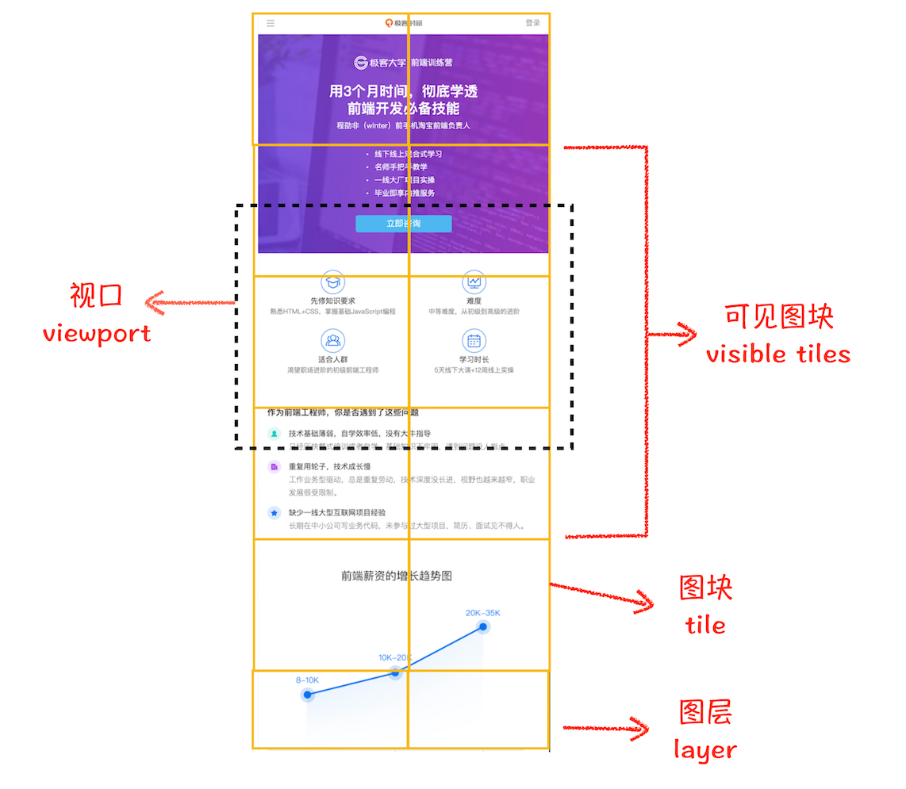

## 渲染流程

---

1. 渲染流水线

- 渲染模块在执行过程中会被划分为很多个子阶段，输入的 HTML 经过这些子阶段，最后输出像素，这样的一个处理流程就叫做渲染流水线(*一般一次UI render称为一帧，也就是一秒刷新多少次。例如60HZ，就是一秒刷新60次*)
- 那么这些子阶段根据渲染的时间顺序，流水线可分为如下几个子阶段：_构建 DOM 树_、_样式计算_、_布局阶段_、_分层_、_绘制_、_分块_、_光栅化和合成_。那么每个子阶段的过程都包含这三点内容：_开始每个子阶段都有其输入的内容_；_然后每个子阶段有其处理过程_；_最终每个子阶段会生成输出内容_

2. 构建 DOM 树

- 浏览器无法直接理解和使用 HTML，所以需要将 HTML 转化为浏览器能够理解的结构 -- **DOM树**。DOM 和 HTML 内容几乎是一样的，但是和 HTML 不同的是，DOM 是保存在内存中的树状结构，可以通过 JavaScript 来查询或修改其内容
- `GUI` 线程会从上至下解析 html，输出树状结构的 dom。当遇到一般情况下的脚本资源时(script)，解析器会暂停构建 dom，需要等到脚本执行完成后才会继续往下解析(*如果是外部链接，需要先将资源下载下来，再去执行它*)，这种情况下可以认为 `GUI` 线程与 `JS` 引擎线程是互斥的。也就是说，普通情况下(*不携带 async 和 defer 属性*)，出现在节点之前的 js 需要先执行完成才会进行后续元素的 dom 的构建工作

3. 样式计算(Recalculate Style)

- 样式计算的目的是为了计算出 DOM 节点中每个元素的具体样式
- 第一个阶段是把 CSS 转换为浏览器能够理解的结构，纯文本的 CSS 样式，浏览器是无法理解的，当渲染引擎接收到 CSS 文本时，会执行一个转换操作，将 CSS 文本转换为浏览器可以理解的结构——styleSheets，可以通过 `document.styleSheets` 来查看此结构
- 第二个阶段是转换样式表中的属性值，使其标准化，需要将所有值转换为渲染引擎容易理解的、标准化的计算值

```css
html {
  font-size: 14px;
}
body {
  font-size: 2em;
}
div {
  font-weight: bold;
}
div p {
  color: white;
}
div span {
  color: red;
}
```

```css
/* 转换为标准值 */
html {
  font-size: 14px;
}
body {
  font-size: 28px;
}
div {
  font-weight: 700;
}
div p {
  color: rgb(255, 255, 255);
}
div span {
  color: rgb(255, 0, 0);
}
```

- 第三个阶段是计算出 DOM 树中每个节点的具体样式，在此过程中会涉及到元素的 **继承** (每个节点都包含父节点的样式，相同优先级的属性会被覆盖) 和 **层叠** 规则


4. 布局阶段

- 当前阶段 DOM 树和 styleSheets 已经计算完毕，但这还不足以显示页面，因为我们还不知道 DOM 元素的几何位置信息。那么接下来就需要计算出 DOM 树中可见元素的几何位置，这个计算过程叫做布局。那么这个阶段主要是计算出节点的几何位置、尺寸等信息，也就是这个元素具体是什么我是不在意的，我只在意这个节点在页面中的位置、占据多大空间等
- ① **创建布局树**。dom 树中包含了很多不可见的元素，如 head 标签，还有使用了 _display:none_ 属性的元素，因此在显示之前，还需要额外的构建一棵只包含可见元素的布局树


- 构造的过程中，浏览器通过遍历 DOM 树中的所有可见节点，并把这些节点加到布局树中，而不可见的节点会被布局树忽略掉，如 head 标签下面的全部内容、包含 `display:none` 属性的元素等。DOM 树中的所有不可见的节点都没有包含到布局树中

- ② **布局计算**。接下来需要在完整的布局树上计算布局树节点的坐标位置了，执行布局操作的时候，会把布局运算的结果重新写回布局树中，所以布局树既是输入内容也是输出内容，这是布局阶段一个不合理的地方，因为在布局阶段并没有清晰地将输入内容和输出内容区分开来
- 需要注意的是，要等到 *样式规则* 计算完成才能进入布局阶段，即使 dom 构建先行完成。*样式规则计算* 和 *dom解析* 是两个并行的过程，*css加载* 不会阻塞 *dom解析*，但会影响 *布局树* 的生成
- 那么生成的布局树实际上是多个元素在坐标系中的具体位置、尺寸等详细信息，它是一个非常详细的数据，它不再具有自适应的概念，到绘制阶段就是一个非常精准的数据

- 在 css 中，还可以设置 **媒体类型(media type)** 和 **媒体查询(media query)** 来解除 `StyleSheets` 对解析阶段的阻塞
```html
<!-- link标签(无论是否内联) 都会阻塞dom的构建，浏览器会优先处理css资源，直到此段 stylesheet 构建完成-->
<link href="index.css" rel="stylesheet">
<!-- 设置媒体类型，只在特定场景下解析，这里是只在打印网页时使用，会加载但不会阻塞dom的构建 -->
<link href="index1.css" media="print" rel="stylesheet">
<!-- 设置媒体查询，只在符合条件时阻塞渲染 -->
<link href="index1.css" media="(min-width:300px)" rel="stylesheet">
```
- 同时，js 的执行是会阻塞 dom 的构建的，内部代码会直接执行，而资源文件需要先加载再执行。同时，你还可以设置 *defer/async* 属性来改变加载模式，但此种方式只对 *资源文件(通过src属性加载的js)* 有效，而内联的 js 是无效的，它依然会阻塞 dom 的构建
```html
<script>console.log(1)</script>
<script defer>console.log(2)</script>
<script async>console.log(3)</script>
<!-- 此段情况仍会挨个执行并阻塞html的解析，也就是说，这三个会依次输出 1 2 3 -->
```
- js 会阻塞 dom 的构建以及渲染，同时需要注意 js 的执行是需要等待之前的 css 加载并且解析完毕，这样可以保证 js 可以操作样式的。但是 css 与 js 的加载过程是可以并行的。因此，js 的执行是可能阻塞 *render tree* 的生成，所以，*render tree* 的生成是需要等待 *html、css、js* 资源的解析过程完成的


- 从上面的图我们可以看出，css 加载并解析的过程可能会阻塞后续 js 的执行以及 dom 的构建，这需要根据后续是否存在 js 来判断

5. 分层
- 布局树保存了每个元素的具体位置信息，但这个时候还不能开始绘制页面。因为页面中一些复杂的 **视差效果**(3d变换、页面滚动或设置了定位的元素)，渲染引擎 **需要为特定的节点生成专用的图层**，并生成一颗对应的图层树，最终的页面图像由这些图层叠加而成
- 浏览器的页面实际上被分成了很多图层，可以通过 chrome 的开发者工具中的 layers 来查看。图层树由布局树生成而来，但不是布局树的每个节点都包含一个图层，如果一个节点没有对应的图层，那么这个节点就会从属于父节点的图层(或者一个存在图层的节点)
- 也就是说，页面中的节点要不就是一个图层，要不就会从属于一个图层。那么什么情况渲染引擎才会给节点创建新的图层呢?可以参考 [图层与z轴规则](../stylesheets/layout.md) 这一章的内容，还有一种情况是 **被裁剪的地方也会被创建为图层**

6. 图层绘制
- 在图层的构建完成后，渲染引擎会对图层树中的每个图层进行绘制，那么它是如何绘制的呢？它实际上是将一个图层的绘制分成许多细小的指令，就像是先做什么、再做什么一样
- 渲染引擎将一个图层的绘制拆分成很多小的 **绘制指令**，然后再把这些指令按照顺序组成一个 **待绘制列表**。这些绘制指令通常是一个简单的绘制操作，如绘制背景、绘制前景、边框等，都需要一个单独的指令去绘制。因此这个阶段输出的就是 **待绘制列表**


- 从 chrome 的开发者工具中的 layers 可以选择某个图层，左边的区域就是待绘制列表，可以发现它们由许多简单的绘制指令组成。同时可以拖动右边区域的进度条来重现其绘制过程

7. 栅格化（raster）操作
- **图层绘制** 阶段只是用来记录绘制顺序和绘制指令的列表，而实际上绘制操作是由渲染引擎中的 *合成线程*


- 从上面的主线程与合成线程之间的关系可以知道，当图层的绘制列表准备好之后，主线程会把待绘制列表 *提交/commit* 给合成线程
- 通常一个页面可能很大，但是用户只能看到其中的一部分，我们把用户可以看到的这个部分叫做视口（viewport）
- 在有些情况下，有的图层可以很大，比如有的页面你使用滚动条要滚动好久才能滚动到底部，但是通过视口，用户只能看到页面的很小一部分，所以在这种情况下，要绘制出所有图层内容的话，就会产生太大的开销，而且也没有必要
- 基于上面的原因，合成线程会将图层划分为 **图块/tile**，图块的大小通常是 *256 \* 256* 或 *512 \* 512*



- 根据以上划分的情况，合成线程会按照视口附近的图块来优先生成位图，实际生成位图的操作是由栅格化来执行。栅格即像素，栅格化即将矢量图形转化为位图；图块属于栅格化执行的最小单位
- 其中，渲染进程还维护了一个栅格化的线程池，所有的图块栅格化都是在线程池内执行的


- 通常情况下，栅格化过程会使用 GPU 来加速生成，渲染进程的合成线程接收到图层的绘制消息时，会通过光栅化线程池将其提交给GPU进程，在GPU进程中执行光栅化操作，执行完成，再将结果返回给渲染进程的合成线程，执行合成图层操作，这种情况下通过 GPU 生成位图的过程叫 **快速栅格化/GPU栅格化**，生成的位图被保存在 GPU 内存中


- 在以上的过程中，渲染进程将生成图块的指令发送给 GPU，然后在 GPU 中执行生成图块的位图并保存在 GPU 的内存中

8. 合成与显示
- 当所有图块都被光栅化以后，合成线程就会生成一个绘制图块的命令，然后将该命令提交给浏览器进程，同时合成的图层会被提交给浏览器进程，浏览器进程和其他渲染进程都可能把自己生成的 `compositor frame` 发给 *GPU进程*， *GPU进程* 里的 *viz线程* 有一个 `display合成器`，负责合成从不同进程发过来的 `compositor frame`。最后 *viz线程* 调用 `OpenGL` 的 `API` 把 `compositor frame` 绘制到屏幕上(**viz进程已独立为一个单独的进程**)


9. 初始化与更新
- 上面的一整个阶段其实只是 **页面初始化** 的过程。那在 ui 界面上，还有一个更重要的事情，那就是 **更新**，比如页面滚动、使用 js 操作 dom 等
- **dom 构建阶段**：在操作 dom 更新页面时，它其实只是更新了部分内容，那么我们可以不从头开始解析，其中可能会做一个 diff 对比，找到更新的位置
- **布局树的生成**：当 dom 树变化以后，需要重新生成布局树，那么它应该也是有这样一种 diff 去优化它对于重复逻辑的布局计算
---
## 阶段更新
---
1. 阶段分类
- 大致的可以将 html 变成 页面内容的过程分为两个过程，一个是 **解析过程**，另一个是 **渲染过程**
2. 重排
- 生成布局树之前，需要等待 dom 解析完成以及样式规则生成，当通过 js 或者 css 修改了元素的几何位置属性(尺寸、结构等)，例如改变元素的宽度、高度、字体等，那么浏览器会触发重新布局，也就是布局树需要重新生成，这样后面的子阶段都需要重新执行，重排需要更新完整的渲染流水线，它的开销也是最大的
- 也就是说，当修改某节点的样式影响了其他节点的几何位置，就会导致 **重排** 的出现，需要避免重排这个事情
3. 重绘
- 如果我们只是对某些节点的背景、颜色、透明度等做修改时，此时并没有引起自身或其他节点的几何位置的变化，因此会跳过布局树和图层树的生成阶段，会在 dom 解析和样式规则计算完成后，直接进入绘制阶段，它的执行效率要比重排高、开销要比重排小
- 那么重绘只关注自身，不会影响其他的元素，而重排是会影响其他的元素的
4. 合成
- 如果更改一个既不要布局也不要绘制的属性，渲染引擎将跳过布局、分层和绘制阶段，只执行后续的合成操作，这个过程被称为合成
- 当使用 css3 的一些属性时，会避开重排和重绘，它会在后续的阶段执行合成操作(非主线程上执行)，这样的话不会占用主线程的资源，大大提升绘制效率
---
## JS与关键渲染路径
---
1. 关键渲染路径
- `Critical Rendering Path` 是与当前用户操作有关的内容。例如用户刚刚打开一个页面，首屏的显示就是当前用户操作相关的内容，具体就是浏览器收到 HTML、CSS 和 JavaScript 等资源并对其进行处理从而渲染出 Web 页面。因此对应到页面上，我们将 html、css 以及 js 称为 *关键资源*
2. 普通script(*同步下载并执行*)
- 在解析 html 时，如果遇到一个不带 *defer* 或 *async* 属性的 *script* 标签时，会先等到 **样式规则** 生成完成(下载并解析css资源)，再执行脚本(script)，最后再继续解析 html。因此，`js` 不只是会阻塞 dom 的构建，也会导致 *样式规则* 阻塞 dom 的构建，但通常情况下 dom 的构建和 *样式规则* 的生成是并行的
- 执行脚本时，不仅仅会操作 dom，也可能对 *样式规则* 进行修改，如果 *js* 想访问并修改它，那么必须拿到完整的 *Sheetstyles*，因为不完整的 *Sheetstyles* 是无法使用的。因此就会造成当 *Sheetstyles* 的下载和构建尚未完成时而刚好遇到一段 *script* 代码，那么浏览器将延迟脚本的执行和 dom 的构建，直至完成 *Sheetstyles* 的下载和构建
- 因此，如果想首屏渲染得更快，就不应该在首屏就加载 js 文件，而是将它放在 `body` 底部进行加载


- 多个 js 的下载是并行的，但它们的执行顺序会按照 html 的先后顺序依次执行。即使后面的 js 资源先下载好，也要等到前面的 js 资源下载并执行完成后才能执行。普通 script 脚本的下载和执行时间越长，`DOMContentLoaded` 事件的触发时间就越久

3. 存在 defer 属性的 script(延迟执行)
- 在解析设置了 `defer` 属性的脚本时，会开启 **新的线程** 去下载脚本文件，并使脚本在 html 解析完成之后再执行。它表示延迟执行 **引入** 的 js。也就是说，此时 **js** 资源的加载与 html 的解析是并行的，它不会停止 dom 的构建。当所有的 dom 构建完成，并且 *defer-scripr* 也加载完成之后(*也就是js资源下载完毕*)，才会执行所有延迟执行的 js 代码，最后触发 *DOMContentLoaded* 事件(*`DOMContentLoaded` 事件触发代表初始的 HTML 被完全加载和解析，不需要等待 CSS，JS，图片加载。`Load` 事件触发代表页面中的 DOM，CSS，JS，图片已经全部加载完毕*)
- 设置了 *defer* 属性的 *script* 脚本，它的加载不会停止 *html* 的解析，并且需要等到 html 解析完成以及 *defer* 的脚本加载完毕之后才会执行。并且它会根据 *script* 书写的顺序进行执行
```html
<script src="index1.js" defer></script>
<script src="index2.js" defer></script>
<script src="index3.js" defer></script>
<!-- 最后的执行会顺序执行三个js资源内的代码 -->
```
- 多个 *defer-script* 的下载是并行的，它们按照在 html 中的书写顺序执行。当你的脚本代码依赖于页面中的 DOM 元素（文档是否解析完毕），或者被其他脚本文件依赖时，推荐添加 defer 属性


4. 存在 async 属性的 script(异步执行)
- 在解析设置此属性的 *script* 脚本时，会异步下载资源，但下载完毕后会立即执行脚本代码，此种方式加载的 *js* 依然可能会阻塞 *html* 的解析，也就是说它可能在 html 解析完成之前或之后下载完毕并执行(*可能会在 `DOMContentLoaded` 事件触发之前或之后执行，但一定在 `load` 触发之前执行*)
- 设置了 *async* 属性的 *script* 脚本，它的加载可能会停止 *html* 的解析。如果已经加载好，它会立即执行，多个 script 脚本的加载会按照先下载好的先执行(*无顺序的*)，而 `defer` 是有顺序的加载，会按照顺序执行


|引入的行为|结果|
|---|---|
|document.createElement|创建的 script 默认是异步的(*即async属性为true*)，意味着动态添加引入js文件默认不会阻塞页面，包括 link 在 chrome 也不会阻塞渲染|
|document.write|通过 document.write 添加的 link 或 script 标签都相当于添加在 document 中的标签，因为它操作的是 document stream（所以对于 loaded 状态的页面使用 document.write 会自动调用 document.open，这会覆盖原有文档内容）。即正常情况下， link 会阻塞渲染，script 会同步执行。但不同的浏览器会做限制，chrome 不允许引入非同源的 *async-script*|
|innerHtml|此方式引入的 script 中的代码不会执行，link 标签中的样式会生效|

5. 优化方向
- 主要从单次脚本的执行时间以及脚本的网络下载方向上。一、提升单次脚本的执行速度，避免 JavaScript 的长任务霸占主线程，这样可以使得页面快速响应交互；二、避免大的内联脚本，因为在解析 HTML 的过程中，解析和编译也会占用主线程；三、减少 JavaScript 文件的容量，因为更小的文件会提升下载速度，并且占用更低的内存
---
## 服务端渲染
---
1. 服务端渲染的本质
- 首先，需要明白一件事，请求回来的 *html* 是什么?


- 可以看出来，这上面其实就是一段字符串。类似于 *服务端渲染*，它准备的是 dom 结构，这个 dom 结构其实就是一个字符串，那么我们在服务端做的工作其实就是 **字符串拼接**。服务端在拿到数据以后，并且组合成一个字符串然后返回给前端，这就是 *服务端渲染* 的本质
2. 组件化的服务端渲染与客户端渲染的区别
- 在 *react/vue* 中都有自己的服务端渲染框架，那么它们在客户端和服务端渲染的区别是什么? 以 *React* 为例，它在客户端输出的目标是 *虚拟Dom/对象*；而在服务端它输出的是一个字符串，它的生命周期是没有更新这个过程的，它只有初始化的过程
- 本质上的区别就是输出的目标不一样，一个输出的目标是 *虚拟Dom*，一个输出的目标是 *字符串*。因此。客户端与服务端渲染是需要共用组件的，那么如何区分哪些逻辑是要在客户端处理的，哪些逻辑是要在服务端处理的，这个是很重要的
---
## 问题
---
1. 如果下载 CSS 文件阻塞了，会阻塞 DOM 树的合成吗

- 首先 DOM 解析 和 CSS 解析 是两个并行的过程，所以这也解释了为什么 CSS 加载不会阻塞 DOM 解析。 但是因为 render tree 依赖于 DOM 树和 cssom 树，所以必须等到 cssom 树构建完成，也就是 CSS 资源加载完成
- 当从服务器接收 HTML 页面的第一批数据时，DOM 解析器就开始工作了，在解析过程中，如果遇到了 JS 脚本，如下所示：

```html
<html>
  <body>
    qqqq
    <script>
      document.write('--foo');
    </script>
  </body>
</html>
```

- 那么 DOM 解析器会先执行 JavaScript 脚本，执行完成之后，再继续往下解析。
- 那么第二种情况复杂点了，我们内联的脚本替换成 js 外部文件，如下所示：

```html
<html>
  <body>
    qqqqq
    <script type="text/javascript" src="foo.js"></script>
  </body>
</html>
```

- 这种情况下，当解析到 JavaScript 的时候，会先暂停 DOM 解析，并下载 foo.js 文件，下载完成之后执行该段 JS 文件，然后再继续往下解析 DOM。这就是 JavaScript 文件为什么会阻塞 DOM 渲染。

- 第三种情况，还是看下面代码：

```html
<html>
  <head>
    <style type="text/css" src="theme.css" />
  </head>
  <body>
    <p>qqqqq</p>
    <script>
      let e = document.getElementsByTagName('p')[0];
      e.style.color = 'blue';
    </script>
  </body>
</html>
```

- 当我在 JavaScript 中访问了某个元素的样式，那么这时候就需要等待这个样式被下载完成才能继续往下执行，所以在这种情况下，CSS 也会阻塞 DOM 的解析
2. 浏览器遗留问题
- 当解析 html 的时候，遇到一个 *script* 标签，如果是一个远程资源，会先去下载资源，此时 html 的解析工作也会被暂停。但其中有个问题，下载这个过程是一个异步的任务，它交由 *网络进程* 来处理，它跟 html 的解析工作应该是不冲突的，它们应该是可以同步进行的；待 js 资源下载完毕，再来执行这个 js。但这样仍可能阻碍 html 的解析，因此最好的执行时机就是 dom 解析完成之后
- 而这个 *普通script* 的加载作为一个历史遗留问题，它阻塞了 dom 的构建过程，但 *render tree* 的生成原本就需要等待 *html、css、js* 的解析完成，所以在这之前的阻塞是没有意义的，因为不管 js 如何阻塞 dom 的构建，到最后你都是要等待的
3. getComputedStyle 方法与性能问题
- 此方法获取的计算样式一定会触发新的样式计算甚至是布局计算呢？熟悉浏览器渲染管线的人应该都清楚，样式计算环节处于构建DOM tree和构建layout tree之间，按理说绘制当前帧时每个DOM结点的计算样式（Computed Style）应该是已知的，为什么不能从已经计算好的计算样式里面取值呢
- 这是因为 **【Return a live CSS declaration block with the following properties[1]】**。live，即实时；由于其设计目的就是要返回一个实时的CSS声明块（实际上是一个只读的CSSStyleDeclaration对象），而执行 gCS 的当前并不能保证之前的计算样式一定和当前最新的计算样式是一致的，所以在获取相应属性的最新计算值时不得不重新计算样式（Recalculate Style），而某些CSS属性受到布局的影响也就不得不重新计算布局
- 那么单纯地调用 `getComputedStyle` 并不会产生样式计算和重排，只有通过 gCS 方法返回的 CSSStyleDeclaration 对象访问某个具体的属性值时才会同步地引起进一步 Recalculate Style 或重排
```js
function relayoutTest (el) {
  const style = getComputedStyle(el)
  return style.height // 仅仅是访问height属性
}
```
- **计算样式DOM化**：每次DOM结点的计算样式结果存放到DOM接口中，而不再需要通过类似gCS方法来强制计算或重排，相当于是将最新的计算样式缓存到DOM上，只有真正的重排、重绘或组合才会引起计算样式地改变
- **结合 style 和默认属性值**：DOM的style属性只会返回当前节点显式声明的样式属性（即通过样式文件，样式声明或内联样式所匹配到的样式），所以不得不用gCS方法来获取那些默认样式的值。考虑到由于某些样式可以继承，所以对于那些不可继承的CSS属性，如果style属性得到的相应属性值为空，那不就是代表其计算属性就是默认值

```js
function relayoutTest (el) {
  const style = getComputedStyle(el)
  return style.position
}
```
```js
function relayoutTest (el) {
  return el.style.position || 'static'
}
```