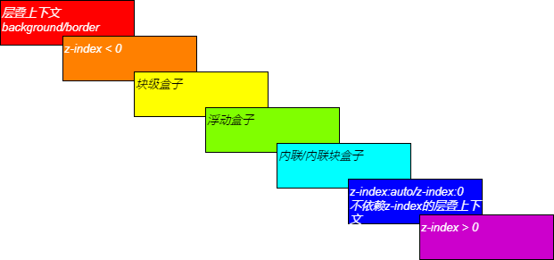

## 图层的概念
---
1. 三维空间
- 浏览器中依据坐标系建立起来的三维空间并不是一个真实的三维空间，其中的x轴和y轴它们都可以用具体的宽高来描述它的位置，但是z轴并没有这样一个能够描述它的位置的具体概念(*x、y轴可以通过多少像素/尺寸去表示他的位置*)，它只是一个概念上的三维空间
- 实际上z轴的规则也就是层叠顺序，它表达的其实是一个元素与元素之间的遮罩关系。那为什么网页里面需要这样一个遮罩关系，例如在一张纸上画图，它是没有谁遮罩谁这种关系的，那为什么网页里面不能从上到下互相挨着画出来呢，实际上，在页面上绘制元素(通过gui去绘制)跟在纸上画画是很相似的，而画画的时候是不考虑遮罩关系的，那为什么在页面里我们一定要搞这种遮罩关系？
- 那么，画画与网页中绘制元素的场景区别在哪呢？一般画画画好以后，它就基本不变了，而网页里面它是随时可能变化的，也就是画好以后它这个画面还会处于一种随时变化的场景。这也就意味着当一个东西要不停的产生变化时，如果我们所有的内容都在一张纸上，那变化起来会非常的吃力，就像实现一个视察效果时，你要大量的去计算它的位置
- 那么浏览器通过 **图层** 来描述页面上的内容，它就像我们绘制的一张张的画。也就是说，当图层里面的内容产生变化时，我需要重新绘制这个图层，但其它没有变化的图层是不需要重新绘制的，这就涉及到性能优化，它可以减少不必要的渲染。而这个就是去界定层叠上下文、层叠等级出现的主要的场景
2. 层叠上下文(stacking context)
- 页面这个容器里面，它有一个现象，那就是不管是不是同一图层，两个元素不会出现完全融合在一起的情况，也就是说，当两个元素的位置一致时，它们不会出现完全融合的情况，它们一定会有一个上下级的关系。那么从层叠的概念来说，它实际上是借鉴了 **栈容器** 的规则来区分多个层叠上下文的上下级关系，那也就代表着每一个层叠上下文(图层)都是一个栈容器，它是属于往栈容器里面放元素这样一个场景
- 在层叠顺序里面，层叠上下文的 `background/border` 是层级水平最小的，借用栈容器的特性之一：栈里面的元素再低也不能低过这个栈底，也就是说这些元素不能超出这个容器；特性之二：即使层叠上下文中 `z-index` 相等或者它们的层叠等级相等，它们也一定会有一个上下关系(*先渲染的(先进栈的)在下边，后渲染的在上边*)
3. 图层产生的性能优化
- 当某块元素运行的规则与主要的元素的运行规则不一致时，在客观上产生视差效果之后，那么它就应该是一个独立的图层。如果其他的地方没必要产生一个图层的时候，它产生了一个图层，那它就是一个冗余的图层
- 我们可以通过 `Chrome` 的图层分析工具，结合层叠上下文的形成条件，去修改我们的结构。因为在我们写代码的时候基本上不会去考虑哪个元素会产生层叠上下文，那么这个时候就可以通过这个依据去修改我们的布局。也就是说，经常变化的提取为一个图层，因为在一个图层里面，只要有一个东西变化，这个图层就需要重新渲染，我们将它提取出来的话，就可以让大部分的图层尽可能少的渲染
4. 结合栈容器进行理解
```tsx
import React from 'react';
import './example/style/stackContext/sc1.scss'

export default () => {
  return (
    <div className="stack-context">
      <div className="content">
        <div className="wrapper box1"></div>
        <div className="wrapper box2"></div>
        <div className="wrapper box3"></div>
      </div>
    </div>
  )
}
```
- 在上面的这个例子中，哪一个div元素谁可能会最先出现在页面上?直觉上告诉我们，第一个div会最先出现在页面上，因为他的Zinde是最小的。那么我们的理论依据是什么？我们会发现它这个规则和栈的思维是一摸一样的，那为什么我们要借鉴栈的思维？因为这样子计算起来最简单，也就是说层级水平低的元素先进栈(处于下面层级元素先渲染好)，虽然在结构被解析的时候可能会先解析，但发现它不是上面的层，所以会被放在下边，这样我们的计算过程就会少很多
- 但网页中的元素被渲染到容器里面只有进栈的过程，没有出栈的过程，进栈就不能出栈了。而栈是有进栈出栈这个概念的
---
## z轴的规则
1. 三维概念
- web使用层叠上下文来表示css中的三维概念。这意味着每个盒模型的位置都是三维的，分别是平面上的X轴，Y轴以及表示层叠的Z轴。一般情况下，元素在页面上沿x轴y轴平铺，这时我们是察觉不到它们在z轴上的层叠关系的。当一个元素含有层叠上下文，可以认为这个元素在z轴上的位置比非层叠上下文元素更高，那么它就离观察者更近
- 在层叠上下文中，它们根据层叠等级(stacking level)来确定在z轴上的上下顺序。
- 在同一个层叠上下文中，层叠等级描述定义的是该层叠上下文中的层叠上下文元素在Z轴上的上下顺序。在其他普通元素中，层叠等级描述定义的是这些普通元素在Z轴上的上下顺序。也就是说，层叠等级的比较只有在当前上下文元素中才有意义，不同层叠上下文中比较层叠等级是没有意义的
- 总结来说的话，实际上 html 中的元素要不就是一个层叠上下文，要不就属于一个层叠上下文，普通元素的层叠水平优先由层叠上下文决定，而层叠上下文的子元素也可以是层叠上下文，每个层叠上下文与它的兄弟元素互相独立，子级层叠上下文的 `z-index` 也只有在父级中才有意义

- 如何形成层叠上下文

|形成层叠上下文的条件|
|---|
|文档根元素(html)|
|position:absolute/relative且z-index不为auto|
|postion:fixed/sticty|
|flex/grid容器的子元素，且z-index不为auto|
|opacity小于1的元素|
|mix-blend-mode 属性值不为 normal 的元素|
|transform值不为none的元素|
|其他css3新属性|


3. 层叠顺序
- 元素与元素之间的遮罩关系
- 层叠顺序”(stacking order)“表示元素发生层叠时按照特定的顺序规则在Z轴上垂直显示，这是一种具体的规则。层叠顺序是同一层叠上下文中的元素的比较，也就是当这些元素同处一个层叠上下文时，它们根据特定的规则来进行排序并垂直显示，这时就会出现低层叠等级的元素被高层叠等级的元素覆盖的情况



- 其中还有一些其他的层级规则，块级元素与内联/内联块元素如果重叠在一起，内联元素的文字层级 > 内联元素的背景层级 > 内联块/块元素的文字层级 > 内联块元素的背景层级 > 块元素的背景层级。因此，当多个这种元素层叠时，会出现文字能透上来或者透不上来的效果

```tsx
import React from 'react';
import './example/style/stackContext/sc2.scss'

export default () => {
  return (
    <div className="stack-context">
      <div className="inline__block__content">
        inline-block
      </div>
      <div className="inline__content">
        inline
      </div>
      <div className="block__content">
        block1
      </div>
      <div className="block__content__2">
        block2
      </div>
    </div>
  )
}
```

- 而元素在使用定位属性时，它的 `z-index` 会自动生效(z-index:auto 是 z-index:0 级别，但实际上 z-index:0 层级高于 z-index:auto)，而不需要支持 `z-index` 的css3新属性，它与定位元素(z-index:auto) 是一个层叠顺序的

```tsx
import React from 'react';
import "./example/style/stackContext/sc3.scss"

export default () => {

  return (
    <div className="stack-context">
      <div className="compare__content">
        <div className="compare__content__1">
          <p className="compare__content__p">z-index:5</p>
        </div>
        <div className="compare__content__2">
          <p className="compare__content__p">z-index:99</p>
        </div>
        <div className="compare__content__3">
          <p className="compare__content__p box1">z-index:1</p>
          <p className="compare__content__p box2">z-index:2</p>
        </div>
      </div>
    </div>
  )
}
```

```tsx
import React from 'react';
import "./example/style/stackContext/sc4.scss";

export default () => {

  return (
    <div className="stack-context">
      <div className="compare__content__7 compare__content__6" >
        <p className="box3">z-index:99</p>
      </div>
      <div className="compare__content__7 compare__content__4">
        <p className="box1">z-index:1</p>
        <p  className="box2">z-index:2</p>
      </div>
    </div>
  )
}
```

- 并且可以发现，position:relative 如果不添加 z-index 属性(z-index:auto 不算)，无法形成一个层叠上下文

```tsx
import React from 'react';

export default () => {

  return (
    <div className="stack-context">
      <div className="compare__content__7 compare__content__5" >
        <p className="box3">z-index:99</p>
      </div>
      <div className="compare__content__7 compare__content__4">
        <p className="box1">z-index:1</p>
        <p  className="box2">z-index:2</p>
      </div>
    </div>
  )
}
```
- 在上面的结构中呈现出了不同的效果，但是仍旧是同属层级上下文的层叠等级的比较(z-index只能提高定位元素/弹性盒子下的子元素的层级水平)；层叠上下文内则是子级之间的层叠等级的比较；不过当同属一个层叠上下文且层叠等级也相同时，则按在dom流出现的顺序进行比较，也就是 *后来者居上*

```tsx
import React from 'react';

export default () => {
  const div1 = {
    display:'flex',
    backgroundColor:"skyblue",
    height:50,
    marginBottom:10
  }

  const div2 = {
    display:'flex',
    backgroundColor:"green",
    height:50,
  }

  const inlineBlock1= {
    zIndex:-1,
    backgroundColor:'red'
  }

  const inlineBlock2= {
    zIndex:1,
    backgroundColor:'blue'
  }

  return <>
    <div style={div1}>
      <div style={inlineBlock1}>z-index:-1</div>
    </div>
    <div style={div2}>
      <div style={inlineBlock2}>z-index:1</div>
    </div>
  </>
}
```

```jsx
import React from 'react';

export default () => {
  const parent = {
    position:"absolute",
    width:"200px",
    height:"150px",
    backgroundColor:"red"
  }

  const child = {
    width:"100px",
    height:"100px",
    backgroundColor:"blue"
  }

  const child1 = {
    width:"100px",
    height:"100px",
    backgroundColor:"green",
    position:"relative",
    zIndex:-1
  }

  return <div style={{position:"relative",height:"150px"}}>
    <div style={parent}>
      <div style={child}></div>
      <div style={child1}></div>
    </div>
  </div>
}
```