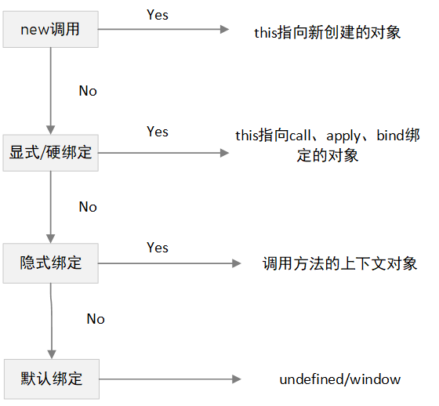

## this
---
1. 决定 this 的是什么
- this 提供了一种更优雅的方式来隐式传递一个对象引用，因此可以将 api 设计得更加简洁并且易于复用。
- this 是在代码的 **解析阶段** 被确定的，在执行上下文被创建时被确定。一般情况下取决于函数上下文环境或如何被调用，通常是被调用时确定，并不取决于函数声明时的位置，而是拥有者，也就是函数在哪里被调用
- es6 的箭头函数中不存在 this，它的 this 取决于父级环境所处的上下文，因此它的 this 一般在创建时就已被确定

> this 在任何情况下都不指向函数的词法作用域。在 js 内部，作用域确实和对象类似，可见的标识符都是它的属性。但是作用域对象无法通过 js 代码访问，它存在于 js 引擎内部

> 词法作用域是在写代码或者说定义时确定的，而动态作用域是在运行时确定的。（this 也是！）词法作用域关注函数在何处声明，而动态作用域关注函数从何处调用

2. this 的绑定规则

| 绑定规则 | 对应使用方式       |
| :------: | :----------------- |
| 默认绑定 | 对应函数的独立调用 |
| 隐式绑定 | 对应函数的方法调用 |
| 显式绑定 | 对应函数的间接调用 |
| new 绑定 | 对应函数的构造调用 |

3. 默认绑定
- 在全局环境中独立调用时，默认绑定到 window

```js
function fn() {
  console.log(this);
  console.log(this === window);
}
fn(); // window true
```

- 全局环境中的 this 指向全局对象 window

```js
console.log(this === window); //true
```

- 函数的嵌套调用时，this 默认绑定到 window

```js
var a = 1;

var obj = {
  a: 2,
  test: function () {
    function innertest() {
      console.log(this.a); // 1
    }
    console.log(this.a); // 2
    innertest();
  },
};

obj.test();
```

- 虽然 innsertest 函数被嵌套在 obj.test 函数中，但 innertest 函数是独立调用，而不是作为方法被调用，所以 this 默认绑定到 window
- IIFE：自执行函数，也就是在函数声明后，直接调用执行

```js
var a = 'window';
function test() {
  var a = 'test';
  (function innertest() {
    console.log(this.a);
  })();
  console.log(this.a);
}
var obj = {
  a: 3,
  fn: test,
};
obj.fn(); // 'window' 3
```

```js
// 等价于上例
var a = 'window';
function test() {
  var a = 'test';
  function innertest() {
    console.log(this.a);
  }
  innertest();
  console.log(this.a);
}
var obj = {
  a: 3,
  fn: test,
};
obj.fn(); // 'window' 3
```

- 闭包：在有些情况的闭包中，this 会出现默认绑定的情况

```js
var a = 'window';
function fn() {
  var a = 'fn';
  function test() {
    console.log(this.a);
  }
  return test;
}
var obj = {
  a: 'obj',
  fn1: fn,
};
let res = obj.fn1();
res(); // 'window'
```

- 在上例中，res 函数属于独立调用，而不是方法调用，因此 this 默认绑定到 window
- 闭包中的 this 常常会出现直接调用而默认绑定到全局对象，但又常常需要访问嵌套函数的 this,所以常常在嵌套函数中使用 var that=this，然后在闭包中使用 that 代替 this，使用作用域查找的方法来找到嵌套函数的 this

```js
var a = 'window';
function fn() {
  var a = 'fn';
  var that = this; // 将环境中的this保存下来
  function test() {
    console.log(that.a);
  }
  return test;
}
var obj = {
  a: 'obj',
  fn1: fn,
};
let res = obj.fn1();
res(); // 'obj'
```

4. 隐式绑定
- 隐式绑定：当某个函数引用有上下文对象时，隐式绑定会把函数调用的 this 绑定到这个上下文对象，这种我们也称之为方法调用

```js
function fn() {
  console.log(this);
  console.log(this.a);
}
var obj1 = {
  a: 1,
  fn: fn,
  obj2: {
    a: 2,
    fn: fn,
  },
};
obj1.fn(); // obj1 1
// fn() 函数的直接对象是obj1，fn被对象obj1所拥有，obj1为调用者，this隐式绑定到obj1
obj1.obj2.fn(); // obj2 2
// fn() 函数的直接对象是obj2，fn被对象obj2所拥有，obj2为调用者，this隐式绑定到obj2
```

- 隐式丢失：一个最常见的 this 绑定问题就是被隐式绑定的函数会丢失绑定对象，也就是说它会应用默认绑定，从而把 this 绑定到全局对象或者 undefined 上，取决于是否是严格模式
- 将函数引用通过函数别名进行传递的情况

```js
var name = 'window';
function fn() {
  console.log(this, this.name);
}
var obj = {
  name: 'obj',
  fn: fn,
};
var obj1 = obj.fn;
// 把obj.fn赋予别名obj1，造成了隐式丢失，因为只把fn函数的引用赋给了obj1，而obj1与obj对象毫无关系
obj1(); // window 'window'
```

```js
// 等价于上例
var name = 'window';
var obj1 = function fn() {
  console.log(this, this.name);
};
obj1(); // window 1
```

- 将函数引用作为参数传递的情况

```js
var name = 'window';
function fn1() {
  console.log(this, this.name);
}
function obj1(fn) {
  fn();
}
var obj = {
  name: 'obj',
  fn1: fn1,
};
obj1(obj.fn); // window 'window'
// 把obj.fn1当作参数传递给obj1时，有隐式的函数赋值fn=obj.fn1。类似于函数别名
//只是把fn1函数引用赋给了fn，而fn与obj对象毫无关系，并且fn1函数传进去是函数调用模式，所以this绑定全局对象
```

```js
var name = 'window';
function obj1(fn) {
  fn();
}
obj1(function fn1() {
  console.log(this, this.name);
}); // window 'window'
```

- 将函数的引用传递给内置函数

```js
var name = 'window';
function fn1() {
  console.log(this, this.name);
}
var obj = {
  name: 'obj',
  fn1: fn1,
};
setTimeout(obj.fn1, 100); //window 'window'
// setTimeout第一个参数传的一定是一个函数引用，而不是执行函数
```

```js
// 等价于上例
var name = 'window';
setTimeout(function fn1() {
  console.log(this, this.name); //window 'window'
}, 100);
```

- 函数的间接引用的情况，一般都是在无意间创建的，最容易发生在赋值时，也会造成隐式丢失

```js
function foo() {
  console.log(this, this.a);
}
var a = 2;
var o = { a: 3, foo: foo };
var p = { a: 4 };
o.foo(); // o 3

(p.foo = o.foo)(); // window 2
/** 
 * 将o.foo函数赋值给对象 o 的 foo 属性上，返回值为 foo 函数的引用
 * 相当于独立调用，this 指向全局
*/
```

```js
function foo() {
  console.log(this.a);
}
var a = 2;
var o = { a: 3, foo: foo };
var p = { a: 4 };
o.foo(); // 3
//将o.foo函数赋值给p.foo函数，之后p.foo函数再执行，是属于p对象的foo函数的执行
p.foo = o.foo;
p.foo(); //4
```

- 还有一些情况也会造成 `隐式丢失`。在 `JavaScript` 内部，`对象` 与 `对象方法` 储存两个地址，简称为 A 和 B。只有 `对象.方法` 这种方式调用时，是从 A 调用 B，因此 `this` 指向该 `调用对象`，如果是直接取出 B 进行运算，然后在全局执行环境中执行调用，则此时 `this` 指向 `全局对象`

```js
var name = 'window';
var obj = {
  name: 'obj',
  foo: foo,
};
var obj1 = {
  name: 'obj1',
};
function foo() {
  console.log(this, this.name);
}

(obj1.foo = obj.foo)(); //window 'window'

(false || obj.foo)(); //window 'window'

(1, obj.foo)(); //window 'window'
```

5. 显式绑定

- 通过 `call`、`apply`、`bind` 方法把对象绑定到 `this`，也就是把函数中的 `this` 手动的指向了传入的对象。这种方法叫做 `显示绑定`，但对于被调用的函数来说，叫做 `间接调用`
- 当你传入一个 `原始值` 时来作为绑定的对象，`JavaScript` 会以该字面量值创建相应的 `对象包装器`，通过 `临时对象` 来进行工作

```js
var name = 'window';
function foo() {
  console.log(this, this.name);
}
var obj = {
  name: 'obj',
};
foo(); //window window
foo.call(obj); //obj obj
foo.call(1);
// Number {1} undefined
```

- 然而普通的显式绑定依然无法解决隐式丢失的问题

```js
var name = 'window';
function foo() {
  console.log(this, this.name);
}
var obj1 = {
  name: 'obj1',
};
var obj2 = {
  name: 'obj2',
};
foo.call(obj1); //obj1 obj1
foo.call(obj2); //obj2 obj2
```

- `硬绑定`：属于 `显示绑定` 的一个变种，使 `this` 不能被修改，是一种显式的强制绑定

```js
var a = 0;
function foo() {
  console.log(this.a);
}
var obj = {
  a: 2,
};
var bar = function () {
  foo.call(obj);
  //foo函数和obj绑定到一起了，所以无论怎么调用bar函数。始终也不会改变什么。
};
//在bar函数内部手动调用foo.call(obj)。因此，无论之后如何调用函数bar，它总会手动在obj上调用foo
bar(); //2
setTimeout(bar, 100); //2
bar.call(window); //2
```

- 一些内置函数中的 `硬绑定`，他们实际上就是通过在内部使用 `call/apply` 实现了显示绑定

| 数组方法 |
| :------: |
|   map    |
| forEach  |
|   some   |
|  filter  |
|  every   |

```js
var id = 'window';
function foo(el) {
  console.log(el, this.id);
}
var obj = {
  id: 'fn',
};
[1, 2, 3].forEach(foo); //1 "window" 2 "window" 3 "window"
[1, 2, 3].forEach(foo, obj); //1 "fn" 2 "fn" 3 "fn"
```

6. new 绑定

- `构造函数`：如果函数或者方法调用之前带有关键字 `new`，它就称之为 `函数的构造调用`，实际上只是被 `new` 调用的普通函数而已。对于 `this` 绑定来说，称为 `new绑定`
- `new` 操作时，函数内部发生了什么？从原型链与对象篇知道，它大概的操作是这样的：创建一个全新的对象，让这个新对象的原型(Object.getPropertyOf(target))指向构造函数的原型对象，将该构造函数内部的 this 绑定到新创建的对象上，如果函数没有返回其他对象，那么 `new` 表达式中的函数调用会自动返回这个新对象，这个返回的新对象就是该构造函数的实例

```js
function test(name, age) {
  this.name = name;
  this.age = age;
}
let t1 = new test('Jim', 18);
// {name:'Jim',age:18}
```

- 如果构造函数使用 `return` 语句但没有指定返回值，或者返回一个 `原始值`，那么这时将忽略返回值，同时使用这个新对象作为调试结果

```js
function test(name, age) {
  this.name = name;
  this.age = age;
  return;
}
let t1 = new test('Jim', 18);
// {name:'Jim',age:18}
```

```js
var person = {
  fn: function () {
    return this;
  },
};
var obj = new person.fn();
console.log(obj, obj === person); // {} false
console.log(obj.constructor === person.fn); // true
```

- 如果构造函数显式地返回一个对象类型的值，那么则将这个返回地对象作为实例对象

```js
function test(name, age) {
  this.name = name;
  this.age = age;
  return {
    name: name,
  };
}
let t1 = new test('Jim', 18);
// {name: "Jim"}
```

7. 优先级

- 目前，关于 `this` 的绑定具有四条规则，当某个调用位置应用多条规则时，那么就需要根据规则的优先级来进行绑定 `this` 了 



---

## 手写 call

---
1. 调用 call 方法做了什么
- call 方法在使用一个指定的 this 值和若干个指定的参数值的前提下调用某个函数或方法。说简单点，就是两个方面，一是改变了函数内部 this 的指向，二是该函数使用指定的参数执行

2. 改变 this 的指向概念分析
- 当我们使用一个对象去调用对象内的某个方法时，这个方法内部的 this 会指向该对象

```js
const obj = {
  name: 'Bob',
  getName: function () {
    console.log(this.name);
  },
};

obj.getName(); 
// Bob
```

- 在上述代码中，this 的指向就指向了 obj。但是，问题在于，此种方法给对象本身 添加 上了一个属性，也就是 getName，所以我们需要再调用完以后，删除该属性

3. 模拟 call 的实现步骤

- ① 将函数设为调用对象的属性；② 使用该对象调用该方法；③ 删除该属性

```js
function getName() {
  console.log(this.name);
};

let obj = {
  name: 'Bob',
};

obj.getName = getName;
obj.getName(); // Bob
delete obj.getName;
```

- 根据以上结论初步改造 myCall

```js
let obj = {
  name: 'Bob',
};

function getName() {
  console.log(this.name);
};

Function.prototype.myCall = function (context) {
  context.caller = this;
  // 函数是一种特殊的对象，因此这里可以用this获取调用call的函数
  context.caller();
  delete context.caller;
};

getName.myCall(obj);
// 输出了预期的结果 'Bob'
```

4. 第二步，该函数需要使用指定的参数并执行

```js
// 改造一下myCall
Function.prototype.myCall = function (context) {
  var arg = [...new Set(arguments)].slice(1);
  // ① [].slice.call(arguments,1)
  // ② Array.prototype.slice.call(arguments,1)
  // ③ Array.from(arg).slice(1)
  context.caller = this;
  context.caller(...arg);
  delete context.caller;
};
```

```js
var obj = {
  name: 'Bob',
};

function getName(age, sex) {
  console.log(this.name);
  console.log(age);
  console.log(sex);
};

getName.myCall(obj, '18', 'boy');
// 达到预期效果 "Bob" '18' 'boy'
```

5. 处理参数与返回值

- 我们知道，call 的参数可以传入 null，传入 null 时，this 视为指向 window

```js
Function.prototype.myCall=function(context,...arg){
  var context=context || window;
  context.caller=this;
  context.caller(...arg);
  delete context.caller
}
```

- this 指向的问题解决了，还有一个问题，函数是具有返回值的

```js
Function.prototype.myCall=function(context,...arg){
  var context=context || window;
  context.caller=this;
  var res=context.caller(...arg);
  delete context.caller;
  return res
}
```

```js
var name = 'window';
var obj = {
  name: 'Bob',
};

function fn(age, sex) {
  console.log(this.name);
  console.log(age);
  console.log(sex);
  return [
    'i m ' + this.name + ',' + 'i ' + age + ',i was ' + sex,
    {
      name: this.name,
      age,
      sex,
    },
  ];
}
console.log(fn.myCall(obj, '18', 'boy'));
// Local
// 18
// boy
// 0: "i m Local,i 18,i was boy"
// 1: {name: "Local", age: "18", sex: "boy"}
console.log(fn.myCall(null, '20', 'gril'));
// window
// 20
// gril
// 0: "i m window,i 20,i was gril"
// 1: {name: "window", age: "20", sex: "gril"}

// 输出符合预期
```

6. 最后，我们再进行一些其他方面的优化

```js
Function.prototype.myCall = function (context, ...args) {
  if (context === null || context === undefined) {
    context = window;
    // 1. 指定为 null 和 undefined 的 this 值会自动指向全局对象(浏览器中为window)
  } else {
    context = Object(context);
    /** 
     * 2.1 为原始值（数字，字符串，布尔值）创建临时对象
     * 2.2 对象形式的经过处理仍为原对象
    */
  }
  let caller = Symbol("call:caller");
  // 用于临时储存函数
  context[caller] = this;
  // 函数是一种特殊的对象，因此这里可以用this获取调用call的函数，将函数的this指向隐式绑定到context上
  let res = context[caller](...args);
  // 通过隐式绑定执行函数并传递参数
  delete context[caller];
  // 删除调用对象的属性
  return res;
  // 返回函数运行结果
};
```

---

## 手写 apply

---

1. 模拟 apply 的实现
- apply 与 call 类似，只不过 apply 要求的参数必须是一个数组。明白了 call 的原理，我们只需要对 aplly 的参数做一些判断即可，大致上是一样的

2. 先来一个简易版

```js
Function.prototype.myApply = function (context, arg) {
  if (context === null || context === undefined) {
    context = window;
    // 指定为 null 和 undefined 的 this 值会自动指向全局对象(浏览器中为window)
  } else {
    context = Object(context);
    // this参数可以传基本类型数据,原生的apply会自动用Object()转换,call也会如此
    // 值为原始值（数字，字符串，布尔值）的 this 会指向该原始值的实例对象
  }
  const fnSymbol = Symbol('这是一个临时属性');
  // 用于临时储存函数
  context[fnSymbol] = this;
  var res;
  if (!arg) {
    res = context[fnSymbol]()
  } else {
    if (!Array.isArray(arg)) {
      throw new TypeError('myApply第二个参数需是数组')
    } else {
      res = context[fnSymbol](...arg)
    }
  }
  delete context[fnSymbol];
  return res
}
```

3. 终极优化版本
- 先贴上一个「JavaScript权威指南」判断是否为类数组对象

```js
// JavaScript权威指南判断是否为类数组对象
function isArrayLike(o) {
  if (
    o && // o不是null、undefined等
    typeof o === 'object' && // o是对象
    isFinite(o.length) && // o.length是有限数值
    o.length >= 0 && // o.length为非负值
    o.length === Math.floor(o.length) && // o.length是整数
    o.length < 4294967296
  ) {
    return true;
  }
    // o.length < 2^32
  return false;
}
```

- 终极版本

```js
Function.prototype.myApply = function (context, args) {
  if (context === null || context === undefined) {
    content = window;
  } else {
    context = Object(context);
  }
  function isArrayLike(obj) {
    if (
      obj &&
      typeof obj === 'object' &&
      isFinite(o.length) &&
      obj.length >= 0 &&
      obj.length === Math.floor(obj.length) &&
      obj.length < 4294967296
    ) {
      return true;
    } else {
      return false;
    }
  }

  let caller = Symbol("apply:caller");
  context[caller] = this;
  let res;

  if (!args) {
    res = context[caller]();
    // 未传递数组，直接执行函数
  } else {
    if (Array.isArray(args) || isArrayLike(args)) {
      res = context[caller](...args)
      // 展开参数数组并执行函数
      // res=context[fnSymbol](...Array.from(arg));
    } else {
      throw new TypeError('myApply第二个参数须是一个数组');
      // 参数不是一个伪数组或数组，报错
    }
  }
  delete context[caller];
  return res
};
```

```js
fn.myApply(obj, ['20', 'gril']);
// Local
// 20
// gril
// 0: "i m window,i 20,i was gril"
// 1: {name: "Local", age: "20", sex: "gril"}
// 结果符合预期
```

---
## 手写 bind
---

1. bind 的特点
- bind 方法会创建一个新函数。当这个新函数被调用时，bind 的第一个参数将作为它运行时的 this，之后的一系列参数将会传递的实参前传入作为它的参数
- 一个绑定函数也能使用 new 操作符创建对象：这种行为就像把原函数当成构造器。提供的 this 值忽略，同时调用时的参数被提供给模拟函数
- 当 bind 返回的函数作为构造函数时，bind 指定的 this 将失效，但传入的参数依然生效

2. 实例解析 bind

```js
var name = 'window';
var obj = {
  name: 'Local',
};
function fn(age, sex) {
  console.log(this.name);
  console.log(age);
  console.log(sex);
  return [
    'i m ' + this.name + ',' + 'i ' + age + ',i was ' + sex,
    {
      name: this.name,
      age,
      sex,
    },
  ];
}
var bindA = fn.bind(obj, 18);
bindA('boy');
// Local
// 18
// boy
// ["i m Local,i 18,i was boy", {…}]
```

- 从结果我们发现，使用 bind 绑定时可以传入一次参数，调用保存的源函数时，还可以传入其他参数，并且结果与直接绑定时传入两次参数的结果一致

3. 重构 bind 的思路
- 拷贝源函数，通过变量储存源函数，使用 Object.create 复制源函数的 prototype 给拷贝的函数；将拷贝的函数返回；调用拷贝的函数。一，new 调用判断，通过 instanceof 判断函数是否通过 new 调用，来决定绑定的 context，也就是 上下文对象；二，绑定 this，并传递参数；三，返回源函数的执行结果

4. 实现绑定 this

```js
Function.prototype.myBind = function (context) {
  var self = this;
  return function () {
    return self.apply(context);
  };
};
```

```js
var name = 'window';
var obj = {
  name: 'Local',
};
function fn(age, sex) {
  console.log(this.name);
  return {
    name: this.name,
  };
}
const fnBInd = fn.myBind(obj);
fnBInd();
// Local
// {name: "Local"}
// 达到预期效果
```

5. 在绑定的同时，对 myBind 调用时传入的参数与 fnBind 调用时传入的参数进行处理

```js
Function.prototype.myBind = function (context) {
  let self = this;
  let args = [].slice.call(arguments, 1);
  // 将绑定this时的参数保存起来
  return function () {
    var FnBindArgs = Array.prototype.slice.call(arguments);
    // 这是调用绑定好this的源函数时传入的参数
    return self.apply(context, args.concat(FnBindArgs));
  };
};
```

```js
var name = 'window';
var obj = {
  name: 'Local',
};
function fn(fname, age, sex) {
  console.log(this.name);
  return {
    name: this.name,
    fname,
    age,
    sex,
  };
}
const fnBind = fn.myBind(obj, 'bob', '18');
console.log(fnBind('boy'));
// Local
// {name: "Local", fname: "bob", age: "18", sex: "boy"}
// 达到预期效果
```

6. 调用判断

- 当 bind 返回的函数作为构造函数时，bind 指定的 this 将失效，但传入的参数依然生效

```js
var name = 'window';
var obj = {
  name: 'Local',
};
function fn(fname, age, sex) {
  this.jname = 'obj';
  console.log(this.name);
  console.log(age, sex);
}
var fnBind = fn.bind(obj, 'Jim', 18);
fn.prototype.Person = 'father';
console.log(new fnBind('Boy'));
// undefined
// 18 "Boy"
// fn {jname: "world"}
```

- 可以看到此时的 this 既不指向 window，又不指向 bind 绑定的 obj，而是指向 new 构造调用出来的那个实例对象

```js
Function.prototype.myBind = function (contextObj) {
  if (typeof this !== "function") {
    throw new Error('Function.prototype.bind - what is trying to be bound is not callable');
  }

  if(contextObj === null || contextObj === undefined) {
    contextObj = window;
  } else {
    contextObj = Object(contextObj)
  }

  let self = this;
  let args = [].slice.call(arguments, 1);

  let fnBind = function () {
    let fnBindArgs = [].slice.call(arguments);

    let isNew = new.target;
    // 判断 fnbind是否被 new 构造调用
    let context = isNew ? this : contextObj;
    // 如果是 new 构造调用就绑定到this上(也就是实例对象),否则就绑定到传入的contextObj
    // 当作为构造函数时，this 指向实例，self 指向绑定函数
    // 当作为普通函数时，this 指向 window，self 指向绑定函数
    return self.apply(context, args.concat(fnBindArgs))
  }

  if (self.prototype) {
    // 复制源函数的prototype给fnBind,一些情况下函数没有prototype,比如箭头函数
    fnBind.prototype = Object.create(self.prototype);
  }

  return fnBind
}
```

- 结果与预期一致

```js
var name = 'window';
var obj = {
  name: 'Local',
};
function fn(fname, age, sex) {
  this.jname = 'obj';
  console.log(this.name);
  console.log(age, sex);
}

var fnBind = fn.myBind(obj, 'Jim', 18);
fnBind('Boy');
// Local
// 18 "Boy"
// undefined

new fnBind('Boy');
// undefined
// 18 "Boy"
// fnBind {jname: "obj"}

var fnBind1 = fn.bind(obj, 'Jim', 18);
fnBind1('Boy');
// Local
// 18 "Boy"
// undefined

new fnBind1('Boy');
// undefined
// 18 "Boy"
// fnBind {jname: "obj"}
```
