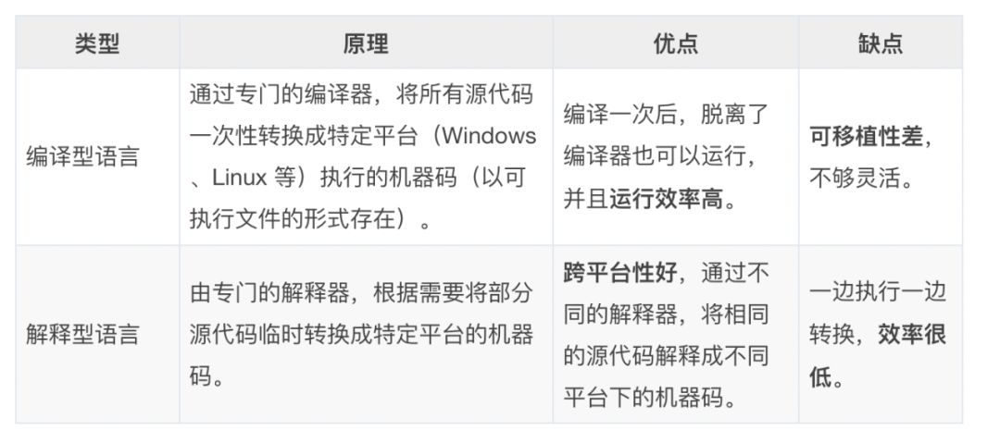
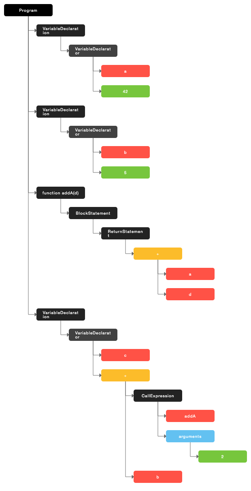
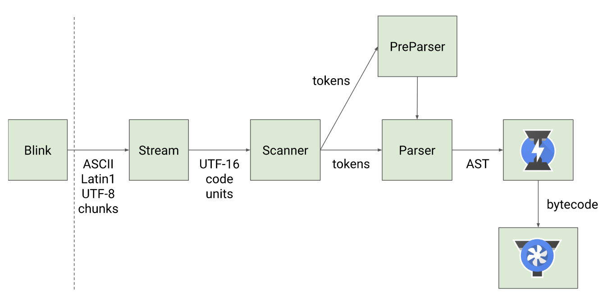
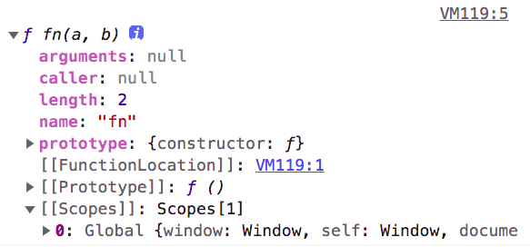
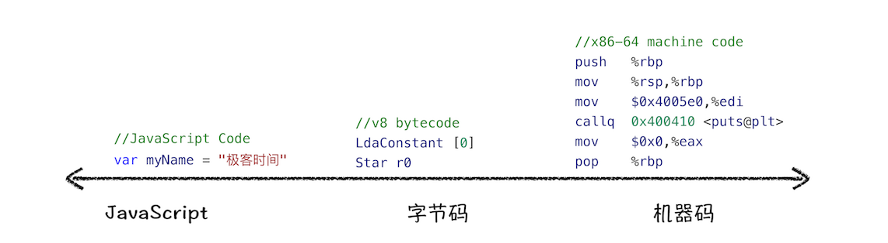

## 从JS引擎角度分析执行过程
---
1. 从底层理解 JavaScript
- 前端工具与框架的更新迭代速度非常快，并且不断在出现更新地工具，但这些上层应用本质上还是基于底层的运行机制(*v8的执行机制*)而存在。因此，抓住这些本质的知识，对我们去理解语言以及相关的工具会更有帮助
- 搞明白 v8 的运行机制，有助于我们从底层了解 JavaScript、深入理解语言转换器 Babel、语法检查工具 ESLint、前端框架 Vue 和 React 的一些底层实现机制
2. 动态语言与静态语言
- *静态语言* 指的是在 *编译阶段* 就能确定变量的类型的语言。*动态语言* 指的是代码在执行的时候才能确定变量的类型，比如 JS，JS 在赋值的时候才能确定变量的类型
3. 编译器与执行器
- 我们的机器只认识二进制的机器码(电信号)，为开发人员创造的编程语言需要经过 **翻译**，才能变成机器能识别的语言，也就是说，我们的程序最终的执行需要将源代码转换成目标机器的语言才能执行。根据 <u>*语言的执行流程*</u> 将它们划分为 <u>*编译型语言*</u> 和 <u>*解释型语言*</u>
- 编译型语言在程序执行之前，需要经过 <u>编译器的编译过程，并且编译之后会直接保留机器能读懂的二进制文件</u>，这样每次运行程序时，都可以直接运行该二进制文件，而不需要再次重新编译了。而解释型语言编写的程序，则需要 <u>每次运行该程序时都需要通过 *解析器* 对程序进行动态解释和执行，一般都是 *边解释边执行*</u>


- 在编译型语言的编译过程中，编译器首先会依次对源代码进行词法分析、语法分析，生成抽象语法树（AST），然后是优化代码，最后再生成处理器能够理解的机器码。如果编译成功，将会生成一个可执行的文件。但如果编译过程发生了语法或者其他的错误，那么编译器就会抛出异常，最后的二进制文件也不会生成成功
- 而在解释型语言的解释过程中，同样解释器也会对源代码进行词法分析、语法分析，并生成抽象语法树（AST），不过它会再基于抽象语法树生成字节码，最后再根据字节码来执行程序、输出结果
- 编译型语言一般是不能垮平台的，不能随意地在不同的操作系统之间切换。解释器一般来说就是虚拟机，它有两种，一种是基于堆栈，另一种是基于寄存器。而解释型语言由于多了解释器这个中间层，可以在不同的平台下，将相同的源代码翻译成不同的机器码，屏蔽了不同平台之间的差异。解释型语言与编译型语言的区别就是是否直接翻译成机器码



- 市面上有很多的 js 解释器(js 虚拟机)，如 SpiderMonkey、V8、JavaScriptCore 等

4. 抽象语法树
- 无论是解释型语言还是编译型语言，其中都会有一个阶段生成了 *AST*，这是编译器或解释器能理解的内存结构。就类似于浏览器的渲染引擎将 HTML 解析成计算机能够理解的 Dom 树一样，AST 就像是代码的结构化表示
```js
function Test() {
  let a = 1;
  const b = 2;
  var c = 3;
  console.log(a + b + c);
}
```
- 通过 [javascript-ast](https://resources.jointjs.com/demos/javascript-ast) 生成的 *ast* 如下所示，可以直观地看出来它的结构与代码的结构非常地相似



- 而在代码转码器 Babel 中，它就是先将 ES6 源码转换为 AST，然后再将 ES6 语法的 AST 转换为 ES5 语法的 AST，最后利用 ES5 的 AST 生成 JavaScript 源代码。另外一个是用来检查 JavaScript 编写规范的插件 ESlint，其检测流程也是需要将源码转换为 AST，然后再利用 AST 来检查代码规范化的问题
5. 框架的相似之处
- 以 Java 为例来说，因为需要跨平台的特性，那么最终翻译成的机器码在不同的平台上是不一样的，既然这样，那就不再直接翻译成机器码，在 <u>*打包的时候只翻译成中间文件*</u>，在执行的时候才翻译成该平台的机器码，这样在不同的平台上都可以使用一套代码，从而达到跨平台的特性
- 在前端越来越多这种跨平台的概念，其实都有这种类似的思路。以 React 框架为例，在开发层面，都是 react 代码，而在翻译的时候会针对不同的平台翻译成不同的语言，这就是这些开发方式的相似性。下面的这些开发方式，其实是属于一种 *静态编译*，它会在打包的时候就编译成对应平台的语言，比如说打包成 js文件、小程序文件等

|原生语言|平台|
|---|---|
|React|Taro/小程序|
|React|web|
|React|桌面|
|React|iOS/Andriod|

6. 解释型语言如何优化
- 在保证语言跨平台的同时，如何解决任务比较庞大的情况下，任务的响应速度得到保证，因为解释型语言需要经过解释 + 编译这一过程，那么如何保证短时间内响应呢?其实就是 **任务的拆分**，类似于大文件上传，进行切片再分片上传。也就是说，将大任务拆分成多个小任务，快速的去解析并执行这个小片段，小任务因为要达到的目标比较小，那么它的响应速度是非常快的，这样用户就可以感知到它的变化
- 类似的还有 *JIT(Just in Time)*，又被称为 **即时编译**，也就是在运行时进行编译，它会一段一段地解释并执行，这样就做到了任务的拆分并执行，保证相应的速度。V8 引擎就使用了这种编译方式，它同时采用了解释执行和编译执行两种方式
- 那么具体到 V8 引擎中，在下面提到的 *Ignition* 解释执行字节码的同时，会收集代码的运行信息，当它发现某段代码被高频调用后，会将该段代码的字节码及收集的信息传递给 *TurboFan*，由编译器将热点代码的字节码转换为更高效的机器码并存储起来，以便该段热点代码再次执行时直接执行机器码
---
## v8执行流程
---
1. v8 引擎
- v8 引擎是一个接收 JavaScript 代码并且编译代码然后执行的 *c++* 程序，作为一个跨平台性的语言，JavaScript 可以在多种操作系统和处理器上运行
- V8 引擎对 JavaScript 的处理包括两个阶段：**编译**、**执行**，那么 <u>*编译阶段*</u> 指 V8 将 JavaScript 转换为字节码或二进制的机器码，<u>*执行阶段*</u> 指解释器解释执行字节码或者计算机直接执行二进制机器码
- 先来看一下整个的执行流程图，其中 **Blink** 是 chrome 的渲染引擎，V8引擎是 **Blink** 内置的 JavaScript 引擎



2. Scanner
- *扫描器* 对文本形式的 JavaScript 代码进行 **分词操作**，也就是 **词法分析阶段**。此阶段会将一行行的源码拆解成一个个 **最小的、不可再分** 的 **词法单元**，也被称为 `token`，其中的空格会被直接忽略
```js
function Test() {
  let a = 1;
  const b = 2;
  var c = 3;
  console.log(a + b + c);
}
```
- 通过在线网站 [esprima](https://esprima.org/demo/parse.html#) 为上面的代码为例生成的 tokens 如下所示
```json
// 每个token都有对应的类型及值
[
  {
    "type": "Keyword",
    // token类型：关键字
    "value": "function"
    // token值：function
  },
  {
    "type": "Identifier",
    // token类型：标识符
    "value": "Test"
    // token值：Test
  },
  {
    "type": "Punctuator",
    "value": "("
  },
  {
    "type": "Punctuator",
    "value": ")"
  },
  {
    "type": "Punctuator",
    "value": "{"
  },
  {
    "type": "Keyword",
    "value": "let"
  },
  {
    "type": "Identifier",
    "value": "a"
  },
  {
    "type": "Punctuator",
    "value": "="
  },
  {
    "type": "Numeric",
    "value": "1"
  },
  {
    "type": "Punctuator",
    "value": ";"
  },
  {
    "type": "Keyword",
    "value": "const"
  },
  {
    "type": "Identifier",
    "value": "b"
  },
  {
    "type": "Punctuator",
    "value": "="
  },
  {
    "type": "Numeric",
    "value": "2"
  },
  {
    "type": "Punctuator",
    "value": ";"
  },
  {
    "type": "Keyword",
    "value": "var"
  },
  {
    "type": "Identifier",
    "value": "c"
  },
  {
    "type": "Punctuator",
    "value": "="
  },
  {
    "type": "Numeric",
    "value": "3"
  },
  {
    "type": "Punctuator",
    "value": ";"
  },
  {
    "type": "Identifier",
    "value": "console"
  },
  {
    "type": "Punctuator",
    "value": "."
  },
  {
    "type": "Identifier",
    "value": "log"
  },
  {
    "type": "Punctuator",
    "value": "("
  },
  {
    "type": "Identifier",
    "value": "a"
  },
  {
    "type": "Punctuator",
    "value": "+"
  },
  {
    "type": "Identifier",
    "value": "b"
  },
  {
    "type": "Punctuator",
    "value": "+"
  },
  {
    "type": "Identifier",
    "value": "c"
  },
  {
    "type": "Punctuator",
    "value": ")"
  },
  {
    "type": "Punctuator",
    "value": "}"
  }
]
```
3. Parser
- *解析器* 会将扫描器生成好的 *tokens/词法单元集合* 根据语法规则转换为 **AST(抽象语法树)**，并生成 **执行上下文**，这个阶段称为 **语法分析阶段**。这个 *AST* 是一个由 <u>*元素逐级嵌套所组成的*</u> 代表了程序语法结构的树
- 从上面的图中能够知道，解析过程会有两种情况。一种是 **预解析/preParser**，另外一种是 **全量解析/Parser**
- *预解析*：又被称为 *惰性解析*，此解析方式会跳过你代码中未被使用过的部分(*如只有函数声明而未调用它，只有函数被调用后，才会对其进行全量解析*)，它不会为这部分代码生成 **抽象语法树/AST**，但会生成不带变量引用和声明的 **[[Scopes]]** 信息。此种方式解析快，只会抛出解析过程中特定的错误，但不会抛出所有的错误
- 预解析能节省解析过程中的很多时间，能够减少内存空间的使用，减低代码的整体执行时间，因为它不用生成特定的信息与 ast
```js
function fn(a, b) {
  let c = 10;
  return a + b + c;
}
console.dir(fn);
// 未被执行，但进行了预解析，scopes信息已生成
```



```js
function fn(a, b) {
  let c = 10 * d;
  // 不存在的变量d，不执行fn的时候并不会抛出错误
  return a + b + c;
}

function fn1(a, b) {
  let c = 10 *;
  // 语法分析阶段抛出，Uncaught SyntaxError: Unexpected token ';'
  return a + b + c;
}
```
- *全量解析*：此解析方式会解析被使用过的代码，并将 *词法单元集合* 根据语法规则生成 **抽象语法树/AST**，并且生成具体的 **[[Scopes]]** 信息、以及自身的 **词法环境** 信息，也就是此阶段 V8 会根据 *AST* 去生成该段代码 *执行上下文* 信息。会抛出所有的语法错误
```js
// 声明时未调用，因此会被认为是不被执行的代码，进行预解析
function foo() {
  console.log('foo');
}

// 声明时未调用，因此会被认为是不被执行的代码，进行预解析
function fn() {}

// 函数立即执行，只进行一次全量解析
(function bar() {})();

// 执行 foo，那么需要重新对 foo 函数进行全量解析，此时 foo 函数被解析了两次
foo();
```
- 无论是预解析还是全量解析，在语法分析过程中，如果源码符合语法规则，这一步会顺利完成，但如果源码存在语法错误，这一步就会终止，并抛出一个语法错误
4. Interperte Ignition
- 有了解析器生成的 AST 和 *执行上下文* 信息，此阶段 *解释器 Ignition* 就会根据 AST 生成字节码，并解释执行字节码
- 解释器除了生成字节码，还会执行字节码。解释器在执行字节码这个操作之前，需要先将字节码转换为机器码后才可以执行，因为计算机只认识机器码
- 在最初的时候，V8 并没有 *字节码* 这个中间码，它会直接将 *AST* 转换为 *机器码*，机器码的执行是非常高效的，所以这种方式在发布后的一段时间内运行效果是非常好的。但是随着 Chrome 在手机上的广泛普及，特别是运行在 512M 内存的手机上，内存占用问题也暴露出来了，因为 V8 需要 **消耗大量的内存** 来存放转换后的机器码。为了解决内存占用问题，V8 团队大幅重构了引擎架构，引入字节码，并且抛弃了之前的编译器
- 字节码其实就是介于 *AST* 和 *机器码* 之间的一种代码，但是它与特定类型的机器码无关，字节码需要解释器将其转换为机器码后才能执行，可以当成是机器码的一种抽象形式



- 可以看出来，机器码所占用的内存空间远远超过了字节码，因此使用字节码可以减少系统的内存使用；而生成字节码的时间也明显比生成机器码的时间快，提升了启动的速度。并且有一些代码没必要生成机器码，解释成字节码更合适，这也是字节码出现的主要原因
- 同时解释器会记录某段代码的执行次数，当一段代码被重复执行多次，这段代码就会被提升为 *热点代码*，同时将该段代码的字节码和收集的分析数据传递给 *优化编译器TurboFan*，TurboFan 根据分析数据的情况，会优化并编译字节码，通过一种推测优化的技术来生成优化好的机器码
5. TurboFan
- **TurboFan** 是 **JIT** 优化的编译器，它的编译线程与解释器生成字节码不是同一个线程，因此可以互相配合使用
- 正常情况下，代码由解释器生成字节码，逐条解释并执行它。当一段代码重复执行多次，就可能会被标记为 *热点代码*，解释器会将该段代码的字节码及收集的分析数据传递给 *TurboFan*
- *编译器 TurboFan* 会将该段热点代码的字节码编译成高效的机器码并存储起来，当再次执行这段优化过的代码时，不需要再去重复字节码翻译成机器码的过程，而只需要执行已经编译过的机器码就可以了，这样执行效率得到了提升
<!-- - *TurboFan* 做的优化包括 *内联* 和 *逃逸分析*。内联会将相关联的函数进行合并，减少运行时间
```js
function splicing(str1,str2){
  return str1 + str2
}

function count(){
  return splicing('hello','world')
}

// 内联优化后

function count(){
  let str1 = 'hello';
  let str2 = 'world';
  let res = str1 + str2;
  return res
}
```
- 另外逃逸分析会分析对象的生命周期是否仅限于当前函数，是的话会进行优化
```js
function splicing(str1,str2){
  const obj = { str1, str2 }
  return obj.str1 + obj.str2
}

// 优化

function splicing(str1,str2){
  const obj_str1 = str1;
  const obj_str2 = str2;
  // const obj = { str1, str2 }
  return obj_str1 + obj_str2
}
``` -->
- [TorboFan优化过程/node --trace-opt](https://github.com/hjzheng/performance-test/blob/master/v8/addFunction.js)
6. Optimize/De-optimize
- 热点代码由解释执行字节码变为直接执行机器码，这个优化的操作是由 *TurboFan* 完成的，这个优化过程也被称为 *Optimize*；但某些情况下，代码不再符合优化的条件，机器码会回到 *Ignition* 中逆向还原成字节码，继续由 *Ignition* 解释执行，这个过程被称为 *De-optimize*
```js
function sum(x,y){
  console.log(x + y)
}
sum(1,2);
sum(3,4);
sum(7,8);
// 1. sum被多次调用后，成为热点函数，被编译成运行更快的机器码
// 2. sum的参数由于多次传递整型数据，因而也被确定，但当你传入两个'0' '1'时
// 3. 机器代码不知道如何处理字符串的参数，就需要进行deoptimization，也就是回退字节码
// 4. 再经由解释器解释执行
```
- 除了上面参数类型改变导致的 *De-optimize*，还有可能当一段代码不再是 *热点代码* 时，也会被执行 *De-optimize* 的操作。在代码编写时尽量将常用函数(*调用次数多的函数*)的参数类型固定，以保证引擎的运行时的高效
- v8 执行时间越久，执行效率越高。因为执行越久，就会有更多的代码成为热点代码，整体代码的执行效率就越高，但内存占用的空间也会越来越多，内存小的会导致浏览器变卡，不过 v8内部有多种权衡策略，根据不同系统的情况来判定是否生成机器码并存储
