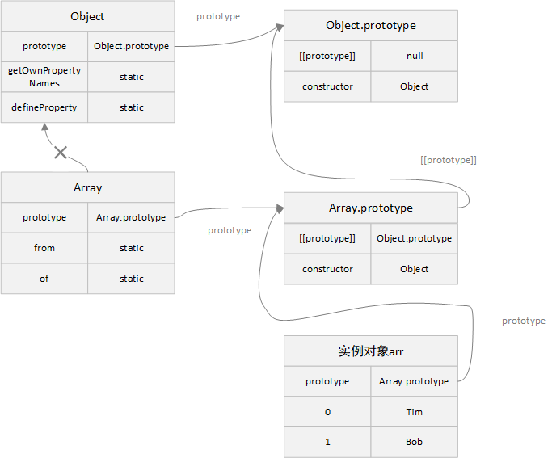

## 内建类的扩展

---

1. 内置对象

- 内置的类，也是可扩展的，如 `Array`、`Date` 等，它们也是可以被继承的

```js
class ExtendArray extends Array {
  isEmpty() {
    return this.length === 0;
  }
}

let arr = new ExtendArray(1, 2.3, 4);
// ExtendArray(3) [2, 4.6, 8]

let arr1 = arr.map((item) => {
  return item * 2;
});
// ExtendArray(3) [1, 2.3, 4]
```

- 内建的某些方法，如 `map`、`filter` 等返回的是**子类**的新对象，而不是**基类**的实例对象，其内部使用了对象的 `constructor` 属性来实现这一功能，内部使用的是 `arr.constructor` 来创建新的结果数组，而不是使用原生的 `Array`
- 我们还可以通过特殊的属性来定制这种行为，通过设置 `[Symbol.species]` 这个属性，当调用内建方法时，如果存在，则应返回 `JavaScript` 在内部用来在 `map` 和 `filter` 等方法中创建新实体的 `constructor`。这个属性被许多其他的集合结构所应用，如 `map`、`set` 等

```js
class ExtendArray extends Array {
  static get [Symbol.species]() {
    return Array;
  }
  // 内建方法将使用该getter作为constructor
  isEmpty() {
    return this.length === 0;
  }
}

class NumberArray extends Array {
  static get [Symbol.species]() {
    return Object
  }
}

let arr = new ExtendArray(1, 2.3, 4);
// ExtendArray(3) [2, 4.6, 8]

let arr3 = new NumberArray(1,2,3,4);

Object.getPrototypeOf(arr) === ExtendArray.prototype; // true
Object.getPrototypeOf(arr) === Array.prototype; // false
arr.isEmpty(); // false

let arr1 = arr.map((item) => {
  return item * 2;
});
// [2, 4.6, 8]

let arr4 = arr3.map((item) => {
  return item * 2;
});
// Number {4, 0: 2, 1: 4, 2: 6, 3: 8}

Object.getPrototypeOf(arr1) === ExtendArray.prototype; // false
Object.getPrototypeOf(arr1) === Array.prototype; // true
arr1.isEmpty();
// Uncaught TypeError: arr1.isEmpty is not a function

// 注意：map内建方法调用了[Symbol.species]，因此返回的是Array，而不是ExtendArray，所以不再是ExtendArray的实例
```

2. 内建类的静态属性

- 在许多的内建类中，有众多的静态属性和方法，如 `Array.of`、`Array.from`、`Object.getOwnPropertyNames(obj)`等。虽然 `Array` 继承自 `Object`，而一般一个类继承自另一个类时，静态方法和 `prototype` 上的方法都会得到继承。但 **内建类是一个例外，它们相互间不会继承静态方法**



```js
let obj = {
  name: 'Bob',
  age: 18,
};

let arr = [1, 2, 3];

Object.getOwnPropertyNames(obj); // ["name", "age"]
Array.getOwnPropertyNames(arr); // Array.getOwnPropertyNames is not a function

// 静态方法没有被继承
```

---

## instanceof

---

1. instanceof 的作用

- 用于检查一个对象是否属于某个特定的类，同时，它还考虑了 `继承`。因此，它将 `原型链` 也考虑在内了

```js
let date = new Date(); //

date instanceof Date; // true

Date.prototype instanceof Object; // true

date instanceof Object; // true
```

2. instanceof 的执行过程

- 第一种方式：如果存在静态方法 `[Symbol.hasInstance]`，那么会直接调用这个方法，因此，我们可以在该方法中自定义执行逻辑

```js
class User {
  static [Symbol.hasInstance](user) {
    if (user.name) {
      return true;
    }
  }
}

let obj = {
  name: 'Bob',
};

let obj1 = {
  name: '',
};

obj instanceof User; // true
obj1 instanceof User; // false
```

- 第二种方式：大部分类中没有 `Symbol.hasInstance`，这种情况下，会一个一个的比较原型链上的每一个原型

```js
function User(name) {
  this.name = name;
}
class Person {
  constructor(name) {
    this.name = name;
  }
}
class Student extends Person {
  constructor(name, class_name) {
    super(name);
    this.class_name = class_name;
  }
  get_class() {
    return this.class_name;
  }
}

let u1 = new User('Bob');
let p1 = new Student('Mary', '0903');

u1 instanceof User; // true
p1 instanceof Person; // true
p1 instanceof Student; // true
```

- 此种方式下，它的内部原理如下所示。但需要注意的是，instanceof 遇到原始值会直接返回 false。它可以准确判断引用数据类型，但不能正确判断原始数据类型

```js
/**
 * L instanceof R
 * 第一个参数指 instanceof 左边的参数
 * 第二个参数指 instanceof 右边的参数
 */

const instanceOf = (l,r) => {
  // 原始类型直接返回false
  if(typeof l !== "object" || l === null) return false;

  /** 
   * l = l.__proto__
   * r = r.prototype
  */
  l = Object.getPrototypeOf(l); // 取 l 的隐式原型
  r = r.prototype; // 取 r 的显式原型对象

  while(true) {
    if(l === null) {
      return false
    } else if (l === r) {
      // r 显式原型严格等于 l 隐式原型时，返回true
      return true
    }
    l = Object.getPrototypeOf(l);
  }
}
```

- _isPrototypeOf_：会检查某原型是否在另一个对象的原型链上，在的话返回 `true`，否则返回 `false`

```js
function User(name) {
  this.name = name;
}
class Person {
  constructor(name) {
    this.name = name;
  }
}
class Student extends Person {
  constructor(name, class_name) {
    super(name);
    this.class_name = class_name;
  }
  get_class() {
    return this.class_name;
  }
}

let u1 = new User('Bob');
let p1 = new Student('Mary', '0903');

Person.prototype.isPrototypeOf(p1); // true
Student.prototype.isPrototypeOf(p1); // true
Object.prototype.isPrototypeOf(p1); // true
User.prototype.isPrototypeOf(u1); // true
```

- _Object.prototype.toString_：会根据参数的类型返回特殊的字符串，可用于判断数据类型，比 `typeof` 更好用

| 类型      | 结果               |
| --------- | ------------------ |
| number    | [object Number]    |
| boolean   | [object Boolean]   |
| null      | [object Null]      |
| undefined | [object Undefined] |
| array     | [object Array]     |
| object    | [object Object]    |
| function  | [object Function]  |

- 我们还可以使用特殊的对象属性 `Symbol.toStringTag` 来自定义对象的 `toString` 方法的行为

```js
let obj = {
  [Symbol.toStringTag]: 'obj',
};

Object.prototype.toString.call(obj); // "[object obj]"

window[Symbol.toStringTag]; // window
Object.prototype.toString.call(window); // "[object Window]"

XMLHttpRequest.prototype[Symbol.toStringTag]; // "XMLHttpRequest"
Object.prototype.toString.call(new XMLHttpRequest()); // "[object XMLHttpRequest]"
```

- 可以发现，`Object.prototype.toString` 输出的结果恰好是包裹了 `[symbol.toStringTag]` 的结果，它能够用来检查 `原始数据类型` 和 `内建对象`，甚至还能自定义，也就是包含了 `[symbol.toStringTag]` 属性的对象
