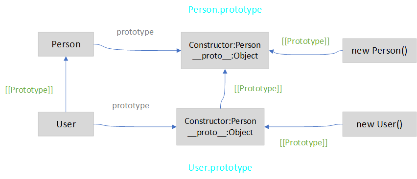

## 静态属性与方法

---

1. 静态属性

- 静态属性，它属于类的函数本身，而不会添加到原型对象上。只能通过 `类.属性名` 来访问，静态属性用于实现属于该类但不属于该类任何特定对象的函数，它与类的具体实例无关，不会被绑定到实例上

```js
// 构造函数
function Person(name, age) {
  this.name = name;
  this.age = age;
}

Person.static_name = 'person';
Person.get_static_name = function () {
  return this.static_name;
};
```

```js
// class类
class Person {
  static static_name = 'person';
  static get_static_name() {
    return this.static_name;
  }
}
```

- 静态属性在非静态方法中被使用时，不能直接使用 `this` 关键字来调用，可以通过构造函数名或构造函数的属性来调用

```js
class Person {
  constructor() {
    this.name = Person.static_name;
    // this.name = this.constructor.static_name
  }
  static static_name = 'person';
  static get_static_name() {
    return this.static_name;
  }
}
```

2. 静态属性的继承

- 使用 `extends` 去扩展类时，当子类继承父类时，会将父类的静态属性和方法也继承下来。但是，它仍然是基于原型的继承方式

```js
class Person {
  static static_name = 'person';
  static get_static_name() {
    return this.static_name;
  }
}

class User extends Person {}

Person.static_name; // person
User.static_name; // person

User.static_name = 'user';
User.static_name; // user
Person.static_name; // person
// 为子类设置同名的静态属性，将不会再去父类上寻找同名的静态属性
```

- 此时，子类的静态属性和方法是从父类上继承来的，也就是当子类在自身找不到这个静态属性时，他会去父类中寻找。因此，`extends` 除了将子类的原型对象的 *__proto__* 指向父类的原型对象外，还将子类的 *__proto__* 指向了父类



- 在 `extends` 实现继承时，它创建了两个 `[[Prototype]]` 引用，子类的函数的原型继承自父类，子类的原型对象继承自父类的原型对象

```js
class Person {
  static static_name = 'person';
  static get_static_name() {
    return this.static_name;
  }
}

class User extends Person {}

Object.getPrototypeOf(User) === Person; // true
Object.getPrototypeOf(User.prototype) == Person.prototype; // true
```

---

## 私有属性与受保护的属性

---

1. 内部接口与外部接口

- `内部接口`：可以通过该类的其他方法访问，但不能从外部访问的方法和属性
- `外部接口`：可以通过该类的其他方法访问，也可以从类的外部访问类的属性和方法
- `受保护的`：只能从类的内部和基于其扩展的类的内部访问

2. 受保护的属性

- 通过设置 `访问器属性` 以达到控制属性被修改的条件

```js
class Person {
  constructor(name, idcard) {
    this.name = name;
    this._idcard = idcard;
  }
  get idcard() {
    return this._idcard;
  }
  set idcard(value) {
    if (`${value}`.length < 6) {
      throw new Error('idcard length is too small');
    }
    this._idcard = value;
  }
}

let p1 = new Person('Mary', 431126);
p1.idcard = 2; //  Uncaught Error: idcard length is too small
```

3. 只读的属性

- 我们可以通过只设置某属性的 `get`，而不设置它的 `set`，这样该属性只能被读取，而不能被修改

```js
class Person {
  constructor(name, idcard) {
    this.name = name;
    this._idcard = idcard;
  }
  get idcard() {
    return this._idcard;
  }
}

class User extends Person {}

let p1 = new Person('Mary', 431126);
// 以_开头作为受保护的属性是一个约定，但此时通过 this._idcard 仍可修改该属性，需要注意
```

- 需要注意，**此种类型的属性是能被通过继承的方式继承到子类的**

4. 私有的属性

- 该提案是即将被添加到规范中的 js 提案，为私有属性和方法提供语言级支持
- 当你需要定义私有属性和方法时，它们应该以 `#` 开头，并且它们只在类的内部可被访问，我们无法从外部或从继承的类中访问它

```js
class Home {
  #riches = 100;
  #increasePrice(val) {
    this.#riches = val + parseInt(this.#riches);
  }
  constructor(father, mother, son) {
    this.father = father;
    this.mother = mother;
    this.son = son;
  }
  handleChange(val) {
    this.#increasePrice(val);
    console.log(this.#riches);
  }
}

let h1 = new Home('Bob', 'Jim', 'Tim');
// {father: "Bob", mother: "Jim", son: "Tim", #increasePrice: ƒ, #riches: "100 million"}

h1.#richers; // Uncaught SyntaxError: Private field '#richers' must be declared in an enclosing class

h1.#increasePrice(250); // Uncaught SyntaxError: Private field '#richers' must be declared in an enclosing class

h1.handleChange(260); // 360
```

- 当子类继承具有私有属性的父类时，无法直接在子类方法里访问私有属性。但我们可以通过设置 **访问器属性** 去访问私有属性。因此，利于区分，我们可以设置一个同名的公有字段，而 **同名的私有和公有字段不会发生冲突**

```js
class Home {
  #riches = 100;
  #increasePrice(val) {
    this.#riches = val + parseInt(this.#riches);
  }
  constructor(father, mother, son) {
    this.father = father;
    this.mother = mother;
    this.son = son;
  }
  handleChange(val) {
    this.#increasePrice(val);
    console.log(this.#riches);
  }
}

class Person extends Home {
  testRiches() {
    console.log(this.#riches);
  }
}
// SyntaxError: Private field '#riches' must be declared in an enclosing class
```

```js
class Home {
  #riches = 100;
  #increasePrice(val) {
    this.#riches = val + parseInt(this.#riches);
  }
  constructor(father, mother, son) {
    this.father = father;
    this.mother = mother;
    this.son = son;
  }
  handleChange(val) {
    this.#increasePrice(val);
    console.log(this.#riches);
  }
  get riches() {
    return this.#riches;
  }
  set riches(val) {
    this.#increasePrice(val);
  }
}

class Person extends Home {
  testRiches() {
    console.log(this.riches);
  }
}

let p1 = new Person('Bob', 'Jim', 'Tim');
// {father: "Bob", mother: "Jim", son: "Tim", #increasePrice: ƒ, #riches: 100}

p1.riches = 10;
// {father: "Bob", mother: "Jim", son: "Tim", #increasePrice: ƒ, #riches: 110}

p1.testRiches(); // 110
```

- 同时注意，私有字段无法通过 `this[name]` 来访问，并且私有字段不能通过在之后赋值来创建它们，这是确保私有性的 `语法限制`，是比较特殊的一个地方

```js
class User {
  constructor(name) {
    this.name = name;
  }
  #name = 'bob';
  printName() {
    return this['#name'];
  }
}

let u1 = new User('jim');
// {name: "jim", #name: "bob"}

u1.printName(); // undefined
```

- 我们还可以把私有属性设置为 `静态私有属性`，它只能在该类中被访问和修改，无法在类的实例中与派生类所访问到

```js
class User {
  constructor(name) {
    this.name = name;
  }

  static #name = 'bob';

  printName() {
    return this['#name'];
  }

  getPriveteStaticProperty() {
    return User.#name;
  }
}

let u1 = new User('jetmine');
// User {name: "jetmine"}
// 未被设置为 User实例对象的私有属性

u1.getPriveteStaticProperty(); // bob
```
