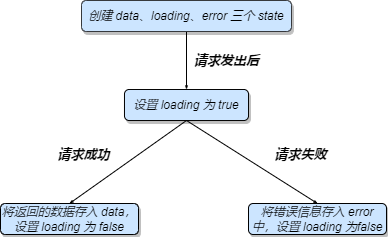

## 自定义 hook

---

1. 什么是自定义 hook

- 当我们在开发需求时，首先就是：这个功能中的哪些逻辑可以抽离出来成为独立的 Hooks ? 这样是为了让我们尽可能地把业务逻辑拆成独立的 Hooks ，这样有助于实现代码的模块化和解耦，同时也方便后面的维护
- 那么通过自定义 Hooks ，我们可以将 Hooks 两个核心的优点给利用上：一是方便进行逻辑复用，二是帮助关注点分离

2. 如何创建自定义 Hooks

- 通常自定义 Hooks 就是 **声明一个名字以 use 开头的函数**，在形式上与普通的函数没有任何区别，我们可以传递任意参数给这个 Hook，也可以返回任何值
- 那么自定义 Hooks 与普通函数在语义上的区别就是：**函数中有没有用到其他的 Hooks**。需要注意的是，函数组件因为其他状态变化引起的重新渲染，会导致自定义 Hook 渲染(更新)

```jsx
import React, { useState, useEffect, useCallback } from 'react';

// 定义一个计数器的自定义hooks
const useCounter = (step) => {
  const [count, setCount] = useState(0);

  const add = useCallback(() => setCount(count + 1), [count]);

  const del = useCallback(() => setCount(count - 1), [count]);

  const reset = useCallback(() => setCount(0), []);
  console.log('re-render');
  return {
    count,
    add,
    del,
    reset,
  };
};

const Counter = () => {
  const { count, add, del, reset } = useCounter();

  console.log('count render');

  return (
    <div>
      <button onClick={del}> - </button>
      <p>{count}</p>
      <button onClick={add}> + </button>
      <button onClick={reset}> reset </button>
    </div>
  );
};

export default Counter;
```

- 在上面的代码中，我们把原来放在函数组件中实现的逻辑提取成了一个 Hooks，一方面能让这个逻辑得到重用，另外一方面也能让代码更加语义化，并且易于理解和维护
- 因此我们可以看到自定义 Hooks 的两个特点：一是名字一定是以 use 开头的函数，这样 React 才能够知道这个函数是一个 Hook；二是函数内部一定调用了其它的 Hooks，可以是内置的 Hooks，也可以是其它自定义 Hooks。这样才能够 _让组件刷新，或者去产生副作用_

3. 封装请求通用逻辑

- 我们将之前获取用户列表信息的代码逻辑拿过来进行改造

```js
import React, { useState } from 'react';

export default () => {
  const [users, setUsers] = useState([]); // 保存用户列表的状态state
  const [loading, setLoading] = useState(false); // 保存加载状态的loading
  const [error, setErrot] = useState(null); // 保存错误状态

  const fetchUsers = async () => {
    // 函数组件重新执行，该函数会被重新定义多次
    setLoading(true);
    try {
      const res = await fetch('https://reqres.in/api/users/');
      const json = await res.json();

      setUsers(json.data);
    } catch (err) {
      setError(err);
    }
    setLoading(false);
  };

  return (
    <div className="userList">
      <button onClick={fetchUsers} disabled={loading}>
        {loading ? 'Loading...' : 'Show Users'}
      </button>
      {error && <div style={{ color: 'red' }}>Failed：{String(error)}</div>}
      <ul>
        {users.length > 0 &&
          users.map((user) => {
            return <li key={user?.id}>{user?.first_name}</li>;
          })}
      </ul>
    </div>
  );
};
```

- 我们可以发现，大部分请求具有以下特点，它们都遵循以下的步骤 

```js
import React, { useState } from 'react';

const useAsync = (asyncFunction) => {
  // 设置三个异步逻辑相关的state
  const [data, setData] = useState([]);
  const [loading, setLoading] = useState(false);
  const [error, setErrot] = useState(null);

  const execute = useCallback(() => {
    // 请求开始前，重置状态
    setLoading(true);
    setData(null);
    setError(null);
    return asyncFunction()
      .then((response) => {
        // 请求成功，设置 data 与 loading
        setData(response);
        setLoading(fasle);
      })
      .catch((error) => {
        // 请求失败，设置 error 与 loading
        setError(error);
        setLoading(false);
      });
  }, [asyncFunction]);
  // 将 asyncFunction 存入依赖项，当asyncFunction变化时重新声明执行器函数

  return {
    execute,
    loading,
    data,
    error,
  };
};
```

- 有了这个 Hook，我们在组件中就只需要关心与业务逻辑相关的部分。利用 Hooks 能管理 React 组件状态的能力，将一个组件中的某一部分状态独立出来，从而实现了通用逻辑的重用
- 自定义 Hooks 要实现的逻辑，要么用到 state，要么用到副作用，是一定会用到内置 Hooks 或者其它自定义 Hooks 的

```jsx
import React, { useState, useCallback, useEffect } from 'react';

const useAsync = (asyncFunction) => {
  // 设置三个异步逻辑相关的state
  const [data, setData] = useState([]);
  const [loading, setLoading] = useState(false);
  const [error, setError] = useState(null);

  const execute = useCallback(() => {
    // 请求开始前，重置状态
    setLoading(true);
    setData(null);
    setError(null);
    return asyncFunction()
      .then((response) => {
        // 请求成功，设置 data 与 loading
        setData(response);
        setLoading(false);
      })
      .catch((error) => {
        // 请求失败，设置 error 与 loading
        setError(error);
        setLoading(false);
      });
  }, [asyncFunction]);
  // 将 asyncFunction 存入依赖项，当asyncFunction变化时重新声明执行器函数

  return {
    execute,
    loading,
    data,
    error,
  };
};

export default () => {
  const { execute, loading, data, error } = useAsync(async () => {
    const res = await fetch('https://reqres.in/api/users/');
    const json = await res.json();
    return json.data;
  });

  if (error) return <div style={{ color: 'red' }}>Failed：{String(error)}</div>;

  return (
    <>
      <button disabled={loading} onClick={execute}>
        {loading ? 'Loading...' : 'Show Users'}
      </button>
      {data?.map((user) => {
        return (
          <ul key={user?.id}>
            <li style={{ display: 'flex' }}>
              <div>
                
              </div>
              <div>
                <p>first_name:{user?.first_name}</p>
                <p>email:{user?.email}</p>
              </div>
            </li>
          </ul>
        );
      })}
    </>
  );
};
```

- 那么这种类型的封装与工具类有什么区别呢? 它在于 Hooks 中，我们可以管理组件的 state，从而将更多的逻辑写在可重用的 Hooks 中；而普通的工具类是无法直接修改组件的 state 的，那么也就无法在数据改变时触发组件的重新渲染

4. 监听浏览器状态

- 大部分情况下，React 组件不需要关心太多的浏览器 Api。但有时候确实必需的：界面需根据窗口变化重新布局；在页面滚动时，根据滚动条位置，来处理一些其他的事情(如显示 '返回顶部' 的按钮)
- 那么通过自定义 Hooks 我们要绑定的数据源就是 _当前滚动条的位置数据_

```js
import React, { useState, useEffect } from 'react';

const getPosition = () => {
  return {
    x: document.documentElement.scrollLeft || document.body.scrollLeft,
    y: document.documentElement.scrollTop || document.body.scrollTop,
  };
};

const useScroll = () => {
  // 设置一个 position 的 state 用于保存滚动条位置
  const [position, setPosition] = useState(getPosition());

  useEffect(() => {
    const handler = () => {
      setPosition(getPosition());
    };
    // 监听滚动事件，更新滚动条位置
    document.addEventListener('scroll', handler);
    return () => {
      // 组件被销毁，移除事件监听
      document.removeEventListener('scroll', handler);
    };
  }, []);

  return position;
};
```

- 接下来，通过这个自定义 Hook，我们来实现一个返回顶部的功能

```jsx
import React, { useState, useEffect, useCallback } from 'react';

const getPosition = () => {
  return {
    x: document.documentElement.scrollLeft || document.body.scrollLeft,
    y: document.documentElement.scrollTop || document.body.scrollTop,
  };
};

const useScroll = () => {
  // 设置一个 position 的 state 用于保存滚动条位置
  const [position, setPosition] = useState(getPosition());

  useEffect(() => {
    const handler = () => {
      setPosition(getPosition());
    };
    // 监听滚动事件，更新滚动条位置
    document.addEventListener('scroll', handler);
    return () => {
      // 组件被销毁，移除事件监听
      document.removeEventListener('scroll', handler);
    };
  }, []);

  return position;
};

export default () => {
  const { y } = useScroll();

  const goTop = useCallback(() => {
    document.documentElement.scrollTop
      ? (document.documentElement.scrollTop = 0)
      : (document.body.scrollTop = 0);
  });

  if (y > 300) {
    return (
      <button
        onClick={goTop}
        style={{
          position: 'fixed',
          right: 10,
          bottom: 60,
          background: 'skyblue',
        }}
      >
        返回顶部
      </button>
    );
  }
  return null;
};
```

- 除了将浏览器状态(窗口大小、滚动条位置等)变为可被 React 组件绑定的数据源外，像一些 cookie、localstorage、URL 等也可以通过这样的方式去实现

5. 拆分复杂组件

- 当某个组件的功能越来越复杂的时候，代码会变得越来越冗长，不便于理解和维护。那么在 Hooks 里面我们应该怎么做呢?那就是 **尽量将相关的逻辑做成独立的 Hooks，然后在函数组中使用这些 Hooks，通过参数传递和返回值让 Hooks 之间完成交互**
- 也就是说，拆分代码逻辑不一定是为了重用，也可以是为了业务逻辑的隔离。因此，我们可以将抽离出来的 Hooks 与 函数组件写在同一个文件中，表示这个 hooks 与当前函数组件紧密相连的

```jsx | pure
import React, { useEffect, useCallback, useMemo, useState } from 'react';
import Select from 'antd/lib/select/index';
import Table from 'antd/lib/table/index';
import _ from 'lodash';
import 'antd/dist/antd.css';

const useAsync = (asyncFunction) => {
  // 设置三个异步逻辑相关的state
  const [data, setData] = useState([]);
  const [loading, setLoading] = useState(false);
  const [error, setError] = useState(null);

  const execute = useCallback(() => {
    // 请求开始前，重置状态
    setLoading(true);
    setData(null);
    setError(null);
    return asyncFunction()
      .then((response) => {
        // 请求成功，设置 data 与 loading
        setData(response);
        setLoading(false);
      })
      .catch((error) => {
        // 请求失败，设置 error 与 loading
        setError(error);
        setLoading(false);
      });
  }, [asyncFunction]);
  // 将 asyncFunction 存入依赖项，当asyncFunction变化时重新声明执行器函数

  return {
    execute,
    loading,
    data,
    error,
  };
};

const endpoint = 'https://60b2643d62ab150017ae21de.mockapi.io/';

const useArticles = () => {
  const { execute, loading, data, error } = useAsync(
    useCallback(async () => {
      const res = await fetch(`${endpoint}/posts`);
      return await res.json();
    }, []),
  );

  // 使用useAsync获取文章列表

  useEffect(() => {
    execute();
  }, [execute]);
  // 执行异步调用

  // 返回文章列表状态
  return {
    articles: data,
    articlesLoading: loading,
    articlesError: error,
  };
};

const useCategories = () => {
  const { execute, data, loading, error } = useAsync(
    useCallback(async () => {
      const res = await fetch(`${endpoint}/categories`);
      return await res.json();
    }, []),
  );
  // 获取分类列表

  useEffect(() => {
    execute();
  }, [execute]);

  // 返回分类列表状态
  return {
    categories: data,
    categoriesLoading: loading,
    categoriesError: error,
  };
};

const useCombinedArticles = (articles, categories) => {
  // 将分类与文件的数据组合到一起
  return useMemo(() => {
    if (!articles || !categories) return null;
    return articles.map((article) => {
      return {
        ...article,
        category: categories.find(
          (_category) => String(_category.id) === String(article.categoryId),
        ),
      };
    });
  }, [articles, categories]);
};

const useFilteredArticles = (articles, selectedCategory) => {
  // 实现按照分类过滤
  return useMemo(() => {
    if (!articles) return null;
    if (!selectedCategory) return articles;
    return articles.filter((article) => {
      // console.log('filter: ', article.categoryId, selectedCategory);
      return String(article?.category?.name) === String(selectedCategory);
    });
  }, [articles, selectedCategory]);
};

export default () => {
  const [selectedCategory, setSelectedCategory] = useState(null);
  // 获取文章列表
  const { articles, articlesError } = useArticles();
  // 获取分类列表
  const { categories, categoriesError } = useCategories();
  // 文章列表与分类列表进行组合
  const combined = useCombinedArticles(articles, categories);
  // 实现过滤
  const result = useFilteredArticles(combined, selectedCategory);

  // 下拉框选项过滤
  const options = useMemo(() => {
    const arr = _.uniqBy(categories, (c) => c.name).map((item) => ({
      value: item.name,
      label: item.name,
    }));

    arr.unshift({ value: null, label: 'All' });

    return arr;
  }, [categories]);

  if (articlesError || categoriesError) return <div style={{ color: 'red' }}>Failed</div>;

  if (!result) return 'Loading...';

  return (
    <div>
      <Select
        value={selectedCategory}
        onChange={(value) => setSelectedCategory(value)}
        options={options}
        style={{ width: '200px' }}
        placeholder="Select a category"
      />
      <Table
        dataSource={result}
        columns={[
          { dataIndex: 'title', title: 'Title' },
          { dataIndex: ['category', 'name'], title: 'Category' },
        ]}
      ></Table>
    </div>
  );
};
```

- 那么现在我们就将一个较为复杂的逻辑抽分成一个个独立的 Hook 了，在代码逻辑与语义变得更加简洁和易于理解
