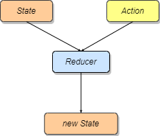

<!-- more -->

## useReducer

---

1. 为何会出现 redux

- 随着对 React 使用的深入，组件级别的 state 和从上而下传递的 props 这两个状态机制，已经无法满足复杂功能的需要(例如跨层级之间的数据共享和传递)
- 单个组件的状态可以用内部的 state 来维护，组件外部是无法访问这个状态的。而 Redux 使用全局唯一的 store 维护整个应用程序的状态。也就是说，页面上的多个组件，都可以从这个 store 获取状态，保证组件之间能够共享状态
- **Redux Store** 具有两个特点：一是 **Redux Store 是全局唯一的**，即一个应用程序一般只有一个 Store；二是 **Redux Store 是树状结构**，可以更天然地映射组件树的结构，虽然不是必须的
- 通过把状态放在组件之外，就可以让 React 组件成为更加纯粹的表现层，那么很多对于业务数据和状态数据的管理，就都可以在组件之外去完成
- 状态共享的能力体现在两个场景中：一是跨组件的状态共享；二是同组件多个实例地状态共享

2. redux 的三个概念



| 概念    | 描述                                                            |
| ------- | --------------------------------------------------------------- |
| state   | 即 store，一般是一个纯 JS Object                                |
| action  | 也是一个 Object，用于描述发生的动作                             |
| reducer | 一个函数，接收 action 和 state 作为参数，通过计算得到新的 store |

- 在 Redux 中，所有对于 Store 的修改都必须通过 Reducer 去完成，而不是直接修改 Store。这样一方面可以 **保证数据的不可变性**，同时还有：**可预测性（Predictable）**：即给定一个初始状态和一系列的 Action，一定能得到一致的结果，同时这也让代码更容易测试。**易于调试**：可以跟踪 Store 中数据的变化，甚至暂停和回放。因为每次 Action 产生的变化都会产生新的对象，而我们可以缓存这些对象用于调试

```js
import { createStore } from 'redux';

const initialState = { count: 0 };
// 定义 store 的初始值

// reducer，用于处理action返回的state
const counterReducer = (state = initialState, action) => {
  switch (action.type) {
    case 'counter/add':
      return { count: state.count + 1 };
    case 'counter/del':
      return { count: state.count + 1 };
    default:
      return state;
  }
};

// 使用redux提供的createStore创建一个store，它接收一个Reducer(纯函数)作为参数
const store = createStore(counterReducer);

store.subscribe(() => console.log(store.getState()));

// 创建一个计时器+1的动作
const addAction = { type: 'counter/add' };

// 创建一个计时器-1的动作
const delAction = { type: 'counter/del' };
```

- 那么，整个 Redux 的逻辑就是：首先创建 Store，再利用 Reducer 和 Action 修改 Store，最后 subscribe 监听 Store 的变化

3. redux 映射到组件中

- 我们需要 Redux 的状态体现到 UI 上，如何建立 Redux 和 React 的联系呢?主要是两点：一是 **React 组件能在依赖的 Store 的数据变化时，重新渲染组件**，二是 **在 React 组件中，dispatch 一个 action，触发 Store 的更新**
- Hooks 的本质是提供了让 React 组件能够绑定到某个可变的数据源的能力。在 Redux 中，这个可变的对象就是 Store

```jsx
import React from 'react';
import { useSelector, useDispatch, Provider } from 'react-redux';

import { createStore } from 'redux';

const initialState = { count: 0 };
// 定义 store 的初始值

// reducer，用于处理action返回的state
const counterReducer = (state = initialState, action) => {
  switch (action.type) {
    case 'counter/add':
      return { count: state.count + 1 };
    case 'counter/del':
      return { count: state.count + 1 };
    default:
      return state;
  }
};

// 使用redux提供的createStore创建一个store，它接收一个Reducer(纯函数)作为参数
const store = createStore(counterReducer);

store.subscribe(() => console.log(store.getState()));

// 创建一个计时器+1的动作
const addAction = { type: 'counter/add' };

// 创建一个计时器-1的动作
const delAction = { type: 'counter/del' };

const Counter = () => {
  const count = useSelector((state) => state.count);

  const dispatch = useDispatch();

  return (
    <div>
      <button onClick={() => dispatch(addAction)}>+</button>
      <p>count:{count}</p>
      <button onClick={() => dispatch(delAction)}>-</button>
    </div>
  );
};

export default () => {
  return (
    <Provider store={store}>
      {/* 将store传给provider根组件  */}
      <Counter />
    </Provider>
  );
};
```

- _react-redux_ 是用于连接 React 与 Redux 的，为了确保需要绑定的组件能够访问到全局唯一的 Redux Store，它利用了 Context 机制去存放 Store 的信息，一般需要将这个 context 作为应用程序的根节点

4. 处理异步逻辑

- 在 Redux 中，处理异步逻辑被称为 **异步 Action**。Redux 提供了 middleware 这样的机制，用于实现异步 action。middleware 可以让你提供一个拦截器在 reducer 处理 action 之前被调用。在这个拦截器中，你可以自由处理获得的 action。无论是把这个 action 直接传递到 reducer，或者构建新的 action 发送到 reduce

```js
// redux-thunk的核心代码，删掉了ts声明与注释部分
function createThunkMiddleware(extraArgument) {
  const middleware =
    ({ dispatch, getState }) =>
    (next) =>
    (action) => {
      if (typeof action === 'function') {
        // 判断action是一个函数，执行该action并将dispatch作为参数传递给它
        return action(dispatch, getState, extraArgument);
      }

      return next(action);
      // 如果不是一个函数，直接将action传递给Reducer
    };
  return middleware;
}
```

- Redux 中的 Action 不仅仅可以是一个 Object，它可以是任何东西，也可以是一个函数。通过 Redux 提供的 `redux-thunk` 这样的中间件，它如果发现接收到的 action 是一个函数，那么就不会传递给 Reducer，而是执行这个函数，并把 dispatch 作为参数传给这个函数，从而在这个函数中你可以自由决定何时，如何发送 Action

```js
import { createStore, applyMiddleware } from 'redux';
import thunkMiddleware from 'redux-thunk';
import rootReducer from './reducer';

const composedEnhancer = applyMiddleware(thunkMiddleware);
// 使用拦截器，指定使用 redux-thunk中间件，在action被reducer处理之前
const store = createStore(rootReducer, composedEnhancer);

const fetchData = () => {
  return (dispatch) => {
    dispatch({ type: 'FETCH_DATA_BEGIN' });
    fetch()
      .then((res) => {
        dispatch({ type: 'FETCH_DATA_SUCCESS', data: res });
      })
      .catch((err) => {
        dispatch({ type: 'FETCH_DATA_FAILED', error: err });
      });
  };
};

const dataList = () => {
  const dispatch = useDispatch();
  // dispatch一个函数 它将由 redux-thunk 中间件去执行
  dispatch(fetchData());
};
```

- 通过 dispatch 一个函数的方式，将其中的异步逻辑交由中间件去处理，由此实现了异步逻辑的重用，这种机制就称为 _异步 Action_。它并不是一个具体的概念，而是 Redux 的一种使用模式，通过组合使用 _同步 Action_ 去处理异步逻辑

5. 状态管理的原则

- 一是要保证 **状态最小化，避免冗余状态** 原则。在保证 State 完整性的同时，也要保证它的最小化。在定义组件 State 之前，要确定这个状态是否是必须的?是否能通过计算得到?
- 二是要 **避免中间状态，确保唯一的数据源**。当原始状态数据来自某个外部数据源，而非 state 或 props 时，需要确保它是唯一的数据源，避免定义中间状态 state
