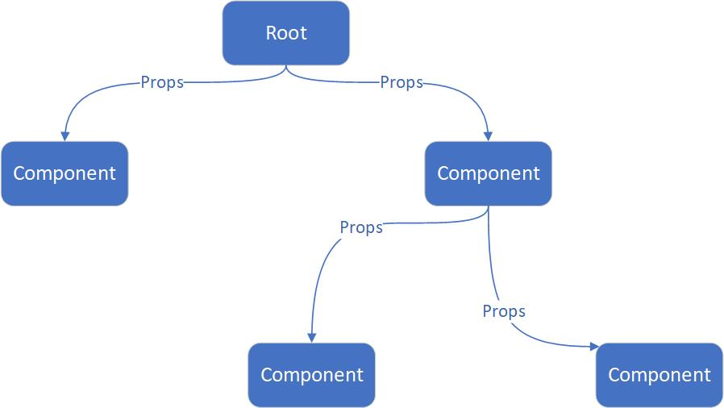

## useState

---

1. 前置内容

- `React` 采取自上而下单向数据流的方式，管理自身的数据与状态。在单向数据流中，数据只能由父组件触发，向下传递到子组件 



- 通过 `props` 的方式向子组件传递自己的 `state`，而子组件想要修改的话，还需要父组件给子组件传递一个 `callback`
- `state` 与 `props` 的改变，都会引发组件重新渲染，并且一旦父组件状态改变，会导致其下所有子组件都会触发重新渲染
- 需要注意的是，组件重新渲染，在类组件中，是执行 `render` 方法；而函数式组件中，是整个函数重新执行，这就意味着，当函数执行完毕，所有的内存都被释放掉，`变量对象` 也跟着被销毁了，因此，函数式组件想要拥有自己的内部状态，需要通过其他的方法

2. useState(initialState)

- _initialState_：作为创建 _state_ 的初始值，可以是任意类型，如原始类型、对象、Map 等。并且初始操作只有组件首次渲染才会执行
- 它可以 _让函数组件具有维持状态的能力_，也就是说，在函数组件的 **多次渲染之间**，这个 state 是共享的。_useState_ 的返回值是有着两个元素的数组，第一个数组元素用来读取 _state_ 的值，并且它是只读的，因此只能通过第二个数组元素来设置 _state_ 的值

```jsx
/** 
 * defaultShowCode: true
*/
// 老例子，按钮点击+1
import React, { useState } from 'react';

export default (props) => {
  const [count, updateCount] = useState(0);
  // 创建一个count的state，用于保存计数
  return (
    <>
      <p>{count}</p>
      <button onClick={() => updateCount(count + 1)}>+</button>
    </>
  );
};
```

- 通过解构得到的方法 `updateCount` 来修改状态。当调用 `updateCount` 方法时，`count` 这个 state 就会被更新，并触发组件的刷新

```js
// 状态是引用类型时，通过拷贝的方式进行替换状态
const [person, setName] = useState({ name: 'Bill', age: 18 });
setName({ ...person, age: 20 });
```

- 如果要创建多个 _state_，就需要多次调用 _useState_ 创建多个不同的状态

```js
const [name, setName] = useState('');

const [id, setId] = useState(0);
```

- 通过 _useState_ 可以让我们很方便地去创建一个状态，并提供一个可以设置这个状态的方法

3. 异步更新
- 状态是什么，在页面中，能直接影响 dom 的变量，才会称之为变量
- 需要知道，无论是类组件还是 hooks，state 的改变，都是异步的，这也就意味着，你无法拿到最新的状态值，最新的状态值，要在下一个事件循环周期执行时，状态才是最新的值

```jsx
import React, { useState } from 'react';

const count = { name: 'bob', age: '18' };

export default function App() {
  function handle() {
    count.age +=2;
    console.log(count);
  }

  console.log('如果组件重新渲染，那么我将打印');

  return (
    <div className="App">
      {count.age}
      <button
        onClick={() => {
          handle();
        }}
      >
        点击
      </button>
    </div>
  );
}
// {count.age} 与 console.log(count) 结果是什么
```

```jsx
import React, { useState } from 'react';

export default function App() {
  const [count, setCount] = useState({ name: 'bob', age: '18' });

  function handle() {
    setCount({ ...count, age: 20 });
    console.log(count);
  }

  console.log('如果组件重新渲染，那么我将打印');

  return (
    <div className="App">
      {count.age}
      <button
        onClick={() => {
          handle();
        }}
      >
        点击
      </button>
    </div>
  );
}
// {count.age} 与 console.log(count) 结果是什么
```

- 上面两个例子，状态的值改变以后，页面组件显示的 `count.name` 与控制台输出的值有什么不同呢

```jsx
import React, { useState } from 'react';

export default function App() {
  const [count, setCount] = useState({ name: 'bob', age: 18 });

  function handle() {
    count.age = 20;
    console.log(count);
  }

  console.log('如果组件重新渲染，那么我将打印');

  return (
    <div className="App">
      {count.age}
      <button
        onClick={() => {
          handle();
        }}
      >
        点击+
      </button>
      <button onClick={() => setCount({ ...count, age: count.age + 20 })}>点击+20</button>
    </div>
  );
}
// {count.age} 与 console.log(count) 结果是什么
```

- 对前面的第二个例子做些许的修改，状态的值改变以后，页面组件显示的 `count.age` 与控制台输出的值又有什么不同呢
- 可以发现，直接对 state 的值进行修改，虽然对应的 state 改变了，但并没有触发组件更新；而只有使用 `setCount` 的方式去更新 state，才会触发组件刷新
- 在使用 `setState` 时，`Hooks` 采用 `Object.is()` 来对比当前值和新值，结果为 `true` 则不渲染，结果为 `false` 时会触发 `re-render`。需要注意，`Object.is()` 采取的是浅比较，即基本数据类型值一样时，结果为 `true`；引用数据类型内存地址一样时并且值未更改时，结果为 `true`

4. 何时使用 useState

- _state_ 中永远不要保存可以通过计算得到的值。例如从 _props_ 传递过来的值、从 _Url_ 中读到的值、从 _cookie_、_localstorage_ 读取的值
- state 虽然便于维护状态，但一旦组件有自己的状态，意味着组件如果重新创建，就需要有恢复进程的过程，这会让组件变得更复杂

5. 多次调用导致多次渲染的问题

- 先来看看以下几种情况，第一个是在 _then_ 的回调函数中 setState

```jsx
import React, { useState, useEffect } from 'react';

export default () => {
  const [loading, setLoading] = useState(false);
  const [count, setCount] = useState(0);

  useEffect(() => {
    const doThing = Promise.resolve();
    doThing.then(() => {
      setLoading(true);
      setCount(count + 1);
    });
  }, []);

  console.log('then render');
  // 这里将会输出三次，意味着函数组件重新渲染三次，第一次是首次渲染，第二次是setLoading，第三次是setCount
  return (
    <>
      <button
        onClick={() => {
          setLoading(!loading);
          setCount(count + 1);
          // 这里只会触发一次render
        }}
      >
        {' '}
        触发
      </button>
    </>
  );
};
```

- 第二个是在 _setTimeout_ 的回调函数中 setState

```jsx
import React, { useState, useEffect } from 'react';

export default () => {
  const [loading, setLoading] = useState(false);
  const [count, setCount] = useState(0);

  useEffect(() => {
    const doThing = setTimeout(() => {
      setLoading(true);
      setCount(count + 1);
    }, 1000);
  }, []);

  console.log('settimeout render');
  // 这里将会输出三次，意味着函数组件重新渲染三次，第一次是首次渲染，第二次是setLoading，第三次是setCount
  return (
    <>
      <button
        onClick={() => {
          setLoading(!loading);
          setCount(count + 1);
          // 这里只会触发一次render
        }}
      >
        {' '}
        触发
      </button>
    </>
  );
};
```

- 第三个是在 _async_ 的 _await_ 之后 setState

```jsx
import React, { useState, useEffect } from 'react';

export default () => {
  const [loading, setLoading] = useState(false);
  const [count, setCount] = useState(0);

  useEffect(() => {
    const doThing = async () => {
      await Promise.resolve();
      setLoading(true);
      setCount(count + 1);
    };
    doThing();
  }, []);

  console.log('async render');
  // 这里将会输出三次，意味着函数组件重新渲染三次，第一次是首次渲染，第二次是setLoading，第三次是setCount
  return (
    <>
      <button
        onClick={() => {
          setLoading(!loading);
          setCount(count + 1);
          // 这里只会触发一次render
        }}
      >
        {' '}
        触发
      </button>
    </>
  );
};
```

- 同时我们添加按钮的同步触发事件去 setState，可以发现 **同步代码会合并多次更新为一次，组件只渲染一次**，而 **异步代码不会合并多次更新，组件因为多次状态变化而产生多次渲染的情况**，这种情况同时存在于类组件和函数组件中
- 那么，在类组件中我们可以将多次更新合并为一处 _this.setState({...this.state,loading:false,action:'add'})_。而在 hooks 中，我们可以通过使用以下几种方式来解决多次更新的问题

```jsx
// 将多个state合并为一个state
import React, { useState, useEffect } from 'react';

export default () => {
  const [state, setState] = useState({
    loading: false,
    count: 0,
    name: 'state',
    address: 'sz',
  });
  useEffect(() => {
    const doThing = async () => {
      await Promise.resolve();
      setState({
        ...state,
        loading: !state.loading,
        count: state.count + 1,
      });
    };
    doThing();
  }, []);
  console.log('batch render');
  // 只会产生两次更新，一次是首次渲染，另一次是setState
  return null;
};
```

```jsx
import React, { useState, useEffect } from 'react';

// 自定义hooks用于合并state
const useMergeState = (initialState) => {
  const [state, setState] = useState(initialState);
  const setMergeState = (newState) => {
    setState((prevState) => ({ ...prevState, ...newState }));
  };
  return [state, setMergeState];
};

export default () => {
  const [state, setState] = useMergeState({
    loading: false,
    count: 0,
    name: 'state',
    address: 'sz',
  });
  useEffect(() => {
    const doThing = async () => {
      await Promise.resolve();
      setState({
        loading: !state.loading,
        count: state.count + 1,
      });
    };
    doThing();
  }, []);
  console.log('batch2 render');
  // 只会产生两次更新，一次是首次渲染，另一次是setState
  return null;
};
```

- 还可以使用 _useReducer_ 来管理状态
