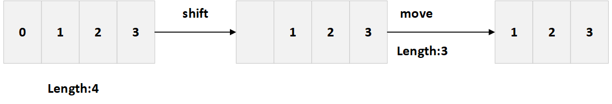

## 数组

---

1. 数组是什么

- 是一组按顺序排列的集合，集合中的值称为元素，这些元素的排列是有序的。因为数组的长度可随时改变，并且其数据在内存中也可以不连续，所以 js 数组不一定是密集型的
- 元素的类型可以为任意的数据类型，包括：number / string / boolean / undefined / null / object / function / array / . . .

```js
var obj = {
  a: 1,
};
var fn = function () {
  return 1;
};
var arr = [12, 'abc', true, 5.12, 1.2e5, null, fn, obj];
```

- 可以通过索引来访问数组的每一个元素，数组的长度可以通过 `length` 属性来访问，数组的索引的起始值为 0
- 数组元素可以看为数组对象的属性，但 js 中以数字开头的属性不能用点号引用，必须用方括号
```js
let arr = ['a','b','c','d'];
arr.0; // Uncaught SyntaxError: Unexpected number
arr[0]; // 'a'
```

2. 数组中多余的逗号

- 多余的逗号会产生 **空位**。**只有元素列表末尾添加的逗号会被忽略**。浏览器会显式地将缺失的元素视为 undefined，但空位并不是 undefined

```js
let arr = [, 1, , 2, 3, 4];
/**
 * [empty, 1, empty, 2, 3, 4, empty × 2]
 * 数组末尾添加的逗号被忽略了
 */

arr.length; // 6

for (let key in arr) {
  console.log(key, arr[key]);
}
// 1 1
// 3 2
// 4 3
// 5 4
```

| 方式 | 遇到空位 |
| --- | --- |
| forEach/filter/reduce/every/some/for..in | 跳过空位 |
| map | 跳过空位，但保留这个值 |
| join/toString | 将空位视为 undefined，但会将 undefined/null 处理为空字符串 |
| for...of | 转化为 undefined |
| Array.from/扩展运算符... | 将空位转化为 undefined |

3. 创建方式

- 字面量方式创建

```js
var arr = [1, 2, 3];
```

- 构造函数的方式创建

```js
var arr = new Array(1, 2, 3);
```

- 创建一个长度为7的数组，数组中的元素均为 undefined

```js
var arr = new Array(7);
```

```js
let arr = [1, 2, 3, 4];
delete arr[0];
// 删除数组元素
console.log(arr);
// [empty, 2, 3, 4]，数组的元素变为空位，访问返回 undefined
```

4. 数组的 length 属性
- 大部分语言不支持直接改变数组的大小，同时越界访问会报错，在 `JS` 中，越界访问不会报错，但会返回一个 `undefined`
- 给数组的 length 属性赋值会导致数组长度变化，同时数组的元素也因此会增多或减少。给数组的 length 属性赋一个大的值会导致数组长度变大，其中多出来的元素填充为空位；给数组的 length 属性赋一个小的值会导致数组长度变小，同时会从最后一个元素开始删除差值的元素
- 可以通过索引赋值达到改变原索引值的元素的值，赋值超出数组索引会使数组变大，其中空部分使用空位填充
- 直接对数组赋值会改变数组的存储的空间地址，也就是变量会指向一个新的数组的引用地址，而不是在之前的空间修改

5. 多维数组
- 一般我们常规的数组都是一维数组，当数组 A 中的某元素 B 是一个数组，而这个数组 B 中的元素又是一个数组 C 时，这个数组 A 就是一个多维数组
- 多维数组要想访问内维数组的值，可以通过依次访问下标的方式去获取

```js
var arr = [1, 2, 3, ['hello', 'world', ['jetmine']]];
arr[3][2][0]; // jetmine
```

---
## 数组的常用 API
---

1. indexOf
- 搜索指定元素出现的位置，参数为某元素。若找到该元素则返回该元素在数组中的索引值，未找到则返回 -1
- 可指定第二个参数。若该参数为正数，则从该参数表示的索引开始往后查找；若该参数为负，则从负值索引往后开始查找

```js
var arr = ['bob', 12345, 'jetmine', 'bill', 'bill'];

arr.indexOf('bill'); // 1
arr.indexOf('bill', arr.length); // -1
arr.indexOf('bill', -2); // 3
```

- indexOf 无法识别 NaN，会直接返回-1。这是因为它与 lastIndexOf 一样，采用的是 === 比较

```js
[NaN, 1, 2.2].indexOf(NaN); // -1
// 因为 NaN === NaN 为 false
```

2. push/pop

- push 可向数组末尾添加若干元素(1-任意个元素)
- pop 会从数组的末尾逐个开始删除元素，并返回被删除的元素的值。对空数组继续删除不会报错，会返回 undefined

3. shift/unshift

- shift 会从数组的头部逐个开始删除元素，同时整个队列往前移，并返回被删除的元素值，对 空数组 继续删除不会报错，会返回 `undefined`
- unshift 可向数组头部添加若干元素(1-任意个元素)
- shift/unshift 操作做了什么? 我们以 shift 为例：一、移除索引为 0 的元素，二、将所有的元素往左（unshift 是向右）移动，将索引 1 改为 0，2 改为 1，以此类推，对其重新编号，三、更新 `length` 属性 



- 因此，数组里的元素越多，移动它们就要花越多的时间，从而导致更多的内存操作

4. sort/reverse

- sort 会对数组的元素进行排序，使用默认排序(从小到大)。通过比对每个元素的 unicode 码来进行排序。可以接收一个函数作为参数，以用于比较两个任意值并返回

```js
/** 
 * 1. a > b,如果第一个值比第二个值大
 * 2. a < b,如果第一个值比第二个值小
 * 3. a == b,如果两个值相等
 * 4. 返回一个整数表示大于，返回一个负数表示小于
*/
function compare(a, b) {
  if (a > b) return 1;
  if (a == b) return 0; 
  if (a < b) return -1; 
  // return a -b 简写代码
}

let arr = [1, 2, 123, 25, 3, 4, 4, 123];
arr.sort(compare); //  [1, 2, 3, 4, 4, 25, 123, 123]
```

- `reverse` 会将数组的元素翻转过来

5. slice(sIndex,eIndex)
- 类似于字符串的 slice，表示截取部分元素。返回指定索引区间的元素，支持 **负值索引**。截取的区间从 sIndex 开始，不包含 eIndex

```js
var arr = ['bob', 12345, 'jetmine', 'bill', 'bill'];

arr.slice(1, -1); // [12345, "jetmine", "bill"]
arr.slice(-3, -1); // ["jetmine", "bill"]
arr.slice(1); // [12345, "jetmine", "bill", "bill"]
arr.slice(); // ["bob", 12345, "jetmine", "bill", "bill"]
arr.slice(2, 4); // ["jetmine", "bill"]
```

6. splice

- 该方法有多个参数，在某个位置删除若干个元素，在删除之后，还能选择给数组添加若干个元素

```js
let arr = [];
arr.splice(i, j, 'item', 'item1');
// 表示从索引i开始删除j个元素，并在i位置开始添加j后的元素

arr.splice(i, j);
// 表示从索引i开始删除j个元素

arr.splice(i, 0, 'item', 'item1');
// 不删除任何元素，但是会在i位置添加元素
```

- 该方法允许负值索引，与数组的负值索引访问方式一致

```js
let arr = [1, 2, 3, 4];
arr.splice(-1, 1); // [1,2,3]
arr.splice(-1, 0, 7, 8); // [1,2,7,8,3]
```

- ~当什么参数都不传时，该方法会将所有的数组元素删除，并返回被删除的元素数组~

7. join

- 将数组的每个元素用指定的字符串连接起来，并返回一个字符串。数组的元素中不是字符串的，会自动转换成字符串后再进行连接

```js
var arr = ['j', 1, function () {},{name:"tom"}];
arr.join('-'); // 'j-1-function () {}-[object Object]'
```

8. concat

- 将当前的元素/数组与另一个元素/数组连接成一个新的数组，它会根据传入顺序进行连接，`concat` 不会修改原始数组的内容，而是返回一个新的数组(*浅拷贝*)

```js
let arr = [1, 2, 3, 4, 5];
arr.concat([7, 8, 9], [[1, 2, 3]], 3, 4);
// [1, 2, 3, 4, 5, 7, 8, 9, [1, 2, 3], 3, 4]
```

- 一般只复制数组中的元素，而如果源对象是类数组对象时，会被作为一个整体进行添加 (默认不展开类数组对象)
- 如果对象具有 `Symbol.isConcatSpreadable` 属性，那么该对象会被当作一个数组来处理，`concat` 会根据该属性的值将数组拉平一层(默认情况下数组会被展开/拉平一层，可设置该属性来修改此默认行为)

```js
let arr = [1, 2, 3];

let obj = {
  0: 'Bob',
  1: 'James',
  [Symbol.isConcatSpreadable]: true,
  length: 2,
};

let obj1 = {
  0: 'Bob',
  1: 'James',
  length: 2,
};

let obj2 = {
  0: 'Bob',
  1: 'James',
  [Symbol.isConcatSpreadable]: false,
  length: 2,
};

let arr1 = arr.concat(obj); //  [1, 2, 3, "Bob", "James"]
let arr2 = arr.concat(obj1); // [1, 2, 3, {0:'Bob',1:'James',length:2}]
let arr3 = arr.concat(obj2); // [1, 2, 3, {0:'Bob',1:'James',length:2}] // 与类数组对象一致
```

9. Array.isArray

- 用于判断传入的参数是否为数组实例，是数组则返回 true，否则返回 false
```js
// Array.prototype 也是一个数组
Array.isArray(Array.prototype); // true
```
- 用于检测数组实例时，isArray 要优于 instanceof。因为 isArray 能检测 iframes
```js
var iframe = document.createElement('iframe');
document.body.appendChild(iframe);
xArray = window.frames[window.frames.length-1].Array;
var arr = new xArray(1,2,3); // [1,2,3]

Array.isArray(arr);  // true
arr instanceof Array; // false
```
10. lastIndexOf

- 与 indexOf 类似，但区别在于，indexOf 对元素的查找始终是从前往后的，而 lastIndexOf 对元素的查找是从后往前的
- 可传入第二个参数，表示从某索引值开始查找元素。若该参数为正，则表示从该索引开始往前查找元素；若该参数为负，则表示从该负值索引开始往前查找元素

```js
var arr = ['bill', 'bob', 12345, 'jetmine', 'bill', 'bill'];
arr.lastIndexOf('bill', -1); // 5
arr.lastIndexOf('bill', -2); // 4
arr.lastIndexOf('bill', 2); // 0
```

11. includes

- 类似于 indexOf,但区别在于，includes 返回的是布尔值，存在该元素即返回 true，否则返回 false。也可以接收第二个参数，若该参数为正值，则从该索引值往后查找；若该参数为负，则从该负值索引往后开始查找

```js
var arr = ['bill', 'bob', '12345', 'jetmine'];
arr.includes('bob', 2); // false
arr.includes('bill', -arr.length); // true
arr.includes('bill', -2); // false
['bill', 'bob', '12345', 'jetmine'].includes('bill', -6); // true ，第二个参数被重置为0
```

- 此外，与 indexOf 不同的是，它可以识别出 NaN

```js
['bill', 'bob', '12345', 'jetmine', NaN].includes(NaN); // true
```

12. Array.of

- 创建数组的另一种方式，类似于字面量方式创建。用于弥补构造函数 Array 的不足，当参数个数不同时，导致 Array 的行为会有差异
- 只有参数个数不少于两个时，Array 才会返回由参数组成的新数组。只有一个参数时，实际创建的是一个参数个空位的数组，根据这个参数指定这个数组的长度

```js
new Array() // []
new Array(3) // [empty*3]
new Array(3)[0] // undefined
new Array(3,4) // [3,4]
```

```js
var arr1 = Array.of(7, 8, 'jetmine');
// [7, 8, "jetmine"] length: 3

var arr2 = Array.of(7);
// [7] length: 1

var arr3 = Array.of([7, 8, 'jetmine']);
// 0: (3) [7, 8, "jetmine"] length: 1
```

13. findIndex(callback(item,index.arg),thisArg)

- 用于查找符合条件的元素，如果回调不返回真值或数组的 `length` 为 0，则返回 -1，否则会返回该元素的索引值
- 可接收第二个参数，用于绑定回调函数的 this

```js
var arr = ['bill', 'bob', 12345, 'jetmine', 'bill', 'bill'];
arr.findIndex(function (item, index, arr) {
  return item.length > 5; // 通过 return 来终止方法往下执行，因此找到第一个就会返回
});

arr.findIndex(function (item, index, arr) {
  if (item.length >= 5) {
    console.log(item); // 12345  jetmine
    // 会返回所有满足条件的元素
  }
});
```

```js
var arr = ['bill', 'bob', '12345', 'jetmine', 'bill', 'bill'];

var obj = {
  name: 'bill',
};

arr.findIndex(function (item, index) {
  return this.name === item;
}, obj);
// 0
```

- findIndex 可借助 `Object.is` 来识别出 `NaN`，正常情况下识别不了 NaN

```js
[NaN, 1, 2, NaN].findIndex(item => NaN); // -1
[NaN, 1, 2, NaN].findIndex((item) => Object.is(NaN, item)); // 0
```

14. Array.from

- 可以将一个含有 length 属性的对象、集合、伪数组(**伪数组和可迭代对象**) 转化为真正的数组
- 伪数组又叫类数组，它具有 length 属性，但无法使用数组的方法，如函数内部的 argments、获取多个的 dom 节点等

```js
function fnc() {
  var arr = arguments.reverse();
  console.log(arr);
}
fnc(1, 2, [3, 4]); // Uncaught TypeError: arguments.reverse is not a function
```

- 将一个普通对象转化为数组，需要注意的是，再将对象转化为数组时，若该对象的 key 超出自身的 length - 1 或不是一个整数，那么被转化为数组之后，该 key 对应的属性值会变成 undefined，且 length 需要能被转换为 Number
- 还可应用于将字符串转化为数组，然后返回字符串的长度，它可以正确处理各种 Unicode 字符，可以避免一个 bug，js 将大于 `\uFFFF` 的 Unicode 字符算作两个字符

```js
// 3 > length-1
var obj = {
  0: 3,
  1: 4,
  3: 7,
  length: 3,
};
Array.from(obj);
// 0: 3
// 1: 4
// 2: undefined
// length: 3
```

```js
var obj = { 1: 'bob', 2: 'jj', length: '5' };
Array.from(obj);
// 0: undefined
// 1: "bob"
// 2: "jj"
// 3: undefined
// 4: undefined
// length: 5
```

- `Array.from` 可以接第二个参数，可以传入一个回调函数，`Array.from(arr,callBack)`，作用类似于数组的 map 方法，用来对每个元素进行处理，将处理后的值放入返回的数组

```js
// 操作节点的每一项
li = document.querySelectorAll('li'); //伪数组
Array.from(li, function (item, index) {
  console.log(item, index);
});
```

- `Array.from` 可以接第三个参数，用来绑定 this
- 使用 `Array.from` 创建一个序列生成器
```js
const range = (start,stop,step) 
=> 
Array.from({length:(stop - start) / step + 1},(_,i) => start + (i * step));

range(0,4,1); // [0,1,2,3,4]
range(1,10,2); // [1,3,5,7,9]
range('A'.charCodeAt(0), 'Z'.charCodeAt(0), 1).map(x => String.fromCharCode(x));
// ["A", "B", "C", "D", "E", "F", "G", "H", "I", "J", "K", "L", "M", "N", "O", "P", "Q", "R", "S", "T", "U", "V", "W", "X", "Y", "Z"]
```
- 使用 `Array.from` 进行数组去重合并

```js
function combine(){
  let arr = [].concat.apply([], arguments);
  //没有去重的新数组
  return Array.from(new Set(arr));
}

var m = [1, 2, 2], n = [2,3,3];
combine(m,n);
// [1, 2, 3]
```

15. find(callback(item,index.arg),thisArg)

- 用于查找符合条件的第一个元素，如果找到，立马返回这个元素，函数体不再往下查找；否则返回 undefined。只会返回第一个符合条件的元素
- 可接收第二个参数，用于绑定回调函数的 this

```js
var arr = [1, 2, 3, 4, 5, 6];
arr.find(function (item, index, arr) {
  // 3
  return item > 2;
});
```

16. filter(callback(item,index.arg),thisArg)

- 与 find 类似，可以查找符合条件的所有元素。不过，find 只会返回第一个符合条件的元素，而 `filter` 会筛选出所有符合条件的元素并返回一个新的数组

```js
var arr = [1, 2, 3, 4, 5, 6];
arr.filter(function (item, index, arr) {
  return item > 2; // [3, 4, 5, 6]
});
```
- thisArg 作为第二个参数可以指定 callback 调用时的 this 指向

17. forEach

- forEach 会按数组的索引值升序对数组的每一项执行一次给定的函数，它不会直接改变调用它的原数组，但数组可能会因 callback 而改变。它总是返回 undefined，如某元素已被删除、未初始化、调用 callback 后被添加进数组，则跳过该项

```js
var arr = [1, 2, 3, 4, 5, 6];
arr.forEach(function (item, index, arr) {
  console.log(item, index, arr);
});
// 1 0 [1, 2, 3, 4, 5, 6]
// 2 1 [1, 2, 3, 4, 5, 6]
// 3 2 [1, 2, 3, 4, 5, 6]
// 4 3 [1, 2, 3, 4, 5, 6]
// 5 4 [1, 2, 3, 4, 5, 6]
// 6 5 [1, 2, 3, 4, 5, 6]
```

- _forEach_ 方法中不允许使用 break、continue 关键字，在其中使用 _return_ 关键字会跳过之后的逻辑，直接开始下一轮循环，效果类似于 _for_ 中的 continue

```js
'jetmine'.split('').forEach((ch) => {
  if (ch === 'e') {
    console.log('continue');
    return false;
  }
  console.log(ch);
});

// j
// continue
// t
// m
// i
// n
// continue
```

- 也就是说，除了抛出异常以外，没有办法中止或跳出 forEach。如果需要提前终止循环，可以使用其他方式

18. map

- 与 forEach 类似，区别在于，forEach 对数组的每一个元素执行一次给定的函数，总是返回 undefined；而 map 会返回一个新数组，新数组的结果为对被操作的数组执行的函数的返回值

```js
var arr = [1, 2, 3];
var arr_1 = arr.map(function (item, index, arr) {
  return item + 1;
});
consolelog(arr_1); // 结果
// 0: 2
// 1: 3
// 2: 4
var arr_2 = arr.forEach(function (item, index, arr) {
  return item + 1;
});
console.log(arr_2); // // undefined
console.log(arr); // [1, 2, 3]
```

19. some

- 使用方式与 map 类似，区别在于 map 是使用给定的函数操作数组的每一项并返回。而 `some` 需要该函数对任意一个元素的返回值为 true ，那么结果会返回 true 并且函数不再往下执行 ，否则返回 false

```js
var arr = [1, 2, 3, -1, 0.5, -0.8];
var arr_1 = arr.some(function (item, index, arr) {
  return item < 0; // 只要返回了true，程序不再往后走
});
console.log(arr_1); // true
```

20. every(callback(item,index,args),thisArg)

- 该方法会对调用它的数组中的所有元素执行某个指定的函数(callback)，并返回一个布尔值。只有所有的元素都使这个指定的函数都返回 true，every 才返回 true；只要有一个元素使 callback 返回 false，every 会立马返回 false
- 可传入第二个参数用于指定调用 callback 时，callback 的 this 指向

```js
var arr = [1, 2, 3, -1, 0.5, -0.8];
var arr_1 = arr.every(function (item, index, arr) {
  return item > 0; // 遍历每一个元素，只要返回了false，程序就结束
});
var arr_2 = arr.every(function (item, index, arr) {
  return item < 6;
  // 都满足条件，才返回true
});
console.log(arr_1, arr_2); // false true

[].every(item => true); // 空数组在任何条件下都能使every返回true
```

21. reduce

- reduce 会为数组的每一项执行给定的函数，除被删除或未初始化的的之外。该方法有两个参数，第一个参数为给定的函数，给定的回调函数接收四个参数；第二个参数为设定的初始值

| 参数位置 |   参数表示    |                     参数含义                     |
| --- | --- | --- |
|    1     | previousValue | 上一次调用返回的值，或是提供的初始值/initiaValue |
|    2     | currentValue  |              数组中当前被处理的元素              |
|    3     |     index     |              当前被处理的元素的索引              |
|    4     |     array     |                调用 reduce 的数组                |

- 实例分析一(未设置初始值的情况)

```js
var arr = [1, 2, 3, 4];
var sum = arr.reduce(function (prev, next, index, arr) {
  console.log(prev, next, index);
  return prev + next;
});
console.log(sum); // 10
```

| 循环次数 | prev | next | index |
| :------: | :--: | :--: | :---: |
|    1     |  1   |  2   |   1   |
|    2     |  3   |  3   |   2   |
|    3     |  6   |  4   |   3   |

- 能够看出，在不提供初始值的情况下，第一轮遍历中 `prev` 的值是数组的第一项，`next` 作为当前正在被处理的元素是从数组的第二项开始，`index` 的第一个值也就等于 `1`
- 实例分析二(设置了初始值的情况)

```js
var arr = [1, 2, 3, 4];
var sum = arr.reduce(function (prev, next, index, arr) {
  console.log(prev, next, index);
  return prev + next;
}, arr[0]); // 将数组的第一项设为初始值
console.log(sum); // 11
```

| 循环次数 | prev | next | index |
| :------: | :--: | :--: | :---: |
|    1     |  1   |  1   |   0   |
|    2     |  2   |  2   |   1   |
|    3     |  4   |  3   |   2   |
|    4     |  7   |  4   |   3   |

- 在设置初始值之后(数组的第一项被设为了初始值，实际上你可以设一个任意的值)，此时 `prev` 的值变为了我们设置的初始值，也就是 `initiaValue` 的值，`index` 的值就会从数组的第一项的索引开始
- 注意，当数组是一个空数组且未设置初始值的情况下，`reduce` 方法会报错，因此在数组为空的情况下，可以设置一个初始值

```js
var arr = [];
var sum = arr.reduce(function (prev, next, index, arr) {
  console.log(prev, next, index);
  return prev + next;
});
// Uncaught TypeError: Reduce of empty array with no initial value
// 数组为空且未设置初始值
```

```js
var arr = [];
var sum = arr.reduce(function (prev, next, index, arr) {
  console.log(prev, next, index);
  return prev + next;
}, 0);
console.log(sum); // 0
// 设置初始值就不会报错了
```
- reduce 不只是简单的能对数字类型的数组进行操作。比如以下情况
```js
const obj = {
  'a.b.c': 1,
  'a.d': 2,
  'e' : 3
}

const transformFlat = (object) => res;
/** 实现这样一个方法，使得  obj 被转化成以下形式 */
transformFlat(obj) === {
  a: {
    b: {
      c: 1    
    },
    d: 2,
  },
  e: 3
}
```

```js
const transformFlat = (props) => {
  return Object.keys(props).reduce((res,key) => {
    key.split('.').reduce((obj,k,i,arr) => obj[k] = i ===arr.length - 1 ? props[key] : (obj[k] || {}),res)
    return res
  },{})
}
```

22. fill(value,[, start[, end]]) <Badge text="ES6" type="tip"/>

- 使用给定值填充一个数组，可用于空数组的初始化，数组已存在的元素会全部被替换为给定的值(默认情况下将填充数组内的所有元素)

```js
[1, 2, 3, 4].fill(7); // [7,7,7,7]
Array(4).fill(7); // [7,7,7,7]
```

- 可接收第二个和第三个参数(默认值分别为0和数组的length)，用于指定填充的起始位置和结束位置

```js
Array(4).fill(7, 1, 3)； // [empty, 7, 7, empty]
[1, 2, 3, 4].fill(7, 0, 1); // [7, 2, 3, 4]；
```

- 当填充的元素是一个对象时，所有被填充进去的元素都会是同一个对象(同一个引用)，也就是全指向同一个引用地址

```js
var arr = [1, 2, 3, 4];
arr.fill({ name: 'jetmine' }, 1, 3);
// 0: 1,1: {name:"jetmine"},2: {name: "jetmine"},3: 4
arr[2].name = 'James';
// 0: 1,1: {name:"James"},2: {name: "James"},3: 4
```

23. [Array.prototype]keys/values/entries <Badge text="ES6" type="tip"/>

- 该方法会返回一个 `Array iterator` 迭代器对象，含有一个 `next` 方法，可用于 `for...of` 迭代处理

```js
let arr = [1, 2, 3, 5];

arr.keys();
// Array Iterator {}

arr.values();
// Array Iterator {}

arr.entries();
// Array Iterator {}

for (let [key, value] of arr.entries()) {
  console.log(key, value);
}
// 0 1
// 1 2
// 2 3
// 3 5
```
- 使用 `Array.entries` 对可以对二维数组进行排序
```js
function sortArr(arr) {
  let values = arr.values();

  while(true){
    let item = values.next();
    if(item.done) break;

    item.value.sort((a,b) => a - b)
  }

  return arr
}

var arr = [[1,34],[456,2,3,44,234],[4567,1,4,5,6],[34,78,23,1]];
sortArr(arr);

/**
 * (4) [Array(2), Array(5), Array(5), Array(4)]
    0:(2) [1, 34]
    1:(5) [2, 3, 44, 234, 456]
    2:(5) [1, 4, 5, 6, 4567]
    3:(4) [1, 23, 34, 78]
    length:4
    __proto__:Array(0)
*/
```

24. flat()/flatMap() <Badge text="ES6" type="tip"/>

- `flat` 可用于扁平化数组，也就是将多维数组拉平，返回一个一维的新数组，会跳过(移除)空位

```js
[1, 2, 3, [4, 5]].flat();
// [1, 2, 3, 4, 5]

[1,2,,,3].flat()
// [1,2,3]
```

- 可接收参数，默认值为 1，即只提取一层嵌套结构，可传入 Infinity 用于转化多层嵌套

```js
[1, 2, 3, [4, 5, [6, 7, 8, [9, 10]]]].flat()
// 相当于传入参数1 (6) [1, 2, 3, 4, 5, Array(4)]

[(1, 2, 3, [4, 5, [6, 7, 8, [9, 10]]])].flat(2)
// [1, 2, 3, 4, 5, 6, 7, 8, Array(2)]
[(1, 2, 3, [4, 5, [6, 7, 8, [9, 10]]])].flat(Infinity);
// (10) [1, 2, 3, 4, 5, 6, 7, 8, 9, 10]
```

- `flatMap` 表示先对数组的每个元素执行一次回调，在对返回值执行一次 `flat`，返回一个新数组，但只能展开一层数组，第一个参数接受一个回调函数，第二个参数可用于绑定 this

```js
[1, 2, 3, [4, 5]].flatMap((item) => [[item]]);
// 0: [1]
// 1: [2]
// 2: [3]
// 3: [Array(2)]

['mary,tom,james','tony,jerry'].map(item => item.spilt(','));
// 0:['mary', 'tom', 'james']
// 1:['tony', 'jerry']

['mary,tom,james','tony,jerry'].flatMap(item => item.split(','));
// ['mary', 'tom', 'james', 'tony', 'jerry']
```

24. Array.prototype.toString

- 数组的原型对象上有自己的 `toString` 方法，它重写了 `Object.prototype.toString`，返回以逗号隔开的元素列表

```js
var arr = [1, 2, 3, [4, 5, 6, [7, 8, 9]]];
Object.prototype.toString.call(arr); // "[object Array]"
Array.prototype.toString.call(arr); // "1,2,3,4,5,6,7,8,9"
// 可用于扁平化数组
```

25. Array.prototype.copyWithin(target, start, end) <Badge text="ES6" type="tip"/>

- 将数组 start (**缺省为0,为负数时从数组末尾开始计算,即length+start**)位置到 end (**缺省为 array.length,为负数时从数组末尾开始计算*)位置(*不包括end位置**)的元素复制到 target (**为负数时从数组末尾开始计算**) 位置，会替换原位置的元素

```js
[1, 2, 3, 4, 5].copyWithin(0, 2, 4); //  [3, 4, 3, 4, 5]

[1, 2, 3, 4, 5].copyWithin(0, 1); // [2, 3, 4, 5, 5]

[1, 2, 3, 4, 5].copyWithin(-1); // [1, 2, 3, 4, 1]

[1, 2, 3, 4, 5, 6, 7, 8].copyWithin(-4); // [1, 2, 3, 4, 1, 2, 3, 4]

[1, 2, 3, 4, 5, 6, 7, 8].copyWithin(-2, -3, -1); // [1, 2, 3, 4, 5, 6, 6, 7]

[].copyWithin.call({length: 5, 3: 1}, 0, 3); // {0: 1, 3: 1, length: 5}

var i32a = new Int32Array([1, 2, 3, 4, 5]);

i32a.copyWithin(0, 2);
// Int32Array [3, 4, 5, 4, 5]
```
- 此方法不要求 this 一定是一个数组对象，它会对原数组进行修改并返回 this。并且当 target >= array.length时，复制将不会发生；或者 target 在 start 之后，复制的序列将被修改以符合 array.length
```js
// 1. target >= start
[1, 2, 3, 4, 5].copyWithin(5, 2, 4); // [1, 2, 3, 4, 5]
```

26. Array.at(index)

- 与通过索引访问数组的效果一致(也支持负整数，表示从数组末尾开始取值)

```js
let arr = [1,3,5,7,9];
arr[1]; // 3
arr.at(1); // 3
arr[-1]; // 9
arr.at(-1); // 9
```

---

## 一些数组相关的题

---

1. 最大子数组

- 某个数组中是一些以数字组成的数组，要求找出所有项的和最大的连续子数组，当所有项目为负数（不会有最大的子数组）时，返回 0

```js
// 使用 Math.max
// 复杂度：O(n^2)
function getMaxNum(arr) {
  let maxSum = 0;
  for (let i = 0; i < arr.length; i++) {
    let everyMaxSum = 0;
    for (let j = i; j < arr.length; j++) {
      everyMaxSum += arr[j];
      maxSum = Math.max(maxSum, everyMaxSum);
    }
  }
  return maxSum;
}
```

```js
// 复杂度：O(n)
const maxSubArray = (nums) => {
  let historyMaxSum = nums[0],sum = 0,historyMaxArr = [],sumArr = [];
  for(let i = 0;i<nums.length;i++) {
    sum = sum < (sum + nums[i]) ? (sum + nums[i]) : 0;
    if(sum < (sum + nums[i])) {
      sumArr.push(nums[i]);
    } else {
      sumArr = []
    };
    if(sum > historyMaxSum) {
      historyMaxSum = sum;
      historyMaxArr= sumArr;
    }
  }

  return historyMaxArr
}

const getMaxNum = (nums) => {
  let historyMaxSum = nums[0],sum = 0;

  for(let i = 0;i<nums.length;i++) {
    sum = sum < (sum + nums[i]) ? (sum + nums[i]) :  0;
    historyMaxSum = Math.max(historyMaxSum,sum);
  }

  return historyMaxSum
}
```
