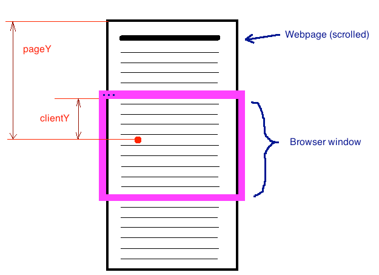

## Event 事件
---
1. 什么是事件
- 事件的三大组成部分：事件源、事件类型、事件处理函数

|      -       | 描述                           |
| :----------: | :----------------------------- |
|    事件源    | 触发事件的是谁                 |
|   事件类型   | 触发的是什么事件               |
| 事件处理函数 | 触发以后需要执行的事件处理函数 |

```js
var oDiv = document.querySelector('p'); // 事件源
oDiv.onclick = function () {
  // 事件类型+事件处理函数
  // 事件触发执行的代码块
};
```

2. 事件对象
- 也就是触发该事件后你的鼠标或者键盘的位置，e 的位置基于在浏览器窗口中的位置来确定，也就是当前位置(坐标)距离浏览器左边与上边的高度

```js
// 兼容写法
const e = e || window.event;
```

```html
<style type="text/css">
  p {
    width: 500px;
    height: 500px;
    background-color: peru;
  }
</style>
<body>
  <p></p>
  <script type="text/javascript">
    var oDiv = document.querySelector('p'); // 事件源
    oDiv.onclick = function (e) {
      // 事件类型+事件处理函数
      e = e || window.event; // 兼容高版本浏览器和ie
      console.log(e); // 位置
      console.log(e.x); // x轴坐标
      console.log(e.y); // y轴坐标
    };
  </script>
</body>
```

3. 获取点击事件的光标坐标点
- 光标坐标点不是一成不变的，一般是相对于光标所在的坐标系来说，相对于 **事件源** / **页面** / **浏览器窗口**。基于不同的参考对象，获取的坐标点也不一样，事件对象里面的属性也不一样

4. 获取元素偏移量
- 偏移量：元素相对于页面的位置，也就是元素在页面的哪一个位置
- offsetParent: 它是一个只读属性，返回一个指向最近的（指包含层级上的最近）包含该元素的定位元素或者最近的 table, td, th, body 元素
- offsetLeft/offsetTop：获取的是当前元素基于元素的 offsetParent 左右边界的偏移量，获取的内容是只读的。取值范围是距离最近的一个有定位(position:static 以外的定位值)的父级的边缘的距离(不包含 border，只包含 padding)

```html
<!-- 某父级元素有定位的情况 -->
<style type="text/css">
  * {
    margin: 0;
    padding: 0;
  }
  #bigBox {
    width: 800px;
    height: 800px;
    margin: 10px;
    overflow: hidden;
    background-color: yellow;
  }
  #box {
    position: absolute;
    width: 500px;
    height: 500px;
    margin: 50px 50px;
    padding: 10px;
    overflow: hidden;
    background-color: pink;
    border: 5px solid red;
  }
  #smallbox {
    width: 200px;
    height: 200px;
    margin-top: 50px;
    margin-left: 50px;
    padding: 25px;
    background-color: green;
    border: 15px solid blue;
  }
</style>
<body>
  <div id="bigBox">
    <div id="box">
      <div id="smallbox"></div>
    </div>
  </div>
</body>
<script type="text/javascript">
  var oBox = document.getElementById('box');
  var sBox = document.getElementById('smallbox');
  console.log('sBox.offsetLeft:', sBox.offsetLeft); // 60
  console.log('sBox.offsetTop:', sBox.offsetTop); // 60
  console.log('sBox.offsetWidth:', sBox.offsetWidth); // 280
  console.log('sBox.offsetHeight:', sBox.offsetHeight); // 280
  console.log('sBox.clientLeft', sBox.clientLeft); // 15
  console.log('sBox.clientTop', sBox.clientTop); // 15
  console.log('sBox.clientHeight', sBox.clientHeight); // 250
  console.log('sBox.clientWidth', sBox.clientWidth); // 250
</script>
```

- offsetWidth/offsetHeight：只读，返回一个元素的布局宽度(width、padding、border的和)，也就是整个元素的实际宽高，不包含 margin
- clientLeft/clientTop：获取该元素对象的左边框/上边框的值，等同于设置的 border-left/border-top
- clientWidth/clientHeight：该元素对象的 **左内边框/上内边框** 至 **右内边框/下内边框** 的距离，获取的元素 content-width/height + padding-left/top + padding-right/bottom 的和，也就是整个元素的实际宽度/高度（不包括 margin 和 border）
- scrollTop/scrollLeft：浏览器向上或向左滚走的距离，也就是浏览器窗口滚走的距离，该值是可读写的

| 盒模型 | 有无 doctype 声明 | 获取方式 | 原因 |
| --- | --- | --- | --- |
| 怪异模式 | 无 | document.body.scrollTop | document.documentElement.scrollTop 为 0 |
| 标准模式 | 有 | document.documentElement.scrollTop | document.body.scrollTop 为 0 |

```js
// 兼容写法
document.onscroll = function () {
  var top = document.body.scrollTop || document.documentElement.scrollTop;
  console.log(top);
};
```

5. 光标偏移量(基于不同参考对象)
- offsetX/offsetY：光标相对于点击的该元素而言，相对于点击的元素的边框内侧(不算 border)开始计算，距离当前最近元素的内部的左边/顶部偏移量

```html
<style type="text/css">
  * {
    margin: 0;
    padding: 0;
  }
  #box {
    width: 300px;
    height: 150px;
    margin: 50px auto;
    padding: 20px;
    background: pink;
    border: 10px solid #00ffff;
  }
</style>
<body>
  <div id="box"></div>
  <script type="text/javascript">
    var oBox = document.querySelector('#box');
    oBox.onclick = function (e) {
      e = e || window.event;
      console.log(e.offsetX);
      console.log(e.offsetY);
    };
  </script>
</body>
```

- 可以看到点击在元素的 content 区域(包含padding) 时，页面的偏移量是基于当前元素而言的。也就是说基于元素的左侧 content(包括padding)与上边 content(包括padding)区域来确定。点击左上角的 content 区域，相对偏移量为(0,0)，点击 border 区域，偏移量也是基于 content 往外，数值是负值，所以是坐标点根据自身元素来做参考的

- clientX/clientY：点击的坐标点相对于浏览器窗口，相对于浏览器窗口来计算(无论页面滚动到什么情况)

```html
<style type="text/css">
  * {
    margin: 0;
    padding: 0;
  }
  #box {
    width: 300px;
    height: 150px;
    padding: 20px;
    background: pink;
    border: 10px solid #00ffff;
  }
</style>
<body>
  <div id="box"></div>
  <script type="text/javascript">
    var oBox = document.querySelector('#box');
    oBox.onclick = function (e) {
      e = e || window.event;
      console.log(e.clientX);
      console.log(e.clientY);
    };
  </script>
</body>
```

- 在点击元素的左侧区域时(包括 border)，偏移量为(0,0)，因此是元素的点击点根据 **浏览器窗口(可视页面距离页面的宽高)** 做参考的
- pageX/pageY：相对于整个页面的坐标点(注意与相对于浏览器窗口的坐标点区分开)，无论页面是否滚动。pageX/pageY 是当前坐标点距离浏览器窗口(左边与上边)的高度加上面向左/向上滚走的距离

```js
e.pageX/Y ≈ e.clientX/Y + document.documentElement/body.scrollTop
```



- screenX/screenY：鼠标位置基于电脑屏幕（屏幕左侧或上侧）的坐标点

6. 事件的执行问题
- 设定这样这样一个情景：在一个盒子 boxes 中，套着另一个盒子 box，两个盒子各自注册了点击事件，当我们点击 boxes 时，box 上的点击事件会被触发吗?

7. 事件的传播
- 在上述例子中，点击在小盒子上，也是点击在了大盒子上，也就是两个盒子的点击事件都会触发
- 当某元素触发一个事件时，其父元素也会**触发相同的事件**，父元素的父元素也会**触发相同的事件**
- 事件传播的路径：某元素-->父元素-->父元素-->body-->html-->document-->window，但触发该条件的前提是各层级元素得 **注册相同的事件**，不然不会触发
- 事件的传播只会传播 **同类型事件**，也就是各层级需注册 **相同的事件**，根据 html 的结构，由触发的元素开始由下往上触发
- 内部元素不论是否有该事件，只要上层元素存在该事件，那么上层元素的事件都会被触发

8. 传播类型
- **冒泡**：缺省触发。就是从事件目标的事件处理函数开始，依次向外，直到 window 的事件处理函数触发，是为自下往上的执行事件处理函数
- **捕获**：只有使用 **事件监听(addEventListener)** 的情况下才能触发。从 window 的事件处理函数开始，依次向内，直到事件目标的事件处理函数执行，是为自上往下的执行事件处理函数
- 冒泡与捕获的区别：在事件的传播中，多个同类型的事件处理函数的执行顺序不同；且若冒泡捕获同时存在，则先执行捕获再执行冒泡

```html
<body>
  <input type="button" name="" id="but" value="点击显示" />
  <ul style="display: none;">
    <li>1</li>
    <li>2</li>
    <li>3</li>
  </ul>
  <script type="text/javascript">
    var oBut = document.getElementById('but');
    var oUl = document.getElementsByTagName('ul')[0];
    oBut.onclick = function (e) {
      oUl.style.display = 'block';
    };
    document.onclick = function () {
      setTimeout(function () {
        oUl.style.display = 'none';
      }, 1000);
    };
  </script>
</body>
```

9. 事件委托
- 本质上来说，就是将自己要做的事委托给其他人来做。根据 **事件冒泡机制**，点击子元素的时候，也会同步触发父元素的相同事件，那么就可以把子元素的事件委托给父元素来做
- 点击子元素的时候，不管子元素是否有点击事件，只要父元素存在点击事件，那么就可以触发父元素的点击事件

```html
<body>
  <ul>
    <li>1</li>
    <li>2</li>
    <li>3</li>
  </ul>
  <script>
    var oUl = docuemnt.querySelector('ul');
    oUl.addEventListener('click', function (e) {
      console.log('我是 ul 的点击事件，我被触发了'); // 点击ul会触发，点击li也会触发
    });
  </script>
</body>
```

- 当点击 li 的时候，也会触发 ul 的点击事件。在事件内，也可以拿到点击的元素，这时候可以把 li 的事件委托给 ul 来做

```html
<body>
  <ul>
    <li>1</li>
    <li>2</li>
    <li>3</li>
  </ul>
  <script>
    var oUl = docuemnt.querySelector('ul');

    oUl.addEventListener('click', function (e) {
      e = e || window.event;
      var target = e.target || e.srcElement;
      // 判断你点击的是 li
      if (target.nodeName.toUpperCase() === 'LI') {
        // 确定点击的是 li
        // 因为当你点击在 ul 上面的时候，nodeName 应该是 'UL'
        // 去做点击 li 的时候该做的事情了
        console.log('我是 li，我被点击了');
      }
    });
  </script>
</body>
```

10. 事件委托的作用
- 作用一：我页面上本身没有 li，我通过代码添加了一些 li，添加进来的 li 是没有点击事件的。我每次动态的操作完 li 以后都要重新给 li 绑定一次点击事件，比较麻烦，这个时候只要委托给 ul 就可以了，因为新加进来的 li 也是 ul 的子元素，点击的时候也可以触发 ul 的点击事件
- 作用二：每添加一个事件处理函数，都会占据一定的内存空间，我们可以只添加一个事件处理程序去代理所有事件，所占用的内存空间更少
- 元素的事件只能委托给 **结构父级** 或者在结构父级的同类型的事件上。比如 li 的点击事件，就不能委托给 ul 的鼠标移入事件，li 的点击事件，只能委托给 ul 或者更高父级的点击事件上

11. target
- 属于 **事件对象** 里面的属性，表示点击的目标。当触发点击事件时，点在哪个元素上，target 就是哪个元素

```js
// 兼容 ie
let target = e.target || e.srcElement;
```

```html
<body>
  <ul>
    <li>1</li>
    <li>2</li>
    <li>3</li>
  </ul>
  <script>
    var oUl = docuemnt.querySelector('ul');
    oUl.addEventListener('click', function (e) {
      // 点击ul，target就是ul，点击li，target就是li
      e = e || window.event;
      var target = e.target || e.srcElement;
      console.log(target);
    });
  </script>
</body>
```

12. 默认行为
- 就是指不用我们注册，它自己就存在的事情。比如我们点击鼠标右键的时候，会自动弹出一个菜单；比如我们点击 a 标签的时候，我们不需要注册点击事件，他自己就会跳转页面。这些不需要我们注册就能实现的事件，叫做 **默认事件**
- **阻止默认行为**： 有的时候，我们不希望浏览器执行默认事件，比如我给 a 标签绑定了一个点击事件，我点击的时候希望能告诉我跳转的地址是什么，而不是直接跳转链接。那么我们就要把 a 标签原先的默认事件给阻止，不让他执行默认事件

```js
// 兼容 ie
e.preventDefault ? e.preventDefault() : e.returnValue = false;
```

```html
<body>
  <a href="http://www.baidu.com">百度</a>
  <script>
    var oA = document.querySelector('a');
    oA.addEventListener('click', function (e) {
      e = e || window.event; // 兼容ie的事件对象
      console.log(this.href); // 输出事件源oA的href属性
      e.preventDefault ? e.preventDefault() : (e.preventDefault = false); // 阻止默认行为,如from的默认提交、a的默认跳转等
      //此时点击a按钮，不会跳转到指定的地址，而是在控制台输出a的属性href的属性值
    });
    // oA.onclick = function(e){
    // e.preventDefault ? e.preventDefault():e.preventDefault=false; || // return false;
    //阻止默认行为后，不需要往后执行了，就使用return false
    //阻止默认行为后，还有其他的代码需要执行，就使用 e.preventDefault ? e.preventDefault():e.preventDefault=false;
    // console.log('未跳转')
    // }
  </script>
</body>
```

- checkbox 或 radio 的 click 事件的默认行为是改变选中的状态（mouseout/mouseleave 没有这个特点）

```html
<body>
	<input type="checkbox" id="check" />
  <script>
    document.getElementById('check').addEventListener('click',function(e){
      var e = e || window.event;
      e.preventDefault ? e.preventDefault() : e.preventDefault = false;
      console.log(e.target.disabled); // false
    })
  </script>
</body>
```

13. 阻止事件的冒泡
- 可以在子级和父级都注册相同的点击事件后，使点击父级和子级触发不同的效果

```js
if (e.stopPropagation) {
  //高版本浏览器
  e.stopPropagation();
} else {
  //ie8
  e.cancelBubble = true;
}
//e.stopPropagation ? e.stopPropagation() : e.cancelBubble = true;
```

```html
<body>
  <input type="button" name="" id="but" value="点击显示" />
  <ul style="display: none;">
    <li>1</li>
    <li>2</li>
    <li>3</li>
  </ul>
  <script type="text/javascript">
    var oBut = document.getElementById('but');
    var oUl = document.getElementsByTagName('ul')[0];
    oBut.onclick = function (e) {
      oUl.style.display = 'block';
      e.stopPropagation ? e.stopPropagation() : (e.cancelBubble = true); // 阻止冒泡事件的发生
    };
    document.onclick = function () {
      oUl.style.display = 'none';
    };
  </script>
</body>
```

```html
<body>
  <input type="button" name="" id="but" value="点击显示" />
  <ul style="display: none;">
    <li>1</li>
    <li>2</li>
    <li>3</li>
  </ul>
  <script type="text/javascript">
    var oBut = document.getElementById('but');
    var oUl = document.getElementsByTagName('ul')[0];
    oBut.onclick = function (e) {
      oUl.style.display = 'block';
      // e.stopPropagation ? e.stopPropagation() : e.cancelBubble = true; // 阻止冒泡事件的发生
    };
    document.onclick = function () {
      setTimeout(() => {
        oUl.style.display = 'none';
      }, 1000);
    };
  </script>
</body>
```

14. 事件监听
- 通常，我们会使用 **on + 事件类型** 的方式去注册一个事件，但是，这种方式对于同一类型的事件只能注册一个，后面的事件会覆盖前面的事件，这时候，我们可以通过事件监听的方式去给元素绑定多个同类型的事件

```js
element.addEventListener ? element.addEventListener : element.attachEvent
```

- **addEventListener**：当触发事件时，根据事件类型，多个事件处理函数会触发，通常是 **顺序注册、顺序执行**，事件类型写 click（事件类型）
- **attachEvent**：当触发事件时，根据事件类型，多个事件处理函数会触发，通常是 **顺序注册、倒序执行**，事件类型写 onclick（事件类型）
- **removeEventListener**：移除该监听事件，同时要将监听内的事件处理函数提取出来

```js
事件源.addEventListener('事件类型', 事件处理函数, 传递方式(冒泡 / 捕获));
```

```html
<style type="text/css">
  .box {
    width: 200px;
    height: 150px;
    margin: 50px auto;
  }
</style>
<body>
  <div class="box" style="background: pink;">
    <p>这是一个p标签</p>
    <span>这是一个span标签</span>
  </div>
  <script type="text/javascript">
    var oDiv = document.querySelector('div'); // 事件源
    function secondClick() {
      console.log('这是box绑定的第二个事件,我将为它增加一段p标签,请点击确定');
      oDiv.innerHTML += '<p>我是被增加上去的p标签</p>';
    }
    oDiv.addEventListener('click',
      function () {
        console.log('这是box绑定的第一个事件,我将改变它的css样式,请点击确定');
        oDiv.style.cssText = 'width: 200px;height: 300px;background-color: red;';
      },false,
    );
    oDiv.addEventListener('click',secondClick,false);
  </script>
</body>
```
---
## 常见的事件与按键类型
---
1. 常见的事件

|事件|
|:---:|
|浏览器事件|
|  鼠标事件|
|  键盘事件  |
|  表单事件  |
|  触摸事件  |

- 浏览器事件

|  事件  |            描述            |
| :----: | :------------------------: |
|  load  | 页面全部资源加载完毕时触发 |
| scroll |      浏览器滚动时触发      |

- 浏览器的 onload 事件在页面所有资源加载完毕后执行该事件中的内容

```html
<html>
  <head>
    <meta charset="UTF-8" />
    <script>
      // 这个代码执行的时候，body 还没有加载
      // 这个时候我们就获取不到 body 中的那个 div，就需要使用 window.onload 事件
      window.onload = function () {
        // 这个函数会在页面加载完毕以后在执行
        // 这个时候页面的 DOM 元素都已经加载了，我们就可以获取 div 了
      };
    </script>
  </head>
  <body>
    <div></div>
  </body>
</html>
```

```html
<html>
  <head>
    <meta charset="UTF-8" />
  </head>
  <body>
    <div></div>

    <script>
      // 这个代码执行的时候，body 已经加载完毕了
      // 在这里就可以获取到 div，写不写 window.onload 就无所谓了

      window.onload = function () {
        // 这个函数会在页面加载完毕以后在执行
        // 这个时候页面的 DOM 元素都已经加载了，我们就可以获取 div 了
      };
    </script>
  </body>
</html>
```

- 浏览器的 onscroll 事件，当浏览器的滚动条滚动时或鼠标滚轮滚动时触发该事件。需要页面的高度要超过浏览器的可视窗口，实际上滚动的是页面的内容，可用于获取页面向上/向左滚动的距离

```js
window.onscroll = function () {
  console.log(document.body.scrollTop); //
  console.log(document.documentElement.scrollTop);
  console.log(document.body.scrollLeft); //
  console.log(document.documentElement.scrollLeft);
  // ie浏览器
  // 1. 有doctype声明时，只能用第二个
  // 2. 没有doctype声明时，以上两个都可以用
  // 谷歌和火狐
  // 1. 有doctype声明时，用第二个
  // 2. 没有doctype声明时，用第一个
};
```

- 鼠标事件

|    事件     |                      描述                      |
| :---------: | :--------------------------------------------: |
|    click    |                    点击事件                    |
|  dblclick   |                    双击事件                    |
| contextmenu |                  右键单击事件                  |
|  mousedown  |                鼠标左键按下事件                |
|   mouseup   |                鼠标左键抬起事件                |
|  mousemove  |                    鼠标移动                    |
|  mouseover  |           鼠标移入事件(支持事件冒泡)           |
|  mouseout   |           鼠标移出事件(支持事件冒泡)           |
| mouseenter  | 鼠标移入事件，不触发父元素事件(不支持事件冒泡) |
| mouseleave  | 鼠标移出事件，不触发父元素事件(不支持事件冒泡) |

```js
document.oncontextmenu = function (e) {
  e.preventDefault();
  // 阻止右键默认事件--弹出菜单栏
};
```

- 键盘事件：判断点击的是哪一个按键，有无组合按键(shift/ctrl/alt+其他键位)，一般只能给页面上选中的元素（表单元素）和 document 来绑定键盘事件

|   事件   |        描述        |
| :------: | :----------------: |
|  keyup   |    键盘抬起事件    |
| keydown  |    键盘按下事件    |
| keypress | 键盘按下再抬起事件 |

- 表单事件

|  事件  |            描述            |
| :----: | :------------------------: |
| change |      表单内容改变事件      |
| input  |      表单内容输入事件      |
| submit |        表单提交事件        |
|  blur  | 事件会在对象失去焦点时触发 |

2. 按键编码

- 在确定按下的是哪一个按键，靠的是每一个按键它的独立编码。
```js
// 兼容火狐)
const keyCode = e.keyCode || e.which;
```

- keydown：键盘的大小写无效，例如 a 和 A 获取到的都是同一字节编码(A)
- keypress：可以获取到不同 unicode 码的 a 和 A(字母键、数字键、符号、空格和回车键以外其他功能键不触发)
- 功能键使用 keydown来获取，数字字母键使用 keypress 来获取

| 键盘码 |       描述       |
| :----: | :--------------: |
|   8    | 删除键（delete） |
|   9    |  制表符（tab）   |
|   13   | 回车键（ebter）  |
|   16   | 上档键（shift）  |
|   17   |     ctrl 键      |
|   18   |      alt 键      |
|   27   |  取消键（esc）   |
|   32   | 空格键（space）  |

3. 组合按键

- 一般的组合按键是 shift/ctrl/alt +其他键位，判断这三个按键是否被按下了，如果有就是组合按键，没有就不是

| 事件属性 | 描述                                       |
| :------: | :----------------------------------------- |
|  altKey  | 如果按下 alt 键返回 true，否则返回 false   |
| shiftKey | 如果按下 shift 键返回 true，否则返回 false |
| ctrlKey  | 如果按下 ctrl 键返回 true，否则返回 false  |

```html
<body>
  <script type="text/javascript">
    function noNumbers(e) {
      var keynum;
      var keychar;
      e = e || window.event; // 兼容ie与高版本浏览器
      keynum = e.keyCode || e.which; // 兼容火狐
      keychar = String.fromCharCode(keynum); // 将unicode编码转化为对应的字符
      if (e.keyCode === keynum && e.altKey) {
        console.log(`组合按键为 alt 和 ${keychar}`);
      } else if (e.keyCode === keynum && e.shiftKey) {
        console.log(`组合按键为 shift 和 ${keychar}`);
      } else if (e.keyCode === keynum && e.ctrlKey) {
        console.log(`组合按键为 ctrl 和 ${keychar}`);
      } else {
        console.log(`按键编码为${keynum},按键位${keychar}`);
      }
    }
  </script>
  <input type="text" onkeydown="return noNumbers(event)" />
</body>
```

4. Selection
- 返回一个 selection 对象，表示用户选择的文本范围或光标的当前位置。window/dom.getselection()，实时监控网页上选中的内容

```js
// 清除选中的内容 兼容处理
var clearSlct =
  'getSelection' in window
    ? function () {
        window.getSelection().removeAllRanges();
      }
    : function () {
        document.selection.empty();
      };
```

- 禁止用户选中页面中的内容

```js
//防止鼠标选中内容（当鼠标松开时清除选中内容）
window.onmouseup = function () {
  clearSlct();
};
//防止通过键盘选中内容（当按键松开时清除选中内容）
window.onkeyup = function () {
  clearSlct();
};
```

- 选中并往页面中添加内容

```html
<body>
  <div id="box">
    <div>
      <p>这里是一段普通的 <span>文字</span></p>
      <p>这里是另一段普通的 <span>文字</span></p>
    </div>
    <div id="box_1" style="width: 500px;height: 400px;background: rgb(154,127,84);"></div>
  </div>
</body>
<script>
  var oBox = document.getElementById('box_1');
  var oDiv = document.getElementById('box');
  var odiv = oDiv.querySelector('div');
  var clearSlct =
    'getSelection' in window
      ? function () {
          window.getSelection().removeAllRanges();
        }
      : function () {
          document.selection.empty();
        };
  window.addEventListener('mouseup', function () {
    var sel = window.getSelection();
    console.log(sel.toString());
    oBox.innerText += sel.toString();
  });
</script>
```
