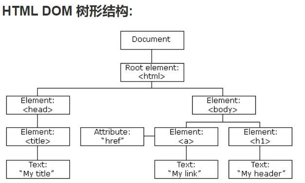
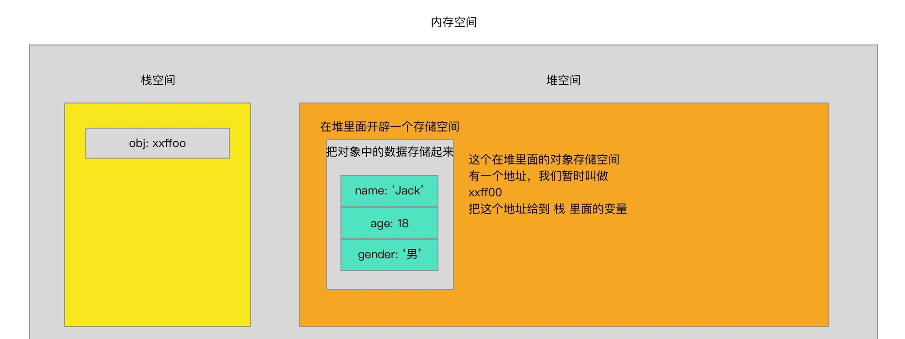

## JavaScript 的组成部分

---

1. 规范

- `ECMAScript` 是一种语言标准，而 `JavaScript` 是网景公司对 ECMAScript 标准的一种实现

2. 文档对象模型

- 文档对象模型简称 `DOM`，是 `html` 和 `xml` 文档的编程接口，它用于描述处理网页内容的方法与接口，定义了访问和操作 `HTML` 文档的标准方法 

3. 浏览器对象模型

- 浏览器对象模型简称 `BOM`，用于描述用户与浏览器进行交互的方法与接口，也就是 JS 与浏览器的对话

---

## 数据类型

---

1. 原始数据类型与引用数据类型

- 原始数据类型，包含数字类型 _Number_、字符串类型 _String_、布尔类型 _Boolean_、_undefined_、_null_、_bigint_、加上 es6 的 _Symbol_
- 引用数据类型，包括对象 _Object_、数组 _Array_、函数对象 _function_ 以及其它内置对象

2. 两种数据类型的差异

- 原始数据类型，以 _整体值_ 进行存储和复制；引用数据类型，值被存储在堆空间的某一块儿内存空间中，把存储空间的地址赋值给引用的变量。对象是通过 `引用` 被存储和复制的 

3. 复杂数据类型与原始数据类型的比较

- `原始数据类型` 是值之间的比较，`引用数据类型` 是内存地址之间的比较
- `原始数据类型` 之间的赋值：相当于是把某个变量的值复制了一份一模一样的给了另一个变量，赋值以后两个互相独立互不影响
- `引用数据类型` 之间的赋值：因为复杂数据类型，变量存储的是地址，真实内容在 `堆空间` 内存储，所以赋值的时候相当于把某变量存储的那个地址 `复制` 了一份给到了另一个变量。现在两个变量存储的地址一样，指向一个内存空间，所以使用任一个变量修改空间内的内容，其指向的空间也会跟着改变
- 对函数传递 `原始数据类型` 和 `复杂数据类型` 的参数，参照以上情况

4. null/undefined

- undefined 表示某个值未定义，null 表示一个空的值。`null` 不等于 `0` 和 `''`，0 是一个数值，`''` 表示一个长度为 0 的字符串
- `null` 构成了一个独立的类型，它并不是一个 `对不存在的object的引用` 或 `null指针`，它仅仅代表 `无`、`空` 或 `值未知` 的特殊值

```js
console.log(typeof null); // object
```

- 第一版的 `JavaScript` 是用 32 位比特来存储值的，且是通过值的低 1 位或 3 位来识别类型的。另外还用两个特殊值：`undefined`，用整数 −2^30（负 2 的 30 次方，不在整型的范围内）；`null`，机器码空指针（C/C++ 宏定义），低三位也是 000

| 低位 | 表示                   |
| ---- | ---------------------- |
| 1    | 整型（int）            |
| 000  | 引用类型（object）     |
| 010  | 双精度浮点型（double） |
| 100  | 字符串（string）       |
| 110  | 布尔型（boolean）      |

5. 布尔值

- 布尔类型只有两个值：`true` 和 `false`。但在 `JavaScript` 里面，会有其他的值也能表示成布尔值，它的规则与使用逻辑非运算符时的规则一致，会调用 `Boolean` 先对数据进行类型转换，这些数据会被转换为 `true` 或 `false`

| 数值类型  | 转换/表示为布尔值                                                  |
| --------- | ------------------------------------------------------------------ |
| undefined | false                                                              |
| null      | false                                                              |
| boolean   | `true` 是 true，`false` 是 false                                   |
| number    | +0、-0 及 NaN 都是 false，其他都为 true                            |
| string    | 长度为 0 的字符串/空字符串为 false，长度大于等于 1 的字符串为 true |
| object    | 所有的对象都是 true                                                |

```js
true ? 'truthy' : 'flasy'; // truthy

new Boolean(false) ? 'truthy' : 'flasy'; // truthy

{} ? 'truthy' : 'flasy'; // truthy

Infinity ? 'truthy' : 'flasy'; // truthy

function test(){}

test ? 'truthy' : 'flasy'; // truthy

NaN ? 'truthy' : 'flasy'; // flasy
```

---

## 对象包装器

---

1. 什么是对象包装器

- _原始类型_ 仍然是原始的，除 `Object` 以外的所有数据类型都是不可变的，与预期相同，提供单个值。我们可以在 `JavaScript` 访问原始类型的方法和属性(如字符串、number、symbol 之类的)，为了使这些方法起作用，创建了提供额外功能的特殊 _对象包装器_，也就是通过临时对象工作，使用完后该对象即被销毁。因此，原始类型不能存储额外的数据，需要注意的是，`null/undefined` 不具有对象包装器

2. 示例解读

- 当我们创建一个 `原始值` 并使用或访问该类型的方法或属性时，`JavaScript` 会创建一个包含 `字面量` 面值的 `特殊对象`，它是一个临时对象，具有一些相关的方法，该方法运行并执行一些相关的操作之后，会返回一个新的 `字面量`，之后特殊对象被销毁，只留下 `原始值`

```js
let str = 'world';
console.log(str.slice());
```

- 字符串 `str` 是一个原始值。当访问它的属性时，会创建一个包含字符串字面值的特殊对象，该对象具有一些方法，如 `toLowerCase、slice` 等。该方法会运行并返回一个新的字符串。接着，特殊对象被销毁，只留下原始值 `str`
- `null` 与 `undefined` 没有任何方法，它们没有对应的 `对象包装器`，也没有提供任何方法，试图访问这种原始值的属性会报错

```js
console.log(null.property);
// Uncaught TypeError: Cannot read property 'property' of null
```