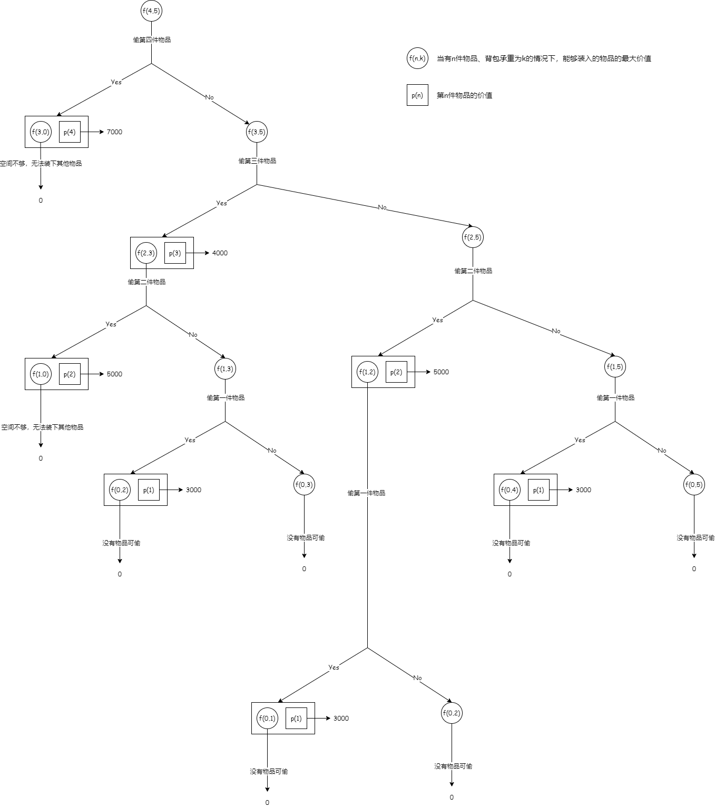
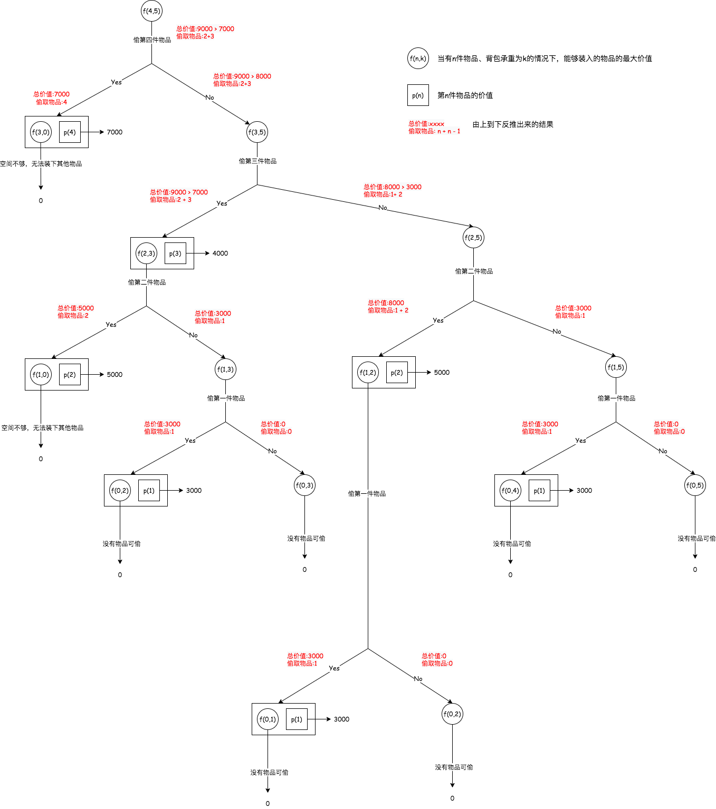
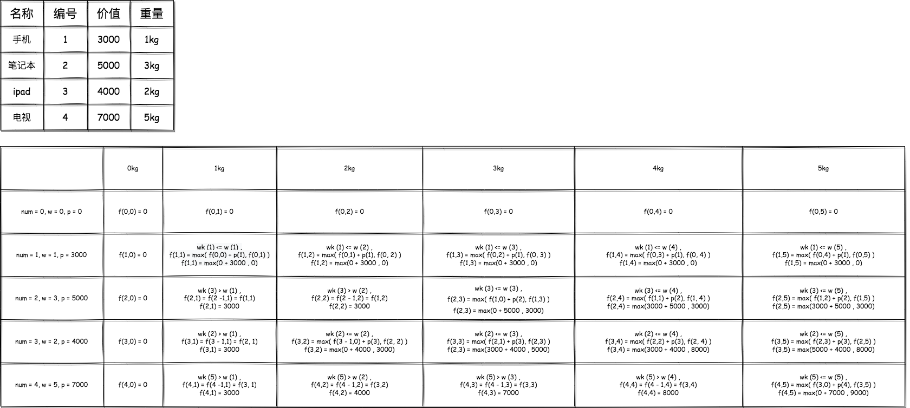
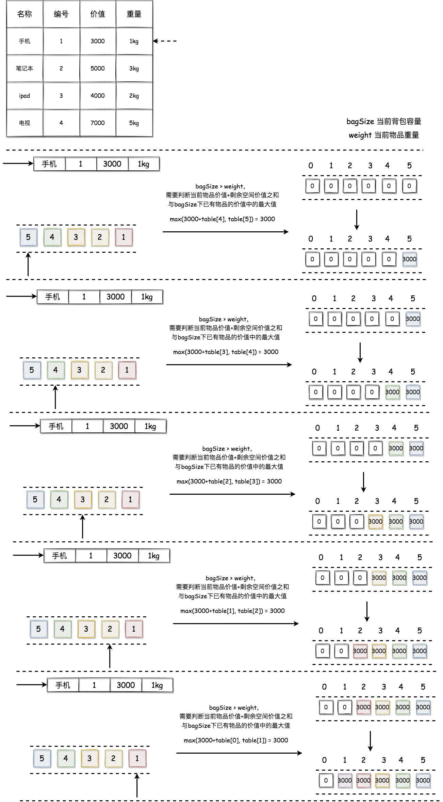

## 动态规划
---
1. 问题
- 给定 n 件物品，物品的重量为 w[i]，物品的价值为 c[i]。现挑选物品放入背包中，假定背包能承受的最大重量为 V，问应该如何选择装入背包中的物品，使得装入背包中物品的总价值最大？
2. 偷东西问题
- 假设你是一个小偷，你正在偷东西，你带了一个最大承重为 5kg 的背包。现在你的面前有以下几样物品，在最大承重范围内，如何让你偷窃的东西价值最高呢？

|物品名称|物品重量|物品价值|
|---|---|---|
|手机|1kg|3000|
|笔记本|3kg|5000|
|ipad|2kg|4000|
|电视|5kg|7000|

- 我们将问题分解，最终的情况是 f(n,k)，它的意思是 **当有n件物品、背包承重为k的情况下，能够装入的物品的最大价值**。那么我们无论从哪一件物品开始，它(假设重量为w，编号为i)的状态只有两个：偷或不偷。如果偷了，f(n,k) = f(n - 1, k - w) + p(i)；如果没偷，f(n,k) = f(n - 1, k)。如下图所示



- 最后，我们根据得出的推论，反推一个最优解，也就是最大价值，如下图所示



- 到这里我们能够发现，它实际上满足以下的一个规律，它的状态转移方程也很容易得出来


- 最后以一个二维数组的形式去表达它，其实就很好理解了。其中背包可以分解为 0kg、1kg、2kg、3kg、4kg、5kg，物品只有两个状态：偷或者不偷（需要在重量合适的情况下）



- 可以发现，当前单元格的价值决定于当前物品是否能放入当前单元格。如果当前物品无法放入当前单元格，那么就取上一个单元格的值(上一行同列/同重量背包)；如果当前商品能够放入当前单元格，那就是取 上一个单元格的价值 与 当前商品的价值+剩余空间的价值 两者之间的最大值

3. 代码实现
- 使用二维数组实现
```js
const goods = [
  {
    price:3000,
    name:'手机',
    weight:1
  },
  {
    price:5000,
    name:'笔记本',
    weight:3
  },
  {
    price:4000,
    name:'ipad',
    weight:2
  },
  {
    price:7000,
    name:'电视',
    weight:5
  }
]

function renderBag(goods,capacity){
  let bag = [];
  for(let good of goods){
    if(!bag.includes(capacity - good.weight)) bag.push((capacity - good.weight))
    if(!bag.includes(good.weight)) bag.push(good.weight)
  }
  return bag.sort()
}

function knapsack(goods,capacity){
  let table = [];
  let bags = renderBag(goods,capacity)
  for(let i=0;i<=goods.length;i++){
    table[i]=[]
    for(let j=0;j<bags.length;j++){
      if(i === 0 || j === 0){
        table[i][j] = {
          price:0,
          good:[]
        }
      } else {
        let weightK = goods[i - 1].weight;
        if(weightK <= j){
          // 不取该物品
          let nonAddPrice = table[i - 1][j].price;

          // 取得该物品
          let addPrice = table[i - 1][j - weightK].price + goods[i - 1].price;

          if(addPrice >= nonAddPrice){
            table[i][j] = {
              price:addPrice,
              good:[...table[i - 1][j - weightK].good,goods[i - 1].name]
            }
          } else {
            table[i][j] = {
              price:nonAddPrice,
              good:table[i - 1][j].good
            }
          }
          // table[i][j] = Math.max(nonAddPrice,addPrice)
        } else {
          table[i][j] = table[i - 1][j]
        }
      }
    }
  }
  console.log(table)

  return table[goods.length][bags.length - 1]
}
```
```js
const goods = [
  {
    price:3000,
    name:'手机',
    weight:1
  },
  {
    price:5000,
    name:'笔记本',
    weight:3
  },
  {
    price:4000,
    name:'ipad',
    weight:2
  },
  {
    price:7000,
    name:'电视',
    weight:5
  }
]

function knapsack(goods,capacity){
  let table = [];
  for(let i=0;i<=goods.length;i++){
    table[i]=[]
    for(let j=0;j<=capacity;j++){
      if(i === 0 || j === 0){
        table[i][j]=0
      } else if(goods[i - 1].weight <= j) {
        // 能够放入，需要计算总价值
        // 多了一行出来，需要取第 i - 1 个物品数量, 这里i > 0
        let priceSum = goods[i - 1].price + table[i - 1][j - goods[i - 1].weight];
        let prevPrice = table[i - 1][j];
        table[i][j] = Math.max(priceSum,prevPrice);
      } else {
        table[i][j] = table[i - 1][j]
      }
    }
  }

  console.log(table)

  findGood(capacity,table,goods)
}

function findGood(capacity,table,goods){
  let str = '';
  let i = goods.length;
  let j = capacity;
  while(i > 0 && j > 0){
    if(table[i][j] !== table[i - 1][j]){
      str += goods[i - 1].name + '+';
      j -= goods[i - 1].weight;
      i --;
    } else {
      i --;
    }
  }
  console.log(str.slice(0,-1))

}
```
- 如果这个背包问题不考虑最终的最优结果是什么，那么我们完全可以用一个一维数组来操作。我们以当只有手机可选时为例，操作过程如下图所示



```js
function knapsack(goods,capacity){
  let table = [0];
  for(let i=0;i<goods.length;i++){
    let weight = goods[i].weight;
    for(let currentSize=capacity;currentSize>0;currentSize--){
      if(currentSize >= weight){
        table[currentSize] = Math.max(
          table[currentSize - weight] + goods[i].price,
          table[currentSize]
        )
      }
    }
  }

  console.log(table)
}
```
