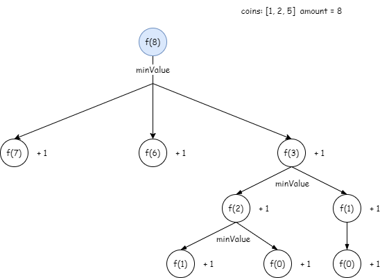

## 最少的硬币数目
---
1. 题目
- 给定不同面额的硬币 coins 和一个总金额 amount。编写一个函数来计算可以凑成总金额所需的最少的硬币个数。如果没有任何一种硬币组合能组成总金额，返回 -1。
- 你可以认为每种硬币的数量是无限的

```md
输入：coins = [1, 2, 5], amount = 11
输出：3 
解释：11 = 5 + 5 + 1
```

```md
输入：coins = [2], amount = 3
输出：-1
```

```md
输入：coins = [1], amount = 0
输出：0
```

```md
输入：coins = [1], amount = 1
输出：1
```

```md
输入：coins = [1], amount = 2
输出：2
```

2. 分析
- 由题目可知，硬币数量是无限的，因此凑成 amount 面值的硬币种类可以有多个相同的。依照动态规划的解题思路来分析的话，将大问题拆解为小问题，我们就可以分别取 coins 中的每个硬币，然后取它们的硬币数量的最小值



- 如图所示，其中详细标记了 amount = 3 所需最少硬币的计算过程，因此，它的状态转移方程也很容易得出

```js
/** 
 * coins = [1, 2, 5]
*/
dp[i] = min(dp[i - 1] + dp[i - 2] + dp[i - 5]) + 1
```

3. 代码结构

```js
/**
 * @param {number[]} coins
 * @param {number} amount
 * @return {number}
 */
var coinChange = function(coins, amount) {
    const dp = [];
    for(let i = 1;i<=amount;i++){
        dp[i] = Number.MAX_VALUE
    }
    dp[0] = 0;
    // 设置初始值，amount = 0 时，没有任何一个硬币可以拼成，其他的暂时设为最大值
    for(let i = 0;i<=amount;i++){
      // dp[i] = min(dp[i - coin[0]], dp[i - coin[1]] + ... + dp[i - coin[coin.length - 1]])
        for(let coin of coins){
            if(coin <= i){
                dp[i] = Math.min(
                    dp[i],
                    dp[i  -coin] + 1
                )
            }
        }
    }
    return dp[amount] >= Number.MAX_VALUE ? -1 : dp[amount]
};
```
