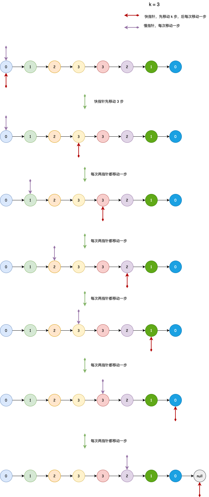

## 链表中倒数第k个节点
---
1. 题目
- 输入一个链表，输出该链表中倒数第k个节点。为了符合大多数人的习惯，本题从1开始计数，即链表的尾节点是倒数第1个节点。
- 例如，一个链表有 6 个节点，从头节点开始，它们的值依次是 1、2、3、4、5、6。这个链表的倒数第 3 个节点是值为 4 的节点

```md
输入: 1->2->3->4->5, 和 k = 2.

输出: 4->5.
```

2. 分析
- 依据题目分析可知，需要求得倒数第 k 个节点，那么其实我们可以发现，倒数第 k 个节点其实就是顺数第 (len - k) 个节点。例如链表有 6 个节点，k = 2，意味着求倒数第 k 个节点，那么它实际上就是求顺数第 4 个节点
- 我们可以维护一个 hashmap，用于存储节点的位置与对应的节点，遍历链表将节点存入其中并获取链表的长度，最后去获取 len - k 位置的节点，即时所求得的节点

```js
var getKthFromEnd = function(head, k) {
    let map = new Map(),
    curr = head,
    index = 1;

    while(curr) {
        if(!map.has(curr)) {
            map.set(index,curr);
        };
        index++;
        curr = curr.next;
    }

    return map.get(index - k);
};
```

- 这种解法的空间复杂度是 O(n)，时间复杂度是 O(n)，那么可不可以不要这个 hashmap，将空间复杂度降至 O(1) 呢? 依据上面的解法，我们只需要获得链表的长度就可以了，接着在遍历到 len - k 的位置，就是我们要求的倒数第 k 个节点的位置

```js
var getKthFromEnd = function(head, k) {
    let curr = head,
    len = 0;

    while(curr) {
        len++;
        curr = curr.next;
    }

    curr = head;

    for(let i = 0;i<len - k;i++) {
        curr = curr.next;
    }

    return curr;
};
```

- 这样的话空间复杂度就降到了 O(1)，但经过了两次循环，那可以只用一次循环就解决吗? 可以使用快慢指针的方式，也就是说，如果从链表末尾往前数，只需要移动 k 次就能到达要求的倒数第 k 个节点；而从链表开头往后数，就只需要移动 len - k 次即可
- 虽然链表长度未知，但我们可以让快指针先移动 k 次，那么它后续就只能移动 len - k 次，这个时候我们可以让慢指针移动 len - k 次，就能指向倒数第 k 个节点了



```js
var getKthFromEnd = function(head, k) {
    if(k <= 0 || head === null) return null;
    let fast = head,slow = head;

    for(let i = 0;i<k;i++) {
        fast = fast.next;
    }

    while(fast) {
        fast = fast.next;
        slow = slow.next;
    }

    return slow;
}
```