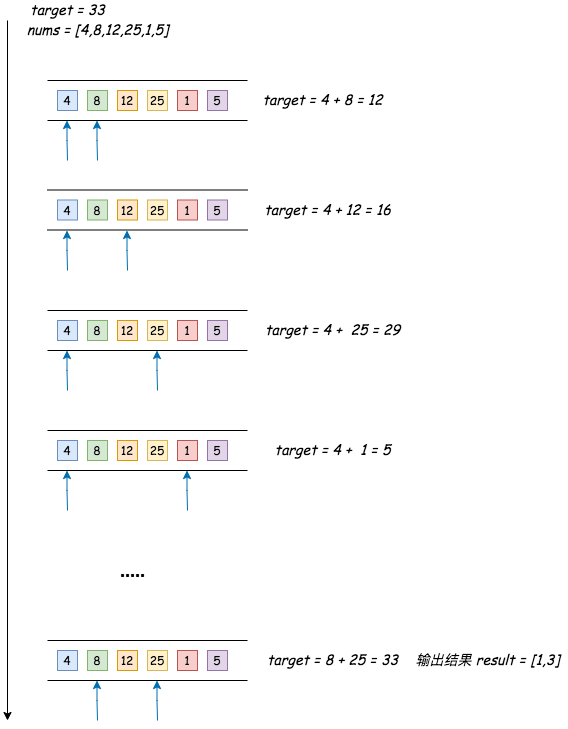
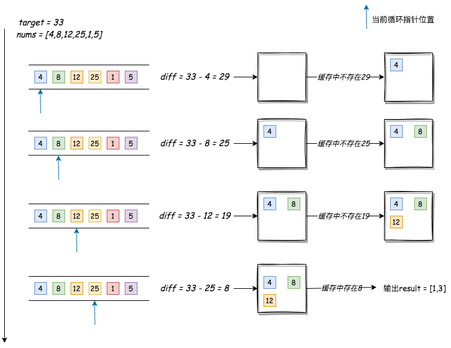

## 两数之和


---
1. 题目
- 给定一个整数数组 nums 和一个整数目标值 target，请你在该数组中找出和为目标值 target  的那两个整数，并返回它们的数组下标。你可以假设每种输入只会对应一个答案。但是，数组中同一个元素在答案里不能重复出现。你可以按任意顺序返回答案

```md
输入：nums = [2,7,11,15], target = 9
输出：[0,1]
解释：因为 nums[0] + nums[1] == 9 ，返回 [0, 1] 
```

```md
输入：nums = [3,2,4], target = 6
输出：[1,2]
```

```md
输入：nums = [3,3], target = 6
输出：[0,1]
```

2. 分析
- 在不考虑复杂度的情况下，我们可以遍历每个元素进行相加比较，也就是暴力穷举的方式，直到这两个数的和与给定的值相等



```js
function twoSum(nums,target){
  let result = [];
  for(let i=0; i<nums.length; i++){
    // 从数组的第一个元素开始遍历
    for(let j=i+1; j<nums.length; j++){
      // 从i+1位元素开始遍历
      if(nums[i]+nums[j] === target){
        result[0]=i;
        result[1]=j;
        return result
      }
    }
  }
}
```

- 从数组的第一项开始，逐步将它与所有的下一项进行相加比较；如果没有，再从第二项开始，再将它与所有的下一项进行相加比较；直到得出一个结果，它的时间复杂度为 O(n^2)
- 如果我们想只扫描一次数组的情况下，就得到这个结果，我们可以将target与当前索引对应的值相减，并搜索这个差值是否存在于缓存里面，如果没有，将当前元素存储到缓存里，并且将数组指针移到下一位，重复以上动作



```js
function twoSum(nums,target){
  let result = [];
  let sumMap = new Map();
  // 
  for(let i=0; i<nums.length; i++){
    if(sumMap.has(target - nums[i])){
      result[0] = sumMap.get(target - nums[i]);
      result[1] = i;
      // result = [sumMap.get(target - nums[i]),i]
      break;
    } else {
      sumMap.set(nums[i],i)
    }
  }
  return result
}

// function twoSum(nums,target){
//   let result = [];
//   let sumMap = new Map();
//   // 
//   for(let i=0; i<nums.length; i++){
//     if(sumMap.has(target - nums[i])){
//       result = [sumMap.get(target - nums[i]),i]
//       break;
//     }
//     sumMap.set(nums[i],i)
//   }
//   return result
// }
```