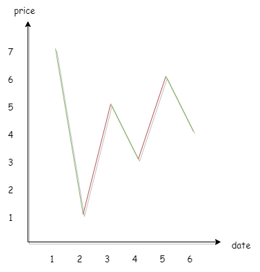

## 买卖股票的最佳时机2
---

1. 题目
- 给你一个整数数组 prices ，其中 prices[i] 表示某支股票第 i 天的价格。

- 在每一天，你可以决定是否购买和/或出售股票。你在任何时候 最多 只能持有 一股 股票。你也可以先购买，然后在 同一天 出售。返回 你能获得的 最大 利润 。

```md
输入：prices = [7,1,5,3,6,4]
输出：7
解释：在第 2 天（股票价格 = 1）的时候买入，在第 3 天（股票价格 = 5）的时候卖出, 这笔交易所能获得利润 = 5 - 1 = 4 。
     随后，在第 4 天（股票价格 = 3）的时候买入，在第 5 天（股票价格 = 6）的时候卖出, 这笔交易所能获得利润 = 6 - 3 = 3 。
     总利润为 4 + 3 = 7 。
```

```md
输入：prices = [1,2,3,4,5]
输出：4
解释：在第 1 天（股票价格 = 1）的时候买入，在第 5 天 （股票价格 = 5）的时候卖出, 这笔交易所能获得利润 = 5 - 1 = 4 。
     总利润为 4 。

```

```md
输入：prices = [7,6,4,3,1]
输出：0
解释：在这种情况下, 交易无法获得正利润，所以不参与交易可以获得最大利润，最大利润为 0 。
```

2. 分析
- 我们以动态规划的模式来分析这道题，由题目已知：同时只能持有一只股票，并且当天买当天卖（相当于收益为0），而且只有在上涨的时候卖出才能增加收益

- 那么每一天的收益就等于两个状态，一个是当天手上没有持有股票，另一个是当天手上持有了股票

- 举例说明，如果今天交易完成后，手上没有持有股票。那么有两种情况：第一种是昨天交易完成就没有持有股票了；第二种是昨天交易完成持有了股票，然后今天交易的时候把这支股票卖出去了

```md
<!-- value[i][0] 表示第i天交易完成后没有持有股票的收益 -->
value[i][0] = max(value[i - 1][0] , value[i - 1][1] + prices[i])
```

- 如果今天交易完成后，手上有持有股票。也有两种情况：第一种是昨天交易完成持有了股票，但今天并未卖出；第二种是昨天交易完成没有购入股票，但今天购入了股票

```md
<!-- value[i][1] 表示第i天交易完成后持有股票的收益 -->
value[i][1] = max(value[i - 1][1] , value[i - 1][0] - prices[i])
```

- 那么这个题的解题思路就出来了，它的状态转移方程如下所示


```js
var maxProfit = (prices) => {

  const len = prices.length - 1;
  const dp = [];

  dp[0] = [0, -prices[0]];
  
  for(let i = 1;i<=len;i++){
    dp[i] = []
    dp[i][0] = Math.max(dp[i - 1][0], dp[i - 1][1] + prices[i])
    dp[i][1] = Math.max(dp[i - 1][1], dp[i -1][0] - prices[i])
  }

  return dp[len][0]
}
```

- 但是我们会发现一个问题，这里面存储了很多多余的状态。实际上当天的收益只与前一天的收益有关，并且我们只需要最后一天的收益情况。因此，我们只记录前一天的收益结果即可(也就是前一天交易完成是否持有股票)

```js
var maxProfit = (prices) => {

  let dp0 = 0,dp1 = -prices[0];
  
  for(let i = 1;i<prices.length;i++){
    let nowDp0 = Math.max(dp0, dp1 + prices[i]);
    let nowDp1 = Math.max(dp1, dp0 - prices[i]);
    dp0 = nowDp0;
    dp1 = nowDp1;
  }

  return dp0
}
```

- 在换一种思路，先看 [7,1,5,3,6,4] 这个情况所代表的折线图，如下图所示



- 我们可以看到，我们只需要计算涨势部分的之和即可。也就是拆分成 6 份，如果该份收益小于 0，我们就不添加到总收益中；如果该份收益大于 0，我们就将它添加到总收益中

```js
var maxProfit = (prices) => {

  let sum = 0;

  for(let i = 1;i<prices.length;i++){
    sum += Math.max(prices[i] - prices[i - 1], 0)
  }

  return sum
}
```
