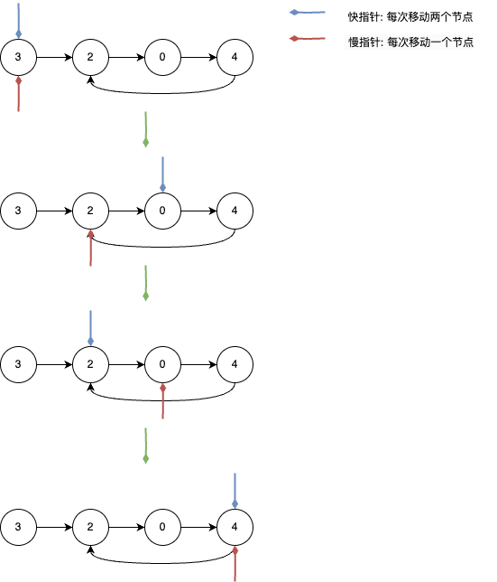

## 环形链表1
---
1. 题目
- 给你一个链表的头节点 head ，判断链表中是否有环。
- 如果链表中有某个节点，可以通过连续跟踪 next 指针再次到达，则链表中存在环。 为了表示给定链表中的环，评测系统内部使用整数 pos 来表示链表尾连接到链表中的位置（索引从 0 开始）。注意：pos 不作为参数进行传递 。仅仅是为了标识链表的实际情况
- 如果链表中存在环 ，则返回 true 。 否则，返回 false


```md
输入：head = [3,2,0,-4], pos = 1
输出：true
解释：链表中有一个环，其尾部连接到第二个节点。
```


```md
输入：head = [1,2], pos = 0
输出：true
解释：链表中有一个环，其尾部连接到第一个节点。
```


```md
输入：head = [1], pos = -1
输出：false
解释：链表中没有环。
```

2. 分析
- 我们可以使用一个 hashmap 来存储已经遍历过的节点，当发现后续有节点被存储在 hashmap 中时，就说明链表有环；否则就没有环

```js
function ListNode(val) {
    this.val = val;
    this.next = null;
}

/**
 * @param {ListNode} head
 * @return {boolean}
 */
var hasCycle = function(head) {
    if(head === null) return false
    const set = new Set();
    // 使用 set 对象，它可以存储任意类型的值

    while(head.next) {
        if(set.has(head)) {
            return true
        } else {
            set.add(head)
        }
        head = head.next
    }
    return false
};
```

- 不过该题目有进阶要求，它要求空间复杂度是 O(1)，而上述使用 hashmap 的方式，它的空间复杂度是 O(n)。那我们就可以换一种方式来解题，如果某个链表存在环，那我们使用双指针的方式(快慢指针)，这两个指针一定会在某一时刻遇上(快指针每次移动两个节点，慢指针每次移动一个节点)



```js
var hasCycle = function(head) {
    if(head === null) return false;
    let slowPoint = head,fastPoint = head;

    // 如果节点的下一个节点以及下一个节点为空，说明这个链表可能不存在环
    // 因为环形链表中不存在 null 的情况
    while(slowPoint?.next !== null && fastPoint?.next?.next !== null) {
        slowPoint = slowPoint?.next;
        fastPoint = fastPoint?.next?.next;
        if(slowPoint === fastPoint) return true;
    }
    return false
}
```

---
## 环形链表2
---
1. 题目
- 给定一个链表的头节点  head ，返回链表开始入环的第一个节点。 如果链表无环，则返回 null。
- 如果链表中有某个节点，可以通过连续跟踪 next 指针再次到达，则链表中存在环。 为了表示给定链表中的环，评测系统内部使用整数 pos 来表示链表尾连接到链表中的位置（索引从 0 开始）。如果 pos 是 -1，则在该链表中没有环。注意：pos 不作为参数进行传递，仅仅是为了标识链表的实际情况。不允许修改 链表


```md
输入：head = [3,2,0,-4], pos = 1
输出：返回索引为 1 的链表节点
解释：链表中有一个环，其尾部连接到第二个节点。
```


```md
输入：head = [1,2], pos = 0
输出：返回索引为 0 的链表节点
解释：链表中有一个环，其尾部连接到第一个节点。
```

2. 分析
- [leetcode-143(环形链表2图解)](https://leetcode.cn/problems/linked-list-cycle-ii/solution/linked-list-cycle-ii-kuai-man-zhi-zhen-shuang-zhi-/)，可以参照这个理解
- 意思是，当快慢指针第一次相遇的时候，fast 走过的步数是 slow 走过的步数的两倍(fast = 2slow)；双指针都走过 a 步，然后在环内绕圈直到重合，重合时 fast 比 slow 多走环的长度整数倍(fast = slow + nb);也就是 slow = nb;
- slow 走过的距离是 a + nb，意思是只要有个节点能再走 a 步就能与 slow 在入口处相遇，这个节点就是头节点

```js
var detectCycle = function(head) {
    if(head === null) return null;
    let slowPoint = head,fastPoint = head,isloop = false;
    while(slowPoint?.next !== null && fastPoint?.next?.next !== null) {
        slowPoint = slowPoint?.next;
        fastPoint = fastPoint?.next?.next;
        if(slowPoint === fastPoint) {
            isloop = true;
            break;
        }
    }

    if(isloop) {
        slowPoint = head;
        while(slowPoint !== fastPoint) {
            slowPoint = slowPoint.next;
            fastPoint = fastPoint.next;
        }
        return slowPoint
    }
    return null
};
```