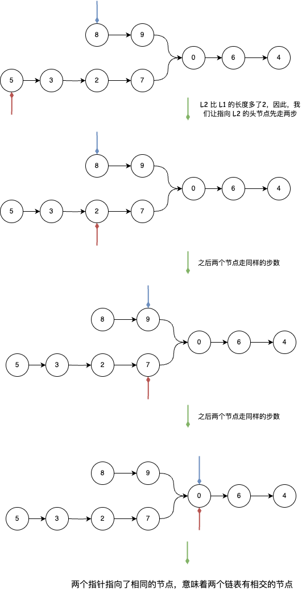

## 相交链表
---
1. 题目
- 给你两个单链表的头节点 headA 和 headB ，请你找出并返回两个单链表相交的起始节点。如果两个链表不存在相交节点，返回 null
- 图示两个链表在节点 c1 开始相交：


- 题目数据 保证 整个链式结构中不存在环。注意，函数返回结果后，链表必须 保持其原始结构。进阶：你能否设计一个时间复杂度 O(m + n) 、仅用 O(1) 内存的解决方案

2. 分析
- 从题目可知，找到两个链表的相交节点，那么我们可以用暴力枚举的方式来寻找，一旦两个节点相等就判定它两有相交的节点。用暴力枚举的方式，时间复杂度是 O(m * n)，空间复杂度是 O(1)，不符合进阶要求
- 我们可以使用 hashmap 的方式来处理，每经过一个节点，就把它存到 hashmap 中

```js
var getIntersectionNode = function(headA, headB) {
    let map = new Set(),head1 = headA,head2 = headB;
    while(head1) {
        if(!map.has(head1)) {
            map.add(head1)
        }
        head1 = head1.next;
    }

    while(head2) {
        if(map.has(head2)) {
            return head2
        }
        head2 = head2.next;
    }

    return null
};
```

- 此种方式的时间复杂度为 O(m + n)，而空间复杂度为 O(m) 或 O(n)，仍不符合题目进阶要求。但是，换一个思路，如果两个链表长度不一样的话，使用双指针的方式，让某个指针多走 longLish.length - shortList.length 的步数，这样如果两个链表相交的话，它们就一定会走到相交的节点去



```js
var getIntersectionNode = function(headA, headB) {
    let head1 = headA,head2 = headB,lenA = 0,lenB = 0,diff = 0;

    // 1. 计算 headA 链表的长度
    while(head1) {
        lenA++;
        head1 = head1.next;
    }

    // 2. 计算 headB 链表的长度
    while(head2) {
        lenB++;
        head2 = head2.next;
    }

    // 3. 如果 lenA < lenB，说明 headB 链表比较长，指向 headB 的指针要先移动
    // 如果 lenA > lenB，说明 headA 链表比较长，指向 headA 的指针要先移动
    if(lenA < lenB) {
        head1 = headB;
        head2 = headA;
        diff = lenB - lenA;
    } else {
        head1 = headA;
        head2 = headB;
        diff = lenA - lenB;
    };

    // 4. 指针 head1 先移动差值步数
    for(let i =0;i<diff;i++) {
        head1 = head1.next;
    }

    while(head1 !== null && head2 !== null) {
        if(head1 === head2) {
            return head1;
        }
        head1 = head1.next;
        head2 = head2.next;
    }

    return null
};
```