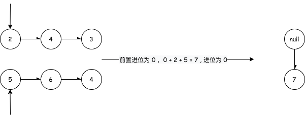
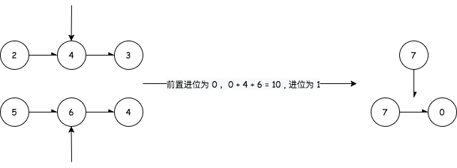
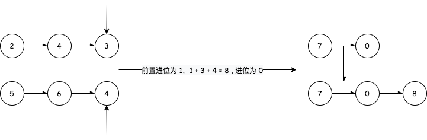
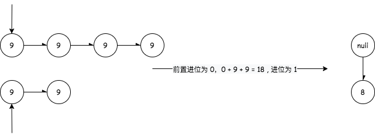
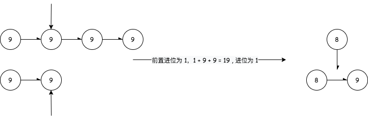
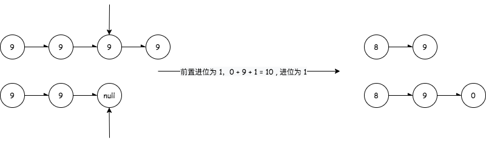
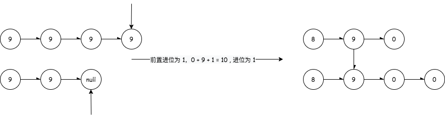
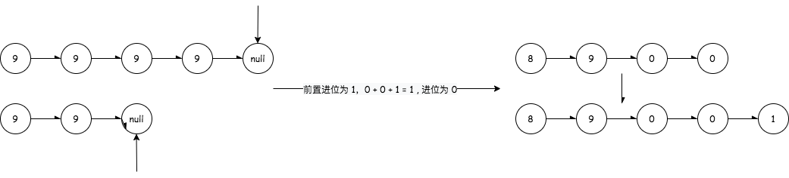

## 两数相加

---

1. 题目
- 给你两个 非空 的链表，表示两个非负的整数。它们每位数字都是按照逆序的方式存储的，并且每个节点只能存储一位数字。
- 请你将两个数相加，并以相同形式返回一个表示和的链表。你可以假设除了数字 0 之外，这两个数都不会以 0 开头

```md
输入：l1 = [2,4,3], l2 = [5,6,4]
输出：[7,0,8]
解释：342 + 465 = 807.
```


```md
输入：l1 = [0], l2 = [0]
输出：[0]
```

```md
输入：l1 = [9,9,9,9,9,9,9], l2 = [9,9,9,9]
输出：[8,9,9,9,0,0,0,1]
```

```js
// 给定一个链表
function ListNode(val, next) {
  this.val = (val===undefined ? 0 : val)
  this.next = (next===undefined ? null : next)
}
```

2. 分析
- 从题目给定的意思来看，我们的数字是按照逆序的方式被存储在链表里面的，例如 `[2,4,3]` 代表的数字是 342。也就是说，如果我们需要遍历链表，它是从数字的低位开始遍历的
- 这里我们可以让每一位相对应的节点(数字)相加，但是要注意两点。第一是十进一问题，例如说 个位数分别为 5 和 8，它们相加为 13，需要将这个进位的 1 保存到十位去，其它的同理，如果没有进位则这个进位设置为 0 即可







- 第二是数字的大小不一，表现到链表里面就是长度不一，当一个链表长一个链表短时，可以考虑 `list1.next = null` 时，`list1.val = 0`，这样就可以与 list2.val 相加了











3. 代码实现
```js
var addTwoNumbers = function(l1, l2) {
  let resListNode = list = new ListNode(0,null);
  // const res = [];
  let curr = 0;
  // 用于保存进位
  const { floor } = Math;

  while(l1||l2){
    let val1 = l1 ? l1.val : 0;
    let val2 = l2 ? l2.val : 0;
    // 获取当前位置的数字

    let sum = val1 + val2 + curr;
    // 计算当前相加之和： 前置进位 + l1.val + l2.val

    curr = floor(sum / 10);
    sum = floor(sum % 10);
    // 十进一，需要保留进位给下一位相加使用
    /*
        if(sum >= 10){
            sum = sum -10;
            curr = 1
        } else {
            curr = 0
        }
    */
   
    // res.push(sum)
    list.next = new ListNode(sum,null);
    // 将计算的结果保存到list的下一位
    list = list.next;
    // 将指针list指向list的下一位

    l1 = l1 ? l1.next :l1;
    l2 = l2 ? l2.next :l2;
    // 将指针l1和l2指向下一位
  }

  if(curr === 1){
    // 特殊情况，例如最后一位分别为 9 和 1，那么需要再进一位
    list.next = new ListNode(1,null);
    // res.push(curr)
  }

  // return res;

  return resListNode.next
};
```
