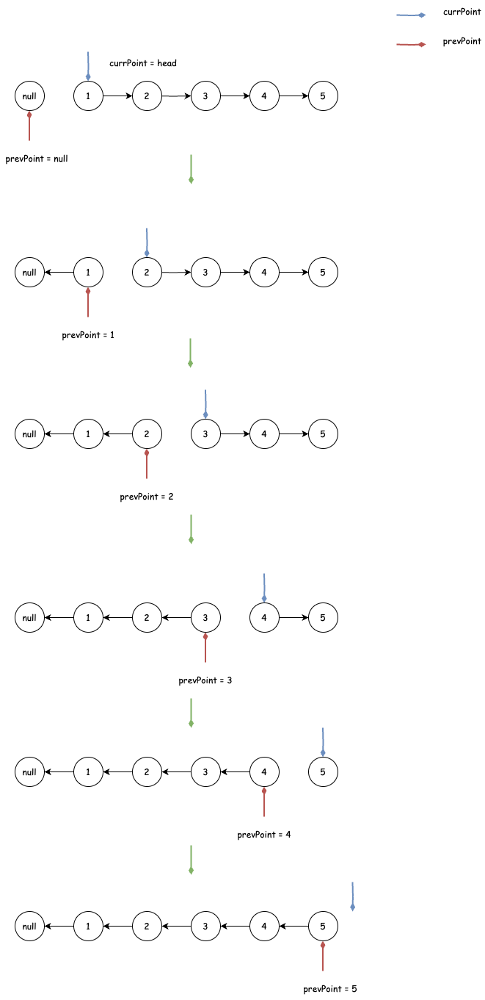

## 反转链表
---
1. 题目
- 给你单链表的头节点 head ，请你反转链表，并返回反转后的链表。

```md
输入：head = [1,2,3,4,5]
输出：[5,4,3,2,1]
```


```md
输入：head = [1,2]
输出：[2,1]
```


```md
输入：head = []
输出：[]
```

2. 分析
- 依据题目意思，也就是将当前节点的指向从指向下一个节点改为指向上一个节点。这里就需要两个指针，一个指针指向下一个节点，一个指针指向上一个节点，图示如下



```js
var reverseList = function(head) {
    // prevHead: 用于保存上一个节点的指向，以便将指向反转，也就是将当前节点的指向上一个节点
    // currHead：当前节点
    // next：当前节点的下一个节点的指向
    let prevHead = null,currHead = head,next = null;
    while(currHead) {
        next = currHead.next;
        currHead.next = prevHead;
        prevHead = currHead;
        currHead = next;
    }
    return prevHead
};
```