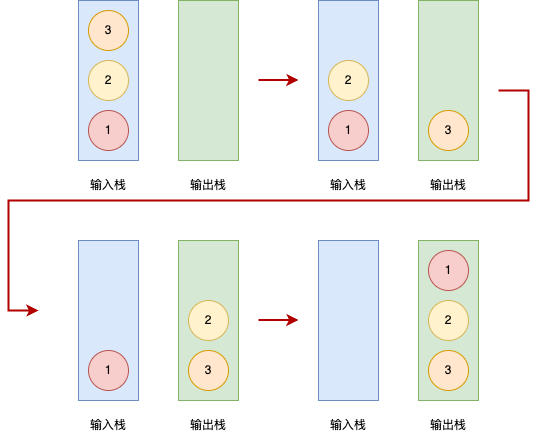

## 用栈实现队列
---
1. 题目
- 请你仅使用两个栈实现先入先出队列。队列应当支持一般队列支持的所有操作（push、pop、peek、empty）
- 实现 MyQueue 类：

|方法|描述|
|---|---|
|void push(int x)|将元素 x 推到队列的末尾|
|int pop() |从队列的开头移除并返回元素|
|int peek() |返回队列开头的元素|
|boolean empty() |如果队列为空，返回 true ；否则，返回 false|

- 说明：你只能使用标准的栈操作 —— 也就是只有 push to top, peek/pop from top, size, 和 is empty 操作是合法的。你所使用的语言也许不支持栈。你可以使用 list 或者 deque（双端队列）来模拟一个栈，只要是标准的栈操作即可

2. 分析
- 要用栈实现队列的顺序，就得结合它两的特性。队列是先进先出，栈是后进先出，题目要求使用两个栈实现，那么我们可以这样做



- 也就是，每次添加新元素，都 push 到输入栈；而每次要 pop 元素，就将输入栈的元素挨个出栈并添加到输出栈，再从输出栈 pop，就实现了队列的顺序机制

```ts
class EStack<T> extends Array<T> {
  get isEmpty() {
    return this.length === 0
  }
}

class MyQueue<T = number> {
  inputStack:EStack<T>;
  outputStack:EStack<T>;

  constructor() {
    this.inputStack = new EStack();
    this.outputStack = new EStack();
  }

  push(x: T): void {
    this.inputStack.push(x);
  }

  pop(): T {
    if(this.outputStack.isEmpty) {
      this.inputToOut()
    }
    const popItem = this.outputStack.pop()!;
    // this.outToIuput();
    return popItem
  }

  peek(): T {
    if(this.outputStack.isEmpty) {
      this.inputToOut()
    }
    const topItem = this.outputStack[this.outputStack.length - 1];
    // this.outToIuput();
    return topItem
  }

  empty(): boolean {
    return this.inputStack.length === 0 && this.outputStack.length === 0
  }

  inputToOut():void {
    while(!this.inputStack.isEmpty) {
      this.outputStack.push(this.inputStack.pop()!)
    }
  }

  // outToIuput():void {
  //   while(!this.outputStack.isEmpty) {
  //     this.inputStack.push(this.outputStack.pop()!)
  //   }
  // }
}
```