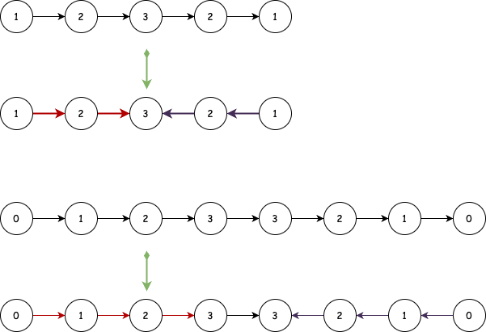
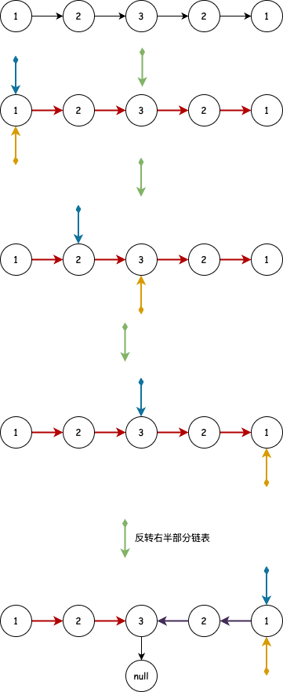
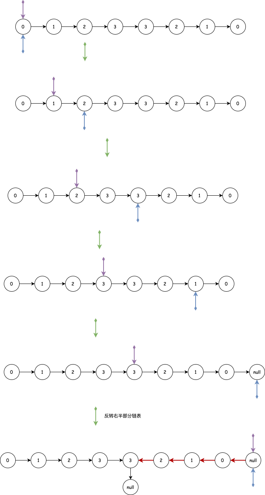

## 回文链表
---
1. 题目
- 给你一个单链表的头节点 head ，请你判断该链表是否为回文链表。如果是，返回 true ；否则，返回 false

```md
输入：head = [0,1,2,3,3,2,1,0]
输出：true
```


```md
输入：head = [0,1,2,3,2,1,0]
输出：true
```


```md
输入：head = [1,2,2,1]
输出：true
```


```md
输入：head = [1,2]
输出：true
```


2. 分析
- 我们可以利用双指针 + 反转链表的方式来解此题。由于是单向链表，我们只能获取当前节点的下一个节点，而无法获取当前的节点的上一个节点，因此，要是我们的链表可以变成如下所示的样子



- 那我们就可以每次对比链表的两端，如果值不一样，那它就一定不是个回文链表。通过快慢指针的方式移动，快指针每次移动两步，慢指针一次移动一步，我们会发现，如果节点数是偶数，那么快指针最终会指向 null (也就是最后一个节点的 next)，而慢指针指向右半部分的第一个节点；如果是奇数，快指针会指向最后一个节点，慢指针会指向中间那个节点





- 接着将快指针移到链表头，快慢指针以同样的速度移动，然后两个指针指向的节点的值不一样，则判定不是回文链表，直到慢指针指向 null

```js
var reverseList = function(head) {
    // prevHead: 用于保存上一个节点的指向，以便将指向反转，也就是将当前节点的指向上一个节点
    // currHead：当前节点
    // next：当前节点的下一个节点的指向
    let prevHead = null,next = null;
    while(head) {
        next = head.next;
        head.next = prevHead;
        prevHead = head;
        head = next;
    }
    return prevHead
};

var isPalindrome = function(head) {
    let fast = head,slow = head;
    
    while(fast !== null && fast.next !== null) {
        fast = fast.next.next;
        slow = slow.next;
    }

    if(fast !== null) {
        slow = slow.next;
    }

    slow = reverseList(slow);
    fast = head;

    while(slow !== null) {
        if(fast.val !== slow.val) {
            return false;
        }
        fast = fast.next;
        slow = slow.next;
    }

    return true;
};
```