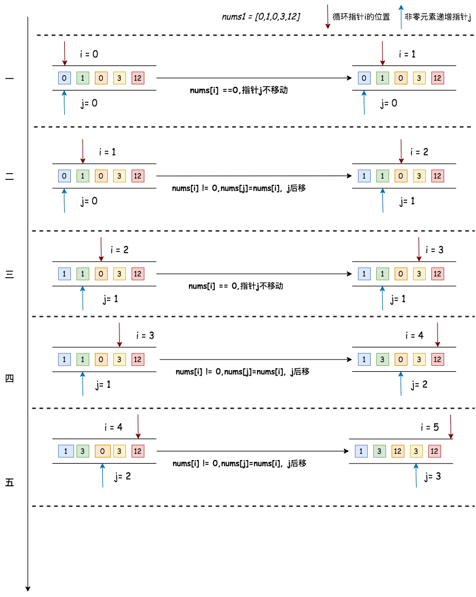

## 移动零
---
1. 题目
- 给定一个数组 nums，编写一个函数将所有 0 移动到数组的末尾，同时保持非零元素的相对顺序。请注意，必须在不复制数组的情况下原地对数组进行操作

```md
输入: nums = [0,1,0,3,12]
输出: [1,3,12,0,0]
```

```md
输入: nums = [0]
输出: [0]
```

2. 分析
- 通过双指针的方式去求解，一个是循环指针i，一个是只在元素是非零元素时才移动的指针j。循环开始时，当当前元素不等于零时，将 nums[i] 赋值给 nums[j]，并且将指针 j 向后移动，；当前元素等于零时，指针 j 不做任何变化，直到循环结束。最后将 nums 中从位置 j 开始的后面的元素全部置为0



```js
function moveZeroes(nums){

  if(!nums) return;

  let nonZeroIndex = 0;

  for(let i=0;i<nums.length;i++){
    if(nums[i]!=0){
      nums[nonZeroIndex++] = nums[i]
    }
  }
  // 还可以直接将i和j的元素进行交换，就不需要再进行下一步的重置0的操作了

  // while(i<nums.length){
  // if(nums[i]!=0){
  //   let temp = nums[nonZeroIndex]
  //   nums[i]=temp;
  //   nums[i] = nums[nonZeroIndex++]
  // }
  // }

  for(let i =nonZeroIndex;i<nums.length;i++){
    nums[i] = 0
  }

  // while(nonZeroIndex<nums.length){
  //   nums[nonZeroIndex++] = 0
  // }

  return nums
}
```
