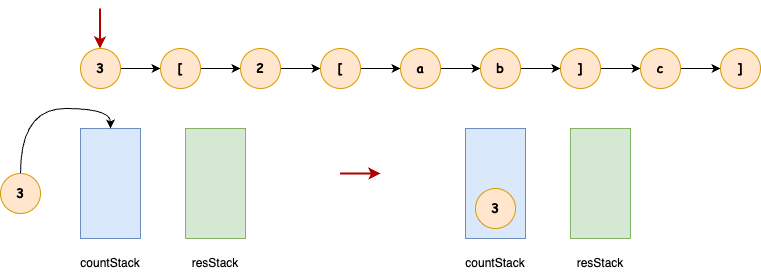
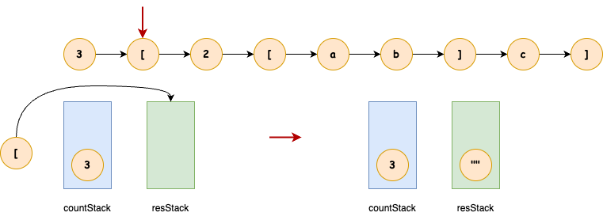
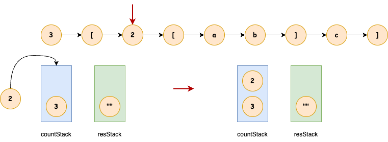
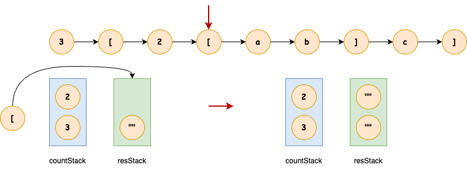
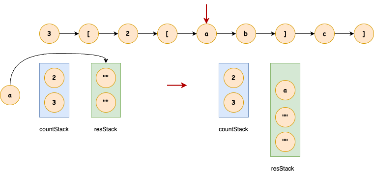
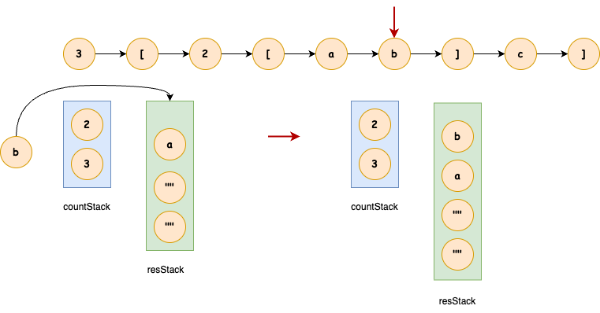
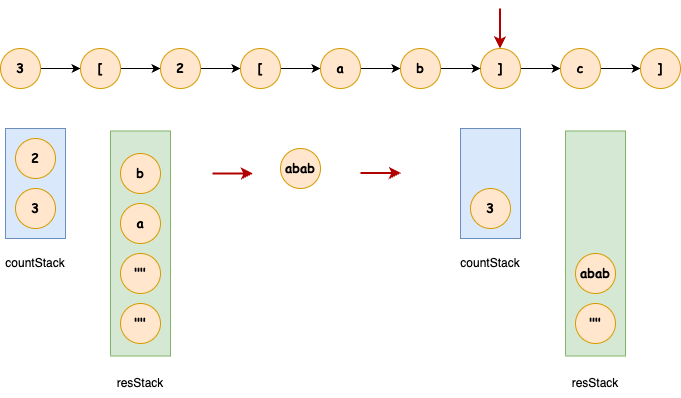
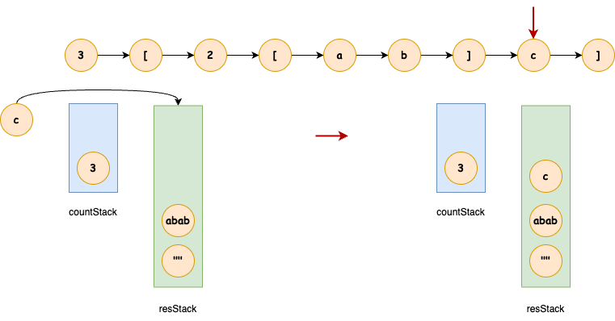
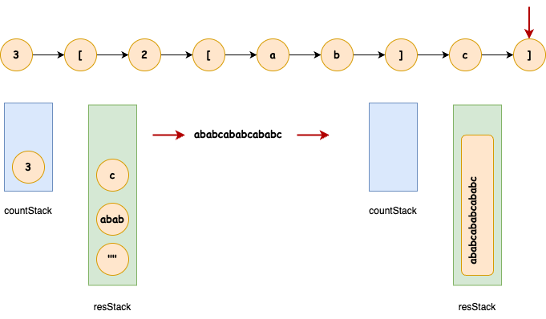

## 字符串解码
---
1. 题目
- 给定一个经过编码的字符串，返回它解码后的字符串。编码规则为: k[encoded_string]，表示其中方括号内部的 encoded_string 正好重复 k 次。注意 k 保证为正整数。
- 你可以认为输入字符串总是有效的；输入字符串中没有额外的空格，且输入的方括号总是符合格式要求的。此外，你可以认为原始数据不包含数字，所有的数字只表示重复的次数 k ，例如不会出现像 3a 或 2[4] 的输入

```md
输入：s = "3[a]2[bc]"
输出："aaabcbc"
```

```md
输入：s = "3[a2[c]]"
输出："accaccacc"
```

```md
输入：s = "2[abc]3[cd]ef"
输出："abcabccdcdcdef"
```

```md
输入：s = "abc3[cd]xyz"
输出："abccdcdcdxyz"
```

2. 分析
- 依据题目分析，需要根据 [] 前面的数字将 [] 里面的一组字符进行重复，它与 [LeetCode-20(有效的括号)](./lc20.md) 类似，那么我们就可以利用栈的特性来处理它
- 先以复杂点的 3[2a[bc]] 为例，因为它是携带内嵌括号的，这里我们维护两个栈，一个用于存放数字，另一个用于存放遇到的字符
- 第一个，遇到数字 3，将它存放到数字栈中



- 第二个，遇到左中括号，将要重复一组字符，我们可以往结果栈中添加一个空字符作为标记



- 第三个，遇到数字 2，将它存放到数字栈中



- 第四个，遇到左中括号，将要重复一组字符，我们可以往结果栈中添加一个空字符作为标记



- 后面遇到的需要重复的字符，我们直接添加到结果栈中





- 接下来遇到的是右中括号，那意味着需要一组字符的结束标记到了，这时候就需要根据栈中的数字与结果来重组一组字符串，然后再将这一组字符串重新入栈到结果栈中(数字栈不为空，说明还需要进行重复)



- 遇到普通的字符，我们直接添加到结果栈中



- 接下来遇到的是右中括号，那意味着需要一组字符的结束标记到了，重复以上操作，此时，字符串遍历完成，将结果输出即可



- 但是，需要注意一点是，数字的可能会有十位数、百位数的，所以，当遇到数字时，需要接着对后续的值进行读取，看是否也是数字

```js
var decodeString = function(s) {
    let countStack = [],resStack = [],index = 0,res = "";

    while(index <s.length) {
        let char = s.charAt(index);
        if(isFinite(char)) {
            let ret = "";
            while(isFinite(s.charAt(index))) {
                ret+=s.charAt(index++)
            }
            countStack.push(+ret);
        } else if(char === "[") {
            resStack.push("[");
            index++;
        } else if(char === "]") {
            let temp = resStack.pop();
            let pefix = countStack.pop();
            let res = "";

            while(temp !== "[") {
                res = temp + res;
                temp = resStack.pop();
            };
            res = res.repeat(pefix);
            resStack.push(res);
            index++;
        } else {
            resStack.push(s.charAt(index++));
        }
    };

    while(resStack.length !== 0) {
        res = resStack.pop() + res;
    }

    return res
};
```

- 还可以更简化一下

```js
var decodeString = function(s) {
    let countStack = [],resStack = [],index = 0,res = "";
    while(index <s.length) {
        let char = s.charAt(index);
        if(isFinite(char)) {
            /** 
              * 1. 处理字符是数字的情况
              *  需要将十位数、百位数的多个字符的数字处理到
            */
            let ret = "";
            while(isFinite(s.charAt(index))) {
                ret+=s.charAt(index++)
            }
            countStack.push(+ret);
        } else if(char === "[") {
            /** 
             * 2. 处理当遇到 另一组不同字符的开始标记符号时
             *  如 3[a]2[b] ，遇到第二个 [ 时，要将之前的 aaa 添加到结果栈中
            */
            resStack.push(res);
            res = "";
            index++;
        } else if(char === "]") {
            /** 
             * 3. 处理当遇到 ] 时，需要将之前的一组字符串进行重复
            */
            let temp = resStack.pop();
            let pefix = countStack.pop();

            // for(let i = 0;i<pefix;i++) {
            //     temp+=res;
            // };
            res = temp + res.repeat(pefix);
            index++
        } else {
            /** 
             * 4. 普通字符，直接添加到本组字符串中
            */
            res+=s.charAt(index++)
        }
    }
    return res
};
```