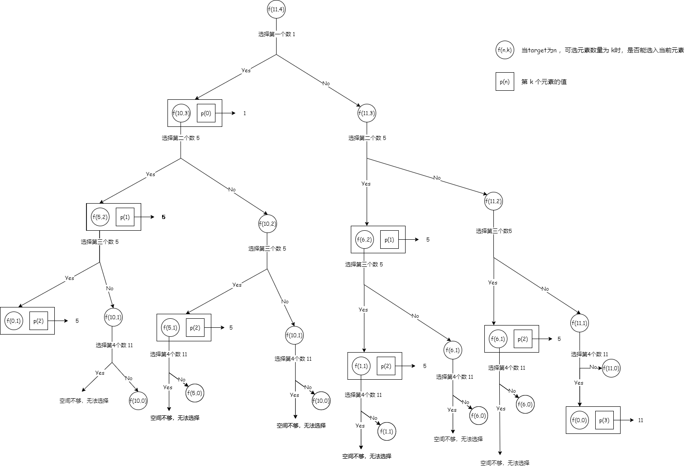

## 分割等和子集
---
1. 题目
- 给你一个 只包含正整数 的 非空 数组 nums 。请你判断是否可以将这个数组分割成两个子集，使得两个子集的元素和相等。1 <= nums.length <= 200。1 <= nums[i] <= 100

```md
输入：nums = [1,5,11,5]
输出：true
解释：数组可以分割成 [1, 5, 5] 和 [11] 。
```

```md
输入：nums = [1,2,3,5]
输出：false
解释：数组不能分割成两个元素和相等的子集。
```

```md
输入：nums = [2,2]
输出：true
解释：数组能分割成两个元素和相等的子集。
```

2. 分析
- 这是一个典型的背包型动态规划问题，首先要明确一点，元素和 sum 必须是一个偶数，数组 nums 才能被拆分成两个元素和相等的子集，奇数是无法拆分出两个元素和相等的子集的
- 这个问题可以转换一下，能否从数组中取出一些数，使得它们的和等于 nums 的元素之和的一半。跟 0-1 背包问题相比，0-1 背包要求的是：所选的物品的总重量不能超过背包的容纳量；而这道题是，取出一些数，使得这些数之和恰好等于 nums 的元素之和的一半



- 也就是说，对于某个元素，它只有两种状态：选或者不选。在元素值 <= target 时，如果选了该元素，f(n,W) = f(N - 1,W -wk) + p(k)；如果没选该元素，f(n,W)  = f(n - 1, W)

```js
var canPartition = function(nums) {
  let sum = 0;
  for(let i = 0;i<nums.length;i++) sum+=nums[i]
  if(sum % 2 !== 0) return false;

  let bagSize = sum / 2;
  let dp = [];
  for(let i = 0;i<nums.length;i++){
    dp[i] = []
    for(let j = 0;j<=bagSize;j++){
      if(i === 0 || j === 0){
        dp[i][j] = 0
      } else {
        if(nums[i] <= j){
          dp[i][j] = Math.max(
            dp[i - 1][j],
            dp[i - 1][j - nums[i]] + nums[i]
          )
        } else {
          dp[i][j] = dp[i - 1][j]
        }
      }
    }
  }

  return dp[nums.length - 1][bagSize] === bagSize
}
```

- 如果不去考虑由哪些元素组成，可以使用一个一维数组的方式来求解

```js
var canPartition = function(nums) {
  let sum = 0;
  for(let i = 0;i<nums.length;i++) sum+=nums[i]
  if(sum % 2 !== 0) return false;

  let bagSize = sum / 2;
  const dp = new Array(bagSize + 1).fill(0)

  for(let i = 0;i<nums.length;i++){
    for(let j = bagSize;j>=nums[i];j--){
      dp[j] = Math.max(
        dp[j],
        dp[j - nums[i]] + nums[i]
      )
    }
  }

  return dp[bagSize] === bagSize
};
```
