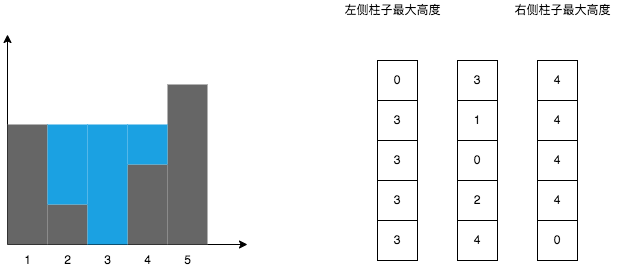

## 接雨水
---

1. 题目
- 给定 n 个非负整数表示每个宽度为 1 的柱子的高度图，计算按此排列的柱子，下雨之后能接多少雨水

```md
输入：height = [0,1,0,2,1,0,1,3,2,1,2,1]
输出：6
解释：上面是由数组 [0,1,0,2,1,0,1,3,2,1,2,1] 表示的高度图，在这种情况下，可以接 6 个单位的雨水（蓝色部分表示雨水）。 
```


```md
输入：height = [4,2,0,3,2,5]
输出：9
```

2. 分析
- 根据题目意思，如果某个柱子能接住雨水的话，需要满足以下条件：一个是两侧的柱子(不一定与当前柱子相邻)都比这个当前柱子高；另一个是接住雨水的量取决两侧柱子较低的哪一个


- 如上图所示，两侧邻接的柱子都比当前柱子高，而接住雨水的量等同于两侧较矮柱子的高度 - 当前柱子的高度。换成不邻接的，其实也是一样的，所以要考虑能接多少水，只需要计算某根柱子的左右侧的所有柱子中的两根最高柱子就行了



- 因此，针对以上分析，我们需要两个结构来存储每个柱子它的左右侧最大高度的柱子。左侧的柱子从最左侧的柱子开始遍历，右侧的从柱子的最右侧开始遍历

3. 代码结构

```js
var trap = function(height) {
    const length = height.length;
    const left = new Array(length).fill(0);
    const right = new Array(length).fill(0);
    let res = 0;
    for(let i = 1;i<length;i++){
        left[i] = Math.max(left[i - 1],height[i - 1]);
    }

    for(let i = length -2;i>=0;i--){
        right[i] = Math.max(right[i + 1],height[i +1]);
        const short = Math.min(left[i],right[i]);
        if(short > height[i]){
            res += (short - height[i])
        }
    }
    return res
};
```
