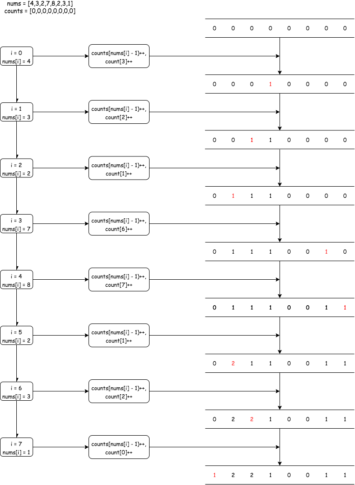
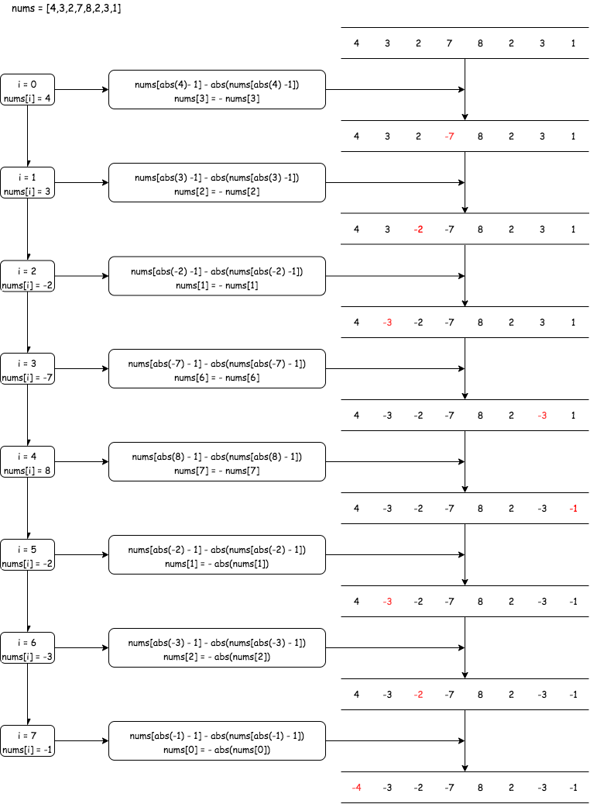

## 找到所有数组中消失的数字

---
1. 题目
- 给你一个含 n 个整数的数组 nums ，其中 nums[i] 在区间 [1, n] 内。请你找出所有在 [1, n] 范围内但没有出现在 nums 中的数字，并以数组的形式返回结果

```md
输入：nums = [4,3,2,7,8,2,3,1]
输出：[5,6]
```

```md
输入：nums = [1,1]
输出：[2]
```

- 进阶：你能在不使用额外空间且时间复杂度为 O(n) 的情况下解决这个问题吗? 你可以假定返回的数组不算在额外空间内

2. 分析
- 那么这个问题该如何来思考呢？首先，nums中出现的数都是在 [1,n] 这个范围里面的；并且数组中最大的数不会超过它的下标，所以我们可以让每个数对应的下标上的值改变，这样下标上的值没改变的，就说明这个数组里面没出现的值了

- 第一种方法，我们初始化一个长度为 n 的数组 counts，遍历 nums，将 counts[nums[i]] ++，而没有改变的元素，就是没出现过的了



```js
var findDisappearedNumbers = function(nums) {
    const counts = new Array(nums.length).fill(0);
    const res = [];
    for(let i = 0;i<nums.length;i++){
        // nums 的 index 为 0 ~ nums.length - 1，而元素的范围为 1 ~ nums.length
        counts[nums[i]- 1]++
    }

    for(let i = 0;i<counts.length;i++){
        if(counts[i] === 0){
            res.push(i + 1)
        }
    }

    return res
}
```

- 第二种方法，直接在原数组上操作，这样就可以不适用额外的空间。我们将出现过的元素作为索引，nums[nums[i]] = -nums[nums[i]]，只要有对应的值出现，那么该对应的值就会变成负数，这样没改变的就是没出现过的值了(需要注意的是，某个元素可能出现多次，偶数次的情况下，该值还会被改回正数，因此要获取原来的元素值)




```js
var findDisappearedNumbers = function(nums) {
    const { abs } = Math;
    const res = [];
    for(let i = 0;i<nums.length;i++){
        nums[abs(nums[i]) - 1] = - abs(nums[abs(nums[i]) - 1])
    }

    for(let i = 0;i<nums.length;i++){
        if(nums[i] > 0){
            res.push(i + 1)
        }
    }

    return res
}

```
