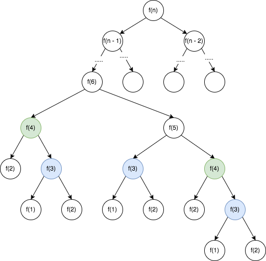

## 爬楼梯

---
1. 题目
- 假设说你正在爬楼梯，需要 n 阶你才能到达楼梯。每次你可以爬 1 或 2 个阶梯，你有多少种方式可以爬到楼梯顶呢？(n是一个正整数)

```md
输入：2
输出：2
解答：有两种方法可以爬楼梯

1. 1阶 + 1阶 / 每次只走一个台阶
2. 2阶 / 每次走两个台阶
```

```md
输入：3
输出：3
解答：有三种方法可以爬楼梯

1. 1阶 + 1阶 + 1阶 / 每次只走一个台阶，一共走三次
2. 2阶 + 1阶 / 第一次走两个台阶，第二次走一个台阶
3. 1阶 + 2阶 / 第一次走一个台阶，第二次走两个台阶
```
2. 分析
- 根据题目分析，当我们开始爬楼梯时，第一步我们只有两种走法：走一个台阶或者走两个台阶。如果要爬完这 n 个台阶，它就等于 *走第一步走一个台阶的总步数* + *走第一步走两个台阶的总步数* 的和，用公式表示就是 *f(n-1) + f(n-2)*

```md
f(1) = 1
f(2) = 2
f(3) = 3 = f(1) + f(2)
f(4) = 5 = f(2) + f(3)
...
f(n) = f(n -1) + f(n - 2)
```

- 那么，可以看出来它与 *斐波那契数列* 的表达式是一样的，那么我们就可以用递归去解决它，那么这个题目里面，这个递归的终止条件就是 `n = 1  n = 2`
3. 解法
- 使用递归的方式求解，它是一种自顶向下的求解结果，从顶层的进行一层层的分解，再将求得的结果一层层的向上累加
```js
function climbStairs(n){
  if(n === 1) return 1;
  if(n === 2) return 2;
  return climbStairs(n - 1) + climbStairs(n - 2)
}
```



- 上述使用递归的方式，时间复杂度是 O(n^2)，并且还有一些问题是，在这里面，有许多的过程经过了重复的计算，如上图所示，以f(6)为例，其中f(3)、f(4)经过了多次的重复计算。因此，我们可以考虑将这些已经计算过的结果缓存起来
```js
let stairMap = [];

function climbStairs(n){
  if(n === 1) return 1;
  if(n === 2) return 2;
  if(stairMap[n]){
    return stairMap[n]
  } else {
    let result = climbStairs(n - 1) + climbStairs(n - 2);
    stairMap[n] = result;
    return result
  }
}
```
- 使用递归的方式，它的时间复杂度降到了 O(n)，空间复杂度也是 O(n)。那么，如果使用循环的方式去求得结果呢？循环的方式，已知的条件是 `n = 1  n = 2` 时的结果、n的值，那么就需要自底向上的求得结果

```md
f(1) = 1
f(2) = 2
f(3) = 3 = f(1) + f(2)
f(4) = 5 = f(2) + f(3)
...
f(n) = f(n -1) + f(n - 2)
```

- 从表达式能够看出，每个f(n)都需要两个值，也就是f(n - 1) 与 f(n - 2)
```js
function climbStairs(n){
  if(n === 1) return 1;
  if(n === 2) return 2;

  let result = 0;
  let prePrev = 1;
  let prev = 2;

  for(let i = 3;i<=n;i++){
    result = prev + prePrev;
    prePrev = prev;
    prev = result;
  }

  return result

}

// function climbStairs(n){
//   if(n === 1) return 1;
//   if(n === 2) return 2;

//   let result = 0;
//   let n1 = 1;
//   let n2 = 1;
//   let n3 = 2

//   for(let i = 3;i<=n;i++){
//     result = n1 + n2 + n3;
//     n1 = n2;
//     n2 = n3;
//     n3 = result;
//   }

//   return result

// }

// function climbStairs(n){
//   let result = 1;
//   let prePrev = 0;
//   let prev = 0;

//   for(let i = 0;i<n;i++){
//     prePrev = prev;
//     prev = result;
//     result = prev + prePrev;
//   }
//   return result
// }
```
- 还可以根据数组的结构来求值，代码更加简单
```js
var climbStairs = (n) => {
  let result = [1,2];

  for(let i = 2;i<n;i++){
    result[i] = result[i - 1] + result[i - 2]
  }

  return result[n]
}
```
4. 斐波那契数列
- 斐波那契数列跟爬楼底其实是差不多的，不过它的终止条件是 `n = 0,result = 0;n = 1,result = 1;...;n = n,result = result[n - 1] + result[n - 2]`。具体的解题过程完全可以用上述思路来进行求解
