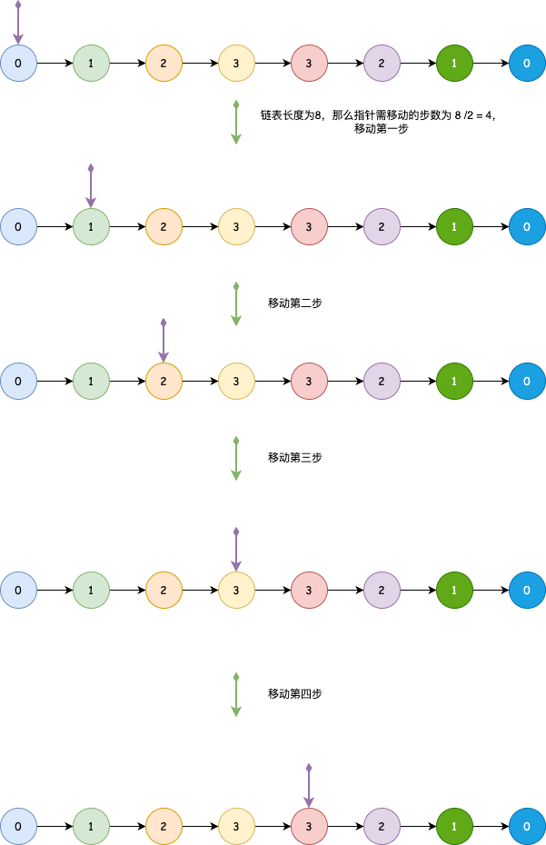
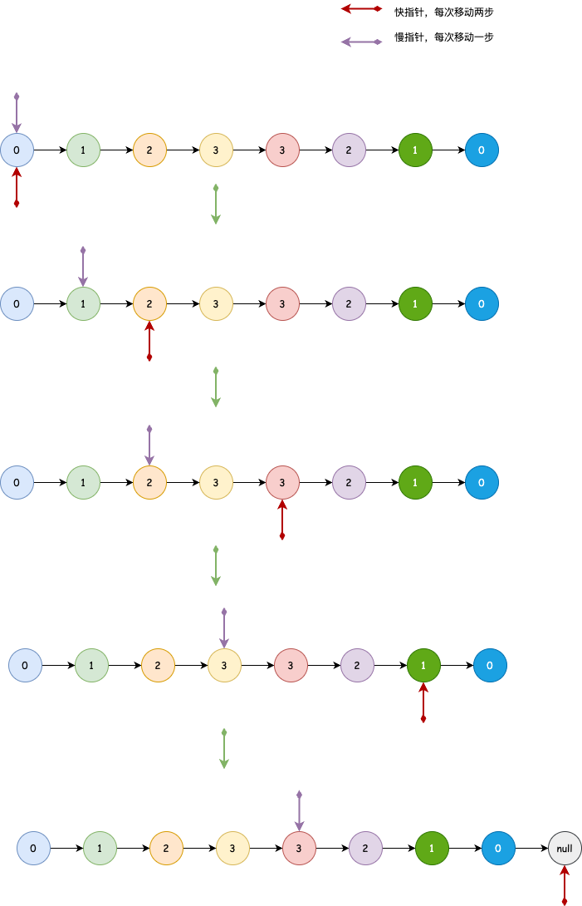

## 链表的中间结点
---
1. 题目
- 给你单链表的头结点 head ，请你找出并返回链表的中间结点。如果有两个中间结点，则返回第二个中间结点。

```md
输入：head = [1,2,3,4,5]
输出：[3,4,5]
解释：链表只有一个中间结点，值为 3 。
```

```md
输入：head = [1,2,3,4,5,6]
输出：[4,5,6]
解释：该链表有两个中间结点，值分别为 3 和 4 ，返回第二个结点。
```

2. 分析
- 依据题目分析，如果是取中间节点的话，我们可以取链表的长度的一半，然后让指针遍历这个值，所得到的即为题目要求



```js
var middleNode = function(head) {
    let len = 0,point = head,step = 0;

    while(point) {
        len++;
        point = point.next;
    }

    step = Math.floor(len / 2);
    point = head;

    for(let i =0;i<step;i++) {
        point = point.next;
    }

    return point;
};
```

- 这样的话，经过了两次循环，它的空间复杂度为 O(1)，时间复杂度为 O(n)；那么，有没有什么方法可以只遍历一次就获得中间节点呢？结合上一题 [LeetCode-234(回文链表)](./lc234.md) 的思路，我们可以使用快慢指针的方式来处理。
- 以快指针走两步，慢指针走一步的节奏来遍历，当快指针走到链表的尾结点或 null 时(尾结点意味着链表的长度是奇数，null 意味着链表的长度是偶数)



```js
var middleNode = function(head) {
    let fast = head,slow = head;

    while(fast !== null && fast.next !== null) {
        fast = fast.next.next;
        slow = slow.next;
    }

    return slow;
}
```