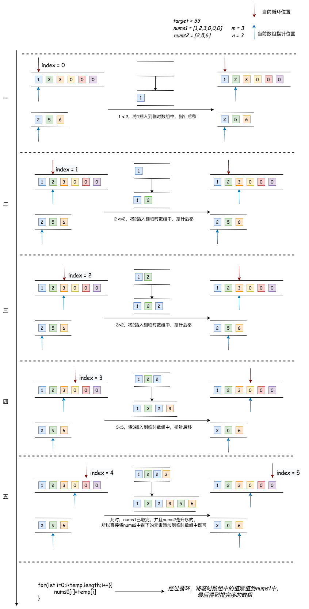
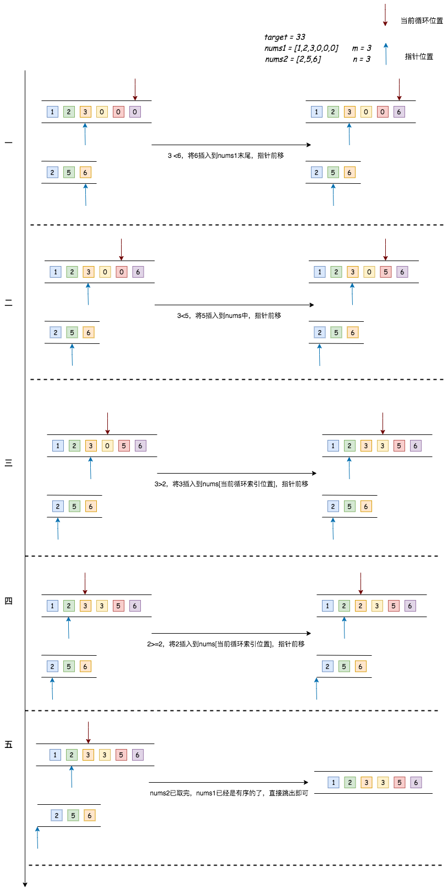

## 合并两个有序数组

---
1. 题目
- 给你两个按 **非递减顺序** 排列的整数数组 nums1 和 nums2，另有两个整数 m 和 n，分别表示 nums1 和 nums2 中的元素数目，请你 合并 nums2 到 nums1 中，使合并后的数组同样按 **非递减顺序** 排列。
- 注意：最终，合并后数组不应由函数返回，而是存储在数组 nums1 中。为了应对这种情况，nums1 的初始长度为 m + n，其中前 m 个元素表示应合并的元素，后 n 个元素为 0 ，应忽略。nums2 的长度为 n 

```md
输入：nums1 = [1,2,3,0,0,0], m = 3, nums2 = [2,5,6], n = 3

输出：[1,2,2,3,5,6]

解释：需要合并 [1,2,3] 和 [2,5,6]。合并结果是 [1*,2*,2,3*,5,6] ，其中加*标注的为 nums1 中的元素。
```

```md
输入：nums1 = [1], m = 1, nums2 = [], n = 0
输出：[1]
解释：需要合并 [1] 和 []。合并结果是 [1]
```

```md
输入：nums1 = [0], m = 0, nums2 = [1], n = 1
输出：[1]
解释：需要合并的数组是 [] 和 [1]。合并结果是 [1]。注意，因为 m = 0 ，所以 nums1 中没有元素。nums1 中仅存的 0 仅仅是为了确保合并结果可以顺利存放到 nums1 中。
```
2. 分析
- 有题目可知，两个原数组都是升序排列的，并且，需要将第二个数组的元素与第一个数组的元素进行比较并插入其中。那么首先要将两个数组进行合并，然后再对它们进行排序

```js
function merge(nums1, m, nums2, n) {
  for(let i = 0;i<n;i++){
    nums1[m+i] = nums2[i]
    // 合并nums2中的元素
  }
  return nums1.sort((a,b)=>a-b)
  // 对nums1进行排序
}
```
- 那么这种方法其实是有问题的，在原本给出的数组中，这两个数组其实是已经有序的。而在合并以后，数组变成无序的并且还重新进行了排序，并没有充分利用上它的有序性
- 我们利用双指针的方式，每次都从两个原数组各取出一个元素进行比较，将较小的那个元素添加到临时数组中，并且将它(较小值)所在的数组的指针向后移动，继续与另一个原数组进行比较，每当比较出一个较小的值，就将它所在的数组的指针向后移动，并将这个值添加到临时数组中，再将这个临时数组一一赋值到 nums1 中



```js
function merge(nums1, m, nums2, n) {
  let nums1Index = 0,nums2Index = 0,temp = [];

  for(let i=0;i<m+n;i++){
    if(nums1Index >=m){
      temp[i] = nums2[nums2Index++]
      // nums1Index >= m，说明nums1数组已取完，这时候直接取nums2的元素即可
    } else if(nums2Index >=n){
      temp[i] = nums1[nums1Index++]
      // nums2Index >= n，说明nums2数组已取完，这时候直接取nums1的元素即可
    } else if(nums1[nums1Index] > nums2[nums2Index]){
      temp[i] = nums2[nums2Index++]
      // 如果nums1的元素大于nums2的元素，则将nums2[nums2Index]添加到临时数组中
      // 并将nums2Index++，也就是nums2指针后移
    } else {
      temp[i] = nums1[nums1Index++]
      // 如果nums1的元素小于等于nums2的元素，则将nums1[nums1Index]添加到临时数组中
      // 并将nums1Index++，也就是nums1指针后移
    }
  }

  // 将升序排列的有序数组temp一一赋值给nums2

  for(let i=0;i<temp.length;i++){
    nums1[i]=temp[i]
  }

  return nums1
}
```
- 可以看到，这个解法引入了一个临时数组，并且最后还做一次循环，那是否可以避免这种情况呢？nums1最后是要被返回的，并且类似 `[1,2,3,0,0,0]` 后面的 0 完全可以利用起来，那么我们可以还是采用双指针的方式。因为原数组都是升序的，我们的指针可以从它的末端有效元素开始



```js
function merge(nums1, m, nums2, n) {
  let nums1Index = m - 1,nums2Index = n - 1;

  for(let i=m+n-1;i>=0;i--){
    if(nums1Index <0){
      nums1[i] = nums2[nums2Index--]
    } else if(nums2Index <0){
      break;
    } else if(nums1[nums1Index] > nums2[nums2Index]){
      nums1[i] = nums1[nums1Index--]
    } else {
      nums1[i] = nums2[nums2Index--]
    }
  }

  return nums1
}
```
