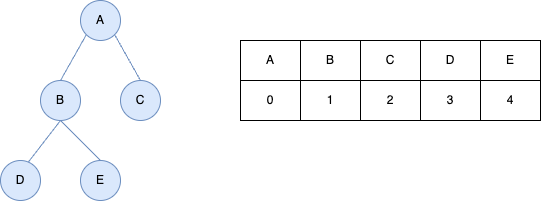
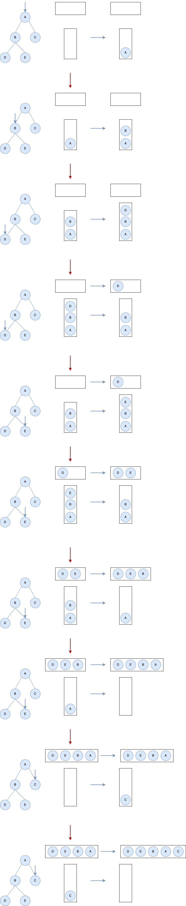

## 二叉树的中序遍历
---
1. 题目
- 给定一个二叉树的根节点 root ，返回 它的 中序 遍历

```md
输入：root = [1,null,2,3]
输出：[1,3,2]
```

```md
输入：root = []
输出：[]
```

```md
输入：root = [1]
输出：[1]
```

2. 分析
- 中序遍历是先中序遍历左子树，在访问根结点，在访问右子树(需要注意输出顺序，访问并不代表输出，在左子树存在的情况下，先访问根结点，输出完左子树后，再输出根结点)



- 以上述树为例，它的中序遍历顺序为 DBEAC，

```js
// 递归的实现方式
var inorderTraversal = function(root,res) {
    if(!res) res = [];
    if(root === null) return [];
    inorderTraversal(root.left,res);
    res.push(root.val);
    inorderTraversal(root.right,res);
    return res
};
```



```js
// 循环的实现方式
var inorderTraversal = function(root) {
    let res = [],stack = [];
    while(root !== null || stack.length) {
        while(root) {
            stack.push(root);
            root = root.left;
        }

        root = stack.pop();
        res.push(root.val);
        root = root.right;
    }
    return res;
};
```