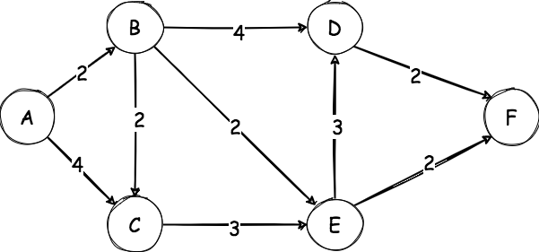
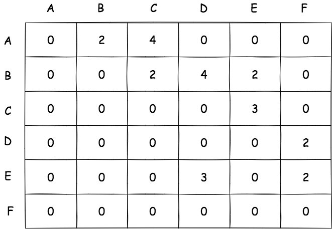
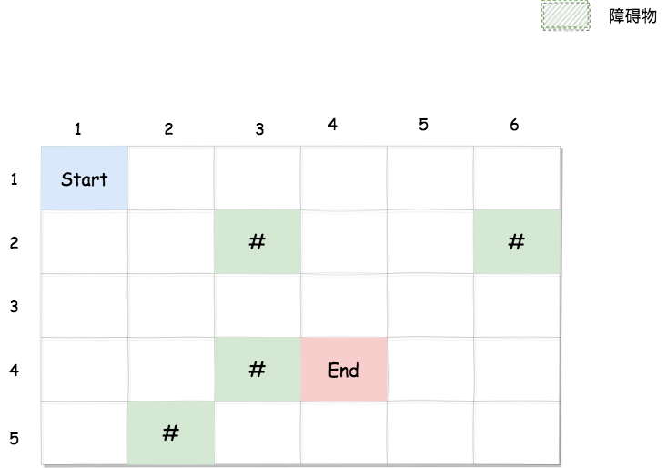
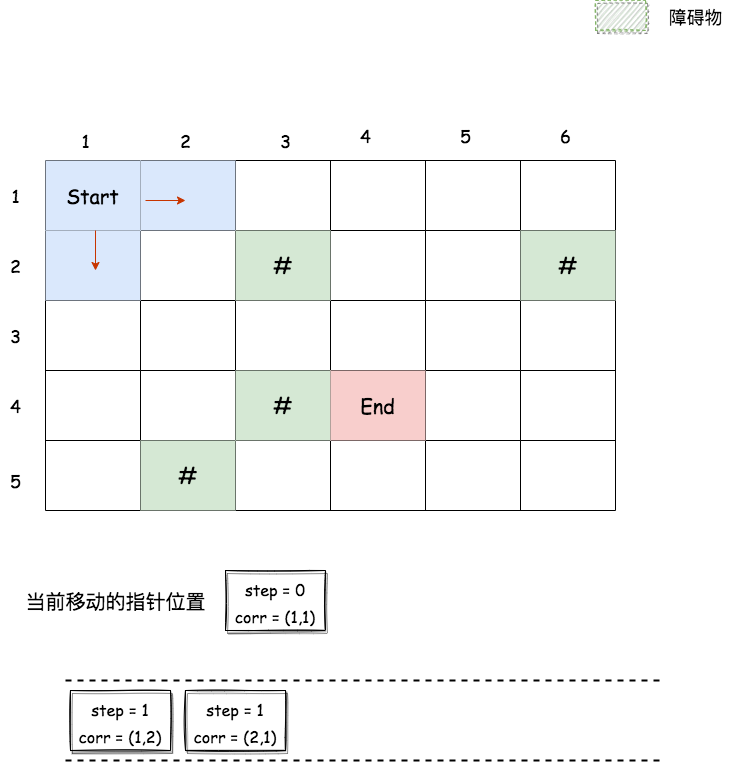
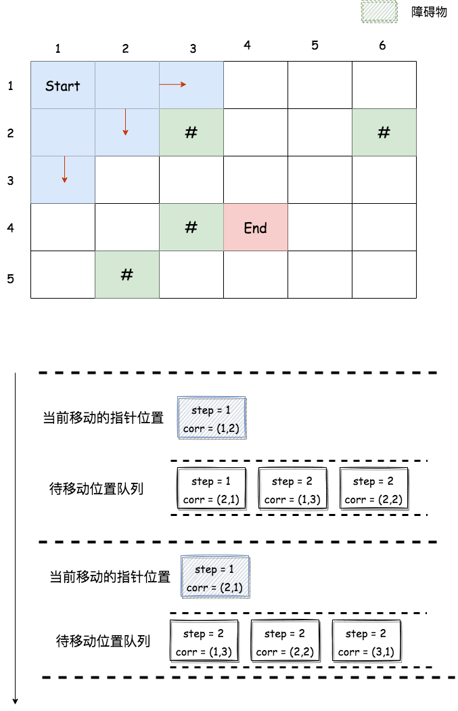

## Dijkstra算法
---
1. 描述
- 它是一种计算单个源到所有其它源的最短路径的贪心算法，可以用于计算从图的一个顶点到其余各顶点的最短路径



- 以上面这个图为例，如何计算从顶点A和其余顶点之间的最短路径呢?这里我们以它的邻接矩阵来做操作



```js
const graph = [
  [0,2,4,0,0,0],
  [0,0,2,4,2,0],
  [0,0,0,0,3,0],
  [0,0,0,0,0,2],
  [0,0,0,3,0,2],
  [0,0,0,0,0,0]
]
```

2. 代码实现
```js
let maxValue = Number.MAX_VALUE;

function minDistance(dist,visited){
  let min = maxValue;
  let minIndex = -1;

  for(let i = 0;i<dist.length;i++){
    if(visited[i] === false && dist[i] <= min){
      // 如果是从未到过的节点
      min = dist[i];
      minIndex = i;
    }
  }
  return minIndex
}
function dijkstra(graph,src){
  const dist = [];
  // 声明一张表，用来存放点之间的路径

  const visited = [];
  // 用于存放已访问过的点

  let length = graph.length;
  // let maxValue = Number.MAX_VALUE;


  for(let i = 0;i<length;i++){
    dist[i] = maxValue;
    // 将所有的距离初始化为最大值
    visited[i] = false;
    // 所有访问状态置为未访问
  }

  dist[src] = 0;
  // 将起点到自己的距离设置为0

  for(let i = 0;i<length;i++){
    const u = minDistance(dist,visited);
    visited[u] = true;

    for(let v = 0;v<length;v++){
      if(!visited[v] && graph[u][v] !==0 && dist[u]!== maxValue && 
      (dist[v] > dist[u] + graph[u][v])){
        dist[v] = dist[u] + graph[u][v]
      }
    }
  }

  console.log(dist)

}
```

## 走迷宫问题
---
1. 问题
- 迷宫由 n 行 m 列的单元格组成，每个单元格要么是空地，要么是障碍物。现需要找到一条从起点到终点的最短路径长度。注意：不能走到障碍物或迷宫外面去



2. 分析
- 使用广度搜索算法来分析此题，需要引入一个队列，队列存放走过的格子(步数+坐标)以及这个格子能到达的格子，如图所示，直到到达终点或队列为空
- 除了不能超出地图和越过障碍物以外，我们需要将已经走过的点设置为已经访问过，也就是不允许走回头路
- 从起点开始，指针 S 只能往下或者往右走，因此将这两个位置添加到队列中。(这里以x代表行坐标，y代指列坐标)
```js
let operate = {
  step:0,
  corr:{x:1,y:1}
}

const waitQueue = [
  {
    step:0,
    corr:{x:1,y:1}
  },
  {
    step:1,
    corr:{x:1,y:2}
  },
  {
    step:1,
    corr:{x:2,y:1}
  }
]

// waitQueue.dequeue()
waitQueue = [
  {
    step:1,
    corr:{x:1,y:2}
  },
  {
    step:1,
    corr:{x:2,y:1}
  }
]
```




- 这时候指针指向的位置可拓展的其他位置已经拓展完了，这时候就需要将队列里面的其他位置拿出来继续拓展了。接下来，将指针 S 指向队首的元素，从图中可以看到，`(1,2)` 位置只能向右或者向下走，同样将这两个拓展的位置添加到队列中，拓展完毕，将队首元素出队
```js
// operate = waitQueue.peek()
operate = {
  step:1,
  corr:{x:1,y:2}
}

// waitQueue.add({step:2,corr:{x:1,y:3}})
// waitQueue.add({step:2,corr:{x:2,y:2}})

waitQueue = [
  {
    step:1,
    corr:{x:1,y:2}
  },
  {
    step:1,
    corr:{x:2,y:1}
  },
  {
    step:2,
    corr:{x:1,y:3}
  },
  {
    step:2,
    corr:{x:2,y:2}
  },
]

// 拓展完成，将队首元素出队
// waitQueue.dequeue()

waitQueue = [
  {
    step:1,
    corr:{x:2,y:1}
  },
  {
    step:2,
    corr:{x:1,y:3}
  },
  {
    step:2,
    corr:{x:2,y:2}
  },
]

```
- 这时指针 S 指向 `(2,1)`，从图中可以看到，`(1,2)` 位置只能向右或者向下走，而右边的位置已经走过了，因此不用重复走了，拓展完毕，进行出队操作

```js
// operate = waitQueue.peak()
operate = {
  step:1,
  corr:{x:2,y:1}
}

// waitQueue.add({step:2,corr:{x:3,y:1}})

waitQueue = [
  {
    step:1,
    corr:{x:2,y:1}
  },
  {
    step:2,
    corr:{x:1,y:3}
  },
  {
    step:2,
    corr:{x:2,y:2}
  },
  {
    step:2,
    corr:{x:3,y:1}
  }
]

// 拓展完成，将队首元素出队
// waitQueue.dequeue()

waitQueue = [
  {
    step:2,
    corr:{x:1,y:3}
  },
  {
    step:2,
    corr:{x:2,y:2}
  },
  {
    step:2,
    corr:{x:3,y:1}
  }
]
```



- 重复以上操作，每次一个位置拓展完毕或者不能拓展新的位置，就将该位置从队列中出队。重复拓展指针位置能拓展的所有位置，直到找到终点或者队列为空
3. 代码结构
```js
const map = [
  [0,1,1,0,0,0,0],
  [0,0,0,0,1,0,0],
  [0,0,1,0,0,0,0],
  [0,0,0,0,1,1,0],
  [0,1,0,0,0,0,1],
  [0,0,0,1,0,0,0]
]

function findPath(node){
  let str = '';
  console.log(node)
  let queue = node;

  while(queue.hasOwnProperty('prevOrigin')){
    str = `-> (${queue.x},${queue.y})` + str;
    queue = queue.prevOrigin
  }

  // while(queue.length > 0){
  //   str += `(${queue[0].x},${queue[0].y}) -> `;
  //   console.log(queue[0].prevOrigin)
  //   if(queue[0].prevOrigin){
  //     queue.push(node.prevOrigin)
  //   }
  //   queue.shift()
  // }

  console.log(`(${queue.x},${queue.y})` + str)

}

function labyrinth(
  m = map.length,
  n = map[0].length,
  startX,
  startY,
  endX,
  endY,
  mazeMap = map
){

  if(startX >=m || startY >=n || endX >=m || endY >=n){
    throw new Error('起点或终点超出当前地图!')
  }

  if(mazeMap[startX][startY] === 1 || mazeMap[endX][endX] === 1){
    throw new Error('起点或终点不能与障碍物重叠!')
  }


  const positionX = [0,1,0,-1];
  const positionY = [1,0,-1,0];
  // 定义四个方向：右下左上

  const queue = [];
  // 队列。用于拓展没有走过的位置

  const visitList = [];
  // 迷宫访问过的标识数组

  let startPoint = {
    x:startX,
    y:startY,
    step:0
  }
  // 起点坐标位置

  for(let i=0;i<m;i++){
    visitList[i]=[]
    for(let j=0;j<n;j++){
      visitList[i][j] = 0;
    }
  }
  // 将visitList中所有的坐标位的访问情况设置为0

  queue.push(startPoint);
  // 起点坐标入队

  visitList[startX][startY] = 1;
  // 起点坐标被访问过了，将标识位设为1

  while(queue.length){
    // 当队列不为空时
    let x = queue[0].x;
    let y = queue[0].y;
    // 获取队头元素坐标位置
    if(x === endX && y === endY){
      // 当当前位置与终点坐标一致时，结束循环
      console.log(`最短路径为${queue[0].step}`,queue,findPath(queue[0]))
      return queue[0].step;
    }

    for(let k=0;k<=3;k++){
      // 每个点可以往右下左上四个方向移动

      let willX = x + positionX[k];
      let willY = y + positionY[k];
      // 移动后的坐标位置

      if(willX < 0 || willY <0 || willX >=m || willY >=n){
        // 如果当前位置超出边界，不进入后续逻辑
        continue;
      }

      if(mazeMap[willX][willY] === 0 && visitList[willX][willY] === 0){
        // 如果拓展的位置不是障碍物并且没有被访问过，则它拓展到队列中
        let temp = {
          x:willX,
          y:willY,
          step:queue[0].step + 1,
          prevOrigin:queue[0]
        }
        queue.push(temp);
        visitList[willX][willY] = 1;
        // 在访问位置列表中将该点位置的访问情况置为已访问
      }
    }

    queue.shift()
    // 重复从队列中取出坐标位置
  }
}
```
---
## 
