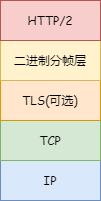

## http/2
---
1. http/1.1 核心问题
- http/1.1 优化了资源加载速度，但它的核心问题是 **对带宽的利用率并不理想**。带宽指每秒最大能发送或者接收的字节数，其中每秒能发送的最大字节数称为 **上行带宽**，每秒能接收的最大字节数称为 **下行带宽**

2. 带宽利用率低的原因
- 第一个原因，TCP 的慢启动策略，它用于减少网络阻塞。一旦一个 TCP 连接建立之后，就进入了发送数据状态，刚开始 TCP 协议会采用一个非常慢的速度去发送数据，然后慢慢加快发送数据的速度，直到发送数据的速度达到一个理想状态，我们把这个过程称为慢启动，类似于车启动的过程
- 而页面中常用的一些关键资源(html/css/js)文件是很小的，一般这些文件在 TCP 连接建立好之后就要发起请求的，但这个过程是慢启动，所以耗费的时间比正常的时间要多很多，这样就推迟了宝贵的首次渲染页面的时长了

- 第二个原因，同时开启多个 TCP 连接，这些连接会竞争固定的带宽资源。而 TCP 又无法协商让那些关键资源优先下载，一些视频等资源的下载就会影响关键资源的下载速度

- 第三个原因，http/1.1队头阻塞的问题。由于一个 tcp 连接同时只能处理一个请求，当某个请求因为其他原因阻塞了，那么后续排队的请求都要延迟等待
- 出现队头阻塞的原因，实际上还是 TCP 的问题，因为在 TCP 的传输阶段，也就是将上层(tls层之上)的数据包分成多个编号的份数 a、b、c等，如果 b 包数据丢失，而 a、c包数据收到了，在超时重传时间到了还没收到 b 包数据的确认，那么服务端会重新发送 b 包，直到客户端收到并发出确认以后，服务端才会发送其他数据，客户端数据才会呈现给上层，这样 tcp 阻塞就发生了

3. http/2 的多路复用
- http/2 提出一个域名只使用一个 tcp 长连接来传输数据，这样整个页面资源的下载速度只需要一次慢启动，同时也避免了多个 tcp 连接竞争所带来的问题
- http/2 通过 Stream 这个设计，多个 Stream 复用一条 TCP 连接，达到并发的效果，解决了 HTTP/1.1 队头阻塞的问题，提高了 HTTP 传输的吞吐量
- http/2 实现了资源的并行请求，它可以任何时候将请求发送出去，而并不需要等待其他的请求的完成，然后服务器也可以随时返回处理好的请求资源给浏览器
- http/2 添加了一个二进制分帧层，如图所示



- 客户端的请求经过 **二进制分帧层** 处理之后，会被转换为一个个带有请求id编号的帧，通过协议栈将这些帧发送到服务器，服务器收到所有帧后，会将所有相同 ID 的帧合并为一条完整的请求信息，处理完成之后，响应结果也会被 **二进制分帧层** 转换为一个个带有请求id的帧，通过同样的方式发送到客户端，客户端收到后会根据 ID 编号将帧的数据提交给对应的请求
- 也就是说，http/2 会将每个请求都拆分成帧通过一个 tcp 连接同时传输，这样即使一个请求被阻塞了，也不会影响其他的请求


- http 消息可以由多个 frame 组成，一个 frame 可以由多个 tcp 报文组成。不同 stream 的帧是可以乱序发送的，每个帧的头部会携带 Stream ID 信息，所以接收端可以通过 Stream ID 有序组装成 HTTP 消息，而同一 Stream 内部的帧必须是严格有序的

4. 其他特性 - 可以设置请求的优先级
- 在浏览器中，发送请求时，重要的请求可能会晚于那些不怎么重要的请求，如果服务器按照请求的顺序来回复数据，那么这个重要的数据就有可能推迟很久才能送达浏览器。而 http/2 允许设置请求优先级，标上该请求的优先级，服务器收到请求以后会优先处理优先级高的请求

5. 其他特性 - 服务器推送

- http/2 还支持服务器直接向浏览器推送数据。对于页面来说，请求的 html 文件里面会存在引用的 js、css 文件，一般是在浏览器解析 html 的时候，遇到相应的资源标签再去请求并下载它，资源过大的会延迟页面的渲染时间

- 而使用 http/2，服务器可以提前解析出该 html 需要哪些 js/css 文件，在接收到浏览器请求页面后，附带将要使用的资源文件一并发送给浏览器，这样就省去了在解析 html 的时候再去下载这些资源文件了，而是直接进行解析已经加载好的资源文件，这样可以有效地提升首屏的渲染时间

```nginx
<!-- nginx 中的实现，在访问 index.html 服务器直接推送 css 文件 -->
location /index.html {
  httm2_push /test.css;
}
```

6. 其他特性 - 头部压缩
- http/2 仍然使用请求头和响应头，这意味着在原来的请求基础上，我们并不需要做什么改动。HTTP/2 会压缩头（Header），这样请求头大小可以有效减小，提升了传输效率(**很多情况下我们其实都是在发送 header，包括 body 的情况较少**)。如果你同时发出多个请求，他们的请求头是一样的或是相似的，那么，协议会帮你消除重复的部分
- 这就是所谓的 HPACK 算法：在客户端和服务器同时维护一张头信息表，所有字段都会存入这个表，生成一个索引号，以后就不发送同样字段了，只发送索引号，这样就提高速度了

7. 二进制帧(frame)
- http/2 将 http/1 的文本格式改成二进制格式传输数据，极大的提高了 http 传输效率，并且二进制数据使用位运算能高效解析


- http/2 把响应报文拆分成了两种帧，请求头+请求行组成 HEADERS frame(首部)，请求体组成 DATA frame(消息负债)，也就是说一条 HTTP 响应，划分成了两类帧来传输，并且采用二进制来编码

- 帧是 http/2 中数据传输的最小单位，它细分表达了 http/1.x 中的各个部分，也优化和增加了 http/1.x 不足的地方。其中帧分为 **帧头** 和 **帧数据**。其中帧头(9个字节)包含几个字段，有 **length(帧数据(frame playload)长度,3字节)**、**type(帧类型,1字节)**、**flags(标志位,1字节)**、**stream identifier(流标识符4字节)**等


- http/2 总共定义了 10 种类型的帧，一般分为数据帧和控制帧两类

|帧类型|描述|类别|
|---|---|---|
|DATA|传递 http 包体|<font color="red">数据帧</font>|
|HEADERS|传递 http 头部|<font color="red">数据帧</font>|
|PRIORITY|设置 stream 流的优先级|<font color="red">数据帧</font>|
|RST_STREAM|终止 stream 流|<font color="green">控制帧</font>|
|SETTINGS|修改连接或者 stream 流的配置|<font color="green">控制帧</font>|
|PUSH_PROMISE|服务器推送资源时描述请求的帧|<font color="green">控制帧</font>|
|PING|心跳检测，兼具计算 rtt 往返时间的功能|<font color="green">控制帧</font>|
|GOAWAY|优雅的终止连接或者通知错误|<font color="green">控制帧</font>|
|WINDOW_UPDATE|实现流量控制|<font color="green">控制帧</font>|
|CONTINUATION|传递大 http 头部时的持续帧|<font color="green">控制帧</font>|

- 标志位可以保存 8 个标志位，用于携带简单的控制信息，比如 END_HEADERS 表示头数据结束标志，相当于 http/1 里头后的空行；END_STREAM 表示单方向数据发送结束，后续不会再有数据帧；PRIORITY 表示流的优先级
- 流标识符用于标识该 Frame 属于那个 stream，接收方可以从这个信息从乱序的帧里找到相同的 stream id 的帧，从而有序组装信息
- 最后就是帧数据了，它存放的是通过 HPACK 算法压缩过的 http 头部和包体

- 这样虽然对人不友好，但是对计算机非常友好，因为计算机只懂二进制，那么收到报文后，无需再将明文的报文转成二进制，而是直接解析二进制报文，这增加了数据传输的效率