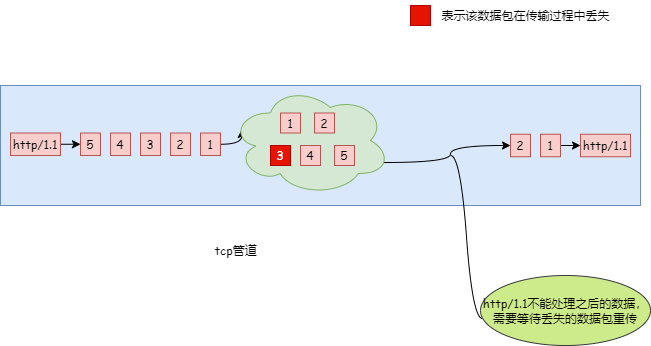
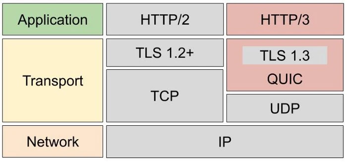
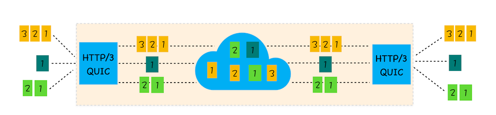

## http/3
---
1. 相较于http/1.1
- http/2 应用了多路复用技术，因此它可以通过一个 tcp 连接来发送多个 url 请求。在 HTTP/1.1 时代，为了提升并行下载效率，浏览器为每个域名维护了 6 个 TCP 连接；而采用 HTTP/2 之后，浏览器只需要为每个域名维护 1 个 TCP 持久连接，同时还解决了 HTTP/1.1 队头阻塞的问题

2. tcp 的队头阻塞
- http/2 解决了应用层面的队头阻塞问题，但它依然采用的 tcp 协议。在 tcp 连接中，计算机的一端将要传输的数据按照顺序放入管道，最终数据会以相同的顺序出现在管道的另外一头
- 从一端发送给另外一端的数据会被拆分为一个个按照顺序排列的数据包，这些数据包通过网络传输到了接收端，接收端再按照顺序将这些数据包组合成原始数据，这样就完成了数据传输
- 但是，如果在这过程中，有一个数据包因为网络或其他原因而产生了丢包，那么这个 tcp 的连接会处于暂停状态，这个 tcp 连接中的所有 http 请求都需要等待丢失的数据包被重新传输过来
- tcp 层必须保证收到的字节流是完整且连续的，而此时某个包在网络中丢失了，那么就需要等待这个包被重传回来，这样内核才会将缓冲区里的数据返回给 http 应用

- 这种情况下，由于单个数据包的丢失而造成的堵塞称为 tcp上的队头堵塞。在 http/2 中，多个请求是复用一个 tcp 连接的，如果其中任意一路数据流出现了丢包的情况，那么就会阻塞该 tcp 连接中的所有请求

- 显然 http/1.1 是不一样的，因为即使某个 tcp 连接出现了队头阻塞的情况，并不会影响其他的 5 个 tcp 连接

3. tcp 建立连接的延时/拥塞控制
- 除了 tcp 队头阻塞外，tcp 的握手过程也是影响传输效率的一个重要因素。其中涉及到网络延迟(RTT)的概念，通常情况下把从浏览器发送一个数据包到服务器，在从服务器返回数据包到浏览器的整个往返时间称为 RTT
- 通常情况下，tcp 的三次握手确认连接成功，需要消耗 1.5 个 RTT 才能进行数据传输。如果采用 https 的话，还需要进行 tls 连接，两个版本(tls1.2、tls1.3) 建立连接所花的时间大致是 1-2 个 RTT。如果请求双方的物理距离较短的话，1 个 RTT 大概是 10ms 内；较远的话，1 个 RTT 大概是 100ms 以上
- 另外，TCP 由于具有「拥塞控制」的特性，所以刚建立连接的 TCP 会有个「慢启动」的过程，它会对 TCP 连接产生"减速"效果

4. tcp 协议僵化
- 数据的传输依赖于互联网中的众多网络设备，它们又被叫做 **中间设备**。这些设备通常依赖一些很少升级的软件，这些软件使用了大量的 TCP 特性，这些功能被设置之后就很少更新了
- 所以，如果我们在客户端升级了 TCP 协议，但是当新协议的数据包经过这些中间设备时，它们可能不理解包的内容，于是这些数据就会被丢弃掉。这就是中间设备僵化，它是阻碍 TCP 更新的一大障碍
- 除了中间设备僵化外，操作系统也是导致 TCP 协议僵化的另外一个原因。因为 TCP 协议都是通过操作系统内核来实现的，应用程序只能使用不能修改。通常操作系统的更新都滞后于软件的更新，因此要想自由地更新内核中的 TCP 协议也是非常困难的

5. udp的特点
- Udp 是一个简单、不可靠的协议，并且 udp 包之间是无序的，也没有依赖关系。udp 之间是不需要连接的，也就不需要握手和挥手的过程，所以天然就比 tcp 快
- 那么，http/2 队头阻塞的问题是因为 tcp，http/3 则把 http 下层的 tcp 协议改成了 udp。udp 是不管丢包、顺序的，所以不会出现 http/2 队头阻塞的问题
- 不过 http/3 也不仅仅是简单的将传输协议换成了 udp，还基于 udp 协议在应用层实现了 quic 协议，它具有类似 TCP 的连接管理、拥塞窗口、流量控制的网络特性，相当于将不可靠传输的 UDP 协议变成“可靠”的了，所以不用担心数据包丢失的问题

6. 无队头阻塞
- QUIC 实现了同一条物理连接上可以有多个独立的、并发传输的逻辑数据流。QUIC 连接上的多个 stream 之间并没有依赖，都是独立的，某个流发生丢包了，只会影响该流，其他流不受影响
- QUIC 虽然使用的传输协议是 UDP，众所周知 UDP 是不关心数据包的顺序的，而且数据包丢失，UDP 也不关心。不过 QUIC 协议会保证数据包的可靠性，每个数据包都有一个序号唯一标识，当某个流中的一个数据包丢失了，即使该流的其他数据包到达了，数据也无法被 HTTP/3 读取，直到 QUIC 重传丢失的报文，数据才会交给 HTTP/3
- 但其他流的数据报文只要被完整接收，http/3 就可以读取到数据。这不同于 http/2，http/2 只要某个流中的数据丢失了，其他流也会受到影响

7. 更快的连接建立
- 对于 http/1.1、http/2 协议，tcp、tls 是分层的，分别属于内核实现的传输层、openssl 库实现的表示层，因此它们难以合并在一起，需要分批次来握手，先 tcp 握手，再 tls 握手
- 而 http/3 的 QUIC 协议握手过程只需 1 RTT，握手的目的是为确认双方的 **连接ID**，连接迁移(tcp 中的问题，当 ip 或端口号任意一个变了，都需要重新进行 tcp、tls 的握手)就是基于连接 ID 实现的
- QUIC 内部包含了 tls，它在自己的帧会携带 tls 里面的记录，再加上 QUIC 使用的是 TLS1.3，因此仅需 1 个 RTT 就可以「同时」完成建立连接与密钥协商，甚至在第二次连接的时候，应用数据包可以和 QUIC 握手信息（连接信息 + TLS 信息）一起发送，达到 0-RTT 的效果

8. 连接迁移
- 基于 tcp 传输协议的 http 协议，是通过四元组(源ip、源端口、目的ip、目的端口)确定一条 tcp 连接，那么当设备的网络切换时(如手机从 4g 切换成 wifi)，意味着 ip 地址变化了，那么就必须断开连接，然后重新建立连接。而建立连接的过程包含 TCP 三次握手和 TLS 四次握手的时延，以及 TCP 慢启动的减速过程，给用户的感觉就是网络突然卡顿了一下，因此连接的迁移成本是很高的
- 而 QUIC 协议没有用四元组的方式来绑定连接，而是通过连接 id 来标识通信的两个端口，客户端和服务端可以各自选择一组 id 来标识自己。因此即使设备 ip 地址变化了，只要保有上下文信息(连接 id、tls 秘钥等)，就可以无缝的复用原连接，消除了重连的成本

