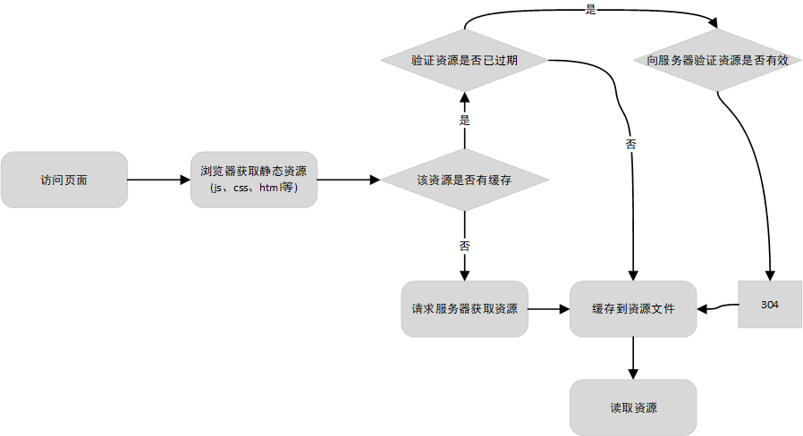

## 缓存

---

1. 浏览器缓存

- 浏览器的缓存是通过 HTTP 协议中的一些特定的字段去控制某个文件是否进行缓存，过期时间等信息

- 浏览器具有两种缓存策略：强缓存、协商缓存

2. 强缓存

- 浏览器在向服务器获取资源之前，首先会查看当前的资源是否命中强缓存，如果命中了强缓存，那么将不会在进行协商缓存，直接从缓存中获取资源内容进行缓存
- 一般使用 **`Expires`** (_http1.0_) 和 **`Cache-Control`** (_http1.1_) 这两个 **响应头** 字段设置某个资源的强缓存
- **`Expires`**：是 _http1.0_ 版本中用于控制强缓存的字段，它的值是一个绝对时间的 _gmt_ 格式的时间字符串。表示该资源的有效时间。但是如果服务器和客户端之间的时间偏差较大，就会出现缓存混乱等情况
- **`Cache-Control`**：是 _http1.1_ 提出的新强缓存策略，是现在最常用的强缓存控制字段。它的值是一个相对时间，例如 _Cache-Control: max-age=90_，代表该资源的有效时间是第一次获取资源后 90 秒失效

| 其他属性值 | 描述                                              |
| ---------- | ------------------------------------------------- |
| no-cache   | 需要进行协商缓存，由服务器确认是否使用缓存        |
| no-store   | 禁止使用缓存，每一次都要重新请求服务器            |
| public     | 可以被所有用户缓存，包括浏览器和 cdn 等中间代理商 |
| private    | 只能对客户端（如浏览器）使用缓存                  |

- 但是为了解决兼容问题，**`Expires`** 和 **`Cache-Control`** 一般是同时设置的。在支持 Cache-Control 的 http 协议中，Cache-Control 的优先级更高

3. 协商缓存

- 协商缓存一般是强缓存没有命中，那么就会进入协商缓存，客户端将当前资源的一些信息携带在请求头的 header 当中，由服务器判断是否使用缓存，如果命中协商缓存，那么将返回 304
- **`Last-Modify/If-Modify-Since`**：浏览器首次请求一个资源的时候，服务器会返回该资源的最后修改时间，通过在响应头的 Last-Modify 属性中返回最后修改时间，浏览器会将该属性值保存起来，在下一次对同样的资源发起请求的时候，会将上一次请求时获取到 Last-Modify 的值携带在请求头的 If-Modify-Since 属性中，如果服务器验证最后修改时间一致，那么将会返回 304。否则就会重新响应新的资源内容以及新的最后修改时间给浏览器
- 但是该属性存在一个缺点：就是返回的值是根据最后修改时间进行判断的，但是如果文件在一个周期内，发生过改变，但是最后还是变回原样，那么最后修改的时间会发生变化，那么会导致协商缓存失效，导致文件内容并没有变化，但是浏览器会重新下载资源。为了解决这个问题，后来就出现了 _ETag/If-None-Match_
- **`ETag/If-None-Match`**：_ETag/If-None-Match_ 返回的是该资源的唯一标识，而且是和资源的内容挂钩的。如果你多次修改文件，但是文件最终的内容还是一样，那么 ETag 的标识码还是一样的。这样就有效的解决了 _Last-Modify/If-Modify-Since_ 的问题。_ETag/If-None-Match_ 和 _Last-Modify/If-Modify-Since_ 的携带方式是一样的

4. 浏览器缓存文件存放机制

- 在通过访问浏览器获取资源后，浏览器本身也有一套缓存的文件存放机制，主要分为 _memory cache_ 和 _disk cache_ 两种方式。从名字上就很清晰知道一个是存放在内存当中，一个是存放到硬盘当中
- _memory cache_：webkit 内核将资源分为两种，一种是 HTML 资源，或者下载项资源。另外一种是派生资源，例如 JS、CSS 和图片。webkit 只支持对派生资源中的 JS、CSS、图片等存放在 memory cache 中。其他派生资源都是存放在 disk cache 中。进程关闭时，内存缓存将会被清除
- _disk cache_：如上述所说的，资源都会存放到硬盘中。进程关闭时，硬盘缓存不会清除。那么什么资源什么时候会存放到硬盘，什么时候会存放到内存呢。这个需要看当前的资源的大小，内存空间是否足够等因素决定

5. 浏览器三级缓存

- 内存中查找缓存资源；内存中没有查找到缓存资源将会在硬盘中查找；硬盘中查找不到资源，将会发起请求获取远程资源；获取到资源后根据资源的类型分别存放到内存或者硬盘中
