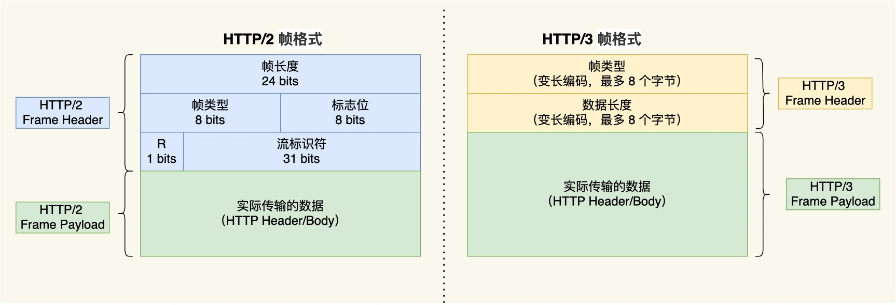

## 差异对比
---
1. http/2 与 http/3 的帧比较
- http/3 和 http/2 一样采用二进制帧的结构，不同的地方在于 http/2 的二进制帧里需要定义 Stream，而 http/3 自身不需要再定义 Stream，直接使用 quic 中的 Stream，因此 http/3 的帧结构也变简单了

- http/3 帧头只包含了两个字段：类型和长度。帧类型大体上分为数据帧和控制帧两大类，HEADERS 帧（HTTP 头部）和 DATA 帧（HTTP 包体）属于数据帧

2. 头部压缩算法
- HTTP/3 在头部压缩算法这一方面也做了升级，升级成了 QPACK。与 HTTP/2 中的 HPACK 编码方式相似，HTTP/3 中的 QPACK 也采用了静态表、动态表及 Huffman 编码

- 对于静态表的变化，HTTP/2 中的 HPACK 的静态表只有 61 项，而 HTTP/3 中的 QPACK 的静态表扩大到 91 项。TTP/2 和 HTTP/3 的 Huffman 编码并没有多大不同，但是动态表编解码方式不同