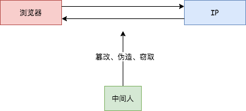
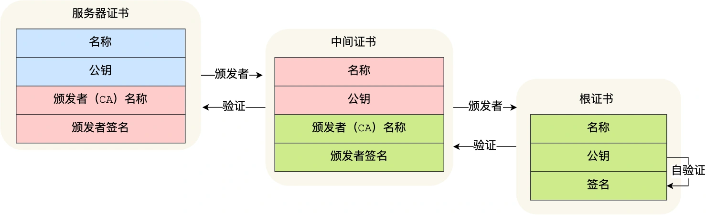

## https
---
1. 与 http 的区别
- 起初设计 http 协议的目的就是为了传输超文本文件，当时并没有太强的加密传输的数据需求，因此长期以来保持着明文传输的特征，信息是明文传输，存在安全风险的问题
- 但明文在传输的过程中每一个环节，数据都有可能被窃取或篡改，这就意味着浏览器和服务器的通信过程中的一切内容都可能被中间人 **窃取、伪造、篡改**，称为 **中间人攻击**

- 因为数据包在通过 http 交给 tcp 层之后，数据会经过用户电脑、wifi路由器、运营商和目标服务器，这之中的每一个环节，数据都有可能被窃取或篡改

|例子|操作|
|---|---|
|用户电脑被安装了恶意软件|恶意软件能抓取和篡改所发出的 http 请求的内容|
|用户连上了 wifi 钓鱼路由器|数据被黑客抓取或篡改|

- 由于是明文传输，具有以下风险。**窃听风险**，比如通信链路上可以获取通信内容；**篡改风险**，比如强制入垃圾广告，视觉污染。**冒充风险**，比如冒充淘宝网站等
- https 在 http 与 tcp 层之间加入了 ssl/tls 协议，因此可以很好的解决以上风险。**信息加密**：交互信息无法被窃取。**校验机制**：无法篡改通信内容，篡改了就不能正常显示。**身份证书**：证明服务器的身份是可信的，例如证明淘宝是真的淘宝网

2. http 协议栈引入安全层
- 通过在 http 与 tcp 层之间插入一个安全层(ssl/tls)，所有经过安全层的报文数据都会被加密传输或解密。因此，https 并不是一个新的协议。其中HTTP 的端口号是 80，HTTPS 的端口号是 443。HTTPS 协议需要向 CA（证书权威机构）申请数字证书，来保证服务器的身份是可信的
- HTTP 连接建立相对简单，tcp 三次握手之后便可进行 http 的报文传输。而 https 在 TCP 三次握手之后，还需进行 SSL/TLS 的握手过程，才可进入加密报文传输
- http 是直接和 tcp 通信，而 https 是先和安全层通信，安全层再和 tcp 层通信。也就是说 https 所有的安全核心都在安全层，它不会影响到上面的 http 协议，也不会影响到下面的 tcp/ip
- 安全层有两个主要的职责(加解密)：对发起 http 请求的数据进行加密操作和对接收到 http 的内容进行解密操作

3. 窃听风险 --> 混合加密
- 通过混合加密的方式实现了信息的 **机密性**，解决了窃听的风险。https 采用的是 **对称加密** 和 **非对称加密** 结合的「混合加密」方式，在 **通信建立连接前** 采用非对称加密的方式交换会话秘钥，后续就不再使用非对称加密；在 **通信过程中** 全部使用 **对称加密** 的会话秘钥的方式加密明文数据
- 为什么要采用混合加密呢？原因有两个，第一个是对称加密只使用一个秘钥，运算速度快，密钥必须保密，无法做到安全的密钥交换。第二个是非对称加密使用两个密钥(**公钥和私钥**)，公钥可以任意分发而私钥保密，解决了密钥交换问题但速度慢

4. 篡改风险 --> 摘要算法
- 保证报文的完整性，它能够为数据生成独一无二的指纹，通过指纹来校验数据的 **完整性**，解决了篡改的风险
- 为了保证传输的内容不被篡改，需要对内容计算出一个指纹，然后同内容一起传输给对方。对方收到以后，先是对内容也计算出一个指纹，然后跟发送方的指纹做一个比较。如果指纹相同，说明内容没有被篡改，否则就可以判断内容被篡改了
- 在计算机中会用摘要算法（哈希函数）来计算出内容的哈希值，也就是内容的「指纹」，这个哈希值是唯一的，且无法通过哈希值推导出内容
- 虽然通过哈希算法可以确保内容不会被篡改，**但是并不能保证「内容 + 哈希值」不会被中间人替换，因为这里缺少对客户端收到的消息是否来源于服务端的证明**

5. 篡改风险 --> 数字签名
- 由于客户端无法验证收到的消息是否来自于服务端(无法确认消息是由持有私钥的一方发送的)，因此计算机会使用非对称加密算法来解决，其中使用两个密钥。公钥可以公开给所有人，私钥必须由本人所管理，不可泄露；同时这两个密钥可以双向加解密，也就是可以用公钥加密内容，然后用私钥解密；也可以用私钥加密内容，公钥解密内容
- 那么如果用公钥加密，私钥解密，这个是为了保证内容传输的安全。因为被公钥加密的内容，其他人是无法解密的，只有持有私钥的人，才能解密出实际的内容
- 如果用私钥加密，公钥解密，是为了保证消息不会被冒充。因为私钥是不可泄露的，如果公钥能正常解密出私钥加密的内容，就能证明这个消息是来源于持有私钥身份的人发送的
- 但一般不会用非对称加密加密传输的内容，因为非对称加密的计算比较耗费性能的，所以它的用途主要在于通过 **私钥加密，公钥解密** 的方式，**来确认消息的身份**，也就是数字签名算法。不过私钥加密内容不是内容本身，而是对内容的哈希值加密
- 私钥是由服务端保管，然后服务端会向客户端颁发对应的密钥，如果客户端收到的信息，能够被公钥解密，就说明该消息是由服务器发送的

6. 冒充风险 --> 数字证书
- 通过将服务器公钥放入到数字证书中，解决了 **冒充** 的风险。虽然通过哈希算法保证了消息的完整性，通过数字签名保证了消息的来源可靠性，但还不够，还缺少身份认证的环节，万一公钥是伪造的呢?
- 在计算机中，通过权威的机构(CA:数字证书认证机构)，将服务器公钥放在数字证书(由CA颁发)中，只要证书是可信的，公钥就是可信的

7. https 的连接建立过程
- **ClientHello**：首先，由客户端向服务器发起加密通信请求(ClientHello)，这一步中客户端主要向服务器发送以下信息。1. 客户端支持的 ssl/tls 协议版本；2. 客户端产生的随机数(client random)，后面会用于生成会话秘钥；3. 客户端支持的密码套件列表，如 rsa 加密算法等
- **SeverHello**：服务器接收到请求后，向客户端发出响应，主要回应一下内容。1. 确认 ssl/tls 协议版本，如果浏览器不支持，则关闭通信；2. 服务器生产的随机数(server random)，也是后面用于生产会话秘钥条件之一；3. 确认的密码套件列表；4. 服务器的数字证书
- **客户端回应**：客户端收到服务器的回应之后，首先会通过浏览器/操作系统中的 CA 公钥，确认服务器的数字证书的真实性。如果证书没有问题，客户端会从数字证书中取出服务器的公钥，然后用它加密报文，向服务器发送以下信息。1. 一个随机数(pre-master key)，该随机数会被服务器公钥加密；2. 加密通信算法改变通知，表示随后的信息都将用会话秘钥加密通信；3. 客户端握手结束通知，表示客户端的握手阶段已经结束。这一项同时把之前所有内容的发生的数据做个摘要，用来供服务端校验
- 服务器和客户端有了这三个随机数（Client Random、Server Random、pre-master key），接着就用双方协商的加密算法，各自生成本次通信的会话秘钥
- **服务端回应**：服务器收到客户端的第三个随机数后，通过协商的加密算法，计算出本次通信的「会话秘钥」，接着向客户端发送最后的信息。1. 加密算法改变通知，表示随后的信息都将用会话秘钥加密通信；2. 服务器握手结束通知，表示服务器的握手阶段已经结束。这一项同时把之前所有内容的发生的数据做个摘要，用来供客户端校验

8. 数字证书签发流程
- CA 会将持有者的公钥、用途、颁发者、有效时间等信息打包，然后对这些信息进行计算，得到一个 hash 值
- 然后 CA 会使用自己的私钥将该 hash 值加密，生成 Certificate Signature，也就是 CA 对证书做了签名
- 最后将 Certificate Signature 添加在文件证书上，形成数字证书

9. 客户端校验数字证书流程
- 首先客户端会使用同样的 hash 算法获取该证书的 hash 值 h1
- 通常浏览器和操作系统中集成了 CA 的公钥信息，浏览器收到证书后可以使用 CA 的公钥解密 Certificate Signature 内容，得到一个 hash 值 h2
- 最后比较 h1 和 h2，如果值相同，则为可信赖的证书，否则认为证书不可信

