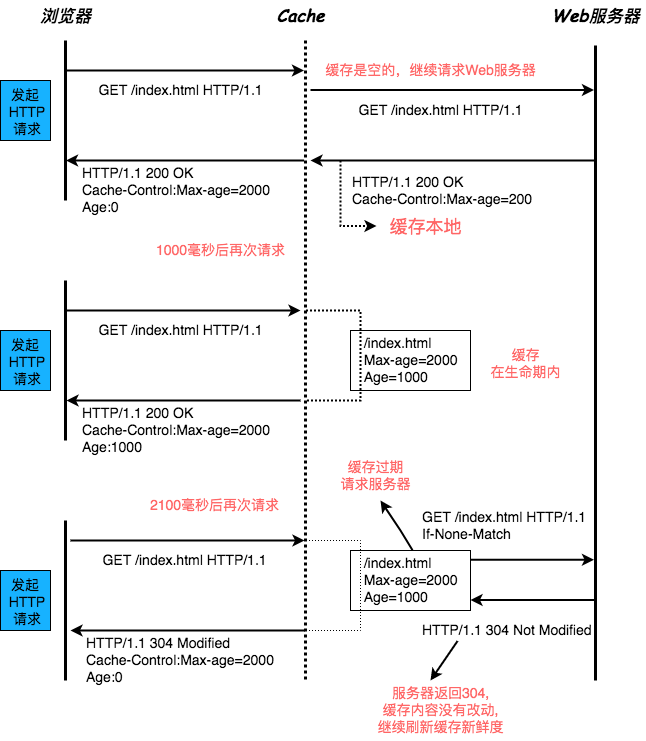

## (应用层协议)HTTP

---

1. 超文本传输协议

- `HTTP` 是一个用于传输超媒体文档（例如 HTML）的应用层协议。它是为 `Web` 浏览器与 `Web` 服务器之间的通信而设计的，但也可以用于其他目的。`HTTP` 遵循经典的客户端-服务端模型，客户端打开一个连接以发出请求，然后等待直到收到服务器端响应。`HTTP` 是无状态协议，这意味着服务器不会在两个请求之间保留任何数据（状态）。尽管通常基于 `TCP/IP` 层，但它可以在任何可靠的传输层上使用，也就是说，该协议不会像 `UDP` 那样静默的丢失消息。`RUDP` ——作为 `UDP` 的可靠化升级版本——是一种合适的替代选择

2. 为什么很多站点二次打开会很快

- 如果第二次页面打开很快，主要原因是第一次加载过程中，缓存了一些耗时的数据，包括 **DNS 缓存** 和 **页面资源缓存**，那么 _DNS 缓存_ 主要是在浏览器本地将对应的 IP 和域名关联起来
- **浏览器页面资源缓存** 的过程主要是下面的情况

- 在服务器返回响应头给浏览器的时候，浏览器通过响应头中的 `Cache-Control` 字段来设置是否缓存该资源。一般会给这个资源设置一个缓存过期时长，通过 `Max-age = xxxx` 来设置，如 `Cache-Control:Max-age = 5000` 即是设置该资源的缓存过期时间为 5000 毫秒
- 那么，当该缓存还未过期时，再次对该资源进行请求，会直接返回缓存中的资源给浏览器；如果缓存过期了，浏览器会向服务器发起请求，并且在请求头上携带上 `If-None-Match:"78fd6c9c-fbf1-47be-aebe-5404333af413"`。服务器会根据 `If-None-Match` 的值来判断请求的资源是否有更新
- 如果有更新，服务器会返回最新资源给浏览器。如果资源没有更新，服务器会返回 304 状态码，告诉浏览器这个资源未做修改，可以继续复用
- 最后，很多网站二次打开很快，是因为这些网站把很多资源都缓存到了本地，浏览器缓存会直接使用本地缓存来回应请求，而不会产生真实的网络请求；并且，DNS 数据也被缓存了，所以省去了 `请求-响应` 与 `DNS 查询` 环节
